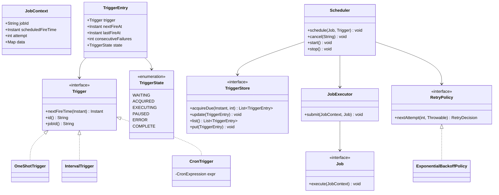
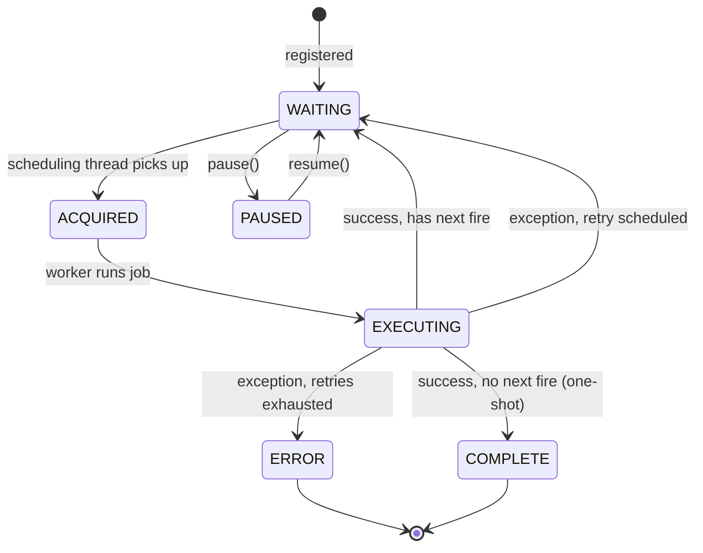

# Design Task Scheduler

**Date:** 2026-05-02 | **Updated:** 2026-05-02
**Tags:** `low-level-design` `case-study` `developer-tools` `scheduler` `cron`

## Summary

A task scheduler runs **jobs** at times defined by **triggers** (one-shot, cron, fixed-interval), executes them on a pool, retries on failure, and persists state so it survives restarts. Reference points: Quartz, Spring's `@Scheduled` + `TaskScheduler`, Java's `ScheduledThreadPoolExecutor`, and Kubernetes CronJobs at the cluster level.

This case study covers:

- Job and trigger abstractions (one-shot, cron, fixed interval).
- The scheduling loop and a min-heap of next-fire times.
- Executor pool sizing and isolation.
- Retry policy with backoff and a dead-letter outcome.
- Persistence so triggers survive restarts and a misfire policy.

## Table of Contents

1. [Requirements](#requirements)
2. [Entities and Relationships](#entities-and-relationships)
3. [Class Skeletons (Java)](#class-skeletons-java)
4. [Key Algorithms / Workflows](#key-algorithms--workflows)
5. [Patterns Used (with reason)](#patterns-used-with-reason)
6. [Concurrency Considerations](#concurrency-considerations)
7. [Trade-offs and Extensions](#trade-offs-and-extensions)
8. [Related](#related)
9. [References](#references)

## Requirements

**Functional:**

- Register a `Job` with a `Trigger`.
- Trigger types: one-shot at instant `t`, fixed interval (`every 5 minutes`), cron (`0 0 9 * * MON-FRI`).
- Cancel / reschedule a trigger.
- Retry on failure with backoff; configurable max attempts; dead-letter on exhaustion.
- Persist triggers and last-fire times so a restart resumes correctly.
- Misfire policy: when the scheduler was down or busy, what should happen to missed fires?

**Non-functional:**

- Many triggers (10⁴–10⁶), few simultaneous executions; pop-next-due must be O(log N).
- Long-running jobs do not block the scheduling thread.
- At-least-once or at-most-once semantics — pick one and document.

## Entities and Relationships



### Trigger lifecycle



## Class Skeletons (Java)

### Job and triggers

```java
public interface Job {
    void execute(JobContext ctx) throws Exception;
}

public final class JobContext {
    private final String jobId;
    private final Instant scheduledFireTime;
    private final int attempt;
    private final Map<String, Object> data;
}

public interface Trigger {
    String id();
    String jobId();
    Instant nextFireTime(Instant after);
}

public final class OneShotTrigger implements Trigger {
    private final Instant fireAt;
    public Instant nextFireTime(Instant after) {
        return after.isBefore(fireAt) ? fireAt : null;
    }
}

public final class IntervalTrigger implements Trigger {
    private final Instant startAt;
    private final Duration period;
    public Instant nextFireTime(Instant after) {
        if (after.isBefore(startAt)) return startAt;
        long ms = period.toMillis();
        long elapsed = after.toEpochMilli() - startAt.toEpochMilli();
        long n = elapsed / ms + 1;
        return startAt.plusMillis(n * ms);
    }
}

public final class CronTrigger implements Trigger {
    private final CronExpression expr;
    public Instant nextFireTime(Instant after) {
        return expr.next(after);
    }
}
```

### Trigger entry and store

```java
public final class TriggerEntry {
    private final Trigger trigger;
    private Instant nextFireAt;
    private Instant lastFireAt;
    private int consecutiveFailures;
    private TriggerState state;
}

public interface TriggerStore {
    List<TriggerEntry> acquireDue(Instant now, int max);
    void update(TriggerEntry entry);
    void put(TriggerEntry entry);
    List<TriggerEntry> list();
}
```

### Retry policy

```java
public interface RetryPolicy {
    RetryDecision nextAttempt(int attempt, Throwable t);
}

public final class ExponentialBackoffPolicy implements RetryPolicy {
    private final int maxAttempts;
    private final Duration base;
    private final Duration cap;

    public RetryDecision nextAttempt(int attempt, Throwable t) {
        if (attempt >= maxAttempts) return RetryDecision.deadLetter();
        long ms = Math.min(cap.toMillis(),
            base.toMillis() * (1L << Math.min(20, attempt)));
        long jitter = ThreadLocalRandom.current().nextLong(ms / 4 + 1);
        return RetryDecision.retryAfter(Duration.ofMillis(ms + jitter));
    }
}
```

### Executor

```java
public final class JobExecutor {
    private final ExecutorService pool;

    public Future<?> submit(JobContext ctx, Job job, JobOutcomeListener listener) {
        return pool.submit(() -> {
            try {
                job.execute(ctx);
                listener.onSuccess(ctx);
            } catch (Throwable t) {
                listener.onFailure(ctx, t);
            }
        });
    }
}
```

### Scheduler

```java
public final class Scheduler {

    private final TriggerStore store;
    private final JobExecutor executor;
    private final RetryPolicy retry;
    private final Map<String, Job> jobs = new ConcurrentHashMap<>();
    private final Clock clock;
    private final Thread schedulerThread;
    private volatile boolean running;

    public void schedule(Job job, Trigger trigger) {
        jobs.put(trigger.jobId(), job);
        TriggerEntry e = TriggerEntry.fresh(trigger,
            trigger.nextFireTime(clock.instant()));
        store.put(e);
    }

    public void start() {
        running = true;
        schedulerThread.start();
    }

    /** Main scheduling loop. */
    private void loop() {
        while (running) {
            Instant now = clock.instant();
            List<TriggerEntry> due = store.acquireDue(now, 32);
            if (due.isEmpty()) {
                Duration waitFor = nextFireSleep(now);
                LockSupport.parkNanos(waitFor.toNanos());
                continue;
            }
            for (TriggerEntry entry : due) {
                fire(entry, now);
            }
        }
    }

    private void fire(TriggerEntry entry, Instant now) {
        Job job = jobs.get(entry.getTrigger().jobId());
        JobContext ctx = new JobContext(
            entry.getTrigger().jobId(), now,
            entry.getConsecutiveFailures() + 1, Map.of());

        executor.submit(ctx, job, new JobOutcomeListener() {
            public void onSuccess(JobContext c) {
                Instant next = entry.getTrigger().nextFireTime(clock.instant());
                entry.markComplete(next);
                store.update(entry);
            }
            public void onFailure(JobContext c, Throwable t) {
                RetryDecision d = retry.nextAttempt(c.getAttempt(), t);
                if (d.isDeadLetter()) {
                    entry.markError();
                } else {
                    entry.markRetry(clock.instant().plus(d.getDelay()));
                }
                store.update(entry);
            }
        });
    }
}
```

## Key Algorithms / Workflows

### Picking the next fire

The store keeps a min-heap (or an indexed table) ordered by `nextFireAt`. `acquireDue(now, max)` returns up to `max` entries with `nextFireAt <= now`, marks them `ACQUIRED`, and returns them. This is the only step that mutates the heap from the scheduling thread — workers never touch it.

### Sleep budget

When nothing is due:

```
Duration sleep = (storeMin - now).clamp(min=10ms, max=30s);
LockSupport.parkNanos(sleep.toNanos());
```

A new `schedule()` call must `unpark` the thread so a sooner trigger isn't ignored.

### Cron parsing

Parse `"second minute hour dayOfMonth month dayOfWeek"` into per-field bitmasks. `next(after)` increments the smallest field, propagating carry — same algorithm as a clock with carry across fields, plus the dayOfMonth/dayOfWeek interaction (POSIX semantics: a day matches if either field matches, when both are restricted).

### Misfire policies

When the scheduler was down for a window and a trigger should have fired N times:

| Policy | Behavior |
|---|---|
| Fire all | Catch up — fire N times back-to-back. |
| Fire once | Fire one "now", advance schedule to current. |
| Skip | Do not fire missed runs; advance schedule. |

Quartz defines exactly these. Pick per-trigger or globally.

### Retry with backoff

`base * 2^attempt` capped at `cap`, plus jitter. Persist `consecutiveFailures` so retries survive restart. After `maxAttempts`, mark `ERROR` and stop scheduling — operator action required (or write to a dead-letter store).

## Patterns Used (with reason)

| Pattern | Where | Reason |
|---|---|---|
| **Strategy** | `Trigger`, `RetryPolicy` | Pluggable scheduling rules and retry behavior. |
| **State** | `TriggerState` enum drives lifecycle | Explicit states make race conditions visible. |
| **Repository** | `TriggerStore` | Swap in-memory vs JDBC vs Quartz-style table. |
| **Observer / Callback** | `JobOutcomeListener` | Decouples scheduler from result handling. |
| **Command** | `Job` interface | Each job is a unit of work with a uniform invocation. |
| **Producer-Consumer** | Scheduling thread enqueues to executor pool | Long-running jobs don't block scheduling. |

## Concurrency Considerations

- **Single scheduling thread** simplifies invariants on the heap. Multiple scheduler nodes (HLD) need a leader-election or per-trigger lock to avoid double-firing.
- **Acquire-then-execute split:** marking `ACQUIRED` before submitting to the executor avoids re-acquiring the same trigger if the loop iterates again before the worker finishes.
- **Persistence semantics:** the `update(entry)` after success must be atomic with computing the next fire — otherwise a crash between the two yields a duplicate fire on restart.
- **At-least-once vs at-most-once:** crashing mid-job and retrying gives at-least-once. For at-most-once, the job must be transactional (commit job result + trigger update in one transaction).
- **Pool sizing:** CPU-bound vs IO-bound pools. Mixing them in one pool means a slow IO job can starve a CPU job. Provide multiple named pools, route by job metadata.
- **Long jobs and pause:** if a worker takes longer than a trigger's interval, decide policy: skip (default), queue, or run concurrently.

## Trade-offs and Extensions

- **Distributed scheduling:** out of LLD scope. Patterns: leader election (only one node fires), or per-trigger row-level lock with a heartbeat (Quartz JDBC store works this way).
- **Idempotency:** retries imply jobs should be idempotent; provide a `JobContext.attempt` and an `idempotencyKey` so jobs can deduplicate.
- **Observability:** emit metrics per trigger (`fires_total`, `failures_total`, `duration_seconds`); export the next-fire time so operators can see drift.
- **Calendars and exclusions:** "every weekday but skip US holidays" — calendar overlay applied after the trigger's natural next fire.
- **Job dependencies / DAGs:** out of scope; either escalate to a workflow engine (Airflow, Temporal) or build an `AfterTrigger` that fires on completion of another.
- **Time zones and DST:** cron should be evaluated in a configurable zone; document behavior at DST transitions (skip / fire-twice).

## Related

- Sibling LLDs: [URL Shortener (LLD)](design-url-shortener-lld.md), [Logging Framework](design-logging-framework.md), [Rate Limiter (LLD)](design-rate-limiter-lld.md), [In-Memory File System](design-in-memory-file-system.md), [Version Control System](design-version-control-system.md).
- Patterns: [Strategy](../../design-patterns/behavioral/), [State](../../design-patterns/behavioral/), [Command](../../design-patterns/behavioral/), [Observer](../../design-patterns/behavioral/), [Repository](../../design-patterns/additional/).
- HLD context: `../../../system-design/INDEX.md` (distributed schedulers, leader election, workflow engines).

## References

- Quartz Scheduler documentation — `Job`, `Trigger`, `JobStore`, misfire policies.
- Spring Framework — `TaskScheduler`, `@Scheduled`, `ThreadPoolTaskScheduler`.
- Java `java.util.concurrent.ScheduledThreadPoolExecutor` (delay queue + worker pool).
- POSIX cron specification (`man 5 crontab`) — field semantics and dayOfMonth/dayOfWeek interaction.
- Goetz et al., *Java Concurrency in Practice* — executor design and lifecycle.
