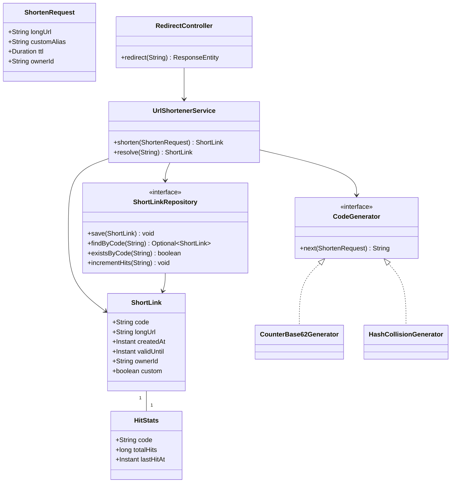

# Design URL Shortener (LLD)

**Date:** 2026-05-02 | **Updated:** 2026-05-02
**Tags:** `low-level-design` `case-study` `developer-tools` `url-shortener` `base62`

## Summary

A URL shortener maps a long URL (`https://example.com/some/very/long/path?q=foo`) to a compact code (`aB3dZ9`) reachable at a short host (`https://sho.rt/aB3dZ9`). At a high level (HLD) the questions are sharding, regional caches, and analytics pipelines. At the **LLD** level — the focus of this doc — we care about the **classes** that produce short codes, persist mappings, resolve them, and serve redirects.

This case study covers:

- Two short-code generation strategies: **counter + Base62** (deterministic, dense) and **hash + collision-resolve** (random, requires lookup before insert).
- Repository abstraction over the mapping table, expiry, and custom aliases.
- Redirect controller behavior (301 vs 302), hit tracking with low write amplification.
- Concurrency and idempotency at the class level.

## Table of Contents

1. [Requirements](#requirements)
2. [Entities and Relationships](#entities-and-relationships)
3. [Class Skeletons (Java)](#class-skeletons-java)
4. [Key Algorithms / Workflows](#key-algorithms--workflows)
5. [Patterns Used (with reason)](#patterns-used-with-reason)
6. [Concurrency Considerations](#concurrency-considerations)
7. [Trade-offs and Extensions](#trade-offs-and-extensions)
8. [Related](#related)
9. [References](#references)

## Requirements

**Functional:**

- `shorten(longUrl, options)` returns a short code; same long URL may produce a new code each call (idempotency is optional, often configurable).
- `resolve(code)` returns the original long URL or `404`.
- Custom alias: caller may supply a desired code; reject if taken.
- Expiry: code may have a `validUntil` timestamp; resolution after that returns `410 Gone`.
- Hit tracking: count resolutions per code (optionally per-day, per-referrer).

**Non-functional (LLD-relevant):**

- Short code length kept ≤ 8 chars for typical traffic.
- `resolve` is the hot path — single-digit ms; uses a cache.
- Generation must be **collision-free** at insert time.
- Custom aliases must not collide with auto-generated codes.

**Out of scope (HLD):** sharding the counter, multi-region replication, real-time analytics streams. Those are covered in `system-design/`.

## Entities and Relationships



## Class Skeletons (Java)

### Domain

```java
public final class ShortLink {
    private final String code;
    private final String longUrl;
    private final Instant createdAt;
    private final Instant validUntil; // nullable
    private final String ownerId;
    private final boolean custom;

    // all-args constructor + getters; immutable
    public boolean isExpired(Instant now) {
        return validUntil != null && now.isAfter(validUntil);
    }
}

public final class ShortenRequest {
    private final String longUrl;
    private final String customAlias;   // nullable
    private final Duration ttl;          // nullable
    private final String ownerId;
    // ... constructor + getters
}
```

### Code generators

```java
public interface CodeGenerator {
    /** Returns a candidate code. May be retried by the service on collision. */
    String next(ShortenRequest req);
}
```

**Strategy 1: counter + Base62 (deterministic, dense).**

```java
public final class CounterBase62Generator implements CodeGenerator {

    private static final char[] ALPHABET =
        "0123456789abcdefghijklmnopqrstuvwxyzABCDEFGHIJKLMNOPQRSTUVWXYZ".toCharArray();

    private final IdSequence sequence; // returns monotonically increasing longs

    public CounterBase62Generator(IdSequence sequence) {
        this.sequence = sequence;
    }

    @Override
    public String next(ShortenRequest req) {
        long id = sequence.nextId();
        return encodeBase62(id);
    }

    static String encodeBase62(long n) {
        if (n == 0) return "0";
        StringBuilder sb = new StringBuilder();
        while (n > 0) {
            sb.append(ALPHABET[(int) (n % 62)]);
            n /= 62;
        }
        return sb.reverse().toString();
    }
}
```

**Strategy 2: hash + resolve collision (random-looking, opaque).**

```java
public final class HashCollisionGenerator implements CodeGenerator {

    private static final int CODE_LEN = 7;
    private final ShortLinkRepository repository;
    private final SecureRandom random = new SecureRandom();

    public HashCollisionGenerator(ShortLinkRepository repository) {
        this.repository = repository;
    }

    @Override
    public String next(ShortenRequest req) {
        // Hash long URL + salt; truncate to CODE_LEN base62 chars.
        // Service is responsible for retrying with different salt on collision.
        byte[] digest = sha256(req.getLongUrl() + ":" + random.nextLong());
        return base62Truncate(digest, CODE_LEN);
    }
}
```

### Repository

```java
public interface ShortLinkRepository {
    void save(ShortLink link);                    // throws on PK conflict
    Optional<ShortLink> findByCode(String code);
    boolean existsByCode(String code);
    void incrementHits(String code);
}
```

### Service

```java
public final class UrlShortenerService {

    private static final int MAX_GENERATION_RETRIES = 5;

    private final CodeGenerator generator;
    private final ShortLinkRepository repository;
    private final Cache<String, ShortLink> cache;
    private final Clock clock;

    public ShortLink shorten(ShortenRequest req) {
        validateUrl(req.getLongUrl());

        if (req.getCustomAlias() != null) {
            return saveCustom(req);
        }

        for (int attempt = 0; attempt < MAX_GENERATION_RETRIES; attempt++) {
            String code = generator.next(req);
            ShortLink link = build(req, code, false);
            try {
                repository.save(link);
                return link;
            } catch (DuplicateCodeException e) {
                // collision — try again with the same generator
            }
        }
        throw new IllegalStateException("Unable to generate unique code");
    }

    public ShortLink resolve(String code) {
        ShortLink cached = cache.getIfPresent(code);
        if (cached != null) return enforceFreshness(cached);

        ShortLink link = repository.findByCode(code)
            .orElseThrow(() -> new NotFoundException(code));
        cache.put(code, link);
        return enforceFreshness(link);
    }

    private ShortLink enforceFreshness(ShortLink link) {
        if (link.isExpired(clock.instant())) throw new GoneException(link.getCode());
        return link;
    }
}
```

### Redirect controller

```java
@RestController
public final class RedirectController {

    private final UrlShortenerService service;
    private final HitTracker hitTracker;

    @GetMapping("/{code}")
    public ResponseEntity<Void> redirect(@PathVariable String code) {
        ShortLink link = service.resolve(code);
        hitTracker.record(code); // async; never blocks redirect
        return ResponseEntity.status(HttpStatus.FOUND) // 302; use 301 only when permanent
            .location(URI.create(link.getLongUrl()))
            .build();
    }
}
```

### Hit tracker (low write amplification)

```java
public final class HitTracker {
    private final ConcurrentMap<String, LongAdder> buffer = new ConcurrentHashMap<>();
    private final ShortLinkRepository repository;

    public void record(String code) {
        buffer.computeIfAbsent(code, k -> new LongAdder()).increment();
    }

    @Scheduled(fixedDelay = 5_000)
    void flush() {
        for (Map.Entry<String, LongAdder> e : buffer.entrySet()) {
            long delta = e.getValue().sumThenReset();
            if (delta > 0) repository.incrementHitsBy(e.getKey(), delta);
        }
    }
}
```

## Key Algorithms / Workflows

### Counter + Base62

1. Acquire next sequence ID (auto-increment column, sequence object, or distributed ID generator at HLD).
2. Encode ID to Base62 (length grows with `log_62(N)`).
3. Insert into `short_link` table; the unique PK (`code`) is guaranteed not to collide because IDs are unique.

**Pros:** zero collision lookups, dense codes, predictable length growth.
**Cons:** codes are guessable / sequential — if that matters, **bit-shuffle** the ID first (`(id * largePrime) mod 2^N`) before encoding, or reserve random gaps.

### Hash + collision-resolve

1. Compute `sha256(longUrl || randomSalt)`, truncate to N Base62 chars.
2. Try insert.
3. On primary-key conflict, regenerate with a fresh salt; retry up to `MAX_GENERATION_RETRIES`.

**Pros:** opaque codes, no global counter.
**Cons:** collision probability rises with table size (birthday paradox); needs an extra round-trip on collisions; not idempotent across calls unless the salt is derived from `longUrl` only.

### Custom alias

1. Validate alphabet and length.
2. `existsByCode(alias)`; if free, `save`. Race between two callers is resolved by the unique constraint on `code`, which surfaces as `DuplicateCodeException`.

### Resolve flow

```
client GET /aB3dZ9
    -> RedirectController
        -> UrlShortenerService.resolve
            -> cache.getIfPresent
            -> on miss: repository.findByCode + cache.put
            -> enforceFreshness (expiry)
        -> hitTracker.record (non-blocking)
    -> 302 Location: longUrl
```

## Patterns Used (with reason)

| Pattern | Where | Reason |
|---|---|---|
| **Strategy** | `CodeGenerator` interface | Swap counter vs hash without touching the service. |
| **Repository** | `ShortLinkRepository` | Hide storage; enables in-memory test doubles. |
| **Facade** | `UrlShortenerService` | Single entry point for shorten / resolve; controller stays thin. |
| **Decorator** (optional) | Caching layer over repository | Compose caching without modifying repo implementations. |
| **Template Method** (optional) | Base generator with `next()` calling `generateCandidate()` | Shared retry logic if both strategies retry the same way. |

## Concurrency Considerations

- **Insert race for hash strategy:** two threads may pick the same code; the database unique constraint is the source of truth. Catch `DuplicateCodeException` and retry.
- **Counter strategy race:** the **sequence** itself must be atomic — use a DB sequence, `AUTO_INCREMENT`, or an atomic `LongAdder`/`AtomicLong` in single-process tests. Never read-then-write to a counter row from app code.
- **Cache coherence:** updates to a `ShortLink` (e.g., `validUntil` change) must invalidate the cache entry — emit an event or use a write-through cache.
- **Hit tracking:** `LongAdder` per code in a `ConcurrentHashMap` avoids a hot row; periodic flush merges deltas. `sumThenReset` is atomic per adder.
- **Redirect path:** must not block on hit tracking. Tracking goes through an async queue or scheduled flush.

## Trade-offs and Extensions

- **301 vs 302:** `301 Moved Permanently` is cached aggressively by browsers — bad if you ever need to change the mapping. Default to `302` unless you guarantee immutability.
- **Idempotent shorten:** if same long URL must always return the same code, store a `UNIQUE(longUrl, ownerId)` index and look up first. Conflicts with the hash strategy unless salt is derived deterministically.
- **Custom alias namespace:** auto-generated codes should avoid the custom-alias namespace (e.g., reserve a length range or a prefix character).
- **Expiry sweep:** lazy (check on resolve) vs background sweep. Lazy is simpler; sweep keeps storage bounded.
- **Bulk shorten:** add a batch API; generator must support batch IDs (counter trivially, hash needs N attempts).
- **Owner scoping:** add `ownerId` to enable per-tenant analytics and quotas.

## Related

- Sibling LLDs: [Logging Framework](design-logging-framework.md), [Rate Limiter (LLD)](design-rate-limiter-lld.md), [In-Memory File System](design-in-memory-file-system.md), [Version Control System](design-version-control-system.md), [Task Scheduler](design-task-scheduler.md).
- HLD twin: see `../../../system-design/INDEX.md` for the URL shortener system-design entry (sharding, KGS, analytics).
- Patterns: [Strategy](../../design-patterns/behavioral/), [Repository](../../design-patterns/additional/), [Facade](../../design-patterns/structural/), [Decorator](../../design-patterns/structural/).

## References

- Base62 encoding: derived from positional notation; see Knuth, *The Art of Computer Programming, Vol. 2* (numerical algorithms).
- HTTP status codes: RFC 9110 (HTTP Semantics) — `301`, `302`, `307`, `308`, `410`.
- Birthday paradox / collision probability for truncated hashes: standard cryptography references (e.g., *Handbook of Applied Cryptography*, Menezes et al.).
- Java `LongAdder`: `java.util.concurrent.atomic.LongAdder` (high-contention counters).
