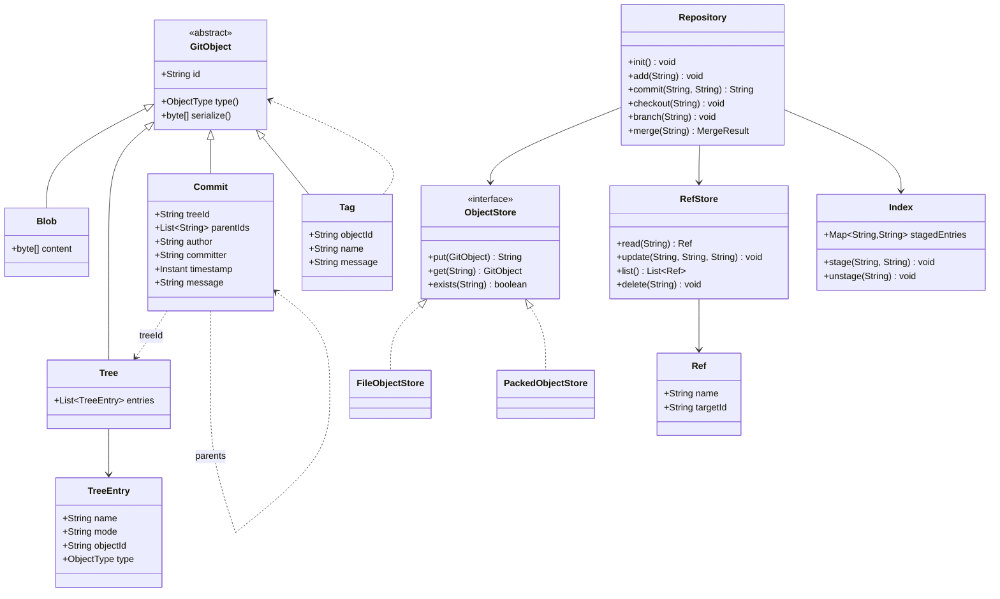
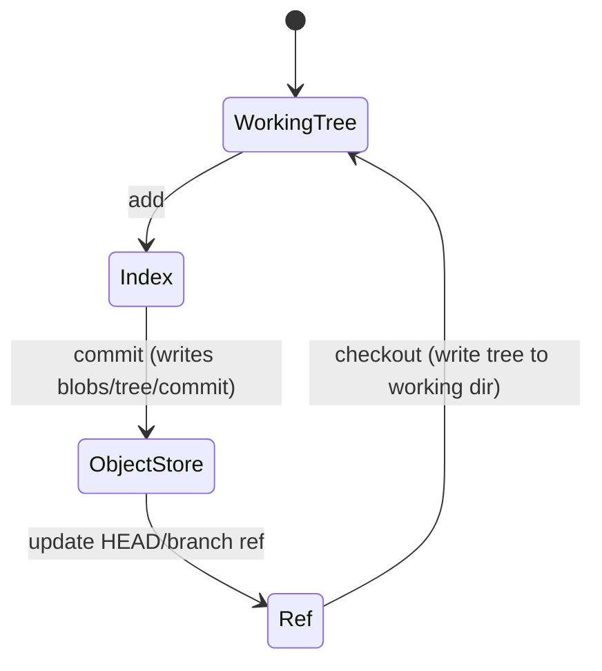

# Design Version Control System

**Date:** 2026-05-02 | **Updated:** 2026-05-02
**Tags:** `low-level-design` `case-study` `developer-tools` `version-control` `git`

## Summary

A version control system stores a project's history as an immutable graph of snapshots. Git's design — content-addressed objects (`blob`, `tree`, `commit`, `tag`), references (`refs/heads/main`), and a working-tree / index / object-store separation — is the canonical reference. This LLD walks through the **classes** that implement that model: an **`ObjectStore`** for content-addressed storage, **`Blob` / `Tree` / `Commit`** as the object types, **`Ref`** management, and the diff/merge layer.

This case study covers:

- The Git-style object model: `blob` (file content), `tree` (directory), `commit` (snapshot + parents), `tag` (named pointer).
- Content addressing: `id = sha256(typeHeader + content)`; identical content shares storage.
- Refs as named pointers; branches and tags as refs.
- Diff (Myers-style) and three-way merge.
- The plumbing/porcelain split.

## Table of Contents

1. [Requirements](#requirements)
2. [Entities and Relationships](#entities-and-relationships)
3. [Class Skeletons (Java)](#class-skeletons-java)
4. [Key Algorithms / Workflows](#key-algorithms--workflows)
5. [Patterns Used (with reason)](#patterns-used-with-reason)
6. [Concurrency Considerations](#concurrency-considerations)
7. [Trade-offs and Extensions](#trade-offs-and-extensions)
8. [Related](#related)
9. [References](#references)

## Requirements

**Functional:**

- `init()`, `add(path)`, `commit(message, author)`, `log()`, `checkout(ref)`, `branch(name)`, `merge(other)`.
- Content-addressed object store: `put(bytes) -> hash`, `get(hash) -> bytes`.
- Refs: create, update (with old-value check / CAS), delete.
- Diff between two trees or two commits.
- Three-way merge with a conflict report.

**Non-functional:**

- Object IDs are stable: the same input bytes always produce the same hash.
- Append-only object store — no in-place mutation.
- O(N) per operation in the size of the touched files, not the entire history.

## Entities and Relationships



### Commit history (state diagram)



## Class Skeletons (Java)

### Object hierarchy

```java
public abstract class GitObject {
    public abstract ObjectType type();   // BLOB | TREE | COMMIT | TAG
    public abstract byte[] payload();    // type-specific body

    public final byte[] serialize() {
        byte[] body = payload();
        String header = type().name().toLowerCase() + " " + body.length + "\0";
        byte[] h = header.getBytes(StandardCharsets.US_ASCII);
        byte[] out = new byte[h.length + body.length];
        System.arraycopy(h, 0, out, 0, h.length);
        System.arraycopy(body, 0, out, h.length, body.length);
        return out;
    }

    public final String id() {
        return Hex.encode(Hashing.sha256(serialize()));
    }
}

public final class Blob extends GitObject {
    private final byte[] content;
    public ObjectType type() { return ObjectType.BLOB; }
    public byte[] payload() { return content; }
}

public final class Tree extends GitObject {
    private final List<TreeEntry> entries; // sorted by name
    public ObjectType type() { return ObjectType.TREE; }
    public byte[] payload() { /* mode<sp>name\0<id20bytes> per entry */ }
}

public final class Commit extends GitObject {
    private final String treeId;
    private final List<String> parentIds;
    private final String author;
    private final String committer;
    private final Instant timestamp;
    private final String message;
    public ObjectType type() { return ObjectType.COMMIT; }
    public byte[] payload() {
        // tree <id>\nparent <id>\n... \nauthor <name> <ts>\n... \n\n<message>
    }
}
```

### Object store

```java
public interface ObjectStore {
    String put(GitObject obj);     // returns the id; idempotent
    GitObject get(String id);
    boolean exists(String id);
}

public final class FileObjectStore implements ObjectStore {
    private final Path root; // .git/objects

    public String put(GitObject obj) {
        String id = obj.id();
        Path target = pathFor(id);
        if (Files.exists(target)) return id; // dedup
        Files.createDirectories(target.getParent());
        byte[] compressed = Compress.deflate(obj.serialize());
        Files.write(target, compressed,
            StandardOpenOption.CREATE_NEW, StandardOpenOption.WRITE);
        return id;
    }

    public GitObject get(String id) {
        byte[] raw = Compress.inflate(Files.readAllBytes(pathFor(id)));
        return parse(raw);
    }

    private Path pathFor(String id) {
        // sharded: objects/ab/cdef... — first 2 chars subdir, rest filename
        return root.resolve(id.substring(0, 2)).resolve(id.substring(2));
    }
}
```

### Ref store

```java
public interface RefStore {
    Optional<Ref> read(String name);                    // e.g., "refs/heads/main"
    void update(String name, String newId, String expectedOldId); // CAS
    List<Ref> list();
    void delete(String name);
}
```

### Index (staging area)

```java
public final class Index {
    private final Map<String, String> staged = new TreeMap<>(); // path -> blobId

    public void stage(String path, String blobId) {
        staged.put(path, blobId);
    }

    public void unstage(String path) { staged.remove(path); }

    public Map<String, String> snapshot() {
        return Map.copyOf(staged);
    }
}
```

### Repository facade

```java
public final class Repository {

    private final ObjectStore objects;
    private final RefStore refs;
    private final Index index;
    private final Path workingTree;

    public void add(String path) {
        byte[] content = Files.readAllBytes(workingTree.resolve(path));
        Blob blob = new Blob(content);
        String id = objects.put(blob);
        index.stage(path, id);
    }

    public String commit(String message, String author) {
        String treeId = writeTreeFromIndex(index.snapshot());
        String parent = refs.read("HEAD").map(Ref::getTargetId).orElse(null);
        Commit c = new Commit(treeId,
            parent == null ? List.of() : List.of(parent),
            author, author, Instant.now(), message);
        String commitId = objects.put(c);
        refs.update(currentBranch(), commitId, parent);
        return commitId;
    }

    public void checkout(String refOrId) {
        String commitId = resolve(refOrId);
        Commit c = (Commit) objects.get(commitId);
        Tree t = (Tree) objects.get(c.getTreeId());
        writeTreeToWorkingDir(t, workingTree);
        refs.update("HEAD", commitId, refs.read("HEAD")
            .map(Ref::getTargetId).orElse(null));
    }

    public void branch(String name) {
        String head = refs.read("HEAD").orElseThrow().getTargetId();
        refs.update("refs/heads/" + name, head, null);
    }

    public MergeResult merge(String otherRef) {
        String ours = refs.read("HEAD").orElseThrow().getTargetId();
        String theirs = resolve(otherRef);
        String base = lowestCommonAncestor(ours, theirs);
        return threeWayMerge(base, ours, theirs);
    }
}
```

## Key Algorithms / Workflows

### Content addressing

`id = sha256(typeHeader || NUL || content)`. Two consequences:

1. Identical content has identical IDs across repositories — enables dedup and integrity checks.
2. Any tampering changes the ID — Merkle property: a commit's ID transitively covers its tree and all reachable blobs.

> Real Git uses SHA-1 historically, with SHA-256 as the modern option. The math doesn't change.

### Writing a tree from the index

The index is a flat `path -> blobId` map. `writeTreeFromIndex` groups entries by directory, recurses into each directory, builds `Tree` objects bottom-up, and returns the root tree's ID.

```
src/Foo.java -> blobId1
src/Bar.java -> blobId2
README.md    -> blobId3
```

becomes:

```
tree(README.md=blobId3, src=tree(Foo.java=blobId1, Bar.java=blobId2))
```

### Diff (Myers algorithm sketch)

For two text blobs, compute the longest common subsequence; emit insertions and deletions as a script. Tree-level diff walks both trees in lockstep:

- Same blobId on both sides -> unchanged.
- Different blobId -> diff the blobs.
- Present in one, absent in the other -> add / remove.

### Three-way merge

```
base    : common ancestor commit's tree
ours    : current branch's tree
theirs  : other branch's tree

for each path in union(base, ours, theirs):
    if ours == theirs: keep
    if ours == base and theirs != base: take theirs
    if theirs == base and ours != base: take ours
    else: conflict — emit both versions with markers
```

### Lowest common ancestor (merge base)

BFS from both commits over parent pointers; first commit found in both visit sets is the merge base. For octopus merges, generalize to multiple parents.

### Refs and atomic update

Branch updates must be atomic. The `RefStore` uses **CAS**: `update(name, newId, expectedOldId)` fails if the current value doesn't match. On the file system this is implemented with a lock file (`refs/heads/main.lock`) renamed atomically into place — Git uses exactly this approach.

## Patterns Used (with reason)

| Pattern | Where | Reason |
|---|---|---|
| **Composite** | `Tree` containing `TreeEntry` references to `Tree` or `Blob` | Recursive directory model. |
| **Memento** | Each `Commit` is a snapshot; checkout restores it | Snapshot-based history. |
| **Repository** | `ObjectStore`, `RefStore` | Hide on-disk vs in-memory; both implement same contract. |
| **Strategy** | Diff and merge algorithms behind interfaces | Swap Myers / patience / histogram diff. |
| **Facade** | `Repository` orchestrates objects + refs + index | Porcelain over plumbing. |
| **Builder** (optional) | `CommitBuilder` for assembling commits | Optional commit fields (gpgsig, multiple parents). |

## Concurrency Considerations

- **Object writes are idempotent:** `put` of the same content from two threads is safe — same hash, same on-disk path; second writer can detect existence and skip. Use `CREATE_NEW` open option to fail loudly on accidental double-write rather than silently overwriting.
- **Ref updates need CAS:** lock file rename is the cross-platform atomic primitive. Without CAS, two concurrent commits can lose one update.
- **Working tree mutations** (`checkout`, `merge`) are not safe to run concurrently against the same working tree — guard with a repo-level mutex.
- **Garbage collection:** unreferenced objects (no ref reaches them) can be pruned. GC must coordinate with concurrent commits — Git uses a grace period (`--prune=2.weeks.ago`) to avoid racing a commit-in-progress.
- **Pack files:** the packed object store rewrites many loose objects into one pack. The rewrite must be online: readers continue to use existing objects until the new pack is sealed.

## Trade-offs and Extensions

- **Loose vs packed objects:** loose objects are simple but burn inodes; packing yields delta compression and sequential reads at the cost of complexity.
- **Hash algorithm:** SHA-1 is broken for adversarial collisions; SHA-256 (Git transition format) is recommended for new designs. The class model is hash-agnostic.
- **History rewriting:** `rebase` and `amend` are not destructive at the object level — they create new commits; only refs move. The old commits remain reachable until GC.
- **Submodules / subtrees:** add a tree entry type that points to a foreign commit ID.
- **Network protocol:** clone/fetch/push transfer packs; smart protocol negotiates "haves" and "wants" — out of scope for this LLD.
- **LFS-style large files:** swap the blob writer to spill to external storage and store a pointer.

## Related

- Sibling LLDs: [URL Shortener (LLD)](design-url-shortener-lld.md), [Logging Framework](design-logging-framework.md), [Rate Limiter (LLD)](design-rate-limiter-lld.md), [In-Memory File System](design-in-memory-file-system.md), [Task Scheduler](design-task-scheduler.md).
- Patterns: [Composite](../../design-patterns/structural/), [Memento](../../design-patterns/behavioral/), [Strategy](../../design-patterns/behavioral/), [Repository](../../design-patterns/additional/), [Facade](../../design-patterns/structural/).
- Storage HLD context: `../../../system-design/INDEX.md` (content-addressed storage, Merkle trees).

## References

- Pro Git book (Chacon, Straub) — chapters on Git internals, objects, refs, packs.
- Git source documentation: `Documentation/technical/` (object format, pack format, ref CAS).
- Eugene Myers, *An O(ND) Difference Algorithm and Its Variations* (1986).
- Tom Preston-Werner — "The Git Parable" (conceptual derivation of the model).
- *The Tao of tmux / git* style references and the official `git-fsck` / `git-cat-file` man pages for object inspection.
