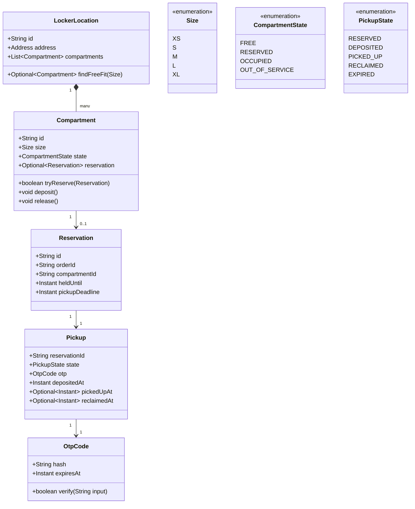
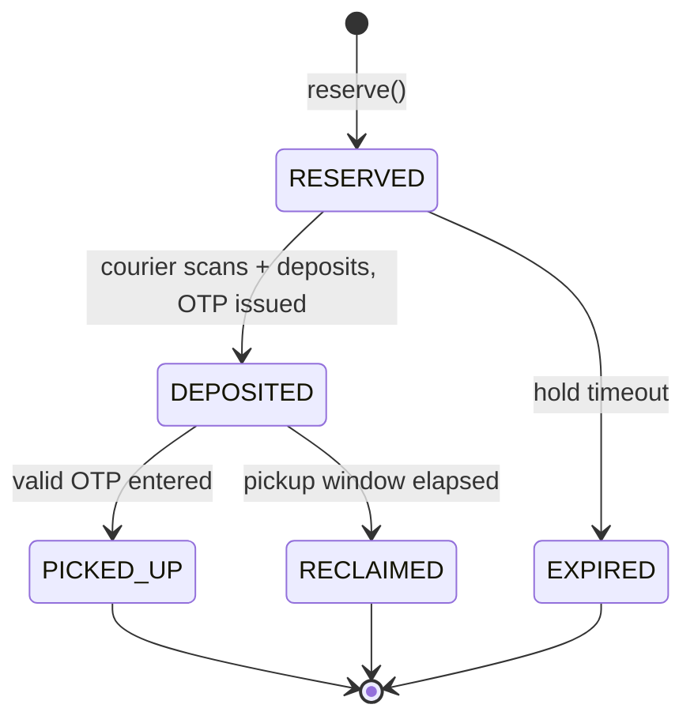

# Design Amazon Locker

**Date:** 2026-05-02 | **Updated:** 2026-05-02
**Tags:** `low-level-design` `case-study` `e-commerce` `locker` `state-machine`

## Summary

Amazon Locker is a self-service pickup service where a courier deposits a parcel into a physical locker compartment and the customer retrieves it later using a one-time code. The LLD problem is interesting because it combines spatial allocation (which compartment fits this package?), reservation under concurrency (two parcels cannot land in the same compartment), and a strict pickup state machine (deposit → notify → retrieve, with timeouts and reclamation).

This document focuses on the OOD inside one logical "locker location" — the compartments, the reservation policy, the OTP issuance and verification, and the state machine that drives a pickup from `RESERVED` through `PICKED_UP` (or `RECLAIMED`).

## Table of Contents

- [Requirements](#requirements)
- [Entities and Relationships](#entities-and-relationships-mermaid-classdiagram)
- [Class Skeletons (Java)](#class-skeletons-java)
- [Key Algorithms / Workflows](#key-algorithms--workflows)
- [Patterns Used](#patterns-used-with-reason)
- [Concurrency Considerations](#concurrency-considerations)
- [Trade-offs and Extensions](#trade-offs-and-extensions)
- [Related](#related)
- [References](#references)

## Requirements

**Functional:**

- A **LockerLocation** has many **Compartments** of fixed size buckets: `XS`, `S`, `M`, `L`, `XL`.
- Given a parcel with dimensions, find the **smallest free compartment** that fits at the customer's preferred location.
- Reserve that compartment for a known **order**; reservation is held until the courier deposits or until a hold timeout.
- When the courier deposits, the system issues an **OTP** to the customer (push, SMS, email).
- Customer enters the OTP at the kiosk; on success, the compartment opens. After the door closes, transition to `PICKED_UP`.
- If the parcel is not picked up within `pickup_window` (e.g., 3 days), reclaim the compartment for return shipment.

**Non-functional:**

- Reservation must be race-free across concurrent couriers and ordering systems.
- OTPs must be unguessable and single-use.
- Each compartment's state must be auditable; transitions must be append-only events.

**Out of scope (HLD lives elsewhere):**

- Geographic search across thousands of locations.
- Last-mile routing optimization.
- Notification fan-out infrastructure.

## Entities and Relationships (Mermaid classDiagram)



## Class Skeletons (Java)

```java
public enum Size { XS, S, M, L, XL;
    public boolean fits(Size needed) { return this.ordinal() >= needed.ordinal(); }
}

public enum CompartmentState { FREE, RESERVED, OCCUPIED, OUT_OF_SERVICE }

public enum PickupState { RESERVED, DEPOSITED, PICKED_UP, RECLAIMED, EXPIRED }

public final class Compartment {
    private final String id;
    private final Size size;
    private CompartmentState state = CompartmentState.FREE;
    private Reservation reservation;
    private final ReentrantLock lock = new ReentrantLock();

    public boolean tryReserve(Reservation r) {
        lock.lock();
        try {
            if (state != CompartmentState.FREE) return false;
            this.reservation = r;
            this.state = CompartmentState.RESERVED;
            return true;
        } finally { lock.unlock(); }
    }

    public void markDeposited() {
        lock.lock();
        try {
            if (state != CompartmentState.RESERVED)
                throw new IllegalStateException("not reserved");
            this.state = CompartmentState.OCCUPIED;
        } finally { lock.unlock(); }
    }

    public void release() {
        lock.lock();
        try {
            this.reservation = null;
            this.state = CompartmentState.FREE;
        } finally { lock.unlock(); }
    }
    // ... getters
}

public final class LockerLocation {
    private final String id;
    private final List<Compartment> compartments;

    public Optional<Compartment> findFreeFit(Size needed) {
        return compartments.stream()
            .filter(c -> c.getState() == CompartmentState.FREE)
            .filter(c -> c.getSize().fits(needed))
            .min(Comparator.comparing(Compartment::getSize)); // smallest fit
    }
}

public final class OtpCode {
    private final String hash;       // bcrypt or Argon2 of the raw code
    private final Instant expiresAt;

    public static OtpCode issue(Duration ttl) {
        String raw = secureRandomDigits(6);
        // raw is delivered out-of-band to the customer; we store only the hash
        return new OtpCode(hashOf(raw), Instant.now().plus(ttl));
    }

    public boolean verify(String input) {
        return Instant.now().isBefore(expiresAt) && constantTimeEquals(hash, hashOf(input));
    }
}

public final class Pickup {
    private final String reservationId;
    private PickupState state = PickupState.RESERVED;
    private OtpCode otp;
    private Instant depositedAt, pickedUpAt, reclaimedAt;

    public void onDeposit(OtpCode issued) {
        require(state == PickupState.RESERVED);
        this.otp = issued;
        this.depositedAt = Instant.now();
        this.state = PickupState.DEPOSITED;
    }

    public void onPickup(String enteredOtp) {
        require(state == PickupState.DEPOSITED);
        if (!otp.verify(enteredOtp)) throw new InvalidOtpException();
        this.pickedUpAt = Instant.now();
        this.state = PickupState.PICKED_UP;
    }

    public void onReclaim() {
        require(state == PickupState.DEPOSITED);
        this.reclaimedAt = Instant.now();
        this.state = PickupState.RECLAIMED;
    }
}
```

## Key Algorithms / Workflows

### 1. Compartment selection (smallest-fit)

```
input: locationId, parcelSize
1. load LockerLocation by id
2. candidates = compartments where state == FREE AND size.fits(parcelSize)
3. pick the candidate with the smallest size (and earliest id as tiebreaker)
4. tryReserve(); if false, retry from step 2 (next smallest)
5. if no candidate -> ParcelTooLargeOrFull
```

This is a best-fit policy. First-fit is simpler but wastes the largest compartments; smallest-fit packs the location more efficiently at the cost of one extra comparison.

### 2. Pickup state machine



Invariant: a compartment is `OCCUPIED` if and only if its current `Pickup` is in `DEPOSITED`.

### 3. OTP issuance & verification

- On `markDeposited()`, generate a 6-digit code from `SecureRandom` (cryptographic, not `Random`).
- Send the **raw** code out-of-band (push/SMS/email). Store only a **hash** with TTL = `pickupDeadline`.
- On entry, hash the input and compare in constant time. Lock the compartment after N failed attempts to prevent brute force.

### 4. Reclamation sweep

A scheduled job (e.g., every 5 minutes) finds pickups where `state == DEPOSITED && depositedAt + pickup_window < now`, transitions them to `RECLAIMED`, and emits a `ReclaimRequested` event so a courier comes to retrieve the parcel.

## Patterns Used (with reason)

- **State pattern** — `PickupState` and `CompartmentState` keep transitions explicit and auditable. Each transition is a method on the entity, not an external mutation.
- **Strategy pattern** — `CompartmentSelectionPolicy` (smallest-fit, first-fit, prefer-locker-tower) is pluggable.
- **Factory** — `OtpCode.issue()` hides random + hash details.
- **Repository** — `LockerLocationRepository` abstracts persistence and lets tests use an in-memory implementation.
- **Domain events** — `Reserved`, `Deposited`, `PickedUp`, `Reclaimed` are emitted for downstream notification and audit.

## Concurrency Considerations

- Two reservation attempts on the same compartment must not both succeed. Two safe approaches:
  - **Optimistic**: store a `version` column on `Compartment`; the `UPDATE compartment SET state='RESERVED', reservation_id=?, version=version+1 WHERE id=? AND state='FREE' AND version=?` returns rowcount 1 only for the winner.
  - **Pessimistic**: `SELECT ... FOR UPDATE` on the candidate row inside a short transaction.
- The `Compartment` aggregate's in-memory `ReentrantLock` only protects a single JVM; the database row is the source of truth across nodes.
- OTP entry must be rate-limited per compartment and per device (e.g., 5 attempts / 10 minutes) to defeat brute force on a 6-digit space (10⁶).
- Hardware (door solenoid) is a side effect — the door command should be issued **after** the database transition succeeds, with a compensating "force-close + alert" if the door does not confirm closure.

## Trade-offs and Extensions

| Decision | Trade-off |
|---|---|
| Smallest-fit packing | Better utilization, slightly worse for parcels arriving near full capacity (no slack). |
| 6-digit OTP | Easy to type, but tight against brute force — requires rate limiting. |
| Single compartment per parcel | Simple model; multi-parcel orders need either multiple reservations or a "bag" abstraction. |
| In-DB state machine | Strong consistency and audit, but a high-throughput location may benefit from event sourcing. |

**Extensions:**

- **Refrigerated lockers** — a sub-type of `Compartment` with a temperature constraint that filters during selection.
- **Returns** — invert the flow: customer drops off, courier picks up. Reuse the same state machine with a `direction` flag.
- **Dynamic pricing for hold extensions** — let customers buy an extra day before reclamation triggers.

## Related

- Siblings:
  - [Design Shopping Cart](./design-shopping-cart.md)
  - [Design Amazon (Catalog + Order)](./design-amazon.md)
  - [Design Movie Booking System](./design-movie-booking-system.md)
  - [Design Car Rental System](./design-car-rental-system.md)
- Patterns:
  - [State Pattern](../../design-patterns/behavioral/state.md)
  - [Strategy Pattern](../../design-patterns/behavioral/strategy.md)
  - [Repository Pattern](../../design-patterns/additional/repository-pattern.md)
- HLD comparison: [System Design INDEX](../../../system-design/INDEX.md) — see locker / pickup network entries if present.

## References

- Officially published Amazon Locker FAQ (general behavior of pickup window and one-time code).
- *Designing Data-Intensive Applications*, Kleppmann — chapter on transactions and concurrency for the optimistic-vs-pessimistic discussion.
- *Patterns of Enterprise Application Architecture*, Fowler — Repository, Domain Events.
