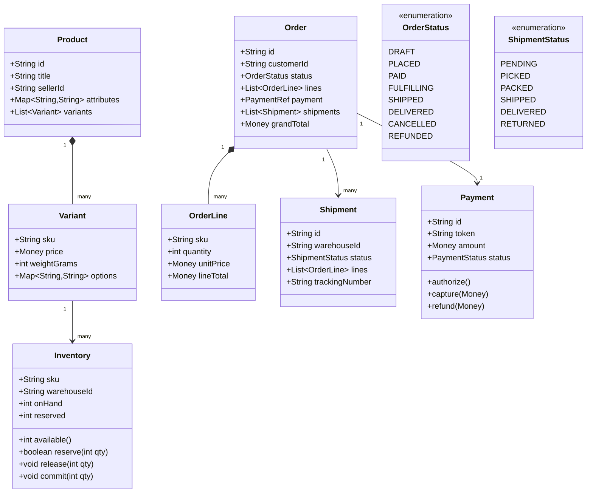

# Design Amazon (Catalog + Order)

**Date:** 2026-05-02 | **Updated:** 2026-05-02
**Tags:** `low-level-design` `case-study` `e-commerce` `catalog` `order` `ood-survey`

## Summary

"Design Amazon" in an LLD interview is a survey of the OOD across the e-commerce flow: **catalog → cart → order → payment → fulfillment**. The point is not to redesign all of AWS — it is to show that you can pick the right aggregates, draw clear boundaries between them, and identify where each pattern earns its keep.

This document is the survey. Deeper LLD lives in dedicated companion docs: cart in [Design Shopping Cart](./design-shopping-cart.md), pickup in [Design Amazon Locker](./design-amazon-locker.md). HLD scaling and storage choices live in [System Design INDEX](../../../system-design/INDEX.md).

## Table of Contents

- [Requirements](#requirements)
- [Entities and Relationships](#entities-and-relationships-mermaid-classdiagram)
- [Class Skeletons (Java)](#class-skeletons-java)
- [Key Algorithms / Workflows](#key-algorithms--workflows)
- [Patterns Used](#patterns-used-with-reason)
- [Concurrency Considerations](#concurrency-considerations)
- [Trade-offs and Extensions](#trade-offs-and-extensions)
- [Related](#related)
- [References](#references)

## Requirements

**Functional (the survey set):**

- **Catalog**: `Product` with `Variant`s (size/color/SKU), `Category`, search-friendly attributes, price, stock-on-hand, seller.
- **Cart**: add/remove/update; see [Design Shopping Cart](./design-shopping-cart.md).
- **Order**: a customer places an order from a frozen cart; an order is split into one or more `Shipment`s by warehouse and seller.
- **Payment**: tokenized payment methods; authorize at order placement, capture on shipment.
- **Fulfillment**: pick → pack → ship; tracking number issued; status events propagate.
- **Returns**: an order line can be returned within a window; refund flows via the original payment method.

**Non-functional:**

- Order placement must be **idempotent** (the user clicking "Place order" twice must not produce two orders).
- Inventory must not oversell (stock is the canonical scarce resource).
- Money math is exact; statuses are auditable.

**Out of scope (HLD):**

- Search ranking, recommendation, image CDN, payment gateway selection across regions.

## Entities and Relationships (Mermaid classDiagram)



## Class Skeletons (Java)

```java
public final class Product {
    private final String id;
    private final String title;
    private final String sellerId;
    private final Map<String,String> attributes;
    private final List<Variant> variants;

    public Optional<Variant> variantBySku(String sku) {
        return variants.stream().filter(v -> v.sku().equals(sku)).findFirst();
    }
}

public final class Inventory {
    private final String sku;
    private final String warehouseId;
    private int onHand;
    private int reserved;

    public synchronized boolean reserve(int qty) {
        if (available() < qty) return false;
        reserved += qty;
        return true;
    }

    public synchronized void commit(int qty) {
        if (qty > reserved) throw new IllegalStateException();
        reserved -= qty;
        onHand -= qty;
    }

    public synchronized void release(int qty) {
        reserved -= qty;
    }

    public int available() { return onHand - reserved; }
}

public final class Order {
    private final String id;
    private final String customerId;
    private OrderStatus status = OrderStatus.DRAFT;
    private final List<OrderLine> lines;
    private PaymentRef payment;
    private final List<Shipment> shipments = new ArrayList<>();

    public void place(Payment authorized) {
        require(status == OrderStatus.DRAFT);
        require(authorized.status() == PaymentStatus.AUTHORIZED);
        this.payment = PaymentRef.of(authorized);
        this.status = OrderStatus.PLACED;
    }

    public void markPaid() {
        require(status == OrderStatus.PLACED);
        this.status = OrderStatus.PAID;
    }

    public void planShipments(ShipmentPlanner planner) {
        require(status == OrderStatus.PAID);
        this.shipments.addAll(planner.plan(lines));
        this.status = OrderStatus.FULFILLING;
    }

    public void onShipped(String shipmentId, String trackingNumber) {
        Shipment s = findShipment(shipmentId);
        s.markShipped(trackingNumber);
        if (shipments.stream().allMatch(Shipment::isShippedOrLater)) {
            this.status = OrderStatus.SHIPPED;
        }
    }
}
```

## Key Algorithms / Workflows

### 1. Order placement (idempotent)

```
input: customerId, checkoutSnapshotId, idempotencyKey, paymentMethodToken
1. lookup by idempotencyKey -> if found, return existing order
2. revalidate snapshot (prices unchanged-or-honored, items still available)
3. for each line: inventory.reserve(qty)   (rollback all on any failure)
4. payment.authorize(grandTotal, paymentMethodToken)
5. order.place(authorized)                  (status: DRAFT -> PLACED)
6. persist order + idempotencyKey -> order_id mapping atomically
7. emit OrderPlaced event
```

If step 4 fails: release inventory and return to the caller with a payment error. If steps 5–6 fail after authorization: void the authorization in a compensating action.

### 2. Shipment planning (multi-warehouse)

A `ShipmentPlanner` chooses, per line, which warehouse fulfills it. Greedy nearest-warehouse-with-stock is the simple default; minimize-shipment-count is a smarter alternative. Each chosen `(warehouse, lines)` group becomes one `Shipment`.

### 3. Capture on shipment

Authorization happens at order placement; **capture** happens when each shipment ships. This matches what regulators in many jurisdictions require ("only charge for what shipped"). For partial shipments, capture the corresponding portion.

### 4. Returns and refunds

```
returnLine(orderId, lineId, qty, reason):
  require order in {DELIVERED}
  require qty <= shipped(lineId) - alreadyReturned(lineId)
  create ReturnRequest (status: REQUESTED)
  on warehouse receipt + inspection -> ReturnReceived
  payment.refund(prorated amount, original method)
  inventory.onHand += qty (if resellable)
  emit Refunded
```

## Patterns Used (with reason)

- **Aggregate root** — `Order` owns `OrderLine` and `Shipment`. Outsiders mutate them only via `Order` methods. Keeps invariants ("sum of shipment qty per sku ≤ ordered qty") in one place.
- **State pattern** — `OrderStatus` and `ShipmentStatus` constrain legal transitions.
- **Strategy** — `ShipmentPlanner`, `TaxStrategy`, `PaymentMethodHandler` (card, wallet, gift card) plug in independently.
- **Repository** — one per aggregate (`ProductRepository`, `OrderRepository`, `InventoryRepository`).
- **Domain events** — `OrderPlaced`, `OrderPaid`, `Shipped`, `Delivered`, `Refunded` drive notifications, analytics, and downstream services.
- **Saga / process manager** — order placement spans inventory + payment; failure compensation is a textbook saga.

## Concurrency Considerations

- **Inventory** is the hottest contended resource. Two safe shapes:
  - Per-row pessimistic lock (`SELECT ... FOR UPDATE` on the `(sku, warehouse)` row) — simple, correct, fine up to moderate QPS.
  - Optimistic with a `version` column and retry on conflict — better throughput at the cost of more code.
- **Idempotency**: an `idempotency_key UNIQUE` index on the orders table guarantees a duplicate `POST /orders` returns the original.
- **Payment authorization** is a remote side effect. Always persist the intent ("attempting authorization with key K") *before* the network call, and reconcile on retry by querying the gateway with the same key.
- **Status transitions** must be atomic with the state-changing event emit. Use the **transactional outbox** pattern: write the event row in the same DB transaction; a separate publisher relays to the message bus.

## Trade-offs and Extensions

| Decision | Trade-off |
|---|---|
| Authorize-then-capture | Matches consumer expectations; needs re-auth if shipment delayed past auth window. |
| One order, many shipments | Flexible fulfillment; UI must explain partial shipping. |
| Saga over 2PC | Available, eventually consistent; distinct compensation per step. |
| Aggregate per `Order` | Strong invariants; cross-order reporting needs a read model. |

**Extensions:**

- **Marketplace** — multiple sellers per order; split payment escrow per seller.
- **Subscriptions** — a recurring `OrderPlan` that produces `Order`s on cadence.
- **Promotions** — see the discount strategy chain in [Design Shopping Cart](./design-shopping-cart.md).
- **Pickup** — a shipment with `mode = LOCKER` instead of `HOME`. See [Design Amazon Locker](./design-amazon-locker.md).

## Related

- Siblings:
  - [Design Amazon Locker](./design-amazon-locker.md)
  - [Design Shopping Cart](./design-shopping-cart.md)
  - [Design Movie Booking System](./design-movie-booking-system.md)
  - [Design Car Rental System](./design-car-rental-system.md)
- Patterns:
  - [Aggregate / Repository](../../design-patterns/additional/repository-pattern.md)
  - [State Pattern](../../design-patterns/behavioral/state.md)
  - [Strategy Pattern](../../design-patterns/behavioral/strategy.md)
  - [Observer / Domain Events](../../design-patterns/behavioral/observer.md)
- HLD comparison: [System Design INDEX](../../../system-design/INDEX.md)

## References

- Eric Evans, *Domain-Driven Design* — aggregates, repositories, bounded contexts.
- Vaughn Vernon, *Implementing Domain-Driven Design* — saga and process manager patterns.
- Chris Richardson, *Microservices Patterns* — saga, transactional outbox, idempotent receiver.
