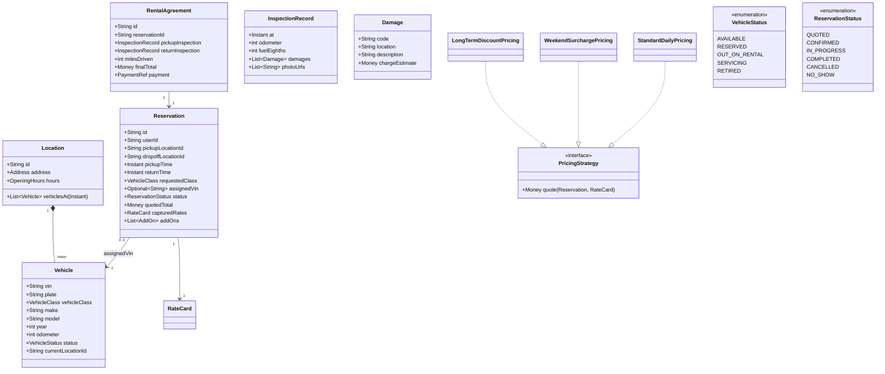

# Design Car Rental System

**Date:** 2026-05-02 | **Updated:** 2026-05-02
**Tags:** `low-level-design` `case-study` `e-commerce` `rental` `inventory` `pricing-strategy`

## Summary

A car rental system (Hertz / Enterprise / Turo-style) is an **inventory-over-time** problem: a vehicle is not just available or unavailable — it is available **for an interval** at a **specific location**. This shape recurs in lots of LLD problems (rooms, equipment, meeting spaces) which is why it is a great study.

The model has to express vehicles, locations, reservations on time intervals, return condition assessment with damage charges, and pricing strategies that handle base rate, day-of-week, mileage, insurance add-ons, and late returns.

## Table of Contents

- [Requirements](#requirements)
- [Entities and Relationships](#entities-and-relationships-mermaid-classdiagram)
- [Class Skeletons (Java)](#class-skeletons-java)
- [Key Algorithms / Workflows](#key-algorithms--workflows)
- [Patterns Used](#patterns-used-with-reason)
- [Concurrency Considerations](#concurrency-considerations)
- [Trade-offs and Extensions](#trade-offs-and-extensions)
- [Related](#related)
- [References](#references)

## Requirements

**Functional:**

- A `Location` has a fleet of `Vehicle`s. Each `Vehicle` has a `class` (`ECONOMY`, `MIDSIZE`, `SUV`, `LUXURY`, `VAN`), VIN, plate, current odometer, and condition.
- A user searches for vehicles available at a `pickupLocation` for a `[pickupTime, returnTime]` interval, optionally with a different `dropoffLocation`.
- The user reserves a vehicle (or a vehicle class — promise the class, swap the specific vehicle at pickup) and pays a deposit / authorization.
- At pickup: agent inspects, records odometer + condition, hands over keys, transitions reservation to `IN_PROGRESS`.
- At return: agent inspects again; system computes final charges (base + add-ons + mileage overage + late + damage) and captures payment.
- Cancellation policy by lead time; refunds via original method.

**Non-functional:**

- No double-booking on overlapping intervals.
- Pricing must be transparent and reproducible from the captured rate card.
- Damage charges must be auditable with photos and inspection records.

## Entities and Relationships (Mermaid classDiagram)



## Class Skeletons (Java)

```java
public enum VehicleClass { ECONOMY, MIDSIZE, SUV, LUXURY, VAN }
public enum VehicleStatus { AVAILABLE, RESERVED, OUT_ON_RENTAL, SERVICING, RETIRED }
public enum ReservationStatus { QUOTED, CONFIRMED, IN_PROGRESS, COMPLETED, CANCELLED, NO_SHOW }

public final class Vehicle {
    private final String vin;
    private final String plate;
    private final VehicleClass vehicleClass;
    private int odometer;
    private VehicleStatus status;
    private String currentLocationId;
    // ... getters / mutation only via service layer
}

public interface PricingStrategy {
    Money quote(Reservation r, RateCard rates);
}

public final class StandardDailyPricing implements PricingStrategy {
    public Money quote(Reservation r, RateCard rates) {
        long days = ChronoUnit.DAYS.between(r.pickupTime(), r.returnTime());
        Money base = rates.dailyFor(r.requestedClass()).times((int) Math.max(1, days));
        Money addons = r.addOns().stream()
            .map(a -> a.priceFor(days, rates))
            .reduce(Money.zero(rates.currency()), Money::plus);
        return base.plus(addons);
    }
}

public final class AvailabilityService {
    private final ReservationRepository reservations;
    private final VehicleRepository vehicles;

    public List<Vehicle> findAvailable(String locationId, VehicleClass vc,
                                       Instant from, Instant to) {
        // 1. Vehicles whose home or expected location at `from` is locationId and class matches.
        List<Vehicle> candidates = vehicles.atLocation(locationId, vc, from);
        // 2. Filter out vehicles with overlapping reservations.
        return candidates.stream()
            .filter(v -> !hasOverlap(v.vin(), from, to))
            .toList();
    }

    private boolean hasOverlap(String vin, Instant from, Instant to) {
        // SQL: WHERE assigned_vin = ? AND status IN ('CONFIRMED','IN_PROGRESS')
        //      AND pickup_time < ? AND return_time > ?
        return reservations.existsOverlap(vin, from, to);
    }
}

public final class ReservationService {
    public Reservation reserve(NewReservationRequest req, PricingStrategy pricing) {
        RateCard rates = rateCardSnapshot(req.pickupTime());
        Reservation draft = Reservation.draft(req, rates);
        Money quoted = pricing.quote(draft, rates);
        // Optional: assign a specific VIN now, OR commit only to class and assign at pickup.
        if (req.assignNow()) {
            Vehicle v = pickOne(req); // deterministic pick: lowest odometer, AVAILABLE
            draft.assign(v.vin());
        }
        draft.confirm(quoted);
        return reservations.save(draft);
    }
}
```

## Key Algorithms / Workflows

### 1. Interval availability

The core query: "is vehicle V free for [from, to)?"

Two reservations on the same vehicle overlap iff `existing.pickup < requested.return AND existing.return > requested.pickup`. A SQL index on `(assigned_vin, pickup_time, return_time)` plus the standard half-open interval check handles it. For *class-level* availability, count reservations per class per overlap window and compare to fleet size.

### 2. Vehicle vs class commitment

Two booking shapes:

- **Commit to a specific vehicle now** — best customer experience but worst utilization (if someone returns a similar car early, you can't substitute).
- **Commit to a class, assign at pickup** — industry default. The system reserves a *slot* in the class-fleet capacity; the specific VIN is chosen at pickup time.

The cleanest model expresses both: every reservation has a `requestedClass`; `assignedVin` is optional and may be set at any point up to pickup.

### 3. Pricing pipeline

```
quote = base(class, days) + dayOfWeekSurcharge + mileagePackage + insurance + youngDriverFee
on return:
  base = unchanged (locked at confirm)
  if returned late: + lateFee per hour (capped at one extra day)
  if miles_driven > package.allowance: + overage * perMileRate
  if damages != []: + sum(damage.chargeEstimate)
  if fuel returned below contract level: + refuelingFee
final = quote + extras
```

Lock the rate card at the time of confirmation (`capturedRates`) so quoted total is reproducible even if rates change midway.

### 4. Pickup state transition

```
pickup(reservationId, agentId, inspection):
  load reservation; require status == CONFIRMED
  if assignedVin == null -> assign one now (re-check class capacity)
  vehicle.status = OUT_ON_RENTAL
  reservation.pickupInspection = inspection
  reservation.status = IN_PROGRESS
```

### 5. Return + final billing

```
returnVehicle(reservationId, returnInspection):
  require status == IN_PROGRESS
  miles = returnInspection.odometer - pickupInspection.odometer
  damages = diff(pickupInspection.damages, returnInspection.damages)
  finalTotal = quotedTotal + mileageOverage + lateFee + damageTotal + refuelingFee
  payment.captureAdditional(finalTotal - quotedTotal, idempotencyKey(reservationId))
  vehicle.status = AVAILABLE
  vehicle.currentLocationId = dropoffLocationId
  reservation.status = COMPLETED
```

### 6. Cancellation policy

Pluggable `CancellationPolicy` (linear in lead time, tiered, fully refundable, prepaid non-refundable). The policy returns the refund amount given `(quotedTotal, leadTime)`; the service performs the refund through the original payment with an idempotency key.

## Patterns Used (with reason)

- **Strategy pattern** — `PricingStrategy`, `CancellationPolicy`, `VehicleAssignmentPolicy` are textbook strategies. New corporate-account rules drop in without touching the core flow.
- **State pattern** — `ReservationStatus` and `VehicleStatus` constrain legal transitions.
- **Snapshot / memento** — `capturedRates` in the reservation is a memento of pricing inputs at confirm time.
- **Repository** — one per aggregate, plus a specialized `OverlapQuery` on `ReservationRepository`.
- **Specification pattern** — composable filters in availability search ("seats ≥ 5 AND has_child_seat AND class = VAN").
- **Domain events** — `ReservationConfirmed`, `RentalStarted`, `RentalCompleted`, `DamageRecorded` for downstream notification, fleet ops, and analytics.

## Concurrency Considerations

- **Class-capacity reservations** race on the count, not on a row. Either:
  - Hold a per-`(location, class, day)` row and `UPDATE ... SET reserved = reserved + 1 WHERE reserved < capacity` (rowcount = 1 wins), or
  - Use a Redis counter with a Lua check-and-incr.
- **VIN-specific reservations** race on the interval. A unique constraint cannot directly express "no overlap"; PostgreSQL's `EXCLUDE USING gist (vin WITH =, tstzrange(pickup, return) WITH &&)` is the cleanest answer if you can use it.
- **Pickup vs no-show**: a sweeper transitions `CONFIRMED` reservations whose pickup window passed (e.g., +60 min) into `NO_SHOW`, freeing the slot. Do this transactionally with a short window after grace to avoid penalizing late customers.
- **Damage assessment** must not block return: record damage as `pendingReview`, charge an estimate, and reconcile with the manager-approved final number on a follow-up settlement.

## Trade-offs and Extensions

| Decision | Trade-off |
|---|---|
| Class commitment, late assignment | Better fleet utilization; small risk of disappointing "I want THAT car" customers. |
| Capture rates at confirm | Reproducible bills; adds storage per reservation. |
| GiST exclusion constraint for VIN | Bulletproof; PostgreSQL-specific. |
| Damage estimate at return | Quick checkout; requires a settlement process. |

**Extensions:**

- **One-way rentals** with location-pair surcharges — modeled as an add-on whose price depends on `pickupLocation` and `dropoffLocation`.
- **Loyalty program** — discounts, free upgrades; another `PricingStrategy` decorator.
- **Peer-to-peer (Turo style)** — vehicles owned by hosts; reservations include host payouts; trust/rating becomes first-class.
- **Long-term leases** — same model, longer intervals, monthly billing; a `BillingSchedule` aggregate replaces single-payment.
- **Telematics integration** — vehicle reports its own odometer/condition automatically, reducing inspection workload.

## Related

- Siblings:
  - [Design Amazon Locker](./design-amazon-locker.md)
  - [Design Shopping Cart](./design-shopping-cart.md)
  - [Design Amazon (Catalog + Order)](./design-amazon.md)
  - [Design Movie Booking System](./design-movie-booking-system.md)
- Patterns:
  - [Strategy Pattern](../../design-patterns/behavioral/strategy.md)
  - [State Pattern](../../design-patterns/behavioral/state.md)
  - [Repository Pattern](../../design-patterns/additional/repository-pattern.md)
  - [Specification Pattern](../../design-patterns/additional/specification-pattern.md)
- HLD comparison: [System Design INDEX](../../../system-design/INDEX.md) — see fleet/reservation system entries.

## References

- *Domain-Driven Design*, Eric Evans — aggregates, value objects.
- *Patterns of Enterprise Application Architecture*, Martin Fowler — Money, Repository, Optimistic Offline Lock.
- PostgreSQL documentation on `EXCLUDE` constraints with GiST indexes for non-overlapping intervals.
