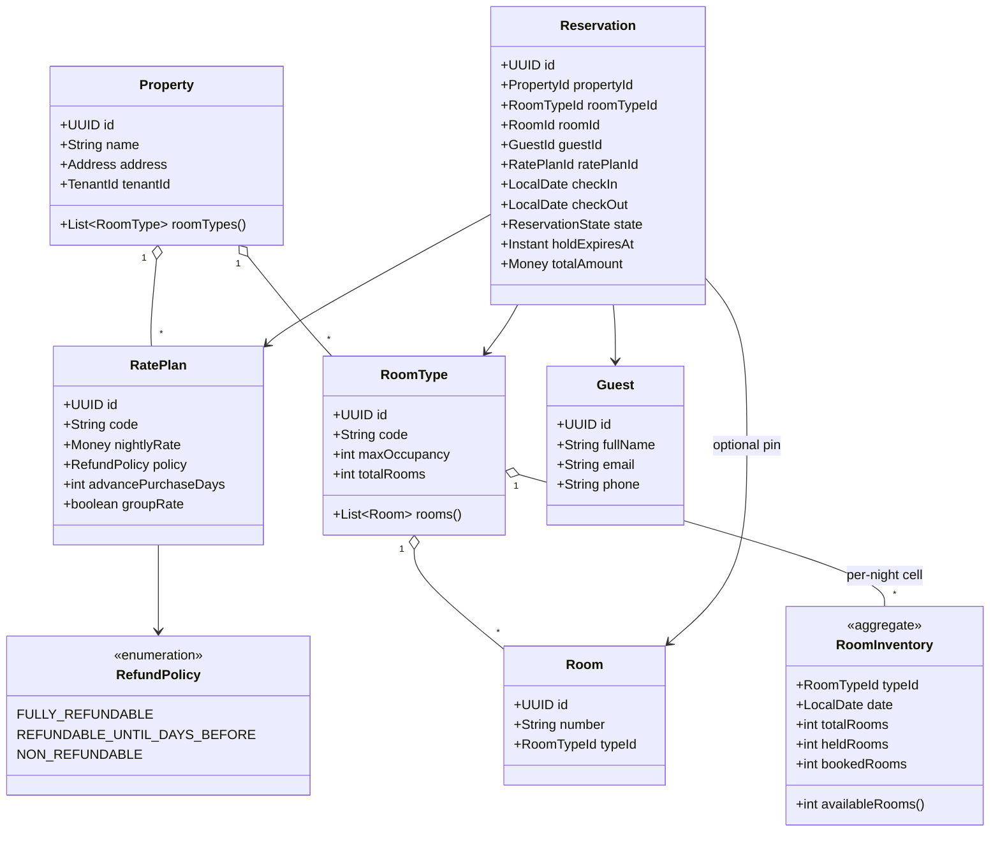
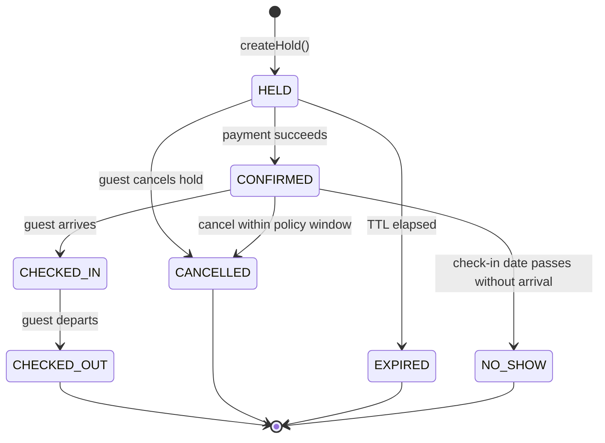

# Design Hotel Booking System

**Date:** 2026-05-02 | **Updated:** 2026-05-02
**Tags:** `low-level-design` `case-study` `e-commerce` `concurrency` `state-machine`

## Summary

Design a hotel reservation system: search rooms by date range and occupancy,
hold them while the guest pays, confirm or release the hold, and apply the
right rate plan and cancellation policy.

This case study is deliberately distinct from movie-booking and car-rental:

- **Movie booking** has a *fixed showing* — one fixed start time per seat. The
  inventory unit is `(showing, seat)`.
- **Car rental** has *fungible vehicles within a class* and rentals span a
  continuous duration but typically pickup/drop at a single location.
- **Hotel booking** has *date-range* inventory (one room is a sequence of
  per-night cells), per-room-type pools rather than specific rooms at search
  time, and rate plans with refundability rules that drive the cancellation
  state machine.

## Table of Contents

- [Requirements](#requirements)
- [Entities and Relationships](#entities-and-relationships)
- [Reservation Lifecycle](#reservation-lifecycle)
- [Class Skeletons (Java)](#class-skeletons-java)
- [Key Algorithms / Workflows](#key-algorithms--workflows)
- [Patterns Used](#patterns-used)
- [Concurrency Considerations](#concurrency-considerations)
- [Trade-offs and Extensions](#trade-offs-and-extensions)
- [Related](#related)
- [References](#references)

## Requirements

### Functional

- A **Property** has many **RoomType**s (e.g., King, Double Queen, Suite).
- Each **RoomType** has a pool of physical **Room**s.
- Inventory is per-night: for `[checkIn, checkOut)` we need each night
  available.
- Search: `(propertyId, checkIn, checkOut, guests)` → list of available
  RoomTypes with their rate-plan pricing.
- Hold: reserve a RoomType for a date range for a TTL (typically 10–15
  minutes) while payment is being collected.
- Confirm: convert a hold into a confirmed reservation upon successful
  payment, optionally pinning a specific Room number.
- Cancel: state-machine transitions driven by the rate plan's cancellation
  policy.
- Multi-tenancy: each Property belongs to a brand/tenant; rate plans and
  inventory are scoped per Property.

### Non-functional

- Concurrent holds for the same RoomType+date must not over-sell the pool.
- Holds expire automatically without manual cleanup.
- Search must be cheap — the hot path should not lock inventory rows.
- Auditable: every reservation state transition is logged.

### Out of scope

- Channel manager / GDS distribution (Booking.com, Expedia sync).
- Loyalty point accrual.
- Group block management beyond a flat group rate plan.

## Entities and Relationships



## Reservation Lifecycle



The transitions allowed from `CONFIRMED → CANCELLED` depend on the
`RefundPolicy` of the booked `RatePlan`:

- `FULLY_REFUNDABLE` → cancel any time before check-in.
- `REFUNDABLE_UNTIL_DAYS_BEFORE` → cancel up to N days before check-in.
- `NON_REFUNDABLE` → cancellation is allowed but **no refund** is issued.

## Class Skeletons (Java)

```java
public enum ReservationState {
    HELD, CONFIRMED, CANCELLED, EXPIRED, CHECKED_IN, CHECKED_OUT, NO_SHOW
}

public enum RefundPolicy {
    FULLY_REFUNDABLE, REFUNDABLE_UNTIL_DAYS_BEFORE, NON_REFUNDABLE
}

public final class RoomInventory {
    private final UUID roomTypeId;
    private final LocalDate date;
    private final int totalRooms, heldRooms, bookedRooms;

    public int availableRooms() { return totalRooms - heldRooms - bookedRooms; }

    public RoomInventory withHoldAdded(int n) {
        if (heldRooms + bookedRooms + n > totalRooms) {
            throw new InventoryUnavailableException(roomTypeId, date);
        }
        return new RoomInventory(roomTypeId, date, totalRooms, heldRooms + n, bookedRooms);
    }
    public RoomInventory withHoldConvertedToBooking(int n) {
        return new RoomInventory(roomTypeId, date, totalRooms, heldRooms - n, bookedRooms + n);
    }
    public RoomInventory withHoldReleased(int n) {
        return new RoomInventory(roomTypeId, date, totalRooms, heldRooms - n, bookedRooms);
    }
    // constructor + getters omitted
}

public final class RatePlan {
    private final UUID id;
    private final Money nightlyRate;
    private final RefundPolicy policy;
    private final int refundCutoffDaysBeforeCheckIn;

    public boolean allowsRefund(LocalDate checkIn, LocalDate today) {
        return switch (policy) {
            case FULLY_REFUNDABLE -> true;
            case REFUNDABLE_UNTIL_DAYS_BEFORE ->
                ChronoUnit.DAYS.between(today, checkIn) >= refundCutoffDaysBeforeCheckIn;
            case NON_REFUNDABLE -> false;
        };
    }
    public Money totalFor(int nights) { return nightlyRate.multiply(nights); }
}

public final class Reservation {
    private final UUID id, propertyId, roomTypeId, roomId, guestId, ratePlanId;
    private final LocalDate checkIn, checkOut;
    private final ReservationState state;
    private final Instant holdExpiresAt;
    private final Money totalAmount;

    public Reservation confirm() {
        require(state == ReservationState.HELD, "must be HELD");
        return copyWithState(ReservationState.CONFIRMED);
    }
    public Reservation cancel() {
        return switch (state) {
            case HELD, CONFIRMED -> copyWithState(ReservationState.CANCELLED);
            default -> throw new IllegalStateTransition(state, "CANCELLED");
        };
    }
    public Reservation expire() {
        require(state == ReservationState.HELD, "only HELD can expire");
        return copyWithState(ReservationState.EXPIRED);
    }
    // copyWithState, getters omitted
}
```

```java
public final class BookingService {
    private final InventoryRepository inventory;
    private final ReservationRepository reservations;
    private final RatePlanRepository ratePlans;
    private final Clock clock;
    private final Duration holdTtl;

    @Transactional
    public Reservation createHold(HoldCommand cmd) {
        List<RoomInventory> nights = inventory
            .lockNights(cmd.roomTypeId(), cmd.checkIn(), cmd.checkOut());
        for (RoomInventory n : nights) {
            if (n.availableRooms() < 1) {
                throw new InventoryUnavailableException(cmd.roomTypeId(), n.date());
            }
        }
        for (RoomInventory n : nights) inventory.save(n.withHoldAdded(1));

        RatePlan plan = ratePlans.byId(cmd.ratePlanId());
        int nightCount = (int) ChronoUnit.DAYS.between(cmd.checkIn(), cmd.checkOut());
        return reservations.save(Reservation.newHold(
            cmd, plan.totalFor(nightCount), clock.instant().plus(holdTtl)));
    }

    @Transactional
    public Reservation confirm(UUID reservationId, PaymentResult payment) {
        Reservation r = reservations.lockById(reservationId);
        if (r.holdExpiresAt().isBefore(clock.instant())) {
            throw new HoldExpiredException(reservationId);
        }
        inventory.lockNights(r.roomTypeId(), r.checkIn(), r.checkOut())
            .forEach(n -> inventory.save(n.withHoldConvertedToBooking(1)));
        return reservations.save(r.confirm());
    }

    @Transactional
    public Reservation cancel(UUID reservationId) {
        Reservation r = reservations.lockById(reservationId);
        inventory.lockNights(r.roomTypeId(), r.checkIn(), r.checkOut())
            .forEach(n -> inventory.save(n.withHoldReleased(1)));
        return reservations.save(r.cancel());
    }
}
```

## Key Algorithms / Workflows

### Search

1. Compute the set of nights `[checkIn, checkOut)`.
2. For each `RoomType` in the `Property`, fetch its `RoomInventory` rows for
   those nights.
3. Filter out RoomTypes where any night has `availableRooms() < requested`.
4. Filter out RoomTypes whose `maxOccupancy < guests`.
5. Join applicable `RatePlan`s (advance-purchase requirements satisfied;
   group rate only if request says group).
6. Return `(RoomType, RatePlan, totalPrice)` rows.

Hot-path search is read-only; never lock inventory rows during search.

### Hold

The hold path is the concurrency-critical write. Two concurrent guests trying
for the last room must not both succeed. See [Concurrency
Considerations](#concurrency-considerations).

### Confirm

Triggered by payment completion. Idempotent on retries — the payment
reference is stored on the `Reservation` and re-confirmation of an already
`CONFIRMED` reservation returns the existing one rather than double-booking.

### Hold expiry sweep

A scheduled job (every minute) finds reservations where
`state = HELD AND holdExpiresAt < now()` and runs the equivalent of `cancel`
with no refund consideration: state → `EXPIRED`, inventory `heldRooms` is
decremented.

### Pinning a specific room

Pinning a `Room` to a `Reservation` typically happens late — at check-in or
the night before — so the front desk can swap rooms without amending
reservations. Some PMS systems (Property Management Systems) pin earlier; the
trade-off is flexibility vs. guaranteeing room number for special requests.

## Patterns Used

- **Aggregate (DDD)** — `RoomInventory` per `(roomType, date)` is an
  aggregate. All inventory changes go through it; no other code mutates the
  counters directly.
- **State** — `ReservationState` plus the transition methods on
  `Reservation` form an explicit state machine. Forbidden transitions throw.
- **Strategy** — `RefundPolicy` is the strategy that `RatePlan.allowsRefund`
  delegates to.
- **Repository** — `InventoryRepository`, `ReservationRepository`, and
  `RatePlanRepository` hide persistence details from the service.
- **Command** — `HoldCommand` carries the search inputs from controller to
  service, decoupling transport from domain.

## Concurrency Considerations

### Per-room/date pessimistic locking on hold

The simplest correct design takes a row-level lock on every night's
`RoomInventory` row inside the hold transaction (Postgres
`SELECT ... FOR UPDATE`). Because the lock is per-`(roomTypeId, date)` cell,
holds for different dates or different room types do not contend.

### Optimistic concurrency alternative

`RoomInventory` carries a `version` column. The hold update reads the row,
asserts `version = expected`, and increments. On conflict, the service
retries (typical retry budget: 3–5). Fewer locks held; more retries under
contention. Works well when contention is rare.

### Hold TTL is critical

If holds were eternal, an abandoned checkout flow would silently consume
inventory until manual cleanup. `holdExpiresAt` plus the sweep job is the
self-healing mechanism.

### Idempotency on confirm

Payment gateways retry. The confirm endpoint must accept a payment
identifier and return the existing confirmed reservation on the second call
rather than incrementing `bookedRooms` twice. Implementations: unique
constraint on `(reservationId, paymentReference)` in a `payment_attempts`
table, or check current `state` before mutating.

### Avoiding deadlocks

Always lock `RoomInventory` rows in a stable order — e.g., sorted by
`(roomTypeId, date)`. Two transactions trying to hold overlapping date
ranges will then queue rather than deadlock.

### Multi-property tenancy isolation

Every query scoped by `propertyId` (which transitively scopes by tenant).
Index `(propertyId, roomTypeId, date)` on `RoomInventory`. Cross-tenant
reads are a security defect; enforce it at the repository layer, not just in
controllers.

## Trade-offs and Extensions

| Choice | Pros | Cons |
|---|---|---|
| Per-night cells | Simple; date-range queries are SQL-natural | More rows per RoomType |
| Date-range tree (KDR/interval tree) | Fewer rows | Complex updates; harder to reason about |
| Pessimistic hold locks | Always correct under contention | Locks held during user-facing checkout |
| Optimistic + retry | Less lock contention | Retry storms under heavy load |
| Pin Room at confirm | Predictable for guest | Less flexibility for housekeeping |
| Pin Room at check-in | Maximum flexibility | Guest can't request specific room |

### Extensions

- **Overbooking** — sell N+k rooms expecting k cancellations; needs a walk
  policy when occupancy actually exceeds N.
- **Length-of-stay / arrival-day restrictions** — `RatePlan` may require
  Saturday arrival or a 3-night minimum.
- **Channel manager sync** — every state change emits an event consumed by
  an outbound sync to OTAs (Booking, Expedia, Airbnb).
- **Group blocks** — a single contract holds N rooms across M nights;
  sub-bookings draw down until a cutoff date, then unsold rooms return.

## Related

- [Design Movie Booking System](./design-movie-booking-system.md)
  — the showing-based sibling case study.
- [Design Car Rental System](./design-car-rental-system.md) — rentals
  spanning a duration but with single pickup/return.
- [Design Patterns: State](../../design-patterns/behavioral/state.md) —
  reservation state transitions.
- [Design Patterns: Strategy](../../design-patterns/behavioral/strategy.md)
  — `RefundPolicy` selection.
- [Design Patterns: Repository](../../design-patterns/additional/repository-pattern.md)
  — aggregate persistence boundary.
- [System Design INDEX](../../../system-design/INDEX.md) — distributed
  inventory and saga patterns for multi-property booking.

## References

- DDD aggregate design (Evans, Vernon) — `RoomInventory` as the consistency
  boundary for night-level availability.
- PostgreSQL row-level locking (`SELECT ... FOR UPDATE`,
  `SELECT ... FOR NO KEY UPDATE`).
- JPA / Hibernate optimistic locking via `@Version`.
- OpenTravel Alliance (OTA) reservation message specs — industry vocabulary
  for hotel booking exchange formats.
- ISO 8601 date intervals — half-open `[checkIn, checkOut)` convention.
