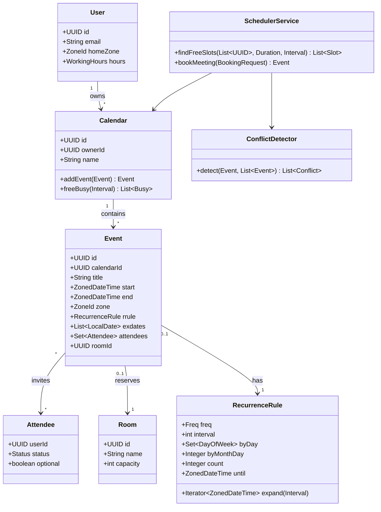

# Design Meeting Scheduler

**Date:** 2026-05-02 | **Updated:** 2026-05-02
**Tags:** `low-level-design` `case-study` `e-commerce` `calendar` `scheduling` `time-zones`

## Summary

A meeting scheduler manages calendars for users and rooms, finds mutually free time
slots, books events, expands recurring rules, detects conflicts, and renders results
in each attendee's local time. The hard parts are not "store events in a list" — the
hard parts are recurrence (RFC 5545 RRULE), DST-safe time-zone arithmetic, and
race-free conflict checks when many people book the same room at once.

This document specifies the LLD: domain model, free-busy algorithm, RRULE expansion,
TZ handling rules, concurrency strategy, and the patterns used to keep each concern
isolated and testable.

## Table of Contents

- [Requirements](#requirements)
- [Entities and Relationships](#entities-and-relationships-mermaid-classdiagram)
- [Class Skeletons (Java)](#class-skeletons-java)
- [Key Algorithms / Workflows](#key-algorithms--workflows)
- [Patterns Used](#patterns-used)
- [Concurrency Considerations](#concurrency-considerations)
- [Trade-offs and Extensions](#trade-offs-and-extensions)
- [Related](#related)
- [References](#references)

## Requirements

### Functional

1. Users own calendars; calendars hold events with `start`, `end`, `tz`, optional
   `RRULE`, optional `EXDATE`s.
2. Find common free time across N attendees within a window, respecting working
   hours per attendee.
3. Book a meeting room for an event; reject if overlap exists.
4. Detect conflicts when scheduling and propose alternatives.
5. Send invitations and update statuses (accepted, declined, tentative).
6. Expand recurring events (daily, weekly with `BYDAY`, monthly by day-of-month or
   nth weekday, yearly).
7. Cancel a single occurrence (`EXDATE`) or terminate a series.
8. Render times in each attendee's local zone.

### Non-Functional

- Conflict checks must be linearizable per (room, time-window).
- Free-busy queries on dense calendars (~10k events) must be sub-100ms.
- Time math must be DST-safe: never store wall-clock time without a zone, never use
  fixed UTC offsets for "every Monday at 9am Berlin time."
- Series with `COUNT=∞` (e.g., weekly forever) must not blow memory — expand lazily.

### Out of Scope

- Email transport (assume `NotificationService` interface).
- ML-based "best time" ranking. We surface candidates; ranking is pluggable.
- Federation across calendar providers (Google, Outlook). Architecture leaves room.

## Entities and Relationships (Mermaid classDiagram)



## Class Skeletons (Java)

```java
public enum Freq { DAILY, WEEKLY, MONTHLY, YEARLY }

public final class RecurrenceRule {
    private final Freq freq;
    private final int interval;
    private final Set<DayOfWeek> byDay;
    private final Integer byMonthDay;
    private final Integer count;
    private final ZonedDateTime until;

    public Iterator<ZonedDateTime> expand(ZonedDateTime seriesStart, Interval window) {
        return new RRuleIterator(this, seriesStart, window);
    }
}

public final class Event {
    private final UUID id;
    private final UUID calendarId;
    private final String title;
    private final ZonedDateTime start;     // includes ZoneId
    private final ZonedDateTime end;
    private final RecurrenceRule rrule;    // nullable
    private final Set<LocalDate> exdates;  // skipped occurrences
    private final Set<Attendee> attendees;
    private final UUID roomId;

    public Stream<Occurrence> occurrencesIn(Interval window) {
        if (rrule == null) {
            return overlaps(window) ? Stream.of(asOccurrence()) : Stream.empty();
        }
        Iterable<ZonedDateTime> starts = () -> rrule.expand(start, window);
        Duration dur = Duration.between(start, end);
        return StreamSupport.stream(starts.spliterator(), false)
            .filter(s -> !exdates.contains(s.toLocalDate()))
            .map(s -> new Occurrence(this, s, s.plus(dur)));
    }
}

public final class FreeBusyIndex {
    // Per-user merged busy intervals, sorted, non-overlapping.
    private final NavigableMap<Instant, Instant> busy = new TreeMap<>();

    public void addBusy(Instant from, Instant to) { /* merge adjacent */ }
    public List<Interval> freeWindows(Interval bound, Duration minLen) { /* ... */ }
}

public final class SchedulerService {
    private final CalendarRepo calendars;
    private final RoomRepo rooms;
    private final ConflictDetector detector;
    private final Clock clock;

    public List<Slot> findFreeSlots(List<UUID> userIds, Duration length, Interval window) {
        List<FreeBusyIndex> indexes = userIds.stream()
            .map(id -> calendars.freeBusyFor(id, window))
            .toList();
        return intersectFree(indexes, length, window);
    }

    public Event bookMeeting(BookingRequest req) {
        // 1. Acquire ordered locks: (room, then each user calendar) by id.
        // 2. Re-read state inside the lock.
        // 3. Run ConflictDetector.
        // 4. Persist Event in single transaction.
        // 5. Emit InviteIssued event for NotificationService (observer).
    }
}
```

## Key Algorithms / Workflows

### 1. Free-Busy Intersection

Inputs: a set of users, a window `[W0, W1]`, a duration `D`.

```text
for each user u:
    occurrences = expand all events of u that intersect [W0, W1]
    busy_u = merge overlapping intervals, clamp to [W0, W1]
    apply working-hours mask: subtract non-working time from "available"
free_intersection = [W0, W1]
for each user u:
    free_u = complement(busy_u, [W0, W1]) intersected with workingHours_u
    free_intersection = interval_intersect(free_intersection, free_u)
slots = sliding D-length windows over free_intersection
```

Complexity: with merged sorted intervals it is `O(K log K)` where K is total
occurrences; sweep-line if you prefer `O(K)` after sort.

### 2. RRULE Expansion (RFC 5545)

We follow [RFC 5545](https://datatracker.ietf.org/doc/html/rfc5545) `RRULE`
semantics for `FREQ`, `INTERVAL`, `BYDAY`, `BYMONTHDAY`, `COUNT`, `UNTIL`,
`EXDATE`. Expansion is **lazy** — we never materialize an unbounded series. The
iterator advances by one occurrence and stops at the window's right edge or at
`COUNT`/`UNTIL`.

DST rule: anchor recurrences at the original `ZonedDateTime`. Adding `Period.ofDays(7)`
on a `ZonedDateTime` is DST-correct in `java.time` because it rebases through
`LocalDateTime`. Adding `Duration.ofDays(7)` is **wrong** — that adds 7 × 24h of
elapsed time and silently shifts the wall clock across DST boundaries.

### 3. Conflict Detection

```text
detect(newEvent, existingEvents):
    expand newEvent into [W0, W1] (typical W = next 12 months)
    for each existing event e:
        if any occurrence of e overlaps any occurrence of newEvent:
            emit Conflict(e, overlap-instant)
```

Use an interval tree per calendar/room when N is large. For typical N ≤ a few
hundred per window, linear sweep is fine.

### 4. Booking Workflow

1. Resolve room and attendees.
2. Acquire row-level locks in deterministic order (by UUID) — prevents deadlock.
3. Re-fetch event lists for room + attendee calendars.
4. Run conflict detector.
5. If clean → insert Event, commit, emit `InviteIssued`.
6. If conflict → return `409` with proposed alternatives via `findFreeSlots`.

### 5. Time-Zone Rendering

- Storage: always `ZonedDateTime` (or `(Instant, ZoneId)` pair). Never raw
  `LocalDateTime` for events that have a definite real-world moment.
- API output: convert to attendee's `homeZone` at the edge, not in the domain.
- "All-day" events are an exception: store as `LocalDate` (zone-less) and render
  in the viewer's zone.

## Patterns Used

- **Strategy** — pluggable `RecurrenceRule.expand` per `Freq` keeps daily/weekly/
  monthly logic isolated and unit-testable. See
  [strategy](../../design-patterns/behavioral/strategy.md).
- **Iterator** — `RRuleIterator` lazily yields occurrences, bounding memory for
  long-running series. See [iterator](../../design-patterns/behavioral/iterator.md).
- **Observer** — `InviteIssued`, `EventUpdated`, `EventCancelled` notify mail/push
  fanout without coupling the scheduler. See
  [observer](../../design-patterns/behavioral/observer.md).
- **Repository** — `CalendarRepo`, `RoomRepo` hide storage; the service layer is
  storage-agnostic.
- **Builder** — `BookingRequest.Builder` for readable construction.
- **Specification / Predicate** — working-hours and "must-attend" filters compose
  cleanly.

## Concurrency Considerations

- **Race-free booking**: two clients reserving the same room at the same time must
  not both succeed. Two viable mechanisms:
  - **Pessimistic lock** on `room_id` row inside the booking transaction
    (`SELECT … FOR UPDATE`). Simple and correct; blocks under contention.
  - **Optimistic lock** with a `version` column on the room calendar plus an
    explicit `EXCLUDE USING gist (room_id WITH =, tsrange(start, end) WITH &&)`
    constraint in PostgreSQL. The DB enforces non-overlap; the second writer fails
    cleanly with a constraint violation that the service translates to `409`.
- Acquire user-calendar locks in deterministic UUID order to avoid deadlock when
  many users are invited.
- The free-busy index is read-mostly. Cache per-user merged intervals and
  invalidate on event mutation.
- Do not perform `NotificationService.send` inside the DB transaction. Publish to
  an outbox table and let a worker drain it (transactional outbox pattern).

## Trade-offs and Extensions

| Decision | Trade-off |
|---|---|
| `ZonedDateTime` everywhere vs `Instant + ZoneId` columns | `ZonedDateTime` ergonomic in Java; the pair form normalizes well in SQL. We store both. |
| Lazy RRULE expansion vs materialized occurrences | Lazy keeps memory bounded for infinite series; materialization speeds queries on hot ranges. We do lazy + a 12-month materialized cache. |
| Postgres `EXCLUDE` constraint vs application-level check | DB constraint is bullet-proof against races; needs `btree_gist`. Worth it. |
| Single calendar table vs sharded per user | Single table simpler; shard once a user crosses ~10⁵ events or once tenants need isolation. |

Extensions:

- Federated calendars: adapter layer pulling Google/Outlook free-busy via their
  APIs and merging into the index.
- Smart suggestions: rank candidate slots by "least disruption" (preserving focus
  blocks, avoiding back-to-back stacking).
- Group/team calendars with delegated permissions.
- Resource booking beyond rooms: equipment, vehicles — same `Resource` abstraction.

## Related

- Sibling LLD case studies:
  - [design-online-auction-system](design-online-auction-system.md)
  - [design-online-food-delivery-service](design-online-food-delivery-service.md)
  - [design-ride-hailing-service](design-ride-hailing-service.md)
- Patterns:
  - [strategy](../../design-patterns/behavioral/strategy.md)
  - [iterator](../../design-patterns/behavioral/iterator.md)
  - [observer](../../design-patterns/behavioral/observer.md)
- HLD context: [system-design INDEX](../../../system-design/INDEX.md)

## References

- IETF **RFC 5545** — *Internet Calendaring and Scheduling Core Object Specification
  (iCalendar)*. Defines `RRULE`, `EXDATE`, `VEVENT` semantics.
- IETF **RFC 7986** — iCalendar new properties (extends 5545).
- `java.time` package — `ZonedDateTime`, `ZoneId`, `Period` vs `Duration`
  semantics.
- IANA Time Zone Database (tzdata) — DST rules.
- Google Calendar API — *freebusy.query* shape; useful reference even without
  federating.
