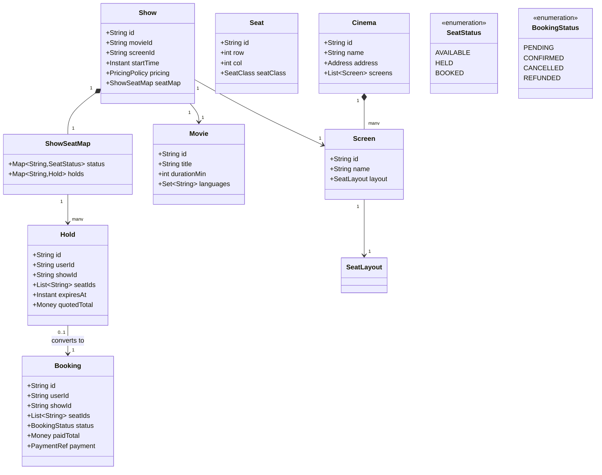
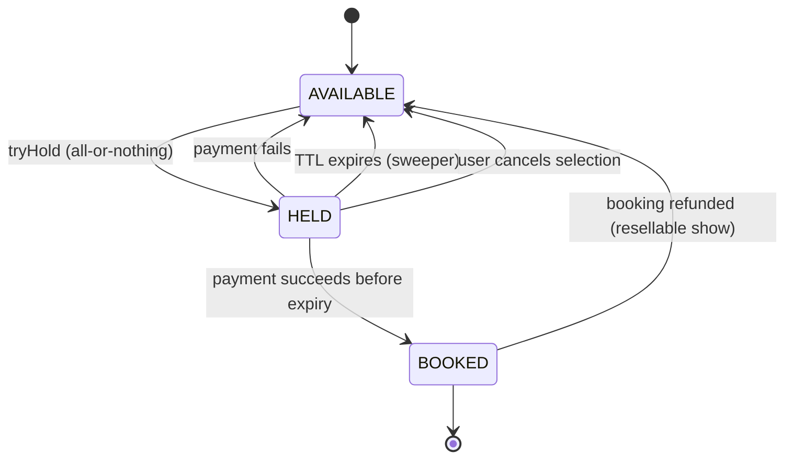

# Design Movie Booking System

**Date:** 2026-05-02 | **Updated:** 2026-05-02
**Tags:** `low-level-design` `case-study` `e-commerce` `booking` `concurrency` `seat-hold`

## Summary

A movie booking system (BookMyShow / Fandango-style) is the canonical seat-allocation problem: many users compete for a small fixed set of resources, and a user needs **exclusive** access to specific seats long enough to enter payment details — but no longer. This makes the **seat-hold TTL** the heart of the design, and it is the part interviewers prod hardest.

This document scopes one logical chain of cinemas: showtimes, screens, seats, holds, bookings, payment integration, and refunds.

## Table of Contents

- [Requirements](#requirements)
- [Entities and Relationships](#entities-and-relationships-mermaid-classdiagram)
- [Class Skeletons (Java)](#class-skeletons-java)
- [Key Algorithms / Workflows](#key-algorithms--workflows)
- [Patterns Used](#patterns-used-with-reason)
- [Concurrency Considerations](#concurrency-considerations)
- [Trade-offs and Extensions](#trade-offs-and-extensions)
- [Related](#related)
- [References](#references)

## Requirements

**Functional:**

- A `Cinema` has many `Screen`s; a `Screen` has a fixed seat layout (rows × cols, with classes: `STANDARD`, `PREMIUM`, `RECLINER`).
- A `Show` is a scheduled `Movie` on a specific `Screen` at a specific `startTime`; pricing varies by seat class and time-of-day.
- A user selects 1+ seats for a show. The system places a **temporary hold** (TTL ≈ 7–10 minutes) so the user can pay.
- On successful payment, the hold becomes a `Booking`. On payment failure or expiry, seats return to the pool.
- A booking can be cancelled within a window for a (possibly partial) refund per cancellation policy.

**Non-functional:**

- No double-selling a seat under any race.
- Hold expiry must be observable in **soft real time** so freed seats become selectable again quickly.
- Bookings must be auditable; refunds must be idempotent.

## Entities and Relationships (Mermaid classDiagram)



## Class Skeletons (Java)

```java
public enum SeatClass { STANDARD, PREMIUM, RECLINER }
public enum SeatStatus { AVAILABLE, HELD, BOOKED }
public enum BookingStatus { PENDING, CONFIRMED, CANCELLED, REFUNDED }

public final class Show {
    private final String id;
    private final String movieId;
    private final String screenId;
    private final Instant startTime;
    private final PricingPolicy pricing;
    private final ShowSeatMap seatMap;

    public Money quote(List<String> seatIds) {
        return seatIds.stream()
            .map(id -> pricing.priceFor(seatMap.seat(id), startTime))
            .reduce(Money.zero(pricing.currency()), Money::plus);
    }
}

public final class ShowSeatMap {
    // For one show. Source of truth for seat status.
    private final Map<String, SeatStatus> status;     // seatId -> status
    private final Map<String, String> holdBySeat;      // seatId -> holdId

    public synchronized boolean tryHold(String holdId, List<String> seatIds) {
        // All-or-nothing: either every seat goes from AVAILABLE -> HELD or nothing changes.
        for (String s : seatIds) {
            if (status.get(s) != SeatStatus.AVAILABLE) return false;
        }
        for (String s : seatIds) {
            status.put(s, SeatStatus.HELD);
            holdBySeat.put(s, holdId);
        }
        return true;
    }

    public synchronized void releaseHold(String holdId) {
        for (var e : Map.copyOf(holdBySeat).entrySet()) {
            if (e.getValue().equals(holdId)) {
                status.put(e.getKey(), SeatStatus.AVAILABLE);
                holdBySeat.remove(e.getKey());
            }
        }
    }

    public synchronized void confirm(String holdId) {
        for (var e : Map.copyOf(holdBySeat).entrySet()) {
            if (e.getValue().equals(holdId)) {
                status.put(e.getKey(), SeatStatus.BOOKED);
                holdBySeat.remove(e.getKey());
            }
        }
    }
}

public final class BookingService {
    private final ShowRepository shows;
    private final HoldRepository holds;
    private final BookingRepository bookings;
    private final PaymentGateway payments;
    private final Clock clock;
    private static final Duration HOLD_TTL = Duration.ofMinutes(8);

    public Hold placeHold(String userId, String showId, List<String> seatIds) {
        Show show = shows.byId(showId);
        Money total = show.quote(seatIds);
        Hold hold = Hold.newOne(userId, showId, seatIds, clock.instant().plus(HOLD_TTL), total);
        if (!show.seatMap().tryHold(hold.id(), seatIds))
            throw new SeatsUnavailableException();
        holds.save(hold);
        return hold;
    }

    public Booking confirm(String holdId, PaymentRequest req) {
        Hold hold = holds.byId(holdId);
        if (clock.instant().isAfter(hold.expiresAt()))
            throw new HoldExpiredException();
        PaymentResult r = payments.charge(req, hold.quotedTotal(), idempotencyKey(holdId));
        if (!r.success()) {
            shows.byId(hold.showId()).seatMap().releaseHold(holdId);
            throw new PaymentFailedException(r);
        }
        shows.byId(hold.showId()).seatMap().confirm(holdId);
        Booking b = Booking.confirmed(hold, r.ref());
        bookings.save(b);
        return b;
    }
}
```

## Key Algorithms / Workflows

### 1. The seat-hold lifecycle (the interview favorite)



### 2. All-or-nothing hold

`tryHold` must be atomic across **all requested seats**. Two implementation shapes:

- **Single-row JSON / hash** in Redis per show, mutated under a Lua script:
  - `HMGET show:{id}:seats <seatIds>` → check all `AVAILABLE`.
  - `HMSET` them to `HELD:{holdId}` and `EXPIRE` a parallel key for TTL.
- **Per-seat row in SQL**: open a transaction, `UPDATE seats SET status='HELD', hold_id=? WHERE show_id=? AND seat_id IN (?) AND status='AVAILABLE'`, check rowcount equals requested count, otherwise rollback.

The Redis path is faster but Redis is now the source of truth for that show. The SQL path is slower but already audited and durable. Most production systems use a hybrid: Redis for hot read traffic + SQL for the durable record.

### 3. TTL enforcement

There are three correctness-relevant ways to enforce expiry:

| Approach | Pros | Cons |
|---|---|---|
| Lazy: check `expiresAt` on every read; sweeper job deletes stale | Simple; correct | Stale seats appear `HELD` until next read |
| Active: sweeper every N seconds frees expired holds | Predictable freshness | Periodic load; window of staleness = N |
| Push: Redis keyspace notifications on `EXPIRE` | Near-real-time | Requires notification config; not delivered guaranteed |

A defensible default: **lazy + active sweeper at 10s**, with the sweeper authoritative.

### 4. Confirm under a race

If hold A expired at the exact moment user A clicks Pay, two things must not happen:

1. User B holds the same seats (because the sweeper saw the expiry first).
2. User A still pays and gets confirmed.

The `confirm` operation must be **conditional**: "confirm hold H only if status is still HELD with my hold id". Implement with a CAS:

```sql
UPDATE seats
SET status='BOOKED', hold_id=NULL, booking_id=:bid
WHERE show_id=:sid AND seat_id IN (:seats) AND hold_id=:hid AND status='HELD'
```

If rowcount < requested, **roll back**, refund the just-charged payment (idempotency key from hold id), and return `HoldExpired`.

### 5. Refund flow

```
cancel(bookingId, requestedAt):
  load booking; require status == CONFIRMED
  policy = pricing.refundPolicy(show.startTime - requestedAt)  // tier by lead time
  refundAmount = policy.amountFor(booking.paidTotal)
  payments.refund(booking.payment, refundAmount, idempotencyKey("refund:" + bookingId))
  if show is resellable:
     seatMap.markAvailable(booking.seatIds)
  booking.status = REFUNDED
```

The idempotency key prevents double-refunds on retried clicks.

## Patterns Used (with reason)

- **State pattern** — seat status and booking status both have explicit transitions.
- **Strategy** — `PricingPolicy`, `RefundPolicy`, `HoldStorageStrategy` (Redis vs SQL) are pluggable.
- **Aggregate root** — `Show` owns its `ShowSeatMap`; outsiders never mutate seats directly.
- **Repository** — clean seam for persistence.
- **Idempotency key** — every external side effect (charge, refund) is keyed by a deterministic string so retries are safe.
- **Sweeper / scheduled job** — for active TTL enforcement.

## Concurrency Considerations

- **Hold acquisition is the contention hotspot.** Optimize the critical section ruthlessly: a single Lua/SQL roundtrip, no remote calls inside it.
- **Do not hold a DB transaction across payment.** Place the hold, commit the row, *then* start payment. The hold is the lock; the DB transaction is short.
- **Clock skew across nodes** matters for TTL. Either centralize the clock (use the database's `now()` for `expiresAt`) or accept an N-second slop and document it.
- **Refund idempotency**: the idempotency key must include the booking id and *intent*; using only the booking id can collide if the customer is refunded multiple times for partial cancellations.
- **Visibility for friends booking together**: many systems intentionally show "someone is selecting these seats" as a UX cue. Implement via a soft signal that does not block — the hard guarantee remains the atomic `tryHold`.

## Trade-offs and Extensions

| Decision | Trade-off |
|---|---|
| TTL ≈ 8 minutes | Generous for slow payment flows; risks abandoned holds blocking inventory at peak. |
| Redis as seat-status source of truth | Fast holds; you must reconcile to durable storage on every confirm. |
| Cancel returns seats to pool | Higher resale revenue; risk of double-sell bugs if rare confirm-vs-cancel race is mishandled. |
| Single show aggregate | Simple consistency; cross-show analytics needs a read model. |

**Extensions:**

- **Best-available seat suggestion** — a `SeatRecommender` strategy ranks free seats by a centerline + together-as-group score.
- **Group bookings with a shared timer** — one hold owned by a group leader; UI shows a synced countdown.
- **Dynamic pricing** — `PricingPolicy` that adjusts by demand or remaining seats; must be deterministic at quote time (capture price in the hold).
- **Subscription / pass** — bookings against a balance instead of a payment; the rest of the flow is unchanged.

## Related

- Siblings:
  - [Design Amazon Locker](./design-amazon-locker.md)
  - [Design Shopping Cart](./design-shopping-cart.md)
  - [Design Amazon (Catalog + Order)](./design-amazon.md)
  - [Design Car Rental System](./design-car-rental-system.md)
- Patterns:
  - [State Pattern](../../design-patterns/behavioral/state.md)
  - [Strategy Pattern](../../design-patterns/behavioral/strategy.md)
  - [Repository Pattern](../../design-patterns/additional/repository-pattern.md)
- HLD comparison: [System Design INDEX](../../../system-design/INDEX.md) — see ticketing / booking entries.

## References

- Martin Kleppmann, *Designing Data-Intensive Applications* — locking, leases, fencing tokens.
- *Patterns of Enterprise Application Architecture*, Fowler — Optimistic and Pessimistic Offline Lock.
- Redis docs on `SET ... NX EX`, Lua scripts, and keyspace notifications.
