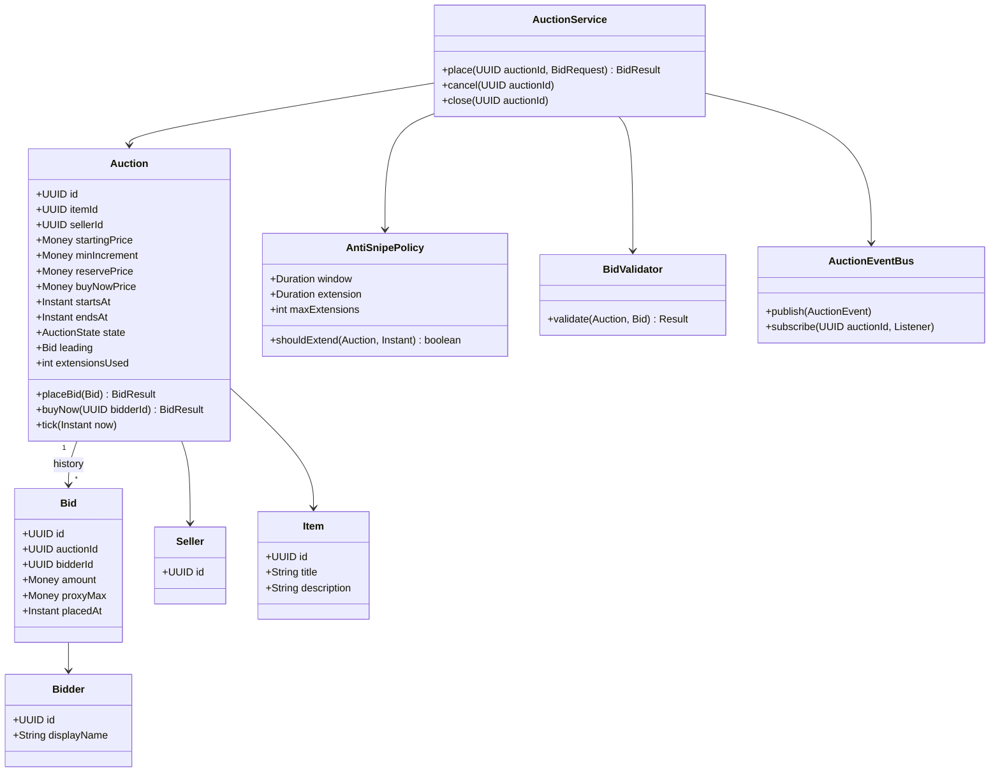
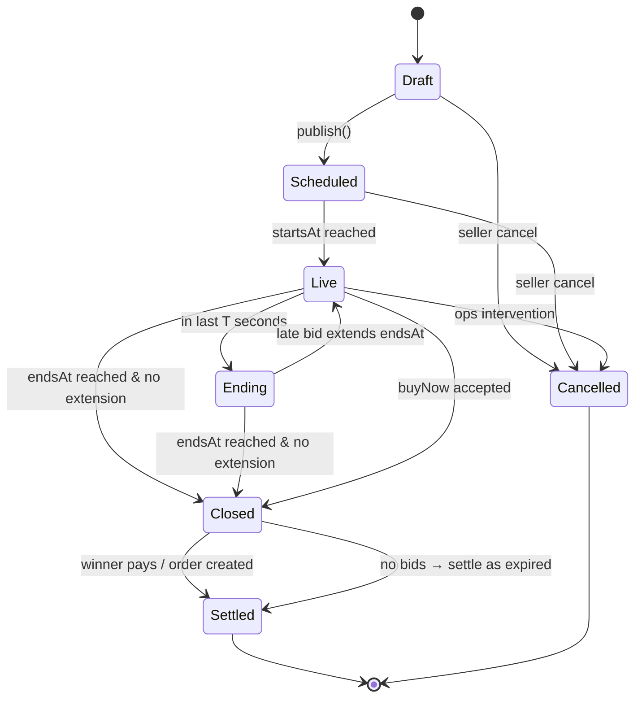

# Design Online Auction System

**Date:** 2026-05-02 | **Updated:** 2026-05-02
**Tags:** `low-level-design` `case-study` `e-commerce` `auction` `real-time` `observer`

## Summary

An online auction lets sellers list items, watchers subscribe, and bidders place
ascending bids until a deadline. The interesting mechanics are the auction
lifecycle, atomic bid acceptance under contention, "sniping" protection (auto
extension of the close time when a late bid lands), and live broadcast of state
changes to watchers without coupling the bidding core to the transport.

This document specifies the LLD: domain entities, lifecycle state machine, bidding
algorithm, anti-sniping rules, and the patterns that keep the bidding core small
and synchronous while pushing fan-out into observers.

## Table of Contents

- [Requirements](#requirements)
- [Entities and Relationships](#entities-and-relationships-mermaid-classdiagram)
- [Auction Lifecycle (stateDiagram)](#auction-lifecycle-statediagram-v2)
- [Class Skeletons (Java)](#class-skeletons-java)
- [Key Algorithms / Workflows](#key-algorithms--workflows)
- [Patterns Used](#patterns-used)
- [Concurrency Considerations](#concurrency-considerations)
- [Trade-offs and Extensions](#trade-offs-and-extensions)
- [Related](#related)
- [References](#references)

## Requirements

### Functional

1. Seller creates an auction with `startsAt`, `endsAt`, `startingPrice`,
   `minIncrement`, optional `reservePrice`, optional `buyNowPrice`.
2. Auction transitions: `Draft → Scheduled → Live → Ending → Closed → Settled`,
   with a `Cancelled` terminal off any non-settled state.
3. Bidders place bids while `Live`. A bid is accepted only if
   `amount >= currentHighestBid + minIncrement`.
4. **Anti-sniping**: a bid placed in the last `T` seconds (e.g., 60s) extends
   `endsAt` by `T` seconds, capped by `maxExtensions`.
5. **Proxy / max-bid**: a bidder may submit a max bid; the system bids on their
   behalf up to that ceiling, only as needed to stay leading.
6. `BuyNow` immediately closes the auction at the buy-now price (if defined and
   above any existing leading bid).
7. Watchers subscribe; live updates fan out (highest bid, time remaining, end
   extensions, close).
8. Persist full bid history; settlement creates an `Order` and notifies winner +
   seller.

### Non-Functional

- Bid acceptance must be linearizable per auction.
- Latency target: bid → broadcast under 200ms p95.
- A misbehaving observer must not block the bid path.
- All monetary math uses `BigDecimal` with explicit scale and rounding.

### Out of Scope

- Payment capture details (we hand off to an `OrderService`).
- KYC, fraud scoring (interfaces only).
- Sealed-bid / Dutch / reverse auctions — design leaves room.

## Entities and Relationships (Mermaid classDiagram)



## Auction Lifecycle (stateDiagram-v2)



## Class Skeletons (Java)

```java
public enum AuctionState { DRAFT, SCHEDULED, LIVE, ENDING, CLOSED, SETTLED, CANCELLED }

public final class Money {
    private final BigDecimal amount;       // scale = 2 typical
    private final Currency currency;
    public Money plus(Money other) { /* same currency check */ }
    public boolean gte(Money other) { /* compareTo */ }
}

public final class Bid {
    private final UUID id;
    private final UUID auctionId;
    private final UUID bidderId;
    private final Money amount;
    private final Money proxyMax;          // null if not a proxy bid
    private final Instant placedAt;
}

public final class Auction {
    private final UUID id;
    private AuctionState state;
    private Bid leading;
    private Instant endsAt;
    private int extensionsUsed;
    private final Money minIncrement;
    private final Money reservePrice;
    private final Money buyNowPrice;
    private final List<Bid> history = new ArrayList<>();
    private final ReentrantLock lock = new ReentrantLock();

    public BidResult placeBid(Bid candidate, AntiSnipePolicy policy, Clock clock) {
        lock.lock();
        try {
            ensureLive(clock.instant());
            Money required = leading == null ? startingPrice : leading.amount().plus(minIncrement);
            if (!candidate.amount().gte(required)) return BidResult.tooLow(required);
            // proxy resolution: if leader has higher proxyMax, simulate auto-bid
            Bid resolved = resolveProxy(candidate);
            history.add(resolved);
            leading = resolved;
            if (policy.shouldExtend(this, clock.instant())) {
                endsAt = endsAt.plus(policy.extension());
                extensionsUsed++;
                state = AuctionState.ENDING;
            }
            return BidResult.accepted(resolved, endsAt);
        } finally {
            lock.unlock();
        }
    }
}

public final class AntiSnipePolicy {
    private final Duration window;       // e.g., 60s
    private final Duration extension;    // e.g., 60s
    private final int maxExtensions;     // cap to prevent infinite extension

    public boolean shouldExtend(Auction a, Instant now) {
        return a.extensionsUsed() < maxExtensions
            && Duration.between(now, a.endsAt()).compareTo(window) <= 0;
    }
}

public interface AuctionListener { void on(AuctionEvent event); }

public final class AuctionEventBus {
    private final Map<UUID, CopyOnWriteArrayList<AuctionListener>> subs = new ConcurrentHashMap<>();
    private final Executor fanout;        // bounded pool, never the bid path

    public void publish(AuctionEvent e) {
        var list = subs.getOrDefault(e.auctionId(), new CopyOnWriteArrayList<>());
        for (var l : list) fanout.execute(() -> safeDeliver(l, e));
    }
}
```

## Key Algorithms / Workflows

### 1. Bid Acceptance

```text
on placeBid(candidate):
    acquire auction lock
    if state not in {LIVE, ENDING}: reject
    required = leading ? leading.amount + minIncrement : startingPrice
    if candidate.amount < required: reject (too low)
    if candidate.amount > buyNowPrice and buyNowPrice exists:
        clamp candidate.amount = buyNowPrice
    resolved = resolveProxy(candidate)
    leading = resolved; append history
    if shouldExtend(now): endsAt += extension; state = ENDING
    persist (history, leading, endsAt, state) atomically
    release lock
    publish BidPlaced event (async fan-out)
```

### 2. Proxy / Max-Bid Resolution

When a bidder submits a `proxyMax`, the system internally raises their bid only as
far as needed to stay leading.

```text
resolveProxy(candidate):
    let prevProxy = leading?.proxyMax (null if absent)
    if prevProxy is null or candidate.proxyMax > prevProxy:
        # new bidder takes lead
        winning = min(candidate.proxyMax, max(candidate.amount,
                       (prevProxy ?? leading.amount) + minIncrement))
        return Bid(candidate.bidder, winning, candidate.proxyMax)
    else:
        # incumbent's proxy still wins; raise incumbent to candidate.proxyMax + increment
        winning = min(prevProxy, candidate.proxyMax + minIncrement)
        return Bid(leading.bidder, winning, prevProxy)   # incumbent retains lead
```

### 3. Anti-Sniping (Time Extension)

A bid arriving inside the last `window` seconds before `endsAt` extends the
deadline by `extension` seconds, up to `maxExtensions`. Without a cap, a malicious
bidder could keep an auction open forever; the cap is essential.

### 4. Buy-Now

Treated as a special bid at the buy-now price. If accepted: `state = CLOSED`
immediately, `endsAt = now`, no further bids allowed.

### 5. Closing & Settlement

A scheduled tick (e.g., per-auction timer or a sweeping cron) checks `now >= endsAt`
in `LIVE`/`ENDING` and transitions to `CLOSED`. Settlement runs:

```text
on close(auction):
    if leading is null or leading.amount < reservePrice:
        state = SETTLED with outcome = NoSale
    else:
        order = OrderService.create(auction, leading.bidder)
        state = SETTLED with outcome = Sold(order.id)
    publish AuctionClosed
```

## Patterns Used

- **State** — `AuctionState` plus guarded transitions encapsulate lifecycle rules.
  See [state](../../design-patterns/behavioral/state.md).
- **Observer** — `AuctionEventBus` fans out `BidPlaced`, `EndsAtExtended`,
  `AuctionClosed` to WebSocket sessions, mailers, watchlists, and analytics
  without coupling the bidding core. See
  [observer](../../design-patterns/behavioral/observer.md).
- **Strategy** — `AntiSnipePolicy` is pluggable per category (rare items want a
  longer window, low-value items want none). See
  [strategy](../../design-patterns/behavioral/strategy.md).
- **Command** — `PlaceBidCommand`, `BuyNowCommand`, `CancelCommand` make audit
  trails and replay trivial. See [command](../../design-patterns/behavioral/command.md).
- **Repository** — `AuctionRepo`, `BidRepo` hide storage; the domain object stays
  pure.

## Concurrency Considerations

- **Per-auction lock**: bids on auction A do not contend with bids on auction B.
  In-process `ReentrantLock` keyed by `auctionId` for single-node; in a cluster,
  pin auction A to one shard or use a distributed lock keyed by auction id.
- **Atomic persistence**: `(history, leading, endsAt, state)` must commit
  together. Either one transaction or an event-sourced log with a single append
  per bid.
- **Fan-out is async and bounded**. A slow WebSocket consumer must not stall the
  next bidder. The bid path returns once the bid is durable; the event bus
  delivers on a separate executor.
- **Timer races**: when `endsAt` is reached mid-bid, the `tick(now)` and
  `placeBid` paths can race. Resolution: `placeBid` re-checks `now < endsAt`
  inside the lock; `tick` only closes if no in-flight bid is mid-extension.
- **Money math**: never use `double`. `BigDecimal` with `setScale(currency.decimals,
  HALF_EVEN)`.
- **Idempotency**: bids carry a client `bidId`; duplicate POSTs are de-duplicated
  on the (auction, bidder, bidId) tuple.

## Trade-offs and Extensions

| Decision | Trade-off |
|---|---|
| In-process `ReentrantLock` vs distributed lock | Simpler and faster single-node; cluster requires sticky routing or Redis lock with fence tokens. |
| Per-auction sweeping timer vs central cron | Per-auction timer is precise but harder at scale; a 1-second sweeper is simpler and "good enough" for most auctions. |
| Synchronous broadcast vs async event bus | Async keeps p95 low; you accept ~10–100ms eventual consistency for watcher views. |
| Hard increment vs percentage increment | Percentage scales with price ($1 increment looks silly on a $50k watch). |
| Reserve price visible vs hidden | UX choice; hidden reserve is common. Easy to support either. |

Extensions:

- Multi-currency auctions with FX at settlement.
- Sealed-bid (Vickrey) variant: keep `Bid.amount` private; pick `argmax` at close
  and charge second-highest.
- Soft-close auctions used by some marketplaces (extension grows with bid count).
- Anti-shill detection: graph signals over bidder pairs, hooked into the
  validator.

## Related

- Sibling LLD case studies:
  - [design-meeting-scheduler](design-meeting-scheduler.md)
  - [design-online-food-delivery-service](design-online-food-delivery-service.md)
  - [design-ride-hailing-service](design-ride-hailing-service.md)
- Patterns:
  - [state](../../design-patterns/behavioral/state.md)
  - [observer](../../design-patterns/behavioral/observer.md)
  - [strategy](../../design-patterns/behavioral/strategy.md)
  - [command](../../design-patterns/behavioral/command.md)
- HLD context: [system-design INDEX](../../../system-design/INDEX.md)

## References

- Vickrey, W. (1961). *Counterspeculation, Auctions, and Competitive Sealed Tenders.*
  Foundational paper on auction theory; explains second-price auctions.
- Krishna, V. *Auction Theory* (2nd ed.). Standard reference on English /
  Vickrey / Dutch / sealed formats.
- eBay developer documentation — proxy bidding mechanics, anti-sniping behavior;
  reference for real-world parameter ranges.
- `java.util.concurrent.locks.ReentrantLock`, `BigDecimal` — JDK API surface used
  in the skeletons.
