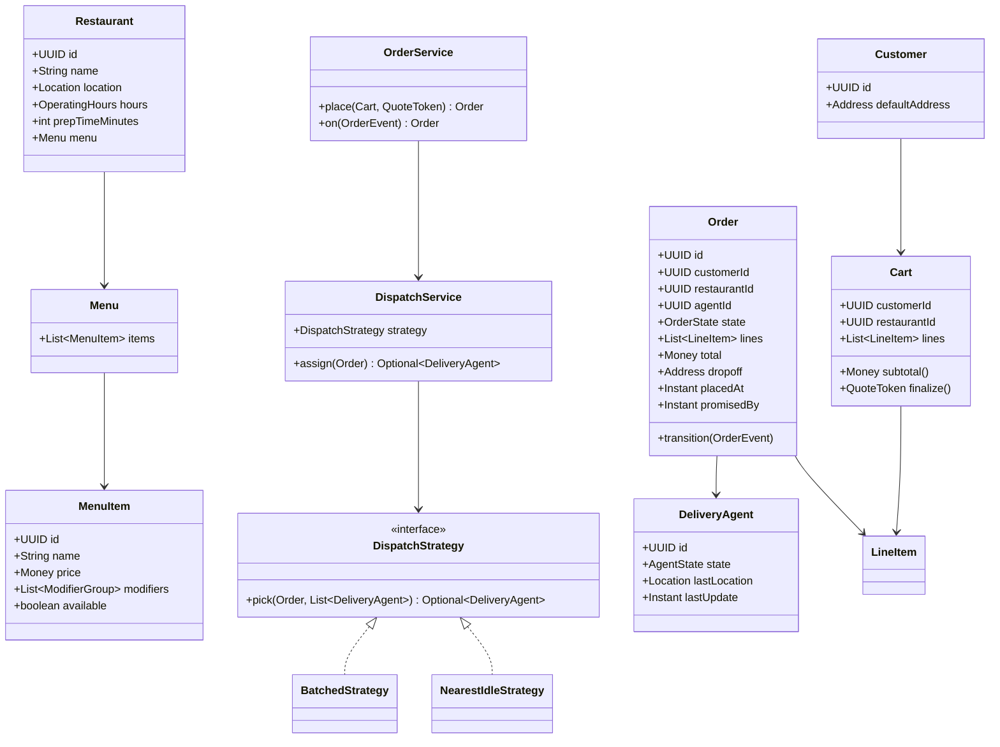
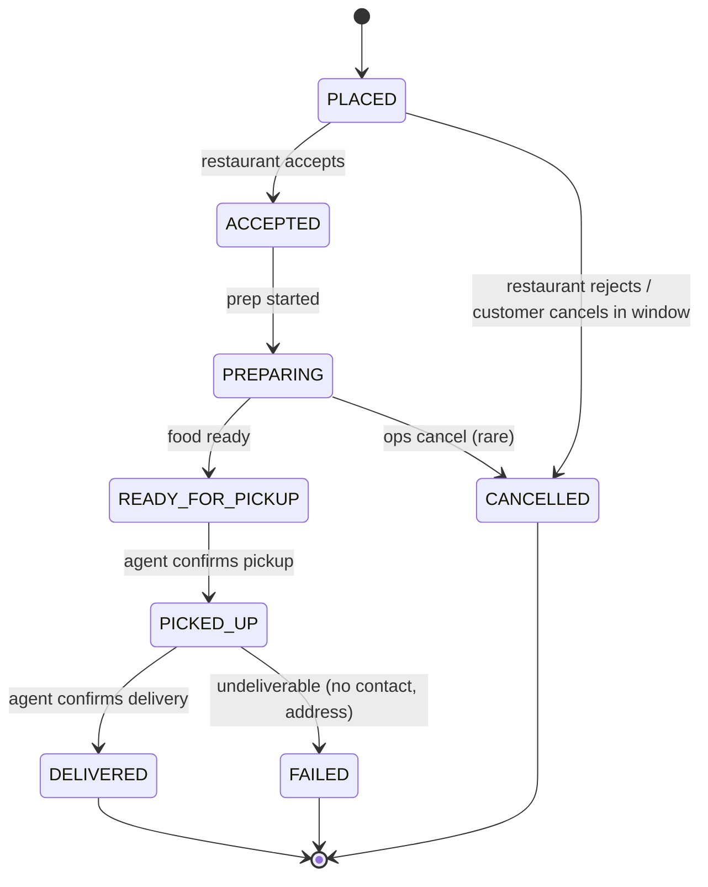

# Design Online Food Delivery Service

**Date:** 2026-05-02 | **Updated:** 2026-05-02
**Tags:** `low-level-design` `case-study` `e-commerce` `marketplace` `dispatch` `state-machines`
## Summary

A food-delivery service is a three-sided marketplace: customers, restaurants, and
delivery agents. The LLD challenges live in (1) the order state machine that must
correctly model "placed → accepted by restaurant → being prepared → picked up →
delivered" with cancellations and timeouts, (2) the dispatch policy that assigns
agents to orders, and (3) the menu / pricing / cart aggregate that must keep
customer-facing prices stable from cart to charge.

This document specifies the LLD: domain model, order lifecycle, dispatch
strategies, and the patterns that keep pricing, dispatch, and notifications
loosely coupled.

## Table of Contents

- [Requirements](#requirements)
- [Entities and Relationships](#entities-and-relationships-mermaid-classdiagram)
- [Order Lifecycle (stateDiagram)](#order-lifecycle-statediagram-v2)
- [Class Skeletons (Java)](#class-skeletons-java)
- [Key Algorithms / Workflows](#key-algorithms--workflows)
- [Patterns Used](#patterns-used)
- [Concurrency Considerations](#concurrency-considerations)
- [Trade-offs and Extensions](#trade-offs-and-extensions)
- [Related](#related)
- [References](#references)

## Requirements

### Functional

1. Customer browses restaurants near their address; sees menus, prices, ETAs.
2. Customer adds items (with modifiers and options) to a cart and checks out.
3. Restaurant accepts or rejects within an SLA; on accept, prep timer starts.
4. System dispatches a delivery agent based on a configurable strategy
   (nearest-idle, batched, ML-ranked).
5. Order moves through states: `PLACED → ACCEPTED → PREPARING → READY_FOR_PICKUP →
   PICKED_UP → DELIVERED` with `CANCELLED`/`FAILED` branches.
6. Real-time tracking: customer sees agent location after pickup.
7. Promotions and dynamic pricing apply at cart finalize, not after.
8. Refunds on customer cancel (within window) or restaurant rejection.

### Non-Functional

- Cart pricing must be stable for the duration of checkout (idempotent quote
  token).
- Dispatch must avoid double-assigning a single agent to two orders unless the
  strategy explicitly batches.
- Order state transitions are linearizable per order.
- Agent location updates are high-frequency; do not write each update to the
  primary OLTP store.

### Out of Scope

- Payment gateway internals (treated as `PaymentService`).
- Catalog ingestion from restaurant POS systems (treated as `MenuRepo`).
- Geocoding (use a `GeoService` interface; H3/S2 indexing details elided).

## Entities and Relationships (Mermaid classDiagram)



## Order Lifecycle (stateDiagram-v2)



The dispatch event (assign agent) is orthogonal to the food-state and may happen
any time after `ACCEPTED`. We model it as a side flag on `Order` rather than a
separate state to keep the lifecycle small.

## Class Skeletons (Java)

```java
public enum OrderState {
    PLACED, ACCEPTED, PREPARING, READY_FOR_PICKUP, PICKED_UP, DELIVERED, CANCELLED, FAILED
}

public sealed interface OrderEvent {
    record RestaurantAccepted() implements OrderEvent {}
    record RestaurantRejected(String reason) implements OrderEvent {}
    record PrepStarted() implements OrderEvent {}
    record ReadyForPickup() implements OrderEvent {}
    record PickedUp(UUID agentId) implements OrderEvent {}
    record Delivered() implements OrderEvent {}
    record CustomerCancelled() implements OrderEvent {}
    record DeliveryFailed(String reason) implements OrderEvent {}
}

public final class Order {
    private OrderState state;
    private UUID agentId;
    private Instant promisedBy;

    public void transition(OrderEvent ev) {
        OrderState next = switch (state) {
            case PLACED -> switch (ev) {
                case OrderEvent.RestaurantAccepted r -> OrderState.ACCEPTED;
                case OrderEvent.RestaurantRejected r -> OrderState.CANCELLED;
                case OrderEvent.CustomerCancelled c -> OrderState.CANCELLED;
                default -> throw illegal(ev);
            };
            case ACCEPTED -> switch (ev) {
                case OrderEvent.PrepStarted p -> OrderState.PREPARING;
                default -> throw illegal(ev);
            };
            case PREPARING -> switch (ev) {
                case OrderEvent.ReadyForPickup r -> OrderState.READY_FOR_PICKUP;
                default -> throw illegal(ev);
            };
            case READY_FOR_PICKUP -> switch (ev) {
                case OrderEvent.PickedUp p -> { this.agentId = p.agentId(); yield OrderState.PICKED_UP; }
                default -> throw illegal(ev);
            };
            case PICKED_UP -> switch (ev) {
                case OrderEvent.Delivered d -> OrderState.DELIVERED;
                case OrderEvent.DeliveryFailed f -> OrderState.FAILED;
                default -> throw illegal(ev);
            };
            default -> throw illegal(ev);
        };
        this.state = next;
    }
}

public interface DispatchStrategy {
    Optional<DeliveryAgent> pick(Order order, List<DeliveryAgent> candidates);
}

public final class NearestIdleStrategy implements DispatchStrategy {
    public Optional<DeliveryAgent> pick(Order o, List<DeliveryAgent> cands) {
        return cands.stream()
            .filter(a -> a.state() == AgentState.IDLE)
            .min(Comparator.comparingDouble(a -> haversine(a.lastLocation(), o.pickupLocation())));
    }
}

public final class DispatchService {
    private final AgentRepo agents;
    private final DispatchStrategy strategy;

    public Optional<DeliveryAgent> assign(Order o) {
        var candidates = agents.nearby(o.pickupLocation(), Distance.km(5));
        return strategy.pick(o, candidates).map(a -> {
            agents.markOnTrip(a.id(), o.id()); // atomic CAS: IDLE → ON_TRIP
            return a;
        });
    }
}
```

## Key Algorithms / Workflows

### 1. Cart → Quote → Order

The cart is mutable; the order is not. Between them sits a `QuoteToken` —
server-signed, short-lived (e.g., 10 minutes), capturing the exact line items,
taxes, fees, surge multiplier, and promotion stack. Checkout submits the token,
not the cart. Server verifies the token's HMAC, ensures unexpired, and creates
the order at the quoted price. This is what prevents the classic "price changed
between cart and checkout" complaint.

### 2. Dispatch

```text
on order.state = ACCEPTED:
    candidates = agents within 5km of restaurant, IDLE
    if none: enqueue retry with backoff (50ms, 200ms, 1s, 5s, 30s)
    chosen = strategy.pick(order, candidates)
    CAS chosen.state from IDLE to ON_TRIP_TO_PICKUP
        on success: write Assignment(order, agent), notify agent
        on failure: another order grabbed them; retry with next candidate
```

### 3. Dispatch Strategies

- **Nearest-idle**: picks the closest IDLE agent. Simple, low latency, decent
  outcomes when supply is dense.
- **Batched**: groups orders headed to nearby drop-offs and assigns one agent.
  Reduces driver-minutes; needs same restaurant or close pickup window.
- **Score-based / ML**: ranks candidates by a model combining distance, agent
  reliability, current load, surge area, expected ETA error. The interface stays
  the same (`DispatchStrategy.pick`); only the implementation changes.

### 4. Real-Time Tracking

Agent app pushes location at 1–5 Hz over MQTT/WebSocket to a separate
**location service** (in-memory + Redis stream + cold archive). The OLTP order
DB stores only milestone events (`PICKED_UP`, `DELIVERED`). Customer "watch
order" subscribes to the location stream filtered to that order id.

### 5. Cancellation Rules

| Stage | Allowed by | Refund |
|---|---|---|
| `PLACED` | customer / restaurant | full |
| `ACCEPTED` | customer (within grace, e.g. 60s) | full |
| `PREPARING` | ops only | partial / case-by-case |
| `READY_FOR_PICKUP` and beyond | not normally cancellable | n/a |

### 6. ETA Promise

`promisedBy = now + max(prepTime, dispatchETA + travelETA) + buffer`. The number
shown to the customer at checkout becomes part of the contract; SLA breaches
trigger automated credits.

## Patterns Used

- **State** — explicit `OrderState` machine with guarded transitions in `Order`.
  See [state](../../design-patterns/behavioral/state.md).
- **Strategy** — `DispatchStrategy` (nearest-idle, batched, ML-ranked) is
  pluggable per market and time-of-day. See
  [strategy](../../design-patterns/behavioral/strategy.md).
- **Observer** — `OrderEventBus` notifies the customer app, restaurant POS, agent
  app, and analytics. See
  [observer](../../design-patterns/behavioral/observer.md).
- **Command** — `PlaceOrderCommand`, `CancelOrderCommand` for retryable / audited
  operations. See [command](../../design-patterns/behavioral/command.md).
- **Composite** — `LineItem` with `ModifierGroup` of options forms a tree we
  price recursively.
- **Repository** — separates domain from storage for `MenuRepo`, `OrderRepo`,
  `AgentRepo`.
- **Decorator / Chain of Responsibility** — promotions, taxes, fees layered
  during quote computation. See
  [chain-of-responsibility](../../design-patterns/behavioral/chain-of-responsibility.md).

## Concurrency Considerations

- **Agent assignment race**: many orders may target the same nearest agent.
  Resolve with a single CAS on `agent.state` from `IDLE → ON_TRIP_TO_PICKUP`.
  Losers retry with the next candidate.
- **Order state transitions** are linearizable per order id. Use row-level lock
  or optimistic concurrency with `version`.
- **Hot menu reads**: the menu changes rarely but is read constantly. Cache per
  restaurant with a short TTL and bust on edit.
- **Location stream isolation**: do not write 1 Hz GPS to the order DB. Write to
  a stream (Redis / Kafka). Persist sampled snapshots if you need them for
  audits.
- **Quote token integrity**: HMAC with a key kept in a secret manager; include
  expiry inside the signed payload.
- **Idempotency**: every external mutation (`place`, `accept`, `pickedUp`) carries
  a client-generated request id; the server records it and returns the prior
  result on duplicate.

## Trade-offs and Extensions

| Decision | Trade-off |
|---|---|
| Quote token vs server-side cart hash | Token is stateless and trivially scalable; hash needs server cart store. |
| Single state machine for food + delivery vs split machines | Combined is simpler to reason about; split is necessary once you offer pickup-only or scheduled orders. |
| Sync dispatch vs background dispatcher | Background scales better and decouples failure modes; adds a few seconds before customer sees an agent. |
| Static prep time vs learned prep time | Learned (per restaurant, per item count, per hour) yields better ETAs but needs telemetry plumbing. |
| Per-restaurant queue vs global priority queue | Per-restaurant is fairer to merchants; global lets a backed-up market self-balance. |

Extensions:

- Scheduled orders (place now, deliver at 7pm).
- Group orders (multiple payers on one cart).
- Subscriptions / membership (free delivery tier).
- Inventory linkage (out-of-stock items disappear from menu in near-real-time).
- Carbon-aware dispatch (prefer e-bikes when ETA permits).

## Related

- Sibling LLD case studies:
  - [design-meeting-scheduler](design-meeting-scheduler.md)
  - [design-online-auction-system](design-online-auction-system.md)
  - [design-ride-hailing-service](design-ride-hailing-service.md)
- Patterns:
  - [state](../../design-patterns/behavioral/state.md)
  - [strategy](../../design-patterns/behavioral/strategy.md)
  - [observer](../../design-patterns/behavioral/observer.md)
  - [command](../../design-patterns/behavioral/command.md)
  - [chain-of-responsibility](../../design-patterns/behavioral/chain-of-responsibility.md)
- HLD context: [system-design INDEX](../../../system-design/INDEX.md)
- Sibling HLD: [system-design DoorDash](../../../system-design/case-studies/location-based/design-doordash.md)

## References

- *Designing Data-Intensive Applications*, Kleppmann — for transactions,
  idempotency, and stream/OLTP separation.
- Uber Eats / DoorDash engineering blogs — public posts on dispatch heuristics
  and ETA modelling are useful real-world calibration.
- H3 (Uber) and S2 (Google) — geospatial indexes underlying "agents near
  restaurant" queries.
- ACID transaction semantics — for order state durability across the lifecycle.
