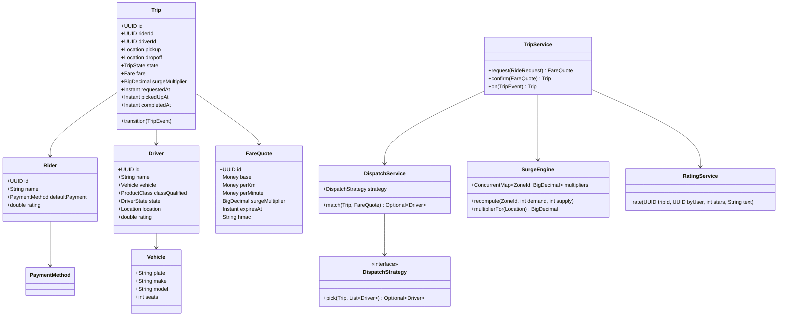
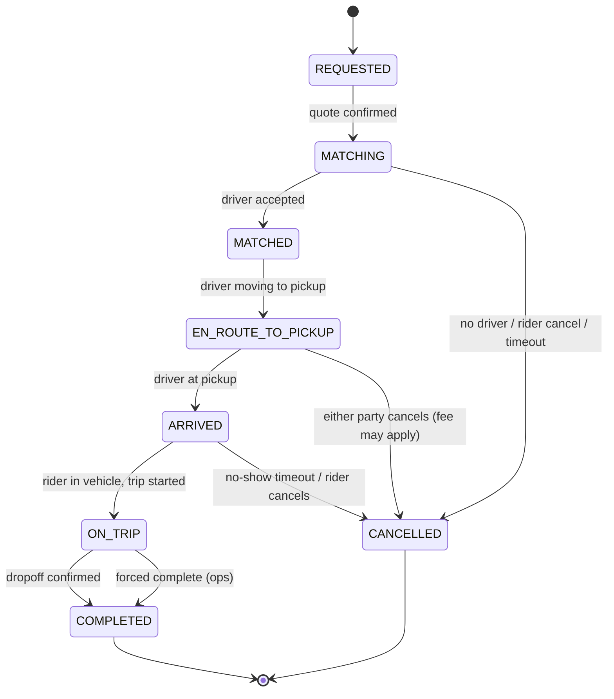

# Design Ride-Hailing Service

**Date:** 2026-05-02 | **Updated:** 2026-05-02
**Tags:** `low-level-design` `case-study` `e-commerce` `dispatch` `surge` `state-machines`
## Summary

A ride-hailing service matches riders requesting trips to drivers in real time,
quotes a fare, manages the trip lifecycle from request through completion,
applies surge multipliers when demand outpaces supply in a region, and captures
two-sided ratings.

The LLD focuses on the in-process domain: the trip state machine, the dispatch
matcher (with race-free assignment and bounded retry), the surge engine that
keeps per-zone multipliers and freezes them per quote, and the rating aggregate.
This document is the LLD twin to the system-design HLD at
[../../../system-design/case-studies/location-based/design-uber.md](../../../system-design/case-studies/location-based/design-uber.md);
geospatial indexing details and global-scale infrastructure live there.

## Table of Contents

- [Requirements](#requirements)
- [Entities and Relationships](#entities-and-relationships-mermaid-classdiagram)
- [Trip Lifecycle (stateDiagram)](#trip-lifecycle-statediagram-v2)
- [Class Skeletons (Java)](#class-skeletons-java)
- [Key Algorithms / Workflows](#key-algorithms--workflows)
- [Patterns Used](#patterns-used)
- [Concurrency Considerations](#concurrency-considerations)
- [Trade-offs and Extensions](#trade-offs-and-extensions)
- [Related](#related)
- [References](#references)

## Requirements

### Functional

1. Rider requests a ride: `(pickup, dropoff, productClass)`. System returns a
   fare quote and ETA.
2. Quote is accepted; system dispatches a nearby driver.
3. Driver accepts/rejects within an SLA; on accept, trip moves through
   `MATCHED → EN_ROUTE_TO_PICKUP → ARRIVED → ON_TRIP → COMPLETED`.
4. Either party may cancel; cancellation rules depend on stage.
5. Surge: when demand/supply ratio in a zone passes thresholds, fare quotes
   include a multiplier. The multiplier is **frozen at quote time**.
6. Rating: rider rates driver and vice versa after `COMPLETED`. Ratings feed back
   into dispatch eligibility.
7. Receipt and payment capture on completion.

### Non-Functional

- Quote latency under 300ms p95.
- Trip state transitions linearizable per trip.
- Dispatch must not double-assign one driver to two trips.
- Surge updates apply with bounded staleness (≤ 30s) but quote freeze is exact.
- Rating writes never block the trip path.

### Out of Scope

- Geo index internals (S2/H3). The HLD covers it; we use a `GeoIndex` interface.
- Map/routing engine (we use a `RoutingService` interface for ETA and distance).
- Payment provider details (use a `PaymentService` interface).

## Entities and Relationships (Mermaid classDiagram)



## Trip Lifecycle (stateDiagram-v2)



## Class Skeletons (Java)

```java
public enum TripState {
    REQUESTED, MATCHING, MATCHED, EN_ROUTE_TO_PICKUP, ARRIVED, ON_TRIP, COMPLETED, CANCELLED
}

public enum DriverState { OFFLINE, ONLINE_IDLE, EN_ROUTE_TO_PICKUP, ON_TRIP }

public sealed interface TripEvent {
    record QuoteConfirmed(FareQuote quote) implements TripEvent {}
    record DriverMatched(UUID driverId) implements TripEvent {}
    record DriverEnRoute() implements TripEvent {}
    record DriverArrived() implements TripEvent {}
    record TripStarted() implements TripEvent {}
    record TripCompleted(Distance d, Duration t) implements TripEvent {}
    record CancelledByRider(String reason) implements TripEvent {}
    record CancelledByDriver(String reason) implements TripEvent {}
    record DispatchTimedOut() implements TripEvent {}
}

public final class FareQuote {
    private final UUID id;
    private final Money base;
    private final Money perKm;
    private final Money perMinute;
    private final BigDecimal surgeMultiplier;
    private final Instant expiresAt;
    private final String hmac;          // server-signed; freezes surge per quote

    public Money compute(Distance d, Duration t) {
        Money raw = base
            .plus(perKm.times(d.km()))
            .plus(perMinute.times(t.toMinutes()));
        return raw.times(surgeMultiplier);
    }
}

public interface DispatchStrategy {
    Optional<Driver> pick(Trip trip, List<Driver> candidates);
}

public final class NearestEligibleStrategy implements DispatchStrategy {
    public Optional<Driver> pick(Trip t, List<Driver> cands) {
        return cands.stream()
            .filter(d -> d.state() == DriverState.ONLINE_IDLE)
            .filter(d -> d.classQualified().includes(t.productClass()))
            .filter(d -> d.rating() >= MIN_RATING)
            .min(Comparator.comparingDouble(d -> haversine(d.location(), t.pickup())));
    }
}

public final class SurgeEngine {
    private final ConcurrentMap<ZoneId, BigDecimal> multipliers = new ConcurrentHashMap<>();
    private final BigDecimal cap = new BigDecimal("3.0");

    public void recompute(ZoneId z, int demand, int supply) {
        double ratio = supply == 0 ? Double.POSITIVE_INFINITY : (double) demand / supply;
        BigDecimal m = bucket(ratio); // step function 1.0, 1.2, 1.5, 2.0, 3.0
        multipliers.put(z, m.min(cap));
    }

    public BigDecimal multiplierFor(Location loc) {
        return multipliers.getOrDefault(zoneOf(loc), BigDecimal.ONE);
    }
}

public final class TripService {
    public FareQuote request(RideRequest r) {
        Distance d = routing.distance(r.pickup(), r.dropoff());
        Duration t = routing.eta(r.pickup(), r.dropoff());
        BigDecimal m = surge.multiplierFor(r.pickup());
        return quotes.sign(new FareQuote(/*...*/, m, Instant.now().plus(QUOTE_TTL)));
    }
}
```

## Key Algorithms / Workflows

### 1. Quote → Confirm → Match

```text
request(rideRequest):
    distance, eta = routing.estimate(pickup, dropoff)
    multiplier = surge.multiplierFor(pickup)        # snapshot now
    quote = FareQuote(distance, eta, multiplier, expiresAt = now + 90s)
    return signed(quote)
confirm(quote):
    verify HMAC, verify not expired
    create Trip in REQUESTED, transition MATCHING
    enqueue dispatch
```

### 2. Dispatch Matching

The dispatcher pulls candidates from the geo index (drivers within radius R,
expanding R if empty), filters by product class and rating, and picks via
`DispatchStrategy`. To avoid double-assignment we CAS the chosen driver's state.

```text
match(trip):
    R = 1km; tries = 0
    loop while tries < MAX_TRIES:
        candidates = geoIndex.nearby(trip.pickup, R)
        chosen = strategy.pick(trip, candidates)
        if chosen is None: R *= 2; tries++; continue
        ok = drivers.cas(chosen.id, ONLINE_IDLE, EN_ROUTE_TO_PICKUP, tripId=trip.id)
        if ok:
            offerToDriver(chosen, trip)             # driver app sees a 15s prompt
            return chosen
        # else CAS lost; pick another candidate
    return None  -> trip.transition(DispatchTimedOut)
```

A driver who declines or times out releases the CAS (state back to
`ONLINE_IDLE`); the dispatcher retries with the next-best candidate.

### 3. Surge Engine

Per-zone (S2 cell or H3 hex), we track recent demand (ride requests in the last
N seconds) and supply (idle eligible drivers). A scheduled recompute every few
seconds updates multipliers using a bucketed step function — bucketing prevents
flicker between 1.31x and 1.32x. The cap (e.g., 3.0x) is policy. **Critical**:
the rider sees and accepts a quote that contains a frozen multiplier; the trip
fare uses that frozen value even if the zone surge changes mid-trip.

### 4. Fare Calculation

`fare = (base + perKm × distance + perMinute × time) × surgeMultiplier`

Wait time, tolls, airport fees and rounding per currency are added on top and
disclosed in the quote's breakdown. Use `BigDecimal` end-to-end with explicit
scale and `RoundingMode.HALF_EVEN`.

### 5. Cancellation Rules

| Stage | Rider cancels | Driver cancels |
|---|---|---|
| `MATCHING` | free | n/a |
| `EN_ROUTE_TO_PICKUP` (after grace) | small fee | demerit, no fare |
| `ARRIVED` (after wait grace) | no-show fee | demerit |
| `ON_TRIP` | full fare for distance traveled | rare; ops handles |

### 6. Ratings

After `COMPLETED`, both parties may rate within a window (e.g., 7 days). Ratings
update an EWMA on the recipient's profile; drivers below a threshold are
filtered out by dispatch eligibility. Writes are async via the event bus — they
never block trip completion.

## Patterns Used

- **State** — `TripState` machine with guarded transitions in `Trip`. See
  [state](../../design-patterns/behavioral/state.md).
- **Strategy** — `DispatchStrategy` (nearest eligible, batch carpool,
  ML-ranked). See [strategy](../../design-patterns/behavioral/strategy.md).
- **Observer** — trip events fan out to rider app, driver app, receipts,
  analytics, surge demand counters. See
  [observer](../../design-patterns/behavioral/observer.md).
- **Command** — `RequestRideCommand`, `CancelTripCommand` for retry / audit /
  replay. See [command](../../design-patterns/behavioral/command.md).
- **Repository** — `DriverRepo`, `TripRepo`, `QuoteRepo` keep storage out of the
  domain.
- **Specification** — eligibility predicates (rating ≥ X, product class match,
  no recent rejection of this rider) compose cleanly.
- **Decorator** — fare modifiers (tolls, airport fee, promo) layer over the
  base fare formula.

## Concurrency Considerations

- **Driver CAS**: assignment atomicity hinges on a single CAS on driver state
  keyed by `driverId`. In a cluster, route operations on `driverId` to one shard
  or use a distributed lock keyed by `driverId`.
- **Trip state transitions** are linearizable per `tripId`. Pessimistic lock on
  the row is the simplest correct approach; optimistic with `version` if write
  rate per trip stays low (it does).
- **Surge map** is read by every quote. Use `ConcurrentHashMap` with a
  background recompute thread; readers never block writers.
- **Quote freeze**: HMAC includes `multiplier` and `expiresAt`. Verify both at
  confirm time. The engine cannot retroactively raise a fare.
- **Geo index** is a separate service; treat queries as best-effort (radius
  search may miss a just-online driver). Tolerate it via retry/expand.
- **Idempotency**: client request ids on `request`, `confirm`, `cancel`, and
  driver-side `accept`. Dedup at the service layer.
- **Event bus** for ratings, receipts, analytics is async; back-pressure and
  bounded queues prevent slow consumers from harming the trip path.

## Trade-offs and Extensions

| Decision | Trade-off |
|---|---|
| Per-zone surge vs per-driver pricing | Zone-based is interpretable and easy to display; per-driver opens optimization space but harms trust. |
| Hard cap on surge vs uncapped | Caps protect riders and brand; uncapped extracts more from inelastic peaks. Most regulators force a cap. |
| Synchronous dispatch vs queue-based | Synchronous gives fastest match in good conditions; queue smooths spikes. Most production systems use a queue with low-latency consumers. |
| Pull dispatch (driver opts in) vs push (assign and ask to confirm) | Push gives lower latency; pull respects driver preference. Most platforms use push with driver-side decline. |
| In-process state vs event-sourced | In-process is simpler; event-sourced shines for audits, replay, and analytics. We separate the domain object from the event log so we can do either. |

Extensions:

- Carpool / shared rides: dispatch packs trips with overlapping routes; trip
  state extends with `WAITING_FOR_RIDER_2`.
- Scheduled rides (book for tomorrow 8am): trips enter `SCHEDULED`, dispatch
  starts T-15min.
- Multi-stop trips: dropoff becomes a list; fare formula sums leg costs.
- Driver heatmaps: surge data, exposed back to drivers to suggest where to go.
- Safety incidents: `SOS` channel that pauses trip, alerts ops, freezes meter.

## Related

- Sibling LLD case studies:
  - [design-meeting-scheduler](design-meeting-scheduler.md)
  - [design-online-auction-system](design-online-auction-system.md)
  - [design-online-food-delivery-service](design-online-food-delivery-service.md)
- Patterns:
  - [state](../../design-patterns/behavioral/state.md)
  - [strategy](../../design-patterns/behavioral/strategy.md)
  - [observer](../../design-patterns/behavioral/observer.md)
  - [command](../../design-patterns/behavioral/command.md)
- HLD twin: [system-design Uber](../../../system-design/case-studies/location-based/design-uber.md)
- HLD context: [system-design INDEX](../../../system-design/INDEX.md)

## References

- *Designing Data-Intensive Applications*, Kleppmann — linearizability,
  idempotency, transactional outbox.
- Uber Engineering blog — public posts on dispatch, geosharding, and surge.
- *The Mathematics of Auctions and Allocations* — for surge as a price-clearing
  mechanism in two-sided markets.
- S2 (Google) and H3 (Uber) — geospatial cell systems used for zone definitions.
- `java.math.BigDecimal`, `java.util.concurrent.ConcurrentHashMap` — JDK API
  surface used in the skeletons.
