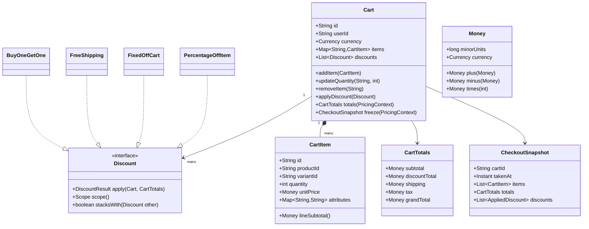

# Design Shopping Cart

**Date:** 2026-05-02 | **Updated:** 2026-05-02
**Tags:** `low-level-design` `case-study` `e-commerce` `cart` `strategy`
## Summary

A shopping cart sounds trivial — a list of items — but the LLD pulls in several interesting forces: **line-item identity** (a "cart item" is not just a product reference), **discount composition** (item-level vs cart-level vs shipping-level, stacking rules, exclusivity), **session persistence** (anonymous → logged-in merge), and **a clean handoff to checkout** so the cart never silently mutates after a price was quoted.

This document scopes the in-process domain model. Inventory holds, payment, and order placement are intentionally outside scope — see [Design Amazon (Catalog + Order)](./design-amazon.md) for that survey.

## Table of Contents

- [Requirements](#requirements)
- [Entities and Relationships](#entities-and-relationships-mermaid-classdiagram)
- [Class Skeletons (Java)](#class-skeletons-java)
- [Key Algorithms / Workflows](#key-algorithms--workflows)
- [Patterns Used](#patterns-used-with-reason)
- [Concurrency Considerations](#concurrency-considerations)
- [Trade-offs and Extensions](#trade-offs-and-extensions)
- [Related](#related)
- [References](#references)

## Requirements

**Functional:**

- Add, update quantity, remove a `CartItem`. A line item ties together `(productId, variantId, quantity, capturedUnitPrice, attributes)`.
- Apply discounts: percentage off, fixed amount off, BOGO, free shipping. Discounts may target a single item, the whole cart, or shipping.
- Compute totals: subtotal, discount total, shipping, tax, grand total.
- Persist cart for both anonymous (cookie/session) and authenticated users; merge anonymous cart into user cart on login.
- Hand off to checkout: produce an immutable `CheckoutSnapshot` so prices, taxes, and discounts cannot drift while the user is on the payment page.

**Non-functional:**

- Currency-safe arithmetic (no `double`).
- Predictable rounding (HALF_UP at the line level, HALF_EVEN for tax — bank-aligned).
- Discount application order must be deterministic.

## Entities and Relationships (Mermaid classDiagram)



## Class Skeletons (Java)

```java
public final class Money {
    private final long minorUnits; // e.g. cents
    private final Currency currency;
    public Money plus(Money o) { requireSameCcy(o); return new Money(minorUnits + o.minorUnits, currency); }
    public Money minus(Money o) { requireSameCcy(o); return new Money(minorUnits - o.minorUnits, currency); }
    public Money times(int n) { return new Money(minorUnits * n, currency); }
    public Money percentOf(BigDecimal pct) {
        BigDecimal v = BigDecimal.valueOf(minorUnits).multiply(pct)
                                  .divide(BigDecimal.valueOf(100), 0, RoundingMode.HALF_UP);
        return new Money(v.longValueExact(), currency);
    }
}

public final class CartItem {
    private final String id;            // line id, NOT productId
    private final String productId;
    private final String variantId;
    private final int quantity;
    private final Money unitPrice;      // captured at add-to-cart time
    public Money lineSubtotal() { return unitPrice.times(quantity); }
}

public interface Discount {
    enum Scope { ITEM, CART, SHIPPING }
    DiscountResult apply(Cart cart, CartTotals running);
    Scope scope();
    default boolean stacksWith(Discount other) { return true; }
}

public final class PercentageOffItem implements Discount {
    private final String productId;
    private final BigDecimal percent;

    @Override
    public DiscountResult apply(Cart cart, CartTotals running) {
        Money off = cart.items().values().stream()
            .filter(i -> i.productId().equals(productId))
            .map(i -> i.lineSubtotal().percentOf(percent))
            .reduce(Money.zero(cart.currency()), Money::plus);
        return new DiscountResult(off, Scope.ITEM, "PCT_" + productId);
    }
    @Override public Scope scope() { return Scope.ITEM; }
}

public final class Cart {
    private final String id;
    private final String userId;
    private final Currency currency;
    private final Map<String, CartItem> items = new LinkedHashMap<>();
    private final List<Discount> discounts = new ArrayList<>();

    public CartTotals totals(PricingContext ctx) {
        Money subtotal = items.values().stream()
            .map(CartItem::lineSubtotal)
            .reduce(Money.zero(currency), Money::plus);

        // Apply discounts in deterministic order: ITEM, CART, SHIPPING
        Money runningDiscount = Money.zero(currency);
        Money shipping = ctx.shippingFor(this);
        for (Discount d : sortedByScope(discounts)) {
            DiscountResult r = d.apply(this, /*running totals*/ null);
            if (r.scope() == Discount.Scope.SHIPPING) shipping = Money.zero(currency);
            else runningDiscount = runningDiscount.plus(r.amount());
        }
        Money taxable = subtotal.minus(runningDiscount).plus(shipping);
        Money tax = ctx.taxFor(taxable, this);
        Money grand = taxable.plus(tax);
        return new CartTotals(subtotal, runningDiscount, shipping, tax, grand);
    }

    public CheckoutSnapshot freeze(PricingContext ctx) {
        return new CheckoutSnapshot(id, Instant.now(),
            List.copyOf(items.values()), totals(ctx),
            applied(discounts));
    }
}
```

## Key Algorithms / Workflows

### 1. Add-to-cart with capture

When a user clicks "Add", the cart **captures the unit price at that moment**. If the catalog price changes later, the cart shows the captured price until the user explicitly refreshes. This prevents silent re-pricing during a session and is also what most regulators expect.

```
add(productId, variantId, qty):
  if exists line where productId+variantId match -> increment qty
  else -> snapshot unitPrice from catalog and append new line
```

### 2. Discount evaluation order

Stacking rules are easy to get wrong. A defensible default:

1. Apply **item-scope** discounts first (so cart-scope sees the discounted line totals).
2. Apply **cart-scope** next.
3. Apply **shipping-scope** last (free shipping zeroes the shipping component).
4. Within the same scope, sort by `priority` then `id` for determinism.

Exclusivity is modelled with `stacksWith(other)`: if any pair fails to stack, keep the higher-value one and drop the other. Document the rule — surprise here causes refund tickets.

### 3. Anonymous → user merge on login

```
mergeOnLogin(anonCart, userCart):
  for each line in anonCart.items:
     if userCart has same (productId,variantId) -> sum quantities (cap by stock)
     else -> append the line
  union the discount codes; re-evaluate stackability
  return userCart
```

### 4. Checkout handoff

`Cart.freeze()` returns an immutable `CheckoutSnapshot`. The payment page, the tax recompute, and the order draft all read the snapshot — never the live cart. After successful payment, the order references the snapshot and the cart is cleared.

## Patterns Used (with reason)

- **Strategy pattern** — `Discount` is the textbook example. New promotion types (BOGO, tiered, threshold) plug in without changing `Cart`.
- **Value object** — `Money` is immutable and equality-by-value; eliminates a large class of currency bugs.
- **Memento / Snapshot** — `CheckoutSnapshot` is a read-only memento of the cart at quote time.
- **Specification / Predicate** — discount eligibility is composable (e.g., "category = SHOES AND total ≥ $50").
- **Repository** — `CartRepository` lives behind the domain so anonymous (Redis-backed) and authenticated (RDBMS-backed) carts share a contract.

## Concurrency Considerations

- A user with two open tabs can issue concurrent `addItem` calls. Treat the cart as a single aggregate and serialize writes — either with optimistic locking on a `version` column or with a per-cart Redis lock.
- A cart can be frozen exactly once. Implement freeze as: `UPDATE cart SET status='FROZEN', frozen_at=? WHERE id=? AND status='OPEN'`. If 0 rows updated, another tab already started checkout.
- Discounts referenced by code (e.g., `SAVE10`) may have global usage limits. Decrement the counter atomically at **freeze**, not at apply, so a user who fills the cart but never checks out doesn't burn a slot.
- On merge, prefer last-writer-wins per line for `quantity`, but be explicit; surprise duplicates are common bug reports.

## Trade-offs and Extensions

| Decision | Trade-off |
|---|---|
| Capture unit price at add-time | Stable UX; complicates "your price dropped" prompts. |
| Strategy-based discounts | Extensible; runtime composition slower than hardcoded logic at very high QPS. |
| One snapshot at checkout | Predictable totals; need re-snapshot if user edits during checkout. |
| Money in minor units (long) | Exact arithmetic; needs care for currencies with non-standard fractions. |

**Extensions:**

- **Saved-for-later** — a sibling collection on the cart aggregate; same line shape, different bucket.
- **Gift wrapping / engraving** — modelled as line-item attributes that affect price, not as separate products.
- **Subscription cart** — extra `cadence` field; checkout produces a recurring order.
- **Multi-currency cart** — disallow at the model level (one cart, one currency); switching currency is a new cart.

## Related

- Siblings:
  - [Design Amazon Locker](./design-amazon-locker.md)
  - [Design Amazon (Catalog + Order)](./design-amazon.md)
  - [Design Movie Booking System](./design-movie-booking-system.md)
  - [Design Car Rental System](./design-car-rental-system.md)
- Patterns:
  - [Strategy Pattern](../../design-patterns/behavioral/strategy.md)
  - [Memento Pattern](../../design-patterns/behavioral/memento.md)
  - [Specification Pattern](../../design-patterns/additional/specification-pattern.md)
- HLD comparison: [System Design INDEX](../../../system-design/INDEX.md)

## References

- Martin Fowler, *Patterns of Enterprise Application Architecture* — Money pattern, Repository.
- Eric Evans, *Domain-Driven Design* — aggregates and value objects.
- Vaughn Vernon, *Implementing Domain-Driven Design* — discount and pricing modelling.
