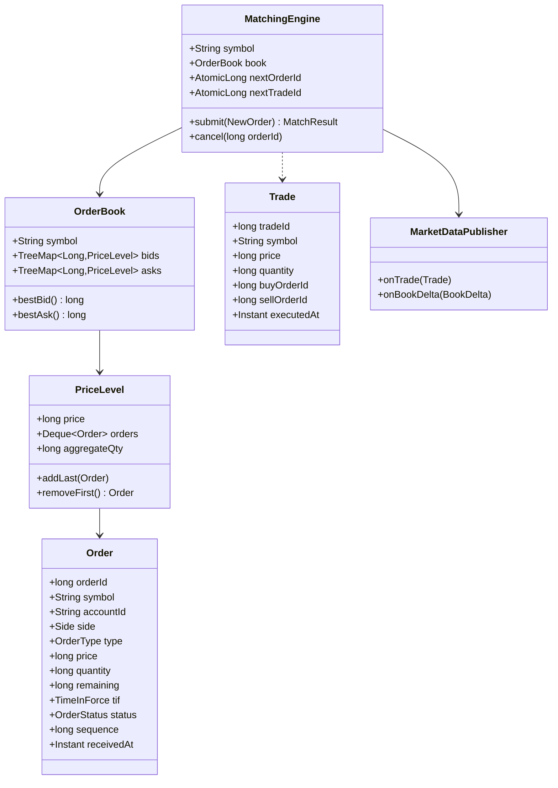

# Design Online Stock Exchange

**Date:** 2026-05-02 | **Updated:** 2026-05-02
**Tags:** `low-level-design` `case-study` `financial` `exchange` `order-book` `matching-engine`

## Summary

An online stock exchange's core is a **matching engine** that consumes orders and produces trades. The LLD centers on the **order book** — a per-symbol structure with two sides (bids and asks) ordered by **price-time priority** — and a small, deterministic matching algorithm. Every other concern (sessions, market data, risk, clearing) is layered around this core.

Two order types are first-class: **limit** (specifies price; rests in the book if not immediately matchable) and **market** (executes against best available prices, never rests). Time-in-force flags (`DAY`, `IOC`, `FOK`) and partial fills are part of the core semantics. The matching engine is single-threaded per symbol — the canonical design — so ordering is inherent and locks are unnecessary on the hot path.

## Table of Contents

- [Requirements](#requirements)
- [Entities and Relationships](#entities-and-relationships)
- [Class Skeletons (Java)](#class-skeletons-java)
- [Key Algorithms / Workflows](#key-algorithms--workflows)
- [Patterns Used](#patterns-used)
- [Concurrency Considerations](#concurrency-considerations)
- [Trade-offs and Extensions](#trade-offs-and-extensions)
- [Related](#related)
- [References](#references)

## Requirements

### Functional

- Place a `BUY` or `SELL` order with `LIMIT` or `MARKET` type and a quantity.
- Limit orders that cross the spread match immediately; the remainder rests in the book at the limit price.
- Market orders consume liquidity at successively worse prices until filled or the book is exhausted.
- Cancel an open order; modify (cancel + replace).
- **Price-time priority**: at the same price level, earlier orders match first.
- Time-in-force: `DAY` (rests until end-of-day or filled), `IOC` (immediate-or-cancel; unfilled portion canceled), `FOK` (fill-or-kill; all-or-nothing immediate match).
- Emit `Trade` events on every match and `BookDelta` events on book changes.

### Non-Functional

- Deterministic matching: same input sequence yields the same output, always.
- Low latency on the hot path; no allocations per order where avoidable.
- Single-writer per symbol; trivial parallelism across symbols by sharding.
- Auditable: every accepted order and every trade has a monotonic exchange-assigned ID.

### Out of Scope

- Clearing/settlement, risk pre-checks beyond simple validation, market-making incentives, complex order types (stop, iceberg, hidden).

## Entities and Relationships



## Class Skeletons (Java)

```java
public enum Side { BUY, SELL }
public enum OrderType { LIMIT, MARKET }
public enum TimeInForce { DAY, IOC, FOK }
public enum OrderStatus { NEW, PARTIALLY_FILLED, FILLED, CANCELED, REJECTED }

public final class Order {
    private final long orderId;
    private final String symbol;
    private final String accountId;
    private final Side side;
    private final OrderType type;
    private final long price;          // ticks; ignored for MARKET
    private final long quantity;
    private long remaining;            // mutable for fills
    private final TimeInForce tif;
    private OrderStatus status;
    private final long sequence;       // monotonic admit order
    private final Instant receivedAt;
}

public final class PriceLevel {
    private final long price;
    private final ArrayDeque<Order> orders = new ArrayDeque<>();
    private long aggregateQty;
    public void addLast(Order o) { orders.addLast(o); aggregateQty += o.remaining(); }
    public Order peekFirst() { return orders.peekFirst(); }
    public Order pollFirst() { Order o = orders.pollFirst(); if (o != null) aggregateQty -= o.remaining(); return o; }
    public boolean isEmpty() { return orders.isEmpty(); }
}

public final class OrderBook {
    private final String symbol;
    // bids: highest price first → reverseOrder()
    private final TreeMap<Long, PriceLevel> bids = new TreeMap<>(Comparator.reverseOrder());
    // asks: lowest price first → naturalOrder()
    private final TreeMap<Long, PriceLevel> asks = new TreeMap<>();

    public Map.Entry<Long, PriceLevel> bestBid() { return bids.firstEntry(); }
    public Map.Entry<Long, PriceLevel> bestAsk() { return asks.firstEntry(); }

    public void rest(Order o) {
        TreeMap<Long, PriceLevel> side = (o.side() == Side.BUY) ? bids : asks;
        side.computeIfAbsent(o.price(), PriceLevel::new).addLast(o);
    }
}

public final class MatchingEngine {
    private final String symbol;
    private final OrderBook book = new OrderBook(symbol);
    private final AtomicLong nextOrderId = new AtomicLong();
    private final AtomicLong nextTradeId = new AtomicLong();
    private final AtomicLong sequence = new AtomicLong();
    private final MarketDataPublisher md;
    private final Map<Long, Order> openOrders = new HashMap<>();

    public MatchResult submit(NewOrder req) {
        Order o = new Order(/* nextOrderId, symbol, ... sequence=sequence.getAndIncrement() */);
        if (!validate(o)) { o.reject(); return MatchResult.rejected(o); }

        if (o.tif() == TimeInForce.FOK && !canFullyFill(o)) {
            o.cancel(); return MatchResult.canceled(o);
        }

        List<Trade> trades = match(o);

        if (o.remaining() == 0) {
            o.markFilled();
        } else if (o.type() == OrderType.MARKET || o.tif() == TimeInForce.IOC) {
            o.cancel();   // unfilled remainder canceled
        } else {
            book.rest(o);
            openOrders.put(o.orderId(), o);
        }
        return new MatchResult(o, trades);
    }

    public void cancel(long orderId) {
        Order o = openOrders.remove(orderId);
        if (o == null || o.status() == OrderStatus.FILLED) return;
        TreeMap<Long, PriceLevel> side = (o.side() == Side.BUY) ? book.bids() : book.asks();
        PriceLevel level = side.get(o.price());
        if (level != null) {
            level.orders().remove(o);    // O(n) within level; acceptable for typical depth
            if (level.isEmpty()) side.remove(o.price());
        }
        o.cancel();
    }

    private List<Trade> match(Order incoming) {
        List<Trade> trades = new ArrayList<>();
        TreeMap<Long, PriceLevel> opposite =
            (incoming.side() == Side.BUY) ? book.asks() : book.bids();

        while (incoming.remaining() > 0 && !opposite.isEmpty()) {
            Map.Entry<Long, PriceLevel> bestEntry = opposite.firstEntry();
            long bestPrice = bestEntry.getKey();
            if (!crosses(incoming, bestPrice)) break;

            PriceLevel level = bestEntry.getValue();
            while (incoming.remaining() > 0 && !level.isEmpty()) {
                Order resting = level.peekFirst();
                long qty = Math.min(incoming.remaining(), resting.remaining());
                trades.add(new Trade(nextTradeId.getAndIncrement(), symbol,
                                     bestPrice, qty,
                                     incoming.side() == Side.BUY ? incoming.orderId() : resting.orderId(),
                                     incoming.side() == Side.BUY ? resting.orderId() : incoming.orderId(),
                                     Instant.now()));
                incoming.fill(qty);
                resting.fill(qty);
                if (resting.remaining() == 0) {
                    level.pollFirst();
                    openOrders.remove(resting.orderId());
                    resting.markFilled();
                }
            }
            if (level.isEmpty()) opposite.remove(bestPrice);
        }
        trades.forEach(md::onTrade);
        return trades;
    }

    private boolean crosses(Order incoming, long bestPrice) {
        if (incoming.type() == OrderType.MARKET) return true;
        return incoming.side() == Side.BUY ? incoming.price() >= bestPrice
                                           : incoming.price() <= bestPrice;
    }

    private boolean canFullyFill(Order o) { /* walk opposite side, sum until quantity met */ return false; }
    private boolean validate(Order o) { /* qty>0, price>0 for limit, symbol enabled, ... */ return true; }
}
```

## Key Algorithms / Workflows

### Price-Time Priority Matching

Within a price level, orders match in **first-in-first-out** order of arrival. Across price levels, the best price wins:

- Best bid = highest buy price.
- Best ask = lowest sell price.

This is the canonical **price-time priority** rule used by major exchanges. It guarantees a deterministic, fair, and predictable match given a fixed input sequence.

### Match Loop

1. While the incoming order has remaining quantity and the opposite side is non-empty:
   - Inspect the best opposite price level.
   - If it does not cross (limit order whose price doesn't satisfy the best on the other side), stop.
   - Walk the FIFO queue at that level, executing min-quantity fills; emit `Trade` events; pop fully-filled resting orders.
   - When the level empties, remove it from the side.
2. If the incoming order is `MARKET` or `IOC`, cancel the unfilled remainder.
3. If `FOK`, pre-check that the entire quantity can be filled at acceptable prices; otherwise cancel without partial fills.
4. Otherwise (limit, `DAY`), rest the remainder in the book at its limit price.

### Cancel

- Remove the order from its `PriceLevel`. Removing from the middle of an `ArrayDeque` is `O(n)` per level; acceptable since each level typically has a few orders. For deeper books, an indexed doubly-linked list per level reduces this to `O(1)`.

### Trade and Book Deltas

- Every fill emits a `Trade`. Every change at a price level emits a `BookDelta` (price + new aggregate quantity, possibly zero to remove). Market data subscribers consume both streams.

## Patterns Used

- **Strategy** — `OrderType` matching behavior; could be encoded as `MarketOrderHandler` / `LimitOrderHandler` strategies.
- **Aggregate** — `OrderBook` is the consistency boundary for a symbol; matching mutates only via the engine.
- **Command** — `NewOrder` and `CancelOrder` are commands fed to the single-threaded engine.
- **Event Sourcing** (extension) — every accepted command and emitted trade is appended to a log; the book is a derived projection.
- **Observer** — `MarketDataPublisher` decouples market-data feeds from the engine.
- **Flyweight** (extension) — interned symbol references and reusable trade objects on the hot path.

## Concurrency Considerations

- One `MatchingEngine` per symbol, single-threaded on the hot path, fed by an inbox queue. This eliminates locking on the book entirely and makes ordering trivial.
- Cross-symbol parallelism is achieved by sharding symbols across engine threads/cores.
- `AtomicLong` IDs are fine because each engine thread is the sole writer for its symbol; cross-engine ID space is partitioned by symbol prefix.
- Market data publishing happens on a separate thread (handoff via SPSC ring buffer) so consumers cannot back-pressure the matcher.
- Order ingress uses a bounded queue with a documented overflow policy (reject with `BUSY`) — never silently drop client orders.

## Trade-offs and Extensions

- **Determinism vs throughput**: single-threaded per symbol is simple and deterministic; multi-threaded matchers exist but are far harder to reason about and audit.
- **Tick size and integer prices**: prices stored as `long` in ticks (e.g., 1 tick = $0.0001) avoids floating-point error; no `BigDecimal` on the hot path.
- **Memory layout**: `TreeMap` is convenient but indirection-heavy; production engines often use price-indexed arrays for the active range plus a sparse map for outliers.
- **Cancel-replace atomicity**: modeled as cancel-then-new with the new order earning a fresh time priority — matches industry norm.

Extensions:

- Stop and stop-limit orders triggered when last trade crosses a stop price.
- Iceberg orders that show only part of their quantity.
- Auctions (open/close): batch matching at a single clearing price using uniform-price auction rules.
- Self-trade prevention: cancel the older or newer side when an account would match itself.
- Risk pre-checks: pre-trade margin and position limit checks before the engine sees the order.

## Related

- [Design Splitwise](./design-splitwise.md)
- [Design Payment Gateway](./design-payment-gateway.md)
- [Design Pub/Sub System (LLD)](../communication/design-pub-sub-system-lld.md)
- [Behavioral patterns](../../design-patterns/behavioral/)
- [Structural patterns](../../design-patterns/structural/)
- [System Design INDEX](../../../system-design/INDEX.md)

## References

- Gamma, Helm, Johnson, Vlissides, *Design Patterns* — Strategy, Command, Observer.
- Goetz et al., *Java Concurrency in Practice* — single-writer principle, bounded queues.
- Aldridge, *High-Frequency Trading* — price-time priority, order book mechanics.
- Harris, *Trading and Exchanges: Market Microstructure for Practitioners* — order types, time-in-force, auction matching.
