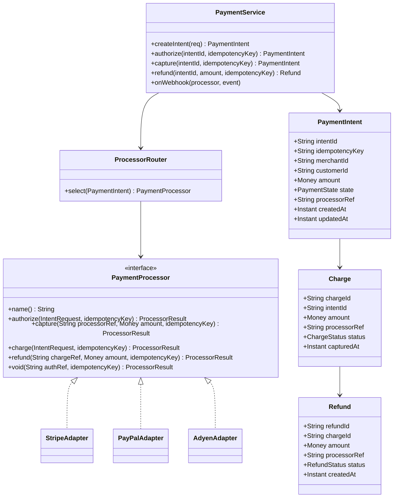
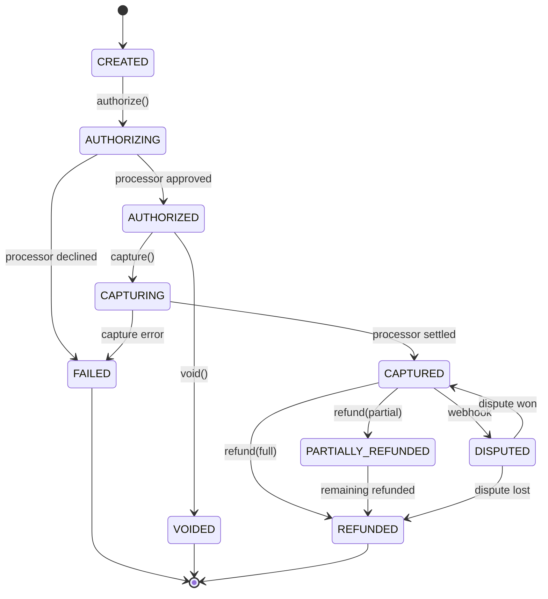

# Design Payment Gateway

**Date:** 2026-05-02 | **Updated:** 2026-05-02
**Tags:** `low-level-design` `case-study` `financial` `payments` `adapter` `state-machine` `idempotency`

## Summary

A payment gateway sits between merchants and external payment processors (Stripe, PayPal, Adyen, bank rails), exposing a single, idempotent API for charging cards, capturing/voiding authorizations, and issuing refunds. The LLD focuses on three pillars:

1. **Payment intent state machine** — every charge is an explicit state transition, never a free-form update, so partial failures and retries remain auditable.
2. **Processor adapters** — each external processor is hidden behind a uniform `PaymentProcessor` interface, isolating SDK quirks and error code mapping.
3. **Idempotency keys** — every external state-changing call (authorize, capture, refund) is keyed so retries cannot double-charge.

The model is intentionally small: a `PaymentIntent` aggregate, an immutable `Charge` and `Refund` event log per intent, and an adapter registry. Webhooks from processors feed back into the same state machine so the gateway's view of truth converges with the processor's.

## Table of Contents

- [Requirements](#requirements)
- [Entities and Relationships](#entities-and-relationships)
- [Class Skeletons (Java)](#class-skeletons-java)
- [Key Algorithms / Workflows](#key-algorithms--workflows)
- [Patterns Used](#patterns-used)
- [Concurrency Considerations](#concurrency-considerations)
- [Trade-offs and Extensions](#trade-offs-and-extensions)
- [Related](#related)
- [References](#references)

## Requirements

### Functional

- Create a `PaymentIntent` for an amount, currency, customer, and merchant.
- Authorize and capture (two-step) or charge (one-step).
- Partial and full refunds against captured charges.
- Voids on uncaptured authorizations.
- Multi-processor routing (`Stripe`, `PayPal`, `Adyen`, ...) with fallback rules.
- Webhook ingestion for asynchronous state changes (auth captured later, refund settled, dispute opened).
- Idempotency on every state-changing client request via `Idempotency-Key`.

### Non-Functional

- Exactly-one external charge per intent regardless of client retries.
- Auditable: every state transition recorded with timestamp, actor, processor reference.
- Strong consistency on the intent's state; eventual on derived metrics.
- PCI scope minimized: raw card data never touches gateway storage; only processor tokens.

### Out of Scope

- 3DS UX, chargeback dispute workflow detail, ledger-side accounting.

## Entities and Relationships



### Payment Intent State Machine



## Class Skeletons (Java)

```java
public enum PaymentState {
    CREATED, AUTHORIZING, AUTHORIZED, CAPTURING, CAPTURED,
    PARTIALLY_REFUNDED, REFUNDED, VOIDED, FAILED, DISPUTED
}

public final class Money {
    private final long minorUnits;
    private final String currency;
}

public interface PaymentProcessor {
    String name();
    ProcessorResult authorize(IntentRequest req, String idempotencyKey);
    ProcessorResult capture(String processorRef, Money amount, String idempotencyKey);
    ProcessorResult charge(IntentRequest req, String idempotencyKey);
    ProcessorResult refund(String chargeRef, Money amount, String idempotencyKey);
    ProcessorResult voidAuth(String authRef, String idempotencyKey);
}

public final class ProcessorResult {
    private final boolean ok;
    private final String processorRef;
    private final String errorCode;       // mapped to gateway-canonical codes
    private final boolean retryable;
    private final Map<String, String> metadata;
}

public final class PaymentIntent {
    private final String intentId;
    private final String idempotencyKey;
    private final String merchantId;
    private final String customerId;
    private final Money amount;
    private final PaymentState state;
    private final String processorRef;     // nullable until first call
    private final long version;            // optimistic lock
    public PaymentIntent withState(PaymentState s, String processorRef) { return null; }
}

public final class IdempotencyStore {
    /** Returns existing response if key was used; else stores marker and returns empty. */
    public Optional<StoredResponse> claim(String key, String requestHash) { return Optional.empty(); }
    public void complete(String key, StoredResponse response) { }
}

public final class PaymentService {
    private final IntentRepository intents;
    private final ChargeRepository charges;
    private final RefundRepository refunds;
    private final ProcessorRouter router;
    private final IdempotencyStore idem;

    public PaymentIntent authorize(String intentId, String idempotencyKey) {
        PaymentIntent intent = intents.findById(intentId);
        guardLegalTransition(intent.state(), PaymentState.AUTHORIZING);

        Optional<StoredResponse> prior = idem.claim(idempotencyKey, hash(intent));
        if (prior.isPresent()) return prior.get().intent();

        PaymentIntent authorizing = intents.transition(intent, PaymentState.AUTHORIZING, null);
        PaymentProcessor p = router.select(authorizing);
        ProcessorResult r = p.authorize(toRequest(authorizing), idempotencyKey);

        PaymentIntent next = r.ok()
            ? intents.transition(authorizing, PaymentState.AUTHORIZED, r.processorRef())
            : intents.transition(authorizing, PaymentState.FAILED, null);

        idem.complete(idempotencyKey, StoredResponse.of(next));
        return next;
    }

    public PaymentIntent capture(String intentId, String idempotencyKey) {
        PaymentIntent intent = intents.findById(intentId);
        guardLegalTransition(intent.state(), PaymentState.CAPTURING);
        PaymentIntent capturing = intents.transition(intent, PaymentState.CAPTURING, intent.processorRef());
        PaymentProcessor p = router.byName(intent.processorName());
        ProcessorResult r = p.capture(intent.processorRef(), intent.amount(), idempotencyKey);
        return r.ok()
            ? intents.transition(capturing, PaymentState.CAPTURED, r.processorRef())
            : intents.transition(capturing, PaymentState.FAILED, null);
    }

    public Refund refund(String intentId, Money amount, String idempotencyKey) {
        PaymentIntent intent = intents.findById(intentId);
        if (intent.state() != PaymentState.CAPTURED &&
            intent.state() != PaymentState.PARTIALLY_REFUNDED)
            throw new IllegalStateException("cannot refund from " + intent.state());
        Money already = refunds.totalRefunded(intent.intentId());
        if (already.add(amount).minorUnits() > intent.amount().minorUnits())
            throw new RefundExceedsCaptureException();
        PaymentProcessor p = router.byName(intent.processorName());
        ProcessorResult r = p.refund(intent.processorRef(), amount, idempotencyKey);
        Refund refund = refunds.save(/* ... */);
        if (already.add(amount).minorUnits() == intent.amount().minorUnits())
            intents.transition(intent, PaymentState.REFUNDED, intent.processorRef());
        else
            intents.transition(intent, PaymentState.PARTIALLY_REFUNDED, intent.processorRef());
        return refund;
    }

    public void onWebhook(String processor, ProcessorEvent event) {
        // map external event to canonical state transitions
    }

    private void guardLegalTransition(PaymentState from, PaymentState to) { /* ... */ }
}
```

## Key Algorithms / Workflows

### Idempotent Authorize

1. Client supplies `Idempotency-Key`.
2. `IdempotencyStore.claim` returns prior stored response if the same key was used with the same request hash; mismatching hash on the same key is rejected.
3. Apply intent state transition `CREATED -> AUTHORIZING` with optimistic locking on `version`.
4. Invoke `PaymentProcessor.authorize(req, idempotencyKey)`; the same key is forwarded to the processor so its server also dedupes.
5. Persist final intent (`AUTHORIZED` or `FAILED`) and store the response under the idempotency key.

### Webhook Reconciliation

- Webhook events are signed and verified per processor.
- Map processor event types to canonical transitions (`charge.captured -> CAPTURED`, `charge.refunded -> REFUNDED`, `charge.dispute.created -> DISPUTED`).
- Apply through the same state machine guards; ignore events that would cause illegal transitions.
- Use the `processorRef` to locate the affected intent; events are processed at-least-once and must be idempotent on the gateway side.

### Processor Routing & Fallback

- `ProcessorRouter.select` picks based on currency, card brand, merchant config, processor health.
- On retryable failure, fallback to a secondary processor while preserving the gateway-side intent; the new attempt uses a new `processorRef` and the same intent retains its history of attempts.

### Refund Bounds

- Sum of refunds per intent must never exceed captured amount; enforced under a per-intent lock.

## Patterns Used

- **Adapter** — each `PaymentProcessor` adapts a vendor SDK to the gateway's interface.
- **State** — `PaymentState` and explicit transition guards prevent illegal moves.
- **Strategy** — `ProcessorRouter` selects a strategy per intent.
- **Command** — `authorize`, `capture`, `refund` are commands routed through the state machine.
- **Idempotency Key** (Hohpe/Woolf) — request-level dedupe at boundary and forwarded downstream.
- **Repository** — `IntentRepository`, `ChargeRepository`, `RefundRepository`.
- **Anti-Corruption Layer** — adapter maps vendor error codes into a small canonical taxonomy.

## Concurrency Considerations

- Optimistic locking (`version`) on `PaymentIntent` ensures concurrent authorize/capture/refund attempts cannot race past the state guard.
- Per-intent lock during refund ensures the sum-of-refunds invariant holds.
- `IdempotencyStore` writes claim and final response atomically; concurrent clients with the same key serialize at the store.
- Webhook handlers run on a dedicated executor and are idempotent; duplicate webhook deliveries are common and must be tolerated.
- All processor calls happen outside DB transactions; the intent transition is committed before the network call to avoid lost updates if the call hangs (with a reconciliation job for dangling `AUTHORIZING` states past TTL).

## Trade-offs and Extensions

- **Two-step (auth + capture) vs one-step charge**: two-step is required for shipping/inventory reservation; one-step simplifies low-risk flows.
- **Synchronous vs asynchronous webhooks**: synchronous response is simpler but ties up clients; async with webhook reconciliation is more resilient.
- **In-house vs hosted card collection**: hosted collection (processor-tokenized) keeps PCI scope at SAQ-A; in-house drastically widens scope.
- **Strict state machine**: rejecting unexpected transitions keeps the data clean but requires careful webhook ordering.

Extensions:

- Saved payment methods (vault), 3DS challenge flows, partial captures.
- Multi-currency settlement with FX rate locked at authorization.
- Retry orchestration with exponential backoff and circuit breakers per processor.
- Ledger integration that emits a double-entry journal on every state transition.

## Related

- [Design Splitwise](./design-splitwise.md)
- [Design Online Stock Exchange](./design-online-stock-exchange.md)
- [Design Notification System (LLD)](../communication/design-notification-system-lld.md)
- [Behavioral patterns](../../design-patterns/behavioral/)
- [Structural patterns](../../design-patterns/structural/)
- [System Design INDEX](../../../system-design/INDEX.md)

## References

- Hohpe, Woolf, *Enterprise Integration Patterns* — Idempotent Receiver, Message Endpoint.
- Gamma, Helm, Johnson, Vlissides, *Design Patterns* — Adapter, State, Strategy, Command.
- Evans, *Domain-Driven Design* — Aggregate, Anti-Corruption Layer.
- Fowler, *Patterns of Enterprise Application Architecture* — Repository, Optimistic Offline Lock.
