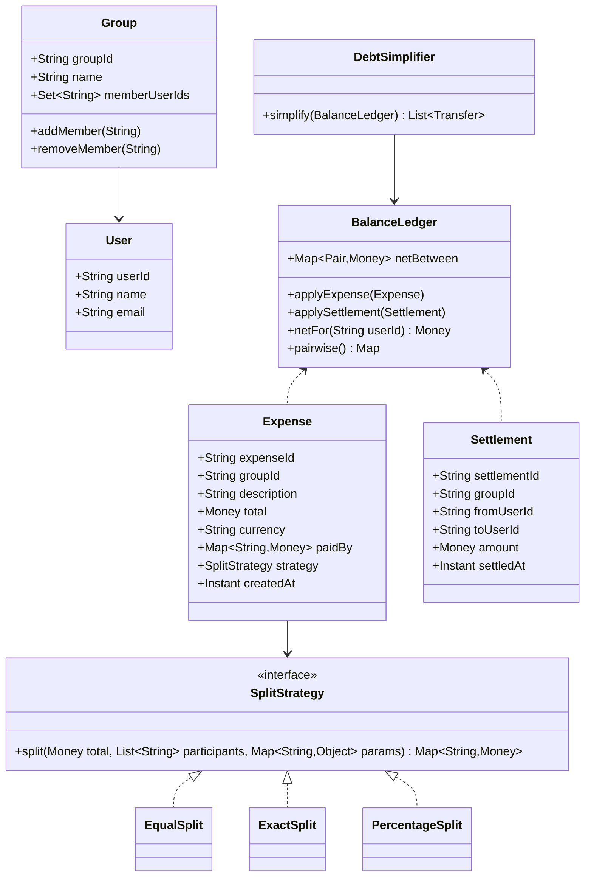

# Design Splitwise

**Date:** 2026-05-02 | **Updated:** 2026-05-02
**Tags:** `low-level-design` `case-study` `financial` `splitwise` `strategy` `graph`

## Summary

Splitwise tracks shared expenses among friends or in a group, computes who owes whom, and minimizes the number of settlement transactions. The LLD revolves around three concerns: (1) modeling **expenses** with pluggable **share strategies** (equal, exact, percentage), (2) maintaining a **balance ledger** as net amounts between every pair of users, and (3) running a **simplify-debts** algorithm — the classic **min-cash-flow** algorithm — to reduce a directed debt graph to the minimum number of transactions.

The system is intentionally an in-memory domain model with repository seams. Money is represented in minor units (cents) using `BigDecimal` to avoid floating-point drift. Settlement and partial payments are first-class so the ledger stays consistent.

## Table of Contents

- [Requirements](#requirements)
- [Entities and Relationships](#entities-and-relationships)
- [Class Skeletons (Java)](#class-skeletons-java)
- [Key Algorithms / Workflows](#key-algorithms--workflows)
- [Patterns Used](#patterns-used)
- [Concurrency Considerations](#concurrency-considerations)
- [Trade-offs and Extensions](#trade-offs-and-extensions)
- [Related](#related)
- [References](#references)

## Requirements

### Functional

- Create users and groups; add or remove members from a group.
- Add an expense with: payer(s), participants, total amount, currency, split strategy.
- Three split strategies: **EQUAL**, **EXACT** (per-user amounts must sum to total), **PERCENTAGE** (must sum to 100%).
- Show pairwise balances and per-user net balance.
- Record settlements (User A pays User B X currency) which adjust the ledger.
- Simplify debts in a group: produce the minimum set of transactions that settle all balances (min-cash-flow).

### Non-Functional

- Currency-safe arithmetic: integer minor units or `BigDecimal` with `RoundingMode.HALF_EVEN`.
- Auditability: every ledger change is sourced from a persisted expense or settlement.
- Deterministic split: rounding remainders are distributed by a documented rule.

### Out of Scope

- Multi-currency conversion (each expense is single-currency; group balances split per currency).
- Recurring expenses, receipts/OCR.

## Entities and Relationships



## Class Skeletons (Java)

```java
public final class Money {
    private final long minorUnits;     // cents
    private final String currency;
    public Money add(Money o) { /* same currency check */ return null; }
    public Money subtract(Money o) { return null; }
    public Money negate() { return new Money(-minorUnits, currency); }
    public boolean isPositive() { return minorUnits > 0; }
    public boolean isZero() { return minorUnits == 0; }
}

public interface SplitStrategy {
    /** Returns share per user; sum must equal total. */
    Map<String, Money> split(Money total, List<String> participants, Map<String, Object> params);
}

public final class EqualSplit implements SplitStrategy {
    @Override
    public Map<String, Money> split(Money total, List<String> ps, Map<String,Object> params) {
        long base = total.minorUnits() / ps.size();
        long remainder = total.minorUnits() % ps.size();
        Map<String, Money> out = new LinkedHashMap<>();
        for (int i = 0; i < ps.size(); i++) {
            long share = base + (i < remainder ? 1 : 0);   // distribute remainder deterministically
            out.put(ps.get(i), new Money(share, total.currency()));
        }
        return out;
    }
}

public final class ExactSplit implements SplitStrategy {
    @Override
    public Map<String, Money> split(Money total, List<String> ps, Map<String,Object> params) {
        @SuppressWarnings("unchecked")
        Map<String, Money> exact = (Map<String, Money>) params.get("amounts");
        long sum = exact.values().stream().mapToLong(Money::minorUnits).sum();
        if (sum != total.minorUnits()) throw new InvalidSplitException("exact sum mismatch");
        return Map.copyOf(exact);
    }
}

public final class PercentageSplit implements SplitStrategy {
    @Override
    public Map<String, Money> split(Money total, List<String> ps, Map<String,Object> params) {
        @SuppressWarnings("unchecked")
        Map<String, BigDecimal> pct = (Map<String, BigDecimal>) params.get("percentages");
        BigDecimal sum = pct.values().stream().reduce(BigDecimal.ZERO, BigDecimal::add);
        if (sum.compareTo(new BigDecimal("100")) != 0) throw new InvalidSplitException();
        Map<String, Money> out = new LinkedHashMap<>();
        long allocated = 0;
        List<String> ordered = new ArrayList<>(pct.keySet());
        for (int i = 0; i < ordered.size(); i++) {
            String u = ordered.get(i);
            long share;
            if (i == ordered.size() - 1) {
                share = total.minorUnits() - allocated;     // absorb remainder
            } else {
                share = pct.get(u)
                    .multiply(BigDecimal.valueOf(total.minorUnits()))
                    .divide(BigDecimal.valueOf(100), 0, RoundingMode.HALF_EVEN)
                    .longValueExact();
                allocated += share;
            }
            out.put(u, new Money(share, total.currency()));
        }
        return out;
    }
}

public final class BalanceLedger {
    /** Net amount user A owes user B; negative means B owes A. */
    private final Map<UserPair, Money> net = new ConcurrentHashMap<>();

    public void applyExpense(Expense e) {
        Map<String, Money> shares = e.strategy().split(e.total(), e.participantIds(), e.params());
        for (var entry : shares.entrySet()) {
            String debtor = entry.getKey();
            Money owed = entry.getValue();
            for (var paid : e.paidBy().entrySet()) {
                String creditor = paid.getKey();
                if (debtor.equals(creditor)) continue;
                Money portion = portionOf(owed, paid.getValue(), e.total());
                addPair(debtor, creditor, portion);
            }
        }
    }

    public void applySettlement(Settlement s) {
        addPair(s.fromUserId(), s.toUserId(), s.amount().negate());
    }

    private void addPair(String debtor, String creditor, Money amount) {
        UserPair key = UserPair.of(debtor, creditor);
        net.merge(key, key.signFor(debtor, amount), Money::add);
    }
}

public final class DebtSimplifier {
    public List<Transfer> simplify(Map<String, Money> netByUser) {
        // min-cash-flow: greedy match max creditor with max debtor
        PriorityQueue<Bal> creditors = new PriorityQueue<>((a, b) ->
            Long.compare(b.amount, a.amount));
        PriorityQueue<Bal> debtors = new PriorityQueue<>((a, b) ->
            Long.compare(a.amount, b.amount));   // most negative first
        for (var e : netByUser.entrySet()) {
            long m = e.getValue().minorUnits();
            if (m > 0) creditors.add(new Bal(e.getKey(), m));
            else if (m < 0) debtors.add(new Bal(e.getKey(), m));
        }
        List<Transfer> transfers = new ArrayList<>();
        while (!creditors.isEmpty() && !debtors.isEmpty()) {
            Bal c = creditors.poll(); Bal d = debtors.poll();
            long settle = Math.min(c.amount, -d.amount);
            transfers.add(new Transfer(d.userId, c.userId, settle));
            long cr = c.amount - settle, dr = d.amount + settle;
            if (cr > 0) creditors.add(new Bal(c.userId, cr));
            if (dr < 0) debtors.add(new Bal(d.userId, dr));
        }
        return transfers;
    }

    private record Bal(String userId, long amount) {}
}
```

## Key Algorithms / Workflows

### Add Expense

1. Validate: payer(s) and participants exist in the group; payments sum to total; strategy params valid.
2. Run `SplitStrategy.split` to get per-participant shares.
3. For each (debtor, creditor) pair, attribute a portion of the debt proportional to creditor's payment share.
4. Update `BalanceLedger`.
5. Persist expense and ledger delta atomically.

### Simplify Debts (Min-Cash-Flow)

The **min-cash-flow** algorithm reduces a graph of pairwise debts to the minimum number of transfers among N users:

1. Compute net balance per user: positive = creditor, negative = debtor, zero = settled.
2. Insert into two priority queues: max-heap of creditors, max-heap of debtors (by absolute value).
3. Repeatedly pop the largest creditor `C` and largest debtor `D`. Settle `min(C, |D|)`. Reinsert any non-zero remainder.
4. Stop when both heaps are empty.

Output: at most `N-1` transfers, often far fewer. This is the classic greedy simplification used in interview problems and in production "simplify debts" features.

### Settlement

- A settlement is a `Transfer` recorded explicitly (User A paid User B X). It is applied to the ledger like an expense in reverse: it reduces the debt edge.

## Patterns Used

- **Strategy** — `SplitStrategy` with `EqualSplit`, `ExactSplit`, `PercentageSplit`.
- **Repository** — `ExpenseRepository`, `SettlementRepository`, `GroupRepository`.
- **Aggregate** — `Group` is the consistency boundary for expenses and ledger inside it.
- **Specification / Validator** — split params validated via small validators per strategy.
- **Value Object** — `Money` and `UserPair` are immutable values with equality by content.
- **Command** — adding an expense or settlement is modeled as a command applied to the ledger.

## Concurrency Considerations

- Per-group write serialization avoids conflicting ledger updates. A single-writer worker per group, or per-group `ReentrantLock`, keeps applying expenses and settlements consistent.
- `BalanceLedger` uses `ConcurrentHashMap` plus `merge` for atomic pair updates.
- `Money` arithmetic is on `long` minor units — overflow-safe within reasonable group sizes; use `Math.addExact` for defensive checks.
- Simplification is computed on a snapshot (copy of net balances) so a long simplify call does not block writers.

## Trade-offs and Extensions

- **Read fan-out vs derived view**: storing the ledger explicitly trades disk for fast reads vs deriving from expenses on every view.
- **Min transactions vs fairness**: min-cash-flow minimizes transfer count but can create transfers between users who never directly transacted. Some products prefer "settle along original edges only".
- **Rounding**: distributing remainders to the first N users is deterministic but not always perceived as fair — alternative is rotating the remainder recipient.
- **Currencies**: keeping per-currency sub-ledgers avoids FX inside the model; conversion is an out-of-band concern.

Extensions:

- Recurring expenses (rent, subscriptions) modeled as a `RecurringExpense` aggregate that emits child `Expense` instances on a schedule.
- Reminders piggyback on the notification system.
- Group activity feed reuses the in-process pub/sub broker.
- Multi-currency settlement using FX snapshots stored on the settlement.

## Related

- [Design Payment Gateway](./design-payment-gateway.md)
- [Design Online Stock Exchange](./design-online-stock-exchange.md)
- [Behavioral patterns](../../design-patterns/behavioral/)
- [Structural patterns](../../design-patterns/structural/)
- [System Design INDEX](../../../system-design/INDEX.md)

## References

- Gamma, Helm, Johnson, Vlissides, *Design Patterns* — Strategy, Command.
- Evans, *Domain-Driven Design* — Aggregate, Value Object, Repository.
- Cormen, Leiserson, Rivest, Stein, *Introduction to Algorithms* — greedy algorithms; min-cash-flow is a textbook variant on graph reduction.
