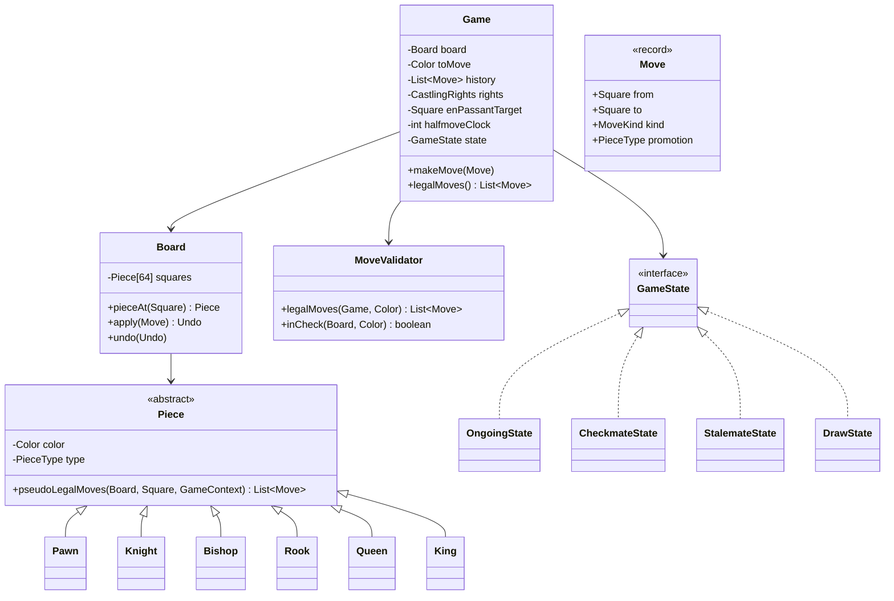

# Design Chess

**Date:** 2026-05-02 | **Updated:** 2026-05-02
**Tags:** `low-level-design` `case-study` `games` `strategy` `state`
## Summary

Chess is the canonical "complicated rules engine" interview problem: six piece types each with their own move geometry, special moves (castling, en passant, promotion), legality checks that depend on whether your own king is in check, and terminal conditions (checkmate, stalemate, draw by various rules). The LLD partitions this into a piece-strategy hierarchy producing pseudo-legal moves, a board that applies/undoes moves, a `MoveValidator` that filters for self-check, and a game state machine that detects check, checkmate, and stalemate after each move.

## Table of Contents

1. [Requirements](#requirements)
2. [Entities and Relationships](#entities-and-relationships)
3. [Class Skeletons](#class-skeletons)
4. [Key Algorithms](#key-algorithms)
5. [Patterns Used](#patterns-used)
6. [Concurrency Considerations](#concurrency-considerations)
7. [Trade-offs and Extensions](#trade-offs-and-extensions)
8. [Related](#related)
9. [References](#references)

## Requirements

### Functional

- 8x8 board with the standard initial position.
- Six piece types: pawn, knight, bishop, rook, queen, king. Two colors.
- Generate the legal moves for any piece given the current board state.
- Support special moves: castling (king + rook), en passant (pawn), pawn promotion to Q/R/B/N.
- Detect check, checkmate, and stalemate after every move.
- Track move history; support undo (needed for legality search and engines).
- Detect draw by insufficient material, threefold repetition, and the 50-move rule.

### Non-Functional

- Move generation in milliseconds; per-position move generation is the inner loop of any engine.
- Strict separation between *pseudo-legal* moves (geometry + capture rules) and *legal* moves (do not leave own king in check).
- Apply / undo must be exact inverses; small bugs here corrupt the entire engine.
- Engine API neutral toward UI, network, and AI clients.

## Entities and Relationships



## Class Skeletons

```java
public enum Color { WHITE, BLACK;
    public Color opposite() { return this == WHITE ? BLACK : WHITE; }
}

public enum PieceType { PAWN, KNIGHT, BISHOP, ROOK, QUEEN, KING }

public enum MoveKind { NORMAL, CAPTURE, DOUBLE_PAWN, EN_PASSANT, CASTLE_KS, CASTLE_QS, PROMOTION }

public record Square(int file, int rank) {
    public Square {
        if (file < 0 || file > 7 || rank < 0 || rank > 7) {
            throw new IllegalArgumentException("off-board");
        }
    }
}

public record Move(Square from, Square to, MoveKind kind, PieceType promotion) {
    public static Move normal(Square f, Square t) {
        return new Move(f, t, MoveKind.NORMAL, null);
    }
}
```

```java
public abstract class Piece {
    protected final Color color;
    protected final PieceType type;
    protected Piece(Color color, PieceType type) {
        this.color = color; this.type = type;
    }
    public Color color() { return color; }
    public PieceType type() { return type; }
    public abstract List<Move> pseudoLegalMoves(Board b, Square at, GameContext ctx);
}

public final class Knight extends Piece {
    private static final int[][] OFFSETS = {
        {1,2},{2,1},{-1,2},{-2,1},{1,-2},{2,-1},{-1,-2},{-2,-1}
    };
    public Knight(Color c) { super(c, PieceType.KNIGHT); }
    @Override public List<Move> pseudoLegalMoves(Board b, Square at, GameContext ctx) {
        List<Move> out = new ArrayList<>();
        for (int[] d : OFFSETS) {
            int f = at.file() + d[0], r = at.rank() + d[1];
            if (f < 0 || f > 7 || r < 0 || r > 7) continue;
            Square to = new Square(f, r);
            Piece occ = b.pieceAt(to);
            if (occ == null) out.add(Move.normal(at, to));
            else if (occ.color() != color) {
                out.add(new Move(at, to, MoveKind.CAPTURE, null));
            }
        }
        return out;
    }
}

public final class Bishop extends Piece {
    private static final int[][] DIRS = {{1,1},{1,-1},{-1,1},{-1,-1}};
    public Bishop(Color c) { super(c, PieceType.BISHOP); }
    @Override public List<Move> pseudoLegalMoves(Board b, Square at, GameContext ctx) {
        return Sliders.sliding(b, at, color, DIRS);
    }
}

// Rook and Queen reuse Sliders with their own direction sets.
```

```java
final class Sliders {
    static List<Move> sliding(Board b, Square at, Color color, int[][] dirs) {
        List<Move> out = new ArrayList<>();
        for (int[] d : dirs) {
            int f = at.file() + d[0], r = at.rank() + d[1];
            while (f >= 0 && f <= 7 && r >= 0 && r <= 7) {
                Square to = new Square(f, r);
                Piece occ = b.pieceAt(to);
                if (occ == null) {
                    out.add(Move.normal(at, to));
                } else {
                    if (occ.color() != color) {
                        out.add(new Move(at, to, MoveKind.CAPTURE, null));
                    }
                    break;
                }
                f += d[0]; r += d[1];
            }
        }
        return out;
    }
}
```

```java
public final class Pawn extends Piece {
    public Pawn(Color c) { super(c, PieceType.PAWN); }
    @Override public List<Move> pseudoLegalMoves(Board b, Square at, GameContext ctx) {
        List<Move> out = new ArrayList<>();
        int dir = color == Color.WHITE ? 1 : -1;
        int startRank = color == Color.WHITE ? 1 : 6;
        int promoRank = color == Color.WHITE ? 7 : 0;

        Square one = new Square(at.file(), at.rank() + dir);
        if (b.pieceAt(one) == null) {
            addPawnAdvance(out, at, one, promoRank);
            if (at.rank() == startRank) {
                Square two = new Square(at.file(), at.rank() + 2 * dir);
                if (b.pieceAt(two) == null) {
                    out.add(new Move(at, two, MoveKind.DOUBLE_PAWN, null));
                }
            }
        }
        for (int df : new int[]{-1, 1}) {
            int nf = at.file() + df, nr = at.rank() + dir;
            if (nf < 0 || nf > 7 || nr < 0 || nr > 7) continue;
            Square cap = new Square(nf, nr);
            Piece occ = b.pieceAt(cap);
            if (occ != null && occ.color() != color) {
                addPawnCapture(out, at, cap, promoRank);
            } else if (cap.equals(ctx.enPassantTarget())) {
                out.add(new Move(at, cap, MoveKind.EN_PASSANT, null));
            }
        }
        return out;
    }

    private void addPawnAdvance(List<Move> out, Square from, Square to, int promoRank) {
        if (to.rank() == promoRank) {
            for (PieceType t : List.of(
                PieceType.QUEEN, PieceType.ROOK, PieceType.BISHOP, PieceType.KNIGHT
            )) out.add(new Move(from, to, MoveKind.PROMOTION, t));
        } else out.add(Move.normal(from, to));
    }
    private void addPawnCapture(List<Move> out, Square from, Square to, int promoRank) {
        if (to.rank() == promoRank) {
            for (PieceType t : List.of(
                PieceType.QUEEN, PieceType.ROOK, PieceType.BISHOP, PieceType.KNIGHT
            )) out.add(new Move(from, to, MoveKind.PROMOTION, t));
        } else out.add(new Move(from, to, MoveKind.CAPTURE, null));
    }
}
```

```java
public final class Board {
    private final Piece[] squares = new Piece[64];

    public Piece pieceAt(Square s) { return squares[s.rank() * 8 + s.file()]; }

    public Undo apply(Move m) {
        // Capture undo info: moved piece, captured piece (incl. en-passant), prior castling rights
        // Returns an Undo record so the move can be reversed exactly.
        // (Implementation handles each MoveKind explicitly.)
        return UndoOps.apply(this, m, squares);
    }

    public void undo(Undo u) { UndoOps.undo(this, u, squares); }

    void put(Square s, Piece p) { squares[s.rank() * 8 + s.file()] = p; }
    Piece take(Square s) {
        int i = s.rank() * 8 + s.file();
        Piece p = squares[i];
        squares[i] = null;
        return p;
    }
}

public record Undo(
    Move move,
    Piece moved,
    Piece captured,
    Square capturedFrom,
    CastlingRights rightsBefore,
    Square epBefore,
    int halfmoveBefore
) {}
```

```java
public record CastlingRights(boolean wKs, boolean wQs, boolean bKs, boolean bQs) {
    public CastlingRights drop(Color c, boolean kingside) {
        return new CastlingRights(
            c == Color.WHITE && kingside ? false : wKs,
            c == Color.WHITE && !kingside ? false : wQs,
            c == Color.BLACK && kingside ? false : bKs,
            c == Color.BLACK && !kingside ? false : bQs
        );
    }
}

public record GameContext(
    Color toMove,
    CastlingRights rights,
    Square enPassantTarget
) {}
```

```java
public final class MoveValidator {
    public List<Move> legalMoves(Game game, Color side) {
        List<Move> out = new ArrayList<>();
        for (Square sq : Squares.all()) {
            Piece p = game.board().pieceAt(sq);
            if (p == null || p.color() != side) continue;
            for (Move m : p.pseudoLegalMoves(game.board(), sq, game.context())) {
                if (isLegal(game, m, side)) out.add(m);
            }
        }
        return out;
    }

    public boolean inCheck(Board b, Color side) {
        Square king = findKing(b, side);
        return isAttacked(b, king, side.opposite());
    }

    private boolean isLegal(Game game, Move m, Color side) {
        Undo u = game.board().apply(m);
        boolean leftKingInCheck = inCheck(game.board(), side);
        game.board().undo(u);
        if (leftKingInCheck) return false;
        // Castling additionally: king must not be in check before, during, or after the move.
        if (m.kind() == MoveKind.CASTLE_KS || m.kind() == MoveKind.CASTLE_QS) {
            return castlingPathSafe(game, m, side);
        }
        return true;
    }
}
```

```java
public interface GameState { boolean terminal(); }
public final class OngoingState implements GameState { public boolean terminal() { return false; } }
public final class CheckmateState implements GameState {
    private final Color winner;
    public CheckmateState(Color w) { this.winner = w; }
    public Color winner() { return winner; }
    public boolean terminal() { return true; }
}
public final class StalemateState implements GameState { public boolean terminal() { return true; } }
public final class DrawState implements GameState {
    public enum Reason { FIFTY_MOVES, THREEFOLD, INSUFFICIENT_MATERIAL, AGREEMENT }
    private final Reason reason;
    public DrawState(Reason r) { this.reason = r; }
    public boolean terminal() { return true; }
}
```

## Key Algorithms

### Pseudo-Legal Move Generation

Each piece returns moves derived from geometry plus capture rules; it does *not* know about check.

- **Knights, kings**: offset tables, bounded by board edges and same-color blocks.
- **Sliders**: walk each direction until edge or blocker; opposite color emits a capture and stops.
- **Pawns**: forward push (one or two from start rank), diagonal capture, en passant when the target matches the game context, and promotion on the back rank.
- **King castling**: emitted if king and rook are on home squares, rights are still set, and squares between them are empty. Check conditions are validated later.

### Legality Filter

A pseudo-legal move is illegal iff making it leaves your own king attacked. The simplest correct approach: apply the move, ask `inCheck(board, side)`, undo. This is the "make / unmake" pattern that every chess engine uses.

```text
for each pseudo-legal move m of side S:
    apply(m)
    if not inCheck(board, S):
        legalMoves.add(m)
    undo(m)
```

Castling has stronger conditions: the king cannot be in check before the move, cannot pass through an attacked square, and cannot land on an attacked square. Implement by simulating the king's intermediate square as well.

### `isAttacked(square, byColor)`

Used both for check detection and for castling safety. Preferred approach is reverse lookup: for each attacking piece type, walk away from `square` and see whether the matching piece sits at the end (pawns from two diagonals, knights from eight offsets, sliders along four or eight rays). Generating all opponent moves is correct but wasteful in hot paths.

### Check / Checkmate / Stalemate

After applying a move, switch sides and:

- If `legalMoves(other).isEmpty()`:
  - If `inCheck(other)` -> `CheckmateState(currentMover)`.
  - Else -> `StalemateState`.
- Else if `inCheck(other)` -> `OngoingState`, but flag "in check" for UI.
- Else -> `OngoingState`.

### Draw Detection

- **Fifty-move rule**: `halfmoveClock` increments per move, resets on pawn moves and captures; 100 half-moves without either is a claimable draw.
- **Threefold repetition**: hash each position (Zobrist or canonical FEN) and count occurrences in history.
- **Insufficient material**: K vs K, K+B vs K, K+N vs K, K+B vs K+B with same-color bishops -> draw.

## Patterns Used

- **Strategy** — `Piece.pseudoLegalMoves` is a per-type strategy; variant pieces plug in without touching the engine.
- **Template Method** — `Sliders.sliding` factors the ray-walking loop; sliders parameterize the directions.
- **Command + Memento** — `Move` is the command; `Undo` is the memento. `apply` returns it; `undo` consumes it. This enables make/unmake legality checking and search.
- **State** — `GameState` replaces enum-flag soup with type-safe terminal handling.
- **Value Object** — `Square`, `Move`, `CastlingRights`, `GameContext` are immutable records; equality is free, which the threefold-repetition check exploits.
- **Facade** — `Game` is the facade over `Board`, `MoveValidator`, and the state machine.

## Concurrency Considerations

- Game state is single-writer; no thread should mutate `Board` concurrently. Network play queues commands per game and one mutator thread applies them in order; spectator broadcasts read a snapshot built right after `apply`.
- An engine search (alpha-beta, MCTS) typically gives each worker its own `Board` and uses make/unmake locally. The skeleton above is friendly to that.
- The Zobrist key used for repetition must update incrementally inside `apply` / `undo` to avoid O(N) recomputation.

## Trade-offs and Extensions

- **0x88 / bitboards** — `Piece[64]` is clear and slow. Production engines use 64-bit bitboards with magic bitboards for sliders. Same LLD shape, lower-level data.
- **Polymorphism vs switch** — Strategy classes per piece read well; a hot engine often inlines via a `PieceType` switch.
- **PGN / SAN** — Add a parser/serializer alongside `Move`; keep parsing out of `Move` itself.
- **Time control** — Wrap `Game` with a clock; loss-on-time is just another terminal state.
- **Variants** — Chess960 and fairy chess plug in via the strategy hierarchy.
- **AI** — Negamax-with-alpha-beta sits on top of `legalMoves` + `apply` + `undo`; add an `Evaluator` interface.

## Related

- [Design Tic-Tac-Toe](design-tic-tac-toe.md) — much smaller game with the same state-pattern shape.
- [Design Snake and Ladder](design-snake-and-ladder.md) — turn-based engine, configurable rules.
- [Design Minesweeper](design-minesweeper.md) — grid game with cell-level state machine and observer.
- [Strategy](../../design-patterns/behavioral/strategy.md), [State](../../design-patterns/behavioral/state.md), [Command](../../design-patterns/behavioral/command.md), [Memento](../../design-patterns/behavioral/memento.md), [Template Method](../../design-patterns/behavioral/template-method.md)
- [Facade Pattern](../../design-patterns/structural/facade.md)
- [UML Class Diagram Cheat Sheet](../../uml/class-diagram.md)

## References

- FIDE Laws of Chess: official rule book covering piece movement, special moves, check, checkmate, stalemate, and draw conditions (fifty-move rule, threefold repetition, insufficient material).
- Pseudo-legal vs legal move generation: pseudo-legal respects geometry and captures; legality additionally forbids leaving the moving side's king in check.
- Make/unmake (apply/undo) is the standard pattern for legality testing and engine search; it pairs with Command + Memento.
- Zobrist hashing is the standard technique for fast position equality used by threefold-repetition detection and transposition tables.
