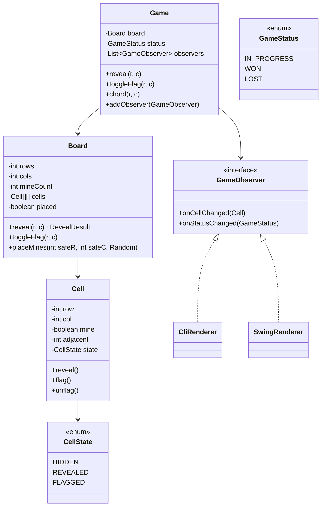

# Design Minesweeper

**Date:** 2026-05-02 | **Updated:** 2026-05-02
**Tags:** `low-level-design` `case-study` `games` `state` `observer`
## Summary

Minesweeper is a grid-based deduction game: the player reveals cells trying to avoid hidden mines, using neighbor-mine counts to deduce safe moves. The design pivots on three things — a per-cell state machine (`HIDDEN`, `REVEALED`, `FLAGGED`), a flood-fill that opens contiguous zero-count regions on a single click, and an observer pipeline so any UI (CLI, Swing, browser) can subscribe to incremental cell updates rather than re-render the whole board.

## Table of Contents

1. [Requirements](#requirements)
2. [Entities and Relationships](#entities-and-relationships)
3. [Class Skeletons](#class-skeletons)
4. [Key Algorithms](#key-algorithms)
5. [Patterns Used](#patterns-used)
6. [Concurrency Considerations](#concurrency-considerations)
7. [Trade-offs and Extensions](#trade-offs-and-extensions)
8. [Related](#related)
9. [References](#references)

## Requirements

### Functional

- Configurable rectangular grid (rows, cols) and mine count.
- Three actions per cell: reveal, toggle-flag, and chord (reveal all unflagged neighbors when the count matches the flagged neighbors).
- First-click safety: the first reveal is guaranteed not to be a mine; mines are placed lazily after the first click.
- Reveal cascades via flood-fill when the clicked cell has zero adjacent mines.
- Game ends in `WON` (all non-mine cells revealed) or `LOST` (a mine is revealed).
- Notify observers of every cell state change and every game-state transition.

### Non-Functional

- Reveal of a single cell: O(1). Flood-fill: O(K) for a region of K zero cells.
- Mine placement uses `Random(seed)` for reproducible games and tests.
- Engine must be UI-agnostic.
- Bounds and state checks are explicit and fail loudly.

## Entities and Relationships



## Class Skeletons

```java
public enum CellState { HIDDEN, REVEALED, FLAGGED }
public enum GameStatus { IN_PROGRESS, WON, LOST }

public final class Cell {
    private final int row;
    private final int col;
    private boolean mine;
    private int adjacent;
    private CellState state = CellState.HIDDEN;

    public Cell(int row, int col) { this.row = row; this.col = col; }

    public int row() { return row; }
    public int col() { return col; }
    public boolean isMine() { return mine; }
    public int adjacent() { return adjacent; }
    public CellState state() { return state; }

    void setMine(boolean v) { this.mine = v; }
    void setAdjacent(int v) { this.adjacent = v; }

    void reveal() {
        if (state != CellState.HIDDEN) {
            throw new IllegalStateException("not hidden");
        }
        state = CellState.REVEALED;
    }
    void toggleFlag() {
        switch (state) {
            case HIDDEN -> state = CellState.FLAGGED;
            case FLAGGED -> state = CellState.HIDDEN;
            case REVEALED -> throw new IllegalStateException("already revealed");
        }
    }
}
```

```java
public record RevealResult(List<Cell> changed, boolean hitMine) {}

public final class Board {
    private final int rows;
    private final int cols;
    private final int mineCount;
    private final Cell[][] cells;
    private final Random rng;
    private boolean placed = false;
    private int hiddenSafe; // non-mine cells still hidden

    public Board(int rows, int cols, int mineCount, Random rng) {
        if (mineCount >= rows * cols) {
            throw new IllegalArgumentException("too many mines");
        }
        this.rows = rows;
        this.cols = cols;
        this.mineCount = mineCount;
        this.cells = new Cell[rows][cols];
        this.rng = rng;
        for (int r = 0; r < rows; r++) {
            for (int c = 0; c < cols; c++) {
                cells[r][c] = new Cell(r, c);
            }
        }
        this.hiddenSafe = rows * cols - mineCount;
    }

    public Cell at(int r, int c) {
        if (r < 0 || r >= rows || c < 0 || c >= cols) {
            throw new IllegalArgumentException("out of bounds");
        }
        return cells[r][c];
    }

    public RevealResult reveal(int r, int c) {
        if (!placed) placeMinesAvoiding(r, c);
        Cell start = at(r, c);
        if (start.state() != CellState.HIDDEN) {
            return new RevealResult(List.of(), false);
        }
        if (start.isMine()) {
            start.reveal();
            return new RevealResult(List.of(start), true);
        }
        List<Cell> changed = new ArrayList<>();
        floodFill(start, changed);
        hiddenSafe -= changed.size();
        return new RevealResult(changed, false);
    }

    public boolean cleared() { return hiddenSafe == 0; }

    private void floodFill(Cell start, List<Cell> changed) {
        Deque<Cell> stack = new ArrayDeque<>();
        stack.push(start);
        while (!stack.isEmpty()) {
            Cell cur = stack.pop();
            if (cur.state() != CellState.HIDDEN) continue;
            cur.reveal();
            changed.add(cur);
            if (cur.adjacent() == 0) {
                for (Cell n : neighbors(cur.row(), cur.col())) {
                    if (n.state() == CellState.HIDDEN && !n.isMine()) {
                        stack.push(n);
                    }
                }
            }
        }
    }

    public List<Cell> neighbors(int r, int c) {
        List<Cell> out = new ArrayList<>(8);
        for (int dr = -1; dr <= 1; dr++) {
            for (int dc = -1; dc <= 1; dc++) {
                if (dr == 0 && dc == 0) continue;
                int nr = r + dr, nc = c + dc;
                if (nr >= 0 && nr < rows && nc >= 0 && nc < cols) {
                    out.add(cells[nr][nc]);
                }
            }
        }
        return out;
    }

    private void placeMinesAvoiding(int safeR, int safeC) {
        Set<Integer> safeZone = new HashSet<>();
        for (Cell n : neighbors(safeR, safeC)) safeZone.add(n.row() * cols + n.col());
        safeZone.add(safeR * cols + safeC);

        int placedCount = 0;
        while (placedCount < mineCount) {
            int idx = rng.nextInt(rows * cols);
            if (safeZone.contains(idx)) continue;
            Cell cell = cells[idx / cols][idx % cols];
            if (cell.isMine()) continue;
            cell.setMine(true);
            placedCount++;
        }
        for (int r = 0; r < rows; r++) {
            for (int c = 0; c < cols; c++) {
                Cell cell = cells[r][c];
                if (cell.isMine()) continue;
                int count = 0;
                for (Cell n : neighbors(r, c)) if (n.isMine()) count++;
                cell.setAdjacent(count);
            }
        }
        placed = true;
    }
}
```

```java
public interface GameObserver {
    void onCellChanged(Cell cell);
    void onStatusChanged(GameStatus status);
}

public final class Game {
    private final Board board;
    private GameStatus status = GameStatus.IN_PROGRESS;
    private final List<GameObserver> observers = new ArrayList<>();

    public Game(int rows, int cols, int mines, Random rng) {
        this.board = new Board(rows, cols, mines, rng);
    }

    public void addObserver(GameObserver o) { observers.add(o); }

    public void reveal(int r, int c) {
        if (status != GameStatus.IN_PROGRESS) return;
        RevealResult res = board.reveal(r, c);
        res.changed().forEach(this::notifyChanged);
        if (res.hitMine()) {
            transition(GameStatus.LOST);
        } else if (board.cleared()) {
            transition(GameStatus.WON);
        }
    }

    public void toggleFlag(int r, int c) {
        if (status != GameStatus.IN_PROGRESS) return;
        Cell cell = board.at(r, c);
        cell.toggleFlag();
        notifyChanged(cell);
    }

    public void chord(int r, int c) {
        if (status != GameStatus.IN_PROGRESS) return;
        Cell cell = board.at(r, c);
        if (cell.state() != CellState.REVEALED || cell.adjacent() == 0) return;
        long flagged = board.neighbors(r, c).stream()
            .filter(n -> n.state() == CellState.FLAGGED).count();
        if (flagged != cell.adjacent()) return;
        for (Cell n : board.neighbors(r, c)) {
            if (n.state() == CellState.HIDDEN) reveal(n.row(), n.col());
        }
    }

    public Board board() { return board; }
    public GameStatus status() { return status; }

    private void notifyChanged(Cell cell) {
        for (GameObserver o : observers) o.onCellChanged(cell);
    }

    private void transition(GameStatus next) {
        this.status = next;
        for (GameObserver o : observers) o.onStatusChanged(next);
    }
}
```

```java
public final class CliRenderer implements GameObserver {
    private final Board board;
    public CliRenderer(Board board) { this.board = board; }
    @Override public void onCellChanged(Cell cell) { redraw(); }
    @Override public void onStatusChanged(GameStatus status) {
        redraw();
        System.out.println("status: " + status);
    }
    private void redraw() { /* iterate board, print symbols */ }
}
```

## Key Algorithms

### Flood-Fill Reveal

The defining mechanic. When the player clicks a cell with `adjacent == 0`, every reachable zero-count cell (and its boundary numbered cells) opens at once.

- Iterative DFS over a stack — recursion can blow the stack on a large empty region.
- Push neighbors only when the current cell has `adjacent == 0`. Numbered cells are revealed but do not propagate.
- Skip mines (you cannot reveal mines via flood-fill; that only happens on direct click).

Time complexity is O(K) for a region of size K; each cell is revealed at most once.

### First-Click Safety

A first click that hits a mine is a feel-bad. The fix: defer mine placement until the first reveal, and place mines anywhere except the clicked cell and (commonly) its eight neighbors. This guarantees the first click also triggers a non-trivial flood-fill.

The `placeMinesAvoiding(safeR, safeC)` routine builds a `safeZone` set, samples random indices, rejects those in the safe zone, and stops once `mineCount` mines are placed. Worst-case sampling is O(mineCount) since the safe zone is at most 9 cells.

### Chord (Mid-Click) Reveal

A "chord" reveals all unflagged hidden neighbors of an already-revealed numbered cell, but only when the number of flagged neighbors equals the cell's count. This is a deduction shortcut, not a new mechanic — it simply applies `reveal` to each candidate, which can cascade.

Edge case: if the player flagged the wrong cell, the chord triggers a mine reveal and the player loses. That's intended.

### Win Detection

Maintain a `hiddenSafe` counter (non-mine cells still hidden). Decrement during flood-fill. When it hits zero, the game is `WON`. This avoids scanning the board after every move.

## Patterns Used

- **State (per cell)** — `CellState` is an enum-driven mini state machine: `HIDDEN -> REVEALED`, `HIDDEN <-> FLAGGED`. Illegal transitions throw, which catches engine bugs early.
- **State (game-level)** — `GameStatus` (`IN_PROGRESS`, `WON`, `LOST`) gates command handling in `Game`. Could be promoted to a full state-pattern hierarchy if more phases appear (e.g., `PAUSED`).
- **Observer** — `GameObserver` lets multiple sinks (CLI, GUI, telemetry, replay logger) subscribe to incremental updates. UI never polls the board.
- **Strategy (light)** — Mine placement is encapsulated; swap `placeMinesAvoiding` for `PuzzleMinePlacement` to seed solvable boards with no guessing.
- **Repository (light)** — `Board` mediates all cell access; `Game` never touches `Cell[][]` directly.

## Concurrency Considerations

- The engine itself runs on one thread per game. Rapid clicks from a UI should be queued and applied serially.
- Observer callbacks fire synchronously inside `reveal`, `toggleFlag`, `chord`. If a renderer is slow, marshal events onto a UI thread (Swing EDT, JavaFX Application Thread) inside the observer.
- For an online competitive timer, keep the clock authoritative on a server and tick independently of player events.
- `Random` is not thread-safe; if multiple games share an RNG, give each its own `SplittableRandom` or `ThreadLocalRandom`.

## Trade-offs and Extensions

- **Difficulty presets** — Encode (rows, cols, mines) tuples for Beginner / Intermediate / Expert and validate on construction.
- **No-guess boards** — Replace the random placer with a constraint-driven generator that keeps re-rolling until the resulting board is solvable by deduction alone.
- **Hint button** — Use the same constraint solver to highlight a deducible safe cell.
- **Hex / triangular grids** — `Board.neighbors` is the only abstraction that changes; everything else (flood-fill, chord) reuses the same shape.
- **Multiplayer co-op** — Multiple observers and command sources; serialize commands through a single mutator thread per board.
- **Replay** — Append every command (`Reveal`, `ToggleFlag`, `Chord`) plus the RNG seed to an event log; replay reconstructs the game.
- **Animation** — Stream `onCellChanged` events with an artificial delay to animate the cascade in a GUI.

## Related

- [Design Tic-Tac-Toe](design-tic-tac-toe.md) — simpler grid game with state pattern at the game level.
- [Design Snake and Ladder](design-snake-and-ladder.md) — turn loop, dice strategy.
- [Design Chess](design-chess.md) — grid game with deeply structured rules.
- [State Pattern](../../design-patterns/behavioral/state.md)
- [Observer Pattern](../../design-patterns/behavioral/observer.md)
- [Strategy Pattern](../../design-patterns/behavioral/strategy.md)
- [UML Class Diagram Cheat Sheet](../../uml/class-diagram.md)

## References

- Standard Minesweeper rules: rectangular grid with hidden mines; revealed cells display the count of mines among the eight neighbors; revealing a mine ends the game; revealing all non-mine cells wins.
- Common feature: first-click safety (the first revealed cell, and often its neighbors, are guaranteed mine-free).
- Chord-click is a long-standing UX feature in classic Minesweeper implementations: clicking both mouse buttons on a numbered cell whose flag count matches its number reveals the remaining hidden neighbors.
