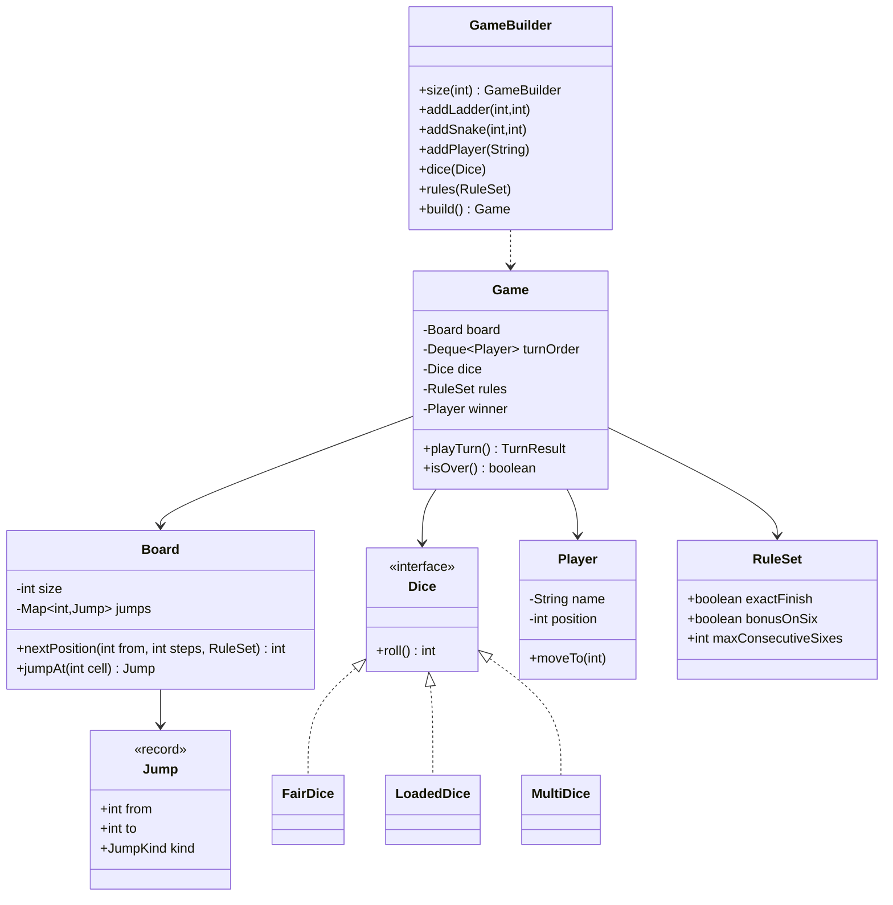

# Design Snake and Ladder

**Date:** 2026-05-02 | **Updated:** 2026-05-02
**Tags:** `low-level-design` `case-study` `games` `strategy` `builder`
## Summary

Snake and Ladder is a turn-based race game: each player rolls a die and advances along a numbered board where ladders shortcut upward and snakes slide downward. The interesting LLD bits are not the gameplay but the modeling — board built from immutable `Jump` objects, dice as a swappable strategy (fair, loaded, multi-die), and rules (exact-finish, bonus-on-six, jump-chains) injected via configuration so the same engine handles regional variants.

## Table of Contents

1. [Requirements](#requirements)
2. [Entities and Relationships](#entities-and-relationships)
3. [Class Skeletons](#class-skeletons)
4. [Key Algorithms](#key-algorithms)
5. [Patterns Used](#patterns-used)
6. [Concurrency Considerations](#concurrency-considerations)
7. [Trade-offs and Extensions](#trade-offs-and-extensions)
8. [Related](#related)
9. [References](#references)

## Requirements

### Functional

- Configurable board size (default 100 cells, indexed 1..N).
- Place any number of snakes and ladders, each defined by a `from -> to` jump.
- Two or more players take turns in fixed order.
- Each turn rolls one or more dice; the player advances by the sum.
- If the landing cell is the head of a snake or foot of a ladder, follow the jump (and chain follow-ups if rules allow).
- First player to land exactly on cell N wins. Optional "must roll exact" rule: overshoot keeps you in place.
- Optional "bonus turn on six" rule.

### Non-Functional

- Validate board on construction: jumps must be in-bounds, no jump from/to the start or finish, no two jumps from the same cell.
- Engine must be deterministic when given a seeded RNG (testability).
- Pluggable dice for fair-vs-loaded testing without conditionals in the engine.
- Game logic UI-agnostic.

## Entities and Relationships



## Class Skeletons

```java
public enum JumpKind { LADDER, SNAKE }

public record Jump(int from, int to, JumpKind kind) {
    public Jump {
        if (from == to) throw new IllegalArgumentException("from == to");
        if (kind == JumpKind.LADDER && to <= from) {
            throw new IllegalArgumentException("ladder must go up");
        }
        if (kind == JumpKind.SNAKE && to >= from) {
            throw new IllegalArgumentException("snake must go down");
        }
    }
}
```

```java
public final class Board {
    private final int size;
    private final Map<Integer, Jump> jumps;

    public Board(int size, List<Jump> jumpList) {
        if (size < 10) throw new IllegalArgumentException("size too small");
        Map<Integer, Jump> map = new HashMap<>();
        for (Jump j : jumpList) {
            if (j.from() <= 1 || j.from() >= size) {
                throw new IllegalArgumentException("jump from out of range");
            }
            if (j.to() < 1 || j.to() > size) {
                throw new IllegalArgumentException("jump to out of range");
            }
            if (map.put(j.from(), j) != null) {
                throw new IllegalArgumentException("two jumps from cell " + j.from());
            }
        }
        this.size = size;
        this.jumps = Map.copyOf(map);
    }

    public int size() { return size; }

    public Jump jumpAt(int cell) { return jumps.get(cell); }

    public int resolve(int landing) {
        int cur = landing;
        // Allow chaining: ladder ending at a snake head, etc. Most rule sets disallow.
        Set<Integer> visited = new HashSet<>();
        while (jumps.containsKey(cur) && visited.add(cur)) {
            cur = jumps.get(cur).to();
        }
        return cur;
    }
}
```

```java
public interface Dice {
    int roll();
}

public final class FairDice implements Dice {
    private final int faces;
    private final int count;
    private final Random rng;
    public FairDice(int faces, int count, Random rng) {
        this.faces = faces; this.count = count; this.rng = rng;
    }
    @Override public int roll() {
        int sum = 0;
        for (int i = 0; i < count; i++) sum += 1 + rng.nextInt(faces);
        return sum;
    }
}

public final class LoadedDice implements Dice {
    private final int[] sequence;
    private int idx;
    public LoadedDice(int... sequence) { this.sequence = sequence; }
    @Override public int roll() {
        int v = sequence[idx % sequence.length];
        idx++;
        return v;
    }
}
```

```java
public final class Player {
    private final String name;
    private int position = 0; // 0 means "not yet on the board"
    public Player(String name) { this.name = name; }
    public String name() { return name; }
    public int position() { return position; }
    void moveTo(int cell) { this.position = cell; }
}

public record RuleSet(
    boolean exactFinish,
    boolean bonusOnSix,
    int maxConsecutiveSixes
) {
    public static RuleSet standard() {
        return new RuleSet(true, true, 3);
    }
}
```

```java
public final class Game {
    private final Board board;
    private final Deque<Player> queue;
    private final Dice dice;
    private final RuleSet rules;
    private Player winner;

    public Game(Board board, List<Player> players, Dice dice, RuleSet rules) {
        this.board = board;
        this.queue = new ArrayDeque<>(players);
        this.dice = dice;
        this.rules = rules;
    }

    public boolean isOver() { return winner != null; }
    public Player winner() { return winner; }

    public TurnResult playTurn() {
        if (isOver()) throw new IllegalStateException("game over");
        Player p = queue.pollFirst();
        List<Integer> rolls = new ArrayList<>();
        int sixes = 0;
        boolean rollAgain;
        do {
            int roll = dice.roll();
            rolls.add(roll);
            int target = p.position() + roll;
            if (target > board.size()) {
                if (rules.exactFinish()) {
                    // overshoot — stay
                } else {
                    p.moveTo(board.size());
                }
            } else {
                p.moveTo(board.resolve(target));
            }
            if (p.position() == board.size()) {
                winner = p;
                return new TurnResult(p, rolls, true);
            }
            boolean isSix = roll == 6;
            if (isSix) sixes++;
            rollAgain = rules.bonusOnSix() && isSix && sixes < rules.maxConsecutiveSixes();
        } while (rollAgain);
        queue.addLast(p);
        return new TurnResult(p, rolls, false);
    }
}

public record TurnResult(Player player, List<Integer> rolls, boolean won) {}
```

```java
public final class GameBuilder {
    private int size = 100;
    private final List<Jump> jumps = new ArrayList<>();
    private final List<String> playerNames = new ArrayList<>();
    private Dice dice = new FairDice(6, 1, new Random());
    private RuleSet rules = RuleSet.standard();

    public GameBuilder size(int s) { this.size = s; return this; }
    public GameBuilder addLadder(int from, int to) {
        jumps.add(new Jump(from, to, JumpKind.LADDER)); return this;
    }
    public GameBuilder addSnake(int from, int to) {
        jumps.add(new Jump(from, to, JumpKind.SNAKE)); return this;
    }
    public GameBuilder addPlayer(String name) {
        playerNames.add(name); return this;
    }
    public GameBuilder dice(Dice d) { this.dice = d; return this; }
    public GameBuilder rules(RuleSet r) { this.rules = r; return this; }

    public Game build() {
        if (playerNames.size() < 2) throw new IllegalStateException(">=2 players");
        Board board = new Board(size, jumps);
        List<Player> players = playerNames.stream().map(Player::new).toList();
        return new Game(board, players, dice, rules);
    }
}
```

## Key Algorithms

### Turn Resolution

Single roll, advance candidate, apply rules:

1. Roll dice -> `r`.
2. `target = position + r`.
3. If `target > N`:
   - If `exactFinish` -> stay.
   - Else -> clamp to `N`.
4. Else `position = board.resolve(target)`.
5. If `position == N` -> set winner.
6. If roll was a six and `bonusOnSix` and consecutive sixes < cap -> roll again.
7. Otherwise, move to back of queue.

### Jump Resolution (Chain Safe)

Chained jumps (a ladder lands on a snake head) are an edge case some rule sets allow. The `Board.resolve` loop iterates `jumps.get(cur)` while tracking visited cells to defend against malformed cyclic configurations. Cycles are impossible in well-formed boards (ladders always go up, snakes always go down) but the guard is cheap insurance.

### Shortest-Path Diagnostic (BFS)

A useful sanity check on a board: the minimum number of turns to reach `N` from `1` assuming you can choose any roll in `[1, faces]`. Run BFS over cells; this exposes pathological boards (unreachable finishes, trivially short paths).

```java
public static int minTurns(Board b, int faces) {
    int n = b.size();
    int[] dist = new int[n + 1];
    Arrays.fill(dist, -1);
    dist[1] = 0;
    Deque<Integer> q = new ArrayDeque<>();
    q.add(1);
    while (!q.isEmpty()) {
        int cur = q.poll();
        if (cur == n) return dist[cur];
        for (int r = 1; r <= faces; r++) {
            int nxt = cur + r;
            if (nxt > n) continue;
            nxt = b.resolve(nxt);
            if (dist[nxt] == -1) {
                dist[nxt] = dist[cur] + 1;
                q.add(nxt);
            }
        }
    }
    return -1;
}
```

## Patterns Used

- **Strategy** — `Dice` interface with `FairDice`, `LoadedDice`, `MultiDice`. The engine never branches on dice type; tests inject a deterministic sequence.
- **Builder** — `GameBuilder` makes setup readable: `size`, `addLadder`, `addPlayer`, `dice`, `rules`. Good fit because the game has many optional configuration knobs.
- **Value Object** — `Jump`, `RuleSet`, `TurnResult` are records: immutable, self-validating.
- **Repository (light)** — `Board.jumps` is a `Map<Integer, Jump>`, encapsulating jump lookup behind `jumpAt(cell)`.
- **Open/Closed (SOLID)** — Adding a "double on the last roll" variant means adding a flag to `RuleSet` and a branch in `playTurn`, never modifying core types.

## Concurrency Considerations

- One game per thread is the natural model; the queue and `Player.position` mutate during a turn.
- For a multiplayer server hosting many concurrent boards, isolate each `Game` in its own actor / single-threaded executor and keep a per-game lock for `playTurn`.
- `Dice` instances must not be shared across games unless they are stateless (e.g., a stateless `FairDice` backed by `ThreadLocalRandom`); `LoadedDice` carries state and must not be shared.
- Determinism: pass an explicit `Random(seed)` into `FairDice` rather than `new Random()`; this lets tests replay exact sessions.

## Trade-offs and Extensions

- **Variable board topology** — Replace `Map<Integer, Jump>` with an adjacency list to support arbitrary teleport graphs (e.g., wormholes that consume a turn).
- **Power-ups** — Add a `CellEffect` interface (`SkipNextTurn`, `RollAgain`, `Swap`). `Board.resolve` evolves into "apply effect chain at landing".
- **Ranking instead of single-winner** — Track finish order so 4-player games yield 1st/2nd/3rd/4th.
- **Persistence** — `TurnResult` log is the event source; replaying it from a `Random(seed)` reconstructs full state.
- **Networked play** — Each `playTurn()` call is a command boundary. Sign the seed and `TurnResult` so clients can verify the server's RNG (anti-cheat).
- **GUI / animations** — Emit a sequence of intermediate positions during a turn (each step) instead of just the final cell, so a UI can animate piece movement.

## Related

- [Design Tic-Tac-Toe](design-tic-tac-toe.md) — turn-based two-player engine with state pattern.
- [Design Minesweeper](design-minesweeper.md) — grid model with cell state machine.
- [Design Chess](design-chess.md) — much richer rules engine with piece strategies.
- [Strategy Pattern](../../design-patterns/behavioral/strategy.md)
- [Builder Pattern](../../design-patterns/creational/builder.md)
- [State Pattern](../../design-patterns/behavioral/state.md)
- [UML Class Diagram Cheat Sheet](../../uml/class-diagram.md)

## References

- Snake and Ladder (also Snakes and Ladders, originally Moksha Patam): two or more players race from cell 1 to cell N (typically 100), advancing by die rolls; ladders move pieces up, snakes move them down.
- Common rule variants: exact-finish on the last cell, an extra turn for rolling a six, capped at three consecutive sixes (otherwise the player forfeits the turn), bouncing back on overshoot.
- Mathematical view: the game is a Markov chain on cell positions; expected number of turns to finish is computable from the transition matrix.
