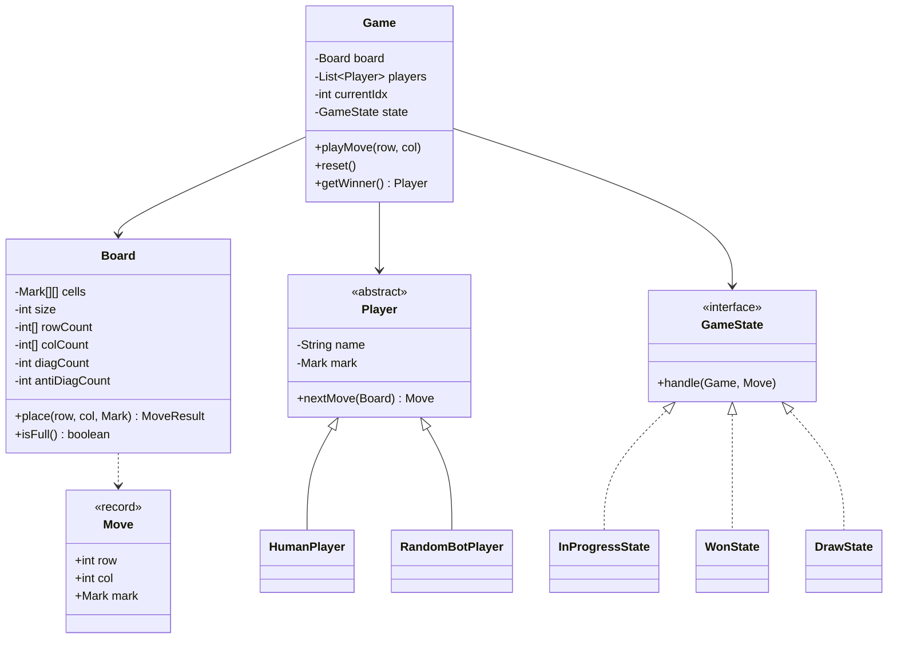

# Design Tic-Tac-Toe

**Date:** 2026-05-02 | **Updated:** 2026-05-02
**Tags:** `low-level-design` `case-study` `games` `state-pattern` `strategy-pattern`

## Summary

Tic-Tac-Toe is a two-player, perfect-information game played on a 3x3 grid where each player alternately places their mark (`X` or `O`) and the first to align three in a row, column, or diagonal wins. The LLD focuses on a clean separation between the board model, player abstraction, win-detection algorithm, and a state machine that drives game phases. The same skeleton extends to NxN boards (Gomoku-style) without changes to the core logic.

## Table of Contents

1. [Requirements](#requirements)
2. [Entities and Relationships](#entities-and-relationships)
3. [Class Skeletons](#class-skeletons)
4. [Key Algorithms](#key-algorithms)
5. [Patterns Used](#patterns-used)
6. [Concurrency Considerations](#concurrency-considerations)
7. [Trade-offs and Extensions](#trade-offs-and-extensions)
8. [Related](#related)
9. [References](#references)

## Requirements

### Functional

- Support two players who alternate turns; first move belongs to `X` by convention.
- Render a 3x3 board (extensible to NxN) where each cell is empty, `X`, or `O`.
- Validate moves: cell must be in-bounds and currently empty.
- Detect a win when a player aligns three (or N) marks in any row, column, or diagonal.
- Detect a draw when the board is full and no one has won.
- Allow restarting a finished match without re-allocating long-lived components.

### Non-Functional

- Move validation and win detection must be O(N) per move, not O(N^2).
- The game core must be UI-agnostic so a CLI loop, GUI, or AI can drive it.
- Immutable move records make undo/replay trivial later.
- Small, dependency-free Java code suitable for an interview.

## Entities and Relationships



## Class Skeletons

```java
public enum Mark {
    EMPTY, X, O;
}

public record Move(int row, int col, Mark mark) {}

public record MoveResult(boolean win, boolean draw) {}

public final class Board {
    private final int size;
    private final int winLength;
    private final Mark[][] cells;
    private int filled;

    public Board(int size, int winLength) {
        if (winLength > size) {
            throw new IllegalArgumentException("winLength must be <= size");
        }
        this.size = size;
        this.winLength = winLength;
        this.cells = new Mark[size][size];
        for (Mark[] row : cells) Arrays.fill(row, Mark.EMPTY);
    }

    public MoveResult place(int r, int c, Mark mark) {
        if (r < 0 || r >= size || c < 0 || c >= size) {
            throw new IllegalArgumentException("out of bounds");
        }
        if (cells[r][c] != Mark.EMPTY) {
            throw new IllegalStateException("cell occupied");
        }
        cells[r][c] = mark;
        filled++;
        boolean win = WinDetector.detect(cells, r, c, mark, winLength);
        boolean draw = !win && filled == size * size;
        return new MoveResult(win, draw);
    }

    public Mark at(int r, int c) { return cells[r][c]; }
    public int size() { return size; }
    public boolean isFull() { return filled == size * size; }
}
```

```java
public abstract class Player {
    protected final String name;
    protected final Mark mark;
    protected Player(String name, Mark mark) {
        this.name = name;
        this.mark = mark;
    }
    public abstract Move nextMove(Board board);
    public Mark mark() { return mark; }
    public String name() { return name; }
}

public final class HumanPlayer extends Player {
    private final Supplier<int[]> input;
    public HumanPlayer(String name, Mark mark, Supplier<int[]> input) {
        super(name, mark);
        this.input = input;
    }
    @Override public Move nextMove(Board board) {
        int[] rc = input.get();
        return new Move(rc[0], rc[1], mark);
    }
}
```

```java
public interface GameState {
    void handle(Game game, Move move);
    boolean isTerminal();
}

public final class InProgressState implements GameState {
    @Override public void handle(Game game, Move move) {
        MoveResult r = game.board().place(move.row(), move.col(), move.mark());
        if (r.win()) game.transitionTo(new WonState(move.mark()));
        else if (r.draw()) game.transitionTo(new DrawState());
        else game.advanceTurn();
    }
    @Override public boolean isTerminal() { return false; }
}

public final class WonState implements GameState {
    private final Mark winner;
    public WonState(Mark winner) { this.winner = winner; }
    public Mark winner() { return winner; }
    @Override public void handle(Game game, Move move) {
        throw new IllegalStateException("game over");
    }
    @Override public boolean isTerminal() { return true; }
}

public final class DrawState implements GameState {
    @Override public void handle(Game game, Move move) {
        throw new IllegalStateException("game over");
    }
    @Override public boolean isTerminal() { return true; }
}
```

```java
public final class Game {
    private final Board board;
    private final List<Player> players;
    private int currentIdx;
    private GameState state;

    public Game(Board board, List<Player> players) {
        this.board = board;
        this.players = List.copyOf(players);
        this.currentIdx = 0;
        this.state = new InProgressState();
    }

    public Player currentPlayer() { return players.get(currentIdx); }
    public Board board() { return board; }
    public GameState state() { return state; }

    public void playMove(Move move) {
        if (move.mark() != currentPlayer().mark()) {
            throw new IllegalStateException("wrong player");
        }
        state.handle(this, move);
    }

    void advanceTurn() {
        currentIdx = (currentIdx + 1) % players.size();
    }

    void transitionTo(GameState next) {
        this.state = next;
    }
}
```

## Key Algorithms

### Win Detection (Incremental)

Naively rescanning the entire board after every move is O(N^2). The trick is that a new mark at `(r, c)` can only complete a line that passes through `(r, c)`. Therefore, only four directions matter: row, column, main diagonal, anti-diagonal. Walk outward from `(r, c)` in both senses of each axis until you hit a non-matching cell or a boundary, and sum the runs.

```java
final class WinDetector {
    private static final int[][] DIRS = {
        {0, 1}, {1, 0}, {1, 1}, {1, -1}
    };

    static boolean detect(Mark[][] cells, int r, int c, Mark m, int winLen) {
        int n = cells.length;
        for (int[] d : DIRS) {
            int count = 1
                + countDir(cells, r, c, d[0], d[1], m, n)
                + countDir(cells, r, c, -d[0], -d[1], m, n);
            if (count >= winLen) return true;
        }
        return false;
    }

    private static int countDir(
        Mark[][] cells, int r, int c, int dr, int dc, Mark m, int n
    ) {
        int count = 0;
        int rr = r + dr, cc = c + dc;
        while (rr >= 0 && rr < n && cc >= 0 && cc < n && cells[rr][cc] == m) {
            count++;
            rr += dr;
            cc += dc;
        }
        return count;
    }
}
```

For 3x3 specifically, a counter-based approach works in O(1) per move: keep `rowCount[r]`, `colCount[c]`, `diagCount`, `antiDiagCount` per player and bump on each move; a win is when any counter reaches 3. Choose based on whether `winLength == size`.

### CLI Loop

```java
public static void main(String[] args) {
    Board board = new Board(3, 3);
    Scanner sc = new Scanner(System.in);
    Supplier<int[]> in = () -> {
        System.out.print("row col: ");
        return new int[]{sc.nextInt(), sc.nextInt()};
    };
    Game game = new Game(board, List.of(
        new HumanPlayer("Alice", Mark.X, in),
        new HumanPlayer("Bob",   Mark.O, in)
    ));
    while (!game.state().isTerminal()) {
        Renderer.draw(board);
        Player p = game.currentPlayer();
        System.out.println(p.name() + " (" + p.mark() + ")");
        try { game.playMove(p.nextMove(board)); }
        catch (RuntimeException e) { System.out.println(e.getMessage()); }
    }
    Renderer.draw(board);
    if (game.state() instanceof WonState w) {
        System.out.println("winner: " + w.winner());
    } else {
        System.out.println("draw");
    }
}
```

## Patterns Used

- **State** — `GameState` (`InProgressState`, `WonState`, `DrawState`) localizes phase-specific behavior. `Game.playMove` delegates instead of branching on enums, and adding a `PausedState` later costs one class.
- **Strategy** — `Player.nextMove` is a strategy hook. `HumanPlayer`, `RandomBotPlayer`, and a future `MinimaxPlayer` plug in without touching `Game`.
- **Template Method (light)** — `Player` fixes the lifecycle (mark, name) while subclasses fill in move selection.
- **Value Object** — `Move` and `MoveResult` are records: immutable, easy to log, easy to replay.
- **Factory (implicit)** — `Game` constructor wires board + players; a `GameBuilder` would help once configuration grows.

## Concurrency Considerations

Tic-Tac-Toe is single-threaded by nature. Worth noting anyway:

- `Board` is not thread-safe. If two threads ever called `place` concurrently, the `cells[r][c] != EMPTY` check and the assignment race. For a server-side multiplayer service, wrap each game in a single-threaded actor or synchronize per-game.
- The state transitions in `Game` rely on monotonic progression. If a network client retries a move, idempotency keys per `Move` prevent double-application.
- An AI opponent may compute moves on a worker thread, but the result must be applied back on the game's owning thread.

## Trade-offs and Extensions

- **NxN with K-in-a-row** — Already supported via `winLength` parameter. The directional `WinDetector` algorithm scales without change.
- **Undo / replay** — Keep a `Deque<Move>` of applied moves. Undo pops, clears the cell, reverts state. Replay is just iteration.
- **AI opponent** — Minimax with alpha-beta is trivial on 3x3 (game tree fits in memory). For larger boards, layer in a transposition table.
- **Networked play** — Promote `Move` to a serializable command and run `Game` behind a queue per match. Use the `MoveResult` to broadcast deltas.
- **Counter-based detector** — Swap `WinDetector` for the O(1) counter approach when `winLength == size`. Both implementations conform to the same internal contract.
- **Spectators** — Add an `Observer` list on `Game` that fires `onMoveApplied` and `onStateChanged` events.

## Related

- [Design Snake and Ladder](design-snake-and-ladder.md) — turn-based loop, dice strategy, and configurable board.
- [Design Minesweeper](design-minesweeper.md) — grid + cell state machine, observer pattern.
- [Design Chess](design-chess.md) — piece-strategy hierarchy, complex move validation, check/checkmate.
- [State Pattern](../../design-patterns/behavioral/state.md)
- [Strategy Pattern](../../design-patterns/behavioral/strategy.md)
- [Template Method Pattern](../../design-patterns/behavioral/template-method.md)
- [UML Class Diagram Cheat Sheet](../../uml/class-diagram.md)

## References

- Standard rules of Tic-Tac-Toe (also called Noughts and Crosses): two players, 3x3 grid, alternate placement, three in a row wins, full board with no winner is a draw.
- Game-theoretic property: Tic-Tac-Toe is a solved game; with perfect play, it is always a draw.
- Generalization to NxN with K-in-a-row is known as the m,n,k-game family in combinatorial game theory.
