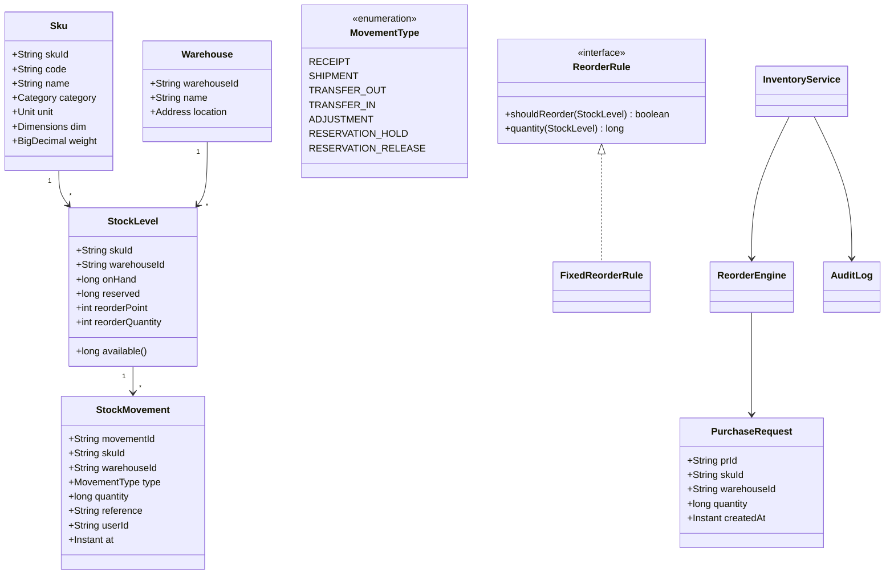

# Design Inventory Management System

**Date:** 2026-05-02 | **Updated:** 2026-05-02
**Tags:** `low-level-design` `case-study` `management` `inventory` `audit-log`

## Summary

An inventory management system tracks SKUs (stock-keeping units) across multiple warehouses, records every quantity change as an immutable movement, exposes available-to-promise quantities, triggers reorder when stock drops below a threshold, and keeps a full audit trail. The interesting LLD problems are: (1) modelling stock as the result of a movement ledger rather than mutable counters, (2) designing a reorder rule engine that does not slow the hot write path, (3) cross-warehouse transfers, and (4) reservations that hide quantity from other concurrent buyers without permanently committing it.

## Table of Contents

- [Requirements (Functional + Non-Functional)](#requirements-functional--non-functional)
- [Entities and Relationships](#entities-and-relationships)
- [Class Skeletons (Java)](#class-skeletons-java)
- [Key Algorithms / Workflows](#key-algorithms--workflows)
- [Patterns Used (with reason)](#patterns-used-with-reason)
- [Concurrency Considerations](#concurrency-considerations)
- [Trade-offs and Extensions](#trade-offs-and-extensions)
- [Related](#related)
- [References](#references)

## Requirements (Functional + Non-Functional)

### Functional

- Catalog of SKUs with attributes (name, category, unit, dimensions, weight).
- Multiple warehouses; each SKU can be stocked in any subset of them.
- Movement types: `RECEIPT` (inbound from supplier), `SHIPMENT` (outbound to customer), `TRANSFER_OUT` / `TRANSFER_IN` (between warehouses), `ADJUSTMENT` (cycle count), `RESERVATION_HOLD`, `RESERVATION_RELEASE`.
- Per-SKU per-warehouse: on-hand, reserved, available = on-hand − reserved.
- Reorder rule: when `available <= reorderPoint`, raise a purchase request to a default supplier with `reorderQuantity`.
- Audit log: every movement records who, when, why, and references (PO id, shipment id).
- Search by SKU code, barcode, name; filter by warehouse and stock band.

### Non-Functional

- Quantity reads must be consistent within a single warehouse (read-your-writes).
- Movements are append-only; never UPDATE a movement record.
- Throughput: at peak, 1000 movements/sec per warehouse.
- A movement that violates a constraint (e.g. negative on-hand) must fail _before_ being logged, not after.

## Entities and Relationships



## Class Skeletons (Java)

```java
public enum MovementType {
    RECEIPT, SHIPMENT, TRANSFER_OUT, TRANSFER_IN,
    ADJUSTMENT, RESERVATION_HOLD, RESERVATION_RELEASE
}

public final class Sku {
    private final String skuId;
    private final String code;
    private final String name;
    private final Category category;
    private final Unit unit;
    public Sku(String id, String code, String name, Category cat, Unit u) {
        this.skuId = id; this.code = code; this.name = name;
        this.category = cat; this.unit = u;
    }
}

public final class StockLevel {
    private final String skuId;
    private final String warehouseId;
    private long onHand;
    private long reserved;
    private final int reorderPoint;
    private final int reorderQuantity;

    public StockLevel(String sku, String wh, int rp, int rq) {
        this.skuId = sku; this.warehouseId = wh;
        this.reorderPoint = rp; this.reorderQuantity = rq;
    }
    public long available() { return onHand - reserved; }
    public long onHand()    { return onHand; }
    public long reserved()  { return reserved; }
    public int reorderPoint()    { return reorderPoint; }
    public int reorderQuantity() { return reorderQuantity; }

    void apply(StockMovement m) {
        switch (m.type()) {
            case RECEIPT, TRANSFER_IN -> onHand += m.quantity();
            case SHIPMENT, TRANSFER_OUT -> {
                if (m.quantity() > onHand - reserved)
                    throw new InsufficientStockException(skuId, warehouseId);
                onHand -= m.quantity();
            }
            case ADJUSTMENT -> {
                long next = onHand + m.quantity();
                if (next < reserved)
                    throw new InsufficientStockException(skuId, warehouseId);
                onHand = next;
            }
            case RESERVATION_HOLD -> {
                if (m.quantity() > onHand - reserved)
                    throw new InsufficientStockException(skuId, warehouseId);
                reserved += m.quantity();
            }
            case RESERVATION_RELEASE -> {
                if (m.quantity() > reserved)
                    throw new IllegalStateException("over-release");
                reserved -= m.quantity();
            }
        }
    }
}

public record StockMovement(
        String movementId,
        String skuId,
        String warehouseId,
        MovementType type,
        long quantity,
        String reference,
        String userId,
        Instant at) { }

public interface ReorderRule {
    boolean shouldReorder(StockLevel level);
    long quantity(StockLevel level);
}

public final class FixedReorderRule implements ReorderRule {
    @Override public boolean shouldReorder(StockLevel l) {
        return l.available() <= l.reorderPoint();
    }
    @Override public long quantity(StockLevel l) {
        return l.reorderQuantity();
    }
}

public interface AuditLog {
    void append(StockMovement m);
    Stream<StockMovement> readByKey(String skuId, String warehouseId);
}

public final class InventoryService {
    private final Map<String, StockLevel> levels = new ConcurrentHashMap<>();
    private final AuditLog audit;
    private final ReorderEngine reorderEngine;
    private final Map<String, ReentrantLock> keyLocks = new ConcurrentHashMap<>();

    public InventoryService(AuditLog audit, ReorderEngine eng) {
        this.audit = audit; this.reorderEngine = eng;
    }

    public void record(StockMovement m) {
        String key = key(m.skuId(), m.warehouseId());
        ReentrantLock lock = keyLocks.computeIfAbsent(key, k -> new ReentrantLock());
        lock.lock();
        try {
            StockLevel level = levels.computeIfAbsent(key,
                k -> new StockLevel(m.skuId(), m.warehouseId(), 0, 0));
            level.apply(m);            // throws if it would violate a constraint
            audit.append(m);           // only appended when apply() succeeded
            reorderEngine.consider(level);
        } finally {
            lock.unlock();
        }
    }

    public void transfer(String skuId, String fromWh, String toWh,
                         long qty, String userId, String ref) {
        // movements within one transfer must succeed atomically.
        // simple variant: log a TRANSFER_OUT then TRANSFER_IN.
        // robust variant: 2-phase or saga across two services.
        String fromKey = key(skuId, fromWh);
        String toKey   = key(skuId, toWh);
        // lock in deterministic order to avoid deadlock
        String firstKey  = fromKey.compareTo(toKey) <= 0 ? fromKey : toKey;
        String secondKey = fromKey.equals(firstKey) ? toKey : fromKey;
        ReentrantLock l1 = keyLocks.computeIfAbsent(firstKey,  k -> new ReentrantLock());
        ReentrantLock l2 = keyLocks.computeIfAbsent(secondKey, k -> new ReentrantLock());
        l1.lock();
        try {
            l2.lock();
            try {
                Instant now = Instant.now();
                String txId = UUID.randomUUID().toString();
                record(new StockMovement(UUID.randomUUID().toString(),
                       skuId, fromWh, MovementType.TRANSFER_OUT, qty, "tx:" + txId, userId, now));
                record(new StockMovement(UUID.randomUUID().toString(),
                       skuId, toWh, MovementType.TRANSFER_IN, qty, "tx:" + txId, userId, now));
            } finally { l2.unlock(); }
        } finally { l1.unlock(); }
    }

    private static String key(String skuId, String wh) { return skuId + "@" + wh; }
}

public final class ReorderEngine {
    private final ReorderRule rule;
    private final PurchaseRequestRepository repo;
    private final SupplierRouter router;
    public ReorderEngine(ReorderRule r, PurchaseRequestRepository repo, SupplierRouter sr) {
        this.rule = r; this.repo = repo; this.router = sr;
    }
    public void consider(StockLevel l) {
        if (!rule.shouldReorder(l)) return;
        if (repo.openRequestExists(l)) return;     // dedupe
        long qty = rule.quantity(l);
        PurchaseRequest pr = new PurchaseRequest(UUID.randomUUID().toString(),
                l.skuId(), l.warehouseId(), qty, Instant.now());
        router.routeToSupplier(pr);
        repo.save(pr);
    }
}
```

## Key Algorithms / Workflows

### Movement is the source of truth

Stock counters are a _fold over_ movements. To recover a corrupted in-memory `StockLevel`, replay the movement log filtered by `(skuId, warehouseId)` and apply each in `at`-order. This makes the system auditable and lets us run the same fold for "stock at time T" reports.

### Reservation lifecycle

```mermaid
sequenceDiagram
    participant C as Cart
    participant I as InventoryService
    participant L as StockLevel
    participant O as Order
    C->>I: hold(sku, qty=2) [RESERVATION_HOLD]
    I->>L: reserved += 2
    Note over L: available = onHand - reserved
    alt order placed within TTL
        O->>I: ship() [RESERVATION_RELEASE then SHIPMENT]
        I->>L: reserved -= 2; onHand -= 2
    else cart abandoned
        I->>L: RESERVATION_RELEASE; reserved -= 2
    end
```

A reservation TTL is enforced by a sweeper job that releases any hold older than its lifetime.

### Reorder check on the hot path

`ReorderEngine.consider` runs inline after every movement. To keep it cheap:

1. The rule is a pure check on the cached `StockLevel`.
2. The "is there already an open PR?" check uses a per-key index in `PurchaseRequestRepository` (in-memory `ConcurrentHashMap`).
3. The actual supplier API call is fired off-thread; only the PR record is written synchronously.

### Cross-warehouse transfer

Two movements (`TRANSFER_OUT` from source, `TRANSFER_IN` at destination) sharing a transaction id (`tx:<uuid>`). We acquire both per-key locks in deterministic order to prevent deadlock when two transfers cross. For multi-process deployments, use a saga: emit `TRANSFER_OUT` first, then a downstream consumer applies `TRANSFER_IN`; on failure, emit a compensating `TRANSFER_IN` back.

## Patterns Used (with reason)

| Pattern | Where | Why |
|---------|-------|-----|
| Event sourcing (lite) | `StockMovement` ledger | Stock is derived from movements; full audit for free. |
| Strategy | `ReorderRule` | Different SKUs use different reorder math (fixed, EOQ, forecast-driven). |
| Repository | `AuditLog`, `PurchaseRequestRepository` | Storage hidden from domain logic. |
| Specification | Search filters | Compose by-warehouse, by-stock-band predicates. |
| Observer / Pub-Sub | New PR emits `PurchaseRequestCreated` to procurement | Other systems react without coupling. |
| Command | `StockMovement` _is_ the command and the record | One artifact for both authorisation and audit. |

## Concurrency Considerations

- **Per-key locking**: `(skuId, warehouseId)` is the natural unit of contention. Use a `ConcurrentHashMap<String, ReentrantLock>`; never a global lock — that would serialise all warehouses.
- **Deadlock avoidance**: `transfer` acquires locks in deterministic order (lexicographic on key).
- **Negative stock**: `StockLevel.apply` validates _before_ mutating. Combined with the per-key lock, two concurrent shipments that would jointly drain stock cannot both succeed.
- **Audit append**: append after a successful in-memory apply. If audit append fails, the in-memory state must be rolled back (or the process must crash, since the on-disk truth is the only durable one).
- **Reorder dedupe**: `openRequestExists` check inside the same per-key lock prevents duplicate POs from racing movements.

## Trade-offs and Extensions

- **Lot / batch tracking**: extend `StockMovement` with a `lotId`. Useful for FIFO/FEFO picking and recalls.
- **Serial numbers**: a serialised SKU has `quantity = 1` per movement and a `serial` field; on-hand is the count of serials on hand.
- **EOQ reorder**: `EconomicOrderQuantityRule implements ReorderRule` — needs demand stats and supplier lead time.
- **Forecast-driven reorder**: ML model output feeds a `ForecastReorderRule`. Same interface, different brain.
- **Multi-tenancy**: prepend `tenantId` to the key. All locks, indexes, and the audit log become tenant-scoped.
- **Snapshotting**: replaying movements gets slow over years. Periodic snapshot per `(skuId, warehouseId)` lets recovery start from the last snapshot and replay only deltas.
- **Idempotency**: every movement carries a `movementId` provided by the caller. Re-submitting the same id is a no-op — important when the producer (e.g. a kiosk) retries on timeout.

## Related

- [Design Parking Lot](design-parking-lot.md)
- [Design Task Management System](design-task-management-system.md)
- [Design Library Management System](design-library-management-system.md)
- [Design Restaurant Management System](design-restaurant-management-system.md)
- [Strategy pattern](../../design-patterns/behavioral/strategy.md)
- [Observer pattern](../../design-patterns/behavioral/observer.md)
- [Command pattern](../../design-patterns/behavioral/command.md)
- [Builder pattern](../../design-patterns/creational/builder.md)
- [Decorator pattern](../../design-patterns/structural/decorator.md)

## References

- Erich Gamma et al., _Design Patterns: Elements of Reusable Object-Oriented Software_, Addison-Wesley, 1994.
- Vaughn Vernon, _Implementing Domain-Driven Design_, Addison-Wesley, 2013.
- Martin Fowler, _Patterns of Enterprise Application Architecture_, Addison-Wesley, 2002.
- Martin Kleppmann, _Designing Data-Intensive Applications_, O'Reilly, 2017.
