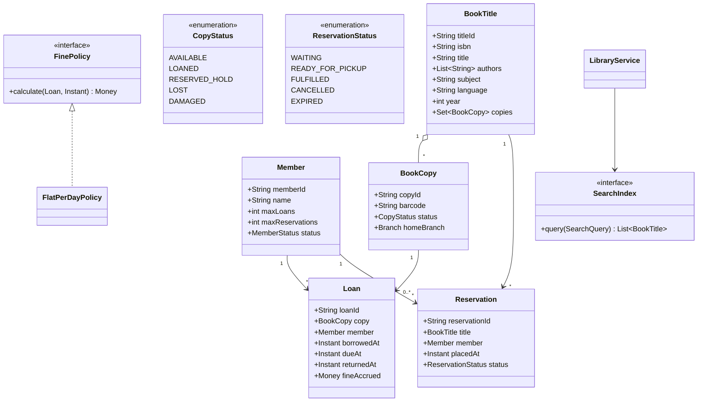
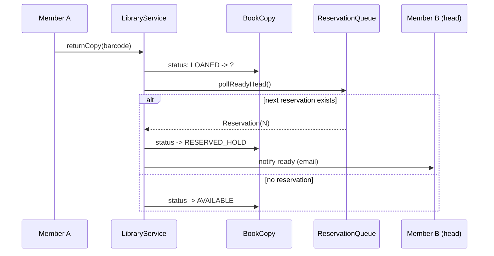

# Design Library Management System

**Date:** 2026-05-02 | **Updated:** 2026-05-02
**Tags:** `low-level-design` `case-study` `management` `library` `reservation`

## Summary

A library management system keeps a catalog of titles, tracks individual physical copies, lets members borrow and return them, computes due dates and fines, and lets members reserve a title that is currently checked out. The interesting LLD problems are: (1) the title-versus-copy distinction (one title, many copies; loans attach to copies), (2) the reservation queue and how it converts to a loan when a copy returns, (3) due-date arithmetic with grace periods and fine accrual, and (4) search across multiple attributes without coupling the storage backend.

## Table of Contents

- [Requirements (Functional + Non-Functional)](#requirements-functional--non-functional)
- [Entities and Relationships](#entities-and-relationships)
- [Class Skeletons (Java)](#class-skeletons-java)
- [Key Algorithms / Workflows](#key-algorithms--workflows)
- [Patterns Used (with reason)](#patterns-used-with-reason)
- [Concurrency Considerations](#concurrency-considerations)
- [Trade-offs and Extensions](#trade-offs-and-extensions)
- [Related](#related)
- [References](#references)

## Requirements (Functional + Non-Functional)

### Functional

- Catalog of `BookTitle` entries (title, authors, ISBN, subject, language, year).
- Each title has zero or more `BookCopy` entries, each with a unique barcode and a status: `AVAILABLE`, `LOANED`, `RESERVED_HOLD`, `LOST`, `DAMAGED`.
- Members have a card with limits (max concurrent loans, max reservations).
- Borrow: a member checks out an `AVAILABLE` copy; status becomes `LOANED`; a `Loan` is created with a due date.
- Return: copy goes back to `AVAILABLE` (or to the next reservation in queue, see below).
- Renew: extend the due date if no one is waiting for that title.
- Reserve: if all copies of a title are loaned, queue a reservation. When a copy returns, the head of the queue gets a hold (status `RESERVED_HOLD`) for a fixed pickup window.
- Fines: accrue per day past due, capped at a per-loan max.
- Search: by title, author, subject, ISBN. Full-text on title+author.

### Non-Functional

- Borrow/return must be atomic per copy.
- A reservation queue is FIFO with deterministic next-in-line behaviour even under concurrent returns.
- Lookups by barcode and by ISBN must be O(1) average.
- Audit trail of every loan, return, fine, and reservation event.

## Entities and Relationships



## Class Skeletons (Java)

```java
public enum CopyStatus { AVAILABLE, LOANED, RESERVED_HOLD, LOST, DAMAGED }
public enum ReservationStatus { WAITING, READY_FOR_PICKUP, FULFILLED, CANCELLED, EXPIRED }
public enum MemberStatus { ACTIVE, SUSPENDED, EXPIRED }

public final class BookTitle {
    private final String titleId;
    private final String isbn;
    private final String title;
    private final List<String> authors;
    private final String subject;
    private final Set<BookCopy> copies = ConcurrentHashMap.newKeySet();
    public BookTitle(String id, String isbn, String title, List<String> authors, String subject) {
        this.titleId = id; this.isbn = isbn;
        this.title = title; this.authors = List.copyOf(authors); this.subject = subject;
    }
    public String isbn() { return isbn; }
    public String titleId() { return titleId; }
    public Set<BookCopy> copies() { return copies; }
}

public final class BookCopy {
    private final String copyId;
    private final String barcode;
    private final BookTitle title;
    private volatile CopyStatus status = CopyStatus.AVAILABLE;
    public BookCopy(String id, String barcode, BookTitle t) {
        this.copyId = id; this.barcode = barcode; this.title = t;
    }
    public synchronized boolean tryClaim(CopyStatus expected, CopyStatus next) {
        if (status != expected) return false;
        status = next; return true;
    }
    public CopyStatus status() { return status; }
    public BookTitle title() { return title; }
    public String barcode() { return barcode; }
}

public final class Member {
    private final String memberId;
    private final String name;
    private final int maxLoans;
    private final int maxReservations;
    private MemberStatus status = MemberStatus.ACTIVE;
    private final Set<String> activeLoanIds = ConcurrentHashMap.newKeySet();
    private final Set<String> activeReservationIds = ConcurrentHashMap.newKeySet();
    public Member(String id, String name, int maxLoans, int maxRes) {
        this.memberId = id; this.name = name;
        this.maxLoans = maxLoans; this.maxReservations = maxRes;
    }
    public boolean canBorrow() {
        return status == MemberStatus.ACTIVE && activeLoanIds.size() < maxLoans;
    }
    public boolean canReserve() {
        return status == MemberStatus.ACTIVE && activeReservationIds.size() < maxReservations;
    }
}

public final class Loan {
    private final String loanId;
    private final BookCopy copy;
    private final Member member;
    private final Instant borrowedAt;
    private Instant dueAt;
    private Instant returnedAt;
    private Money fineAccrued = Money.ZERO;
    public Loan(String id, BookCopy c, Member m, Instant borrowedAt, Instant dueAt) {
        this.loanId = id; this.copy = c; this.member = m;
        this.borrowedAt = borrowedAt; this.dueAt = dueAt;
    }
    public Instant dueAt() { return dueAt; }
    public void extendDueDate(Instant next) { this.dueAt = next; }
    public void close(Instant t, Money fine) { this.returnedAt = t; this.fineAccrued = fine; }
}

public final class Reservation {
    private final String reservationId;
    private final BookTitle title;
    private final Member member;
    private final Instant placedAt;
    private ReservationStatus status = ReservationStatus.WAITING;
    private Instant readyAt;
    public Reservation(String id, BookTitle t, Member m, Instant at) {
        this.reservationId = id; this.title = t; this.member = m; this.placedAt = at;
    }
    public void markReady(Instant t) { this.status = ReservationStatus.READY_FOR_PICKUP; this.readyAt = t; }
    public void fulfil()  { this.status = ReservationStatus.FULFILLED; }
    public void expire()  { this.status = ReservationStatus.EXPIRED; }
    public ReservationStatus status() { return status; }
}

public interface FinePolicy {
    Money calculate(Loan l, Instant now);
}

public final class FlatPerDayPolicy implements FinePolicy {
    private final Money perDay;
    private final Money cap;
    public FlatPerDayPolicy(Money perDay, Money cap) {
        this.perDay = perDay; this.cap = cap;
    }
    @Override public Money calculate(Loan l, Instant now) {
        if (!now.isAfter(l.dueAt())) return Money.ZERO;
        long daysLate = Duration.between(l.dueAt(), now).toDays();
        return perDay.times(daysLate).min(cap);
    }
}

public final class LibraryService {
    private final Map<String, BookTitle> titlesByIsbn = new ConcurrentHashMap<>();
    private final Map<String, BookCopy> copiesByBarcode = new ConcurrentHashMap<>();
    private final Map<String, Deque<Reservation>> reservationsByTitle = new ConcurrentHashMap<>();
    private final FinePolicy fines;
    private final SearchIndex index;
    private final Duration loanPeriod;
    private final Duration pickupWindow;

    public LibraryService(FinePolicy fines, SearchIndex index, Duration loan, Duration pickup) {
        this.fines = fines; this.index = index;
        this.loanPeriod = loan; this.pickupWindow = pickup;
    }

    public Loan borrow(String memberBarcode, String copyBarcode) {
        Member m = findMember(memberBarcode);
        if (!m.canBorrow()) throw new BorrowDeniedException("limit or status");
        BookCopy copy = copiesByBarcode.get(copyBarcode);
        if (copy == null) throw new IllegalArgumentException("unknown copy");
        // a hold for this member converts cleanly; otherwise must be AVAILABLE
        if (!copy.tryClaim(CopyStatus.AVAILABLE, CopyStatus.LOANED)) {
            if (!isHoldFor(copy, m) || !copy.tryClaim(CopyStatus.RESERVED_HOLD, CopyStatus.LOANED))
                throw new CopyNotAvailableException(copyBarcode);
        }
        Instant now = Instant.now();
        Loan l = new Loan(UUID.randomUUID().toString(), copy, m, now, now.plus(loanPeriod));
        // persist loan, update member, write audit ...
        return l;
    }

    public void returnCopy(String copyBarcode, String loanId) {
        BookCopy copy = copiesByBarcode.get(copyBarcode);
        Loan loan = lookupLoan(loanId);
        Instant now = Instant.now();
        Money fine = fines.calculate(loan, now);
        loan.close(now, fine);
        // hand off to next reservation if any, else AVAILABLE
        Deque<Reservation> q = reservationsByTitle.get(copy.title().titleId());
        Reservation next = pollReadyHead(q);
        if (next != null) {
            copy.tryClaim(CopyStatus.LOANED, CopyStatus.RESERVED_HOLD);
            next.markReady(now);
            scheduleHoldExpiry(next);
        } else {
            copy.tryClaim(CopyStatus.LOANED, CopyStatus.AVAILABLE);
        }
    }

    public Reservation reserve(String memberBarcode, String isbn) {
        Member m = findMember(memberBarcode);
        if (!m.canReserve()) throw new ReservationDeniedException("limit or status");
        BookTitle t = titlesByIsbn.get(isbn);
        if (t == null) throw new IllegalArgumentException("unknown title");
        // reserving when at least one copy is available is silly; convert directly
        if (anyAvailable(t)) throw new IllegalStateException("at least one copy is AVAILABLE; borrow it instead");
        Reservation r = new Reservation(UUID.randomUUID().toString(), t, m, Instant.now());
        reservationsByTitle.computeIfAbsent(t.titleId(), k -> new ConcurrentLinkedDeque<>())
                           .addLast(r);
        return r;
    }

    public Loan renew(String loanId) {
        Loan l = lookupLoan(loanId);
        BookTitle t = l.copy().title();
        Deque<Reservation> q = reservationsByTitle.get(t.titleId());
        if (q != null && !q.isEmpty()) throw new RenewalDeniedException("others waiting");
        l.extendDueDate(l.dueAt().plus(loanPeriod));
        return l;
    }

    private boolean isHoldFor(BookCopy copy, Member m) { /* check the head reservation */ return true; }
    private boolean anyAvailable(BookTitle t) {
        return t.copies().stream().anyMatch(c -> c.status() == CopyStatus.AVAILABLE);
    }
    private Reservation pollReadyHead(Deque<Reservation> q) {
        if (q == null) return null;
        while (true) {
            Reservation head = q.peekFirst();
            if (head == null) return null;
            if (head.status() == ReservationStatus.WAITING) {
                q.pollFirst(); return head;
            }
            q.pollFirst(); // EXPIRED or CANCELLED
        }
    }
    private void scheduleHoldExpiry(Reservation r) { /* timer service */ }
    private Member findMember(String barcode) { /* lookup */ return null; }
    private Loan lookupLoan(String id) { /* lookup */ return null; }
}
```

## Key Algorithms / Workflows

### Reservation queue handover



A hold expires after `pickupWindow`. The expiry job sets the reservation `EXPIRED` and re-runs the same algorithm: hand the copy to the new head, or mark `AVAILABLE`.

### Due-date and fine accrual

- On borrow: `dueAt = now + loanPeriod` (e.g. 14 days).
- Fines accrue per-day past due. The accrual is computed lazily on return; nothing is stored until close-out.
- Cap per loan prevents pathological accumulation when a member loses a book — replaced by a flat lost-book fee.

### Search

`SearchIndex` is a separate component, often Lucene/Elasticsearch backed. The library service writes catalog mutations through; reads go through the index for full-text and through `Map<String, BookTitle>` for ISBN/barcode keys.

### Renewal contention

A renewal must not jump the reservation queue. The check is:

```text
if (queue(title).nonEmpty) reject;
else extend dueAt;
```

This must read-and-extend under the same lock as `reserve`; otherwise a reservation could be added between the check and the extension. We use a per-title lock for both operations.

## Patterns Used (with reason)

| Pattern | Where | Why |
|---------|-------|-----|
| Strategy | `FinePolicy` | Fine math varies by member type (regular, student, senior). |
| State (lite) | `CopyStatus` and guarded `tryClaim` | No invalid status flips. |
| Observer | Notification on `READY_FOR_PICKUP`, due-soon | Decouple comms from domain. |
| Repository | `MemberRepository`, `LoanRepository` | Storage abstraction. |
| Specification | Search filters | Compose category, language, year predicates. |
| Factory | `BookCopyFactory` from acquisition feed | Generate barcodes, default home branch. |
| Adapter | `SearchIndex` adapter for Lucene/ES | Swap engines. |

## Concurrency Considerations

- **Per-copy CAS**: `tryClaim(expected, next)` is the only way `CopyStatus` flips. Two librarians scanning the same copy: one wins, the other is told the state changed.
- **Per-title lock** for reservation queue mutations and renewal-versus-reserve interaction. `ConcurrentLinkedDeque` alone is not enough because `renew` and `reserve` need a compound check-and-act.
- **Hold expiry timer**: a single-threaded scheduler is fine; jobs are short. Use Java's `ScheduledExecutorService`.
- **Audit log**: append-only, single writer or sharded by titleId.
- **Member limits**: `Member.canBorrow()` reads `activeLoanIds.size()`. Update this set in the same critical section as the loan creation; otherwise a member could borrow above their limit by racing.

## Trade-offs and Extensions

- **eBooks / DRM-bound copies** — modelled as a `DigitalCopy` subtype with the same status model but `borrow` returns a license token. Reservation queue still applies because a publisher may license only N concurrent reads.
- **Inter-branch loans** — copies have a `homeBranch`; a borrow at a different branch creates a transit movement. The copy's status sees a new value `IN_TRANSIT`.
- **Member tiers** — different `maxLoans`, different `FinePolicy` plugged in via member type.
- **Lost / damaged** — when a return is rejected, the copy's status moves to `LOST` or `DAMAGED`; replacement fee invoiced.
- **Recommendations** — orthogonal subsystem driven off loan history.
- **Membership renewal expiry** — `MemberStatus.EXPIRED` blocks borrow but not return; outstanding loans must still be closeable.
- **Audit retention** — keep loan history for compliance and for member-facing "books I've read" view.

## Related

- [Design Parking Lot](design-parking-lot.md)
- [Design Task Management System](design-task-management-system.md)
- [Design Inventory Management System](design-inventory-management-system.md)
- [Design Restaurant Management System](design-restaurant-management-system.md)
- [Strategy pattern](../../design-patterns/behavioral/strategy.md)
- [Observer pattern](../../design-patterns/behavioral/observer.md)
- [State pattern](../../design-patterns/behavioral/state.md)
- [Factory Method](../../design-patterns/creational/factory-method.md)
- [Adapter pattern](../../design-patterns/structural/adapter.md)

## References

- Erich Gamma et al., _Design Patterns: Elements of Reusable Object-Oriented Software_, Addison-Wesley, 1994.
- Eric Evans, _Domain-Driven Design_, Addison-Wesley, 2003.
- Vaughn Vernon, _Implementing Domain-Driven Design_, Addison-Wesley, 2013.
- Apache Lucene documentation — full-text indexing concepts.
