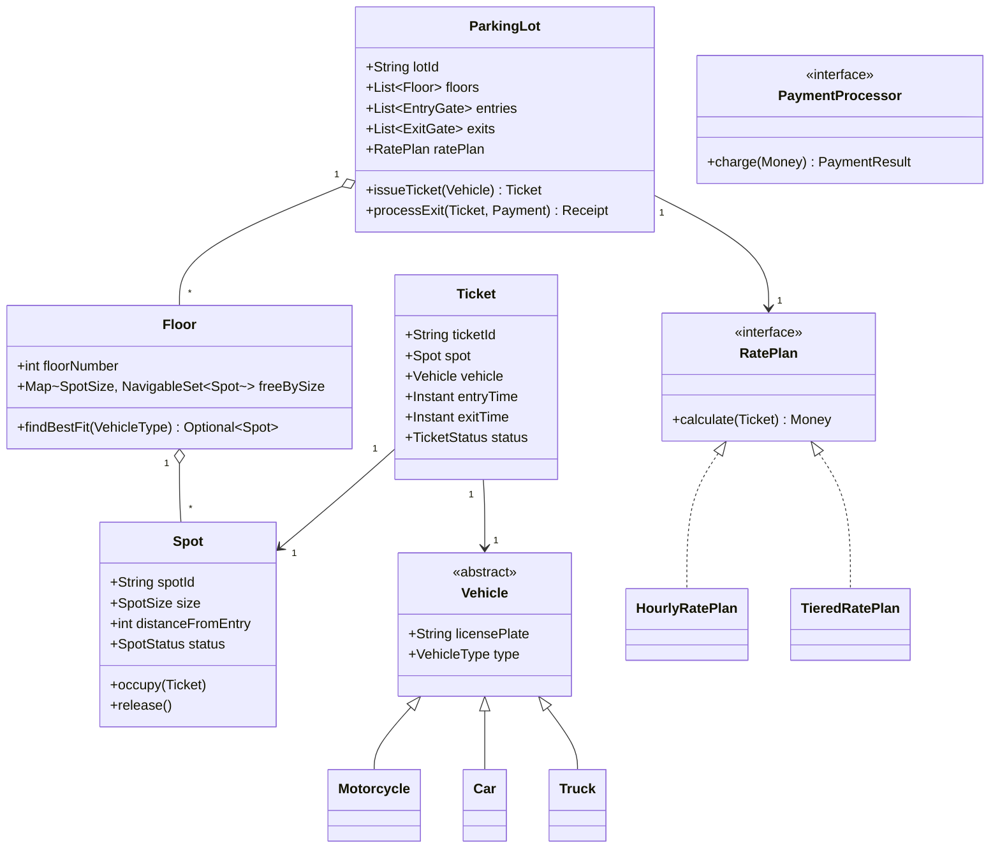
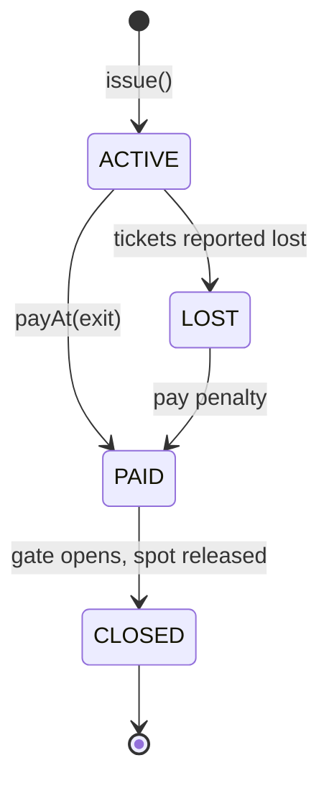
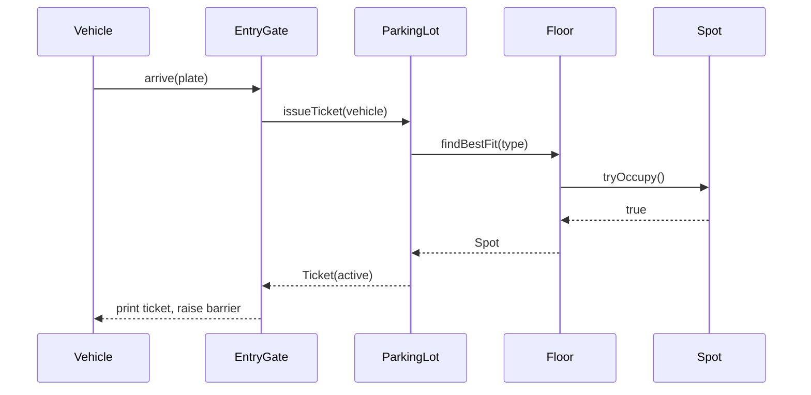

# Design Parking Lot

**Date:** 2026-05-02 | **Updated:** 2026-05-02
**Tags:** `low-level-design` `case-study` `management` `parking` `state-machines`
## Summary

A parking-lot system manages a fixed inventory of physical spots distributed across multiple floors, allocates them to vehicles of varying sizes, tracks how long each vehicle stays, and charges for the visit. The interesting LLD problems are: (1) modelling spot/vehicle compatibility cleanly, (2) finding the "best" spot fast — usually nearest entrance and tightest fit, (3) the ticket lifecycle with concurrent issue/exit, and (4) a pricing engine that can change without touching the allocation core.

This document gives a complete LLD: domain model, allocation algorithm, ticket state machine, payment, and the design patterns that hold it together.

## Table of Contents

- [Requirements (Functional + Non-Functional)](#requirements-functional--non-functional)
- [Entities and Relationships](#entities-and-relationships)
- [Class Skeletons (Java)](#class-skeletons-java)
- [Key Algorithms / Workflows](#key-algorithms--workflows)
- [Patterns Used (with reason)](#patterns-used-with-reason)
- [Concurrency Considerations](#concurrency-considerations)
- [Trade-offs and Extensions](#trade-offs-and-extensions)
- [Related](#related)
- [References](#references)

## Requirements (Functional + Non-Functional)

### Functional

- Multi-level (floor) parking lot. Each floor has rows of spots.
- Three vehicle types: `MOTORCYCLE`, `CAR`, `TRUCK`.
- Three spot sizes: `COMPACT`, `REGULAR`, `LARGE`. Compatibility:
  - Motorcycle fits any spot
  - Car fits regular or large
  - Truck only fits large
- Issue a ticket on entry; mark exit on payment.
- Compute fee from duration, vehicle type, and rate plan.
- Support multiple entry/exit gates; display real-time available counts per floor.
- Pluggable payment methods: cash, credit card, mobile wallet.

### Non-Functional

- Allocation must be O(log n) or better at peak (we use per-size priority queues).
- A ticket-issue and a payment must each complete in < 200 ms p99.
- Strict consistency on spot occupancy: a spot must never be issued to two tickets.
- Auditable history of every ticket and payment.
- Configurable rate plans without redeploying allocation logic.

## Entities and Relationships



### Ticket state machine



## Class Skeletons (Java)

```java
public enum VehicleType { MOTORCYCLE, CAR, TRUCK }
public enum SpotSize    { COMPACT, REGULAR, LARGE }
public enum SpotStatus  { FREE, OCCUPIED, OUT_OF_SERVICE }
public enum TicketStatus { ACTIVE, PAID, LOST, CLOSED }

public abstract class Vehicle {
    private final String licensePlate;
    private final VehicleType type;
    protected Vehicle(String plate, VehicleType type) {
        this.licensePlate = plate;
        this.type = type;
    }
    public VehicleType type() { return type; }
    public String licensePlate() { return licensePlate; }
}

public final class Motorcycle extends Vehicle {
    public Motorcycle(String plate) { super(plate, VehicleType.MOTORCYCLE); }
}
public final class Car extends Vehicle {
    public Car(String plate) { super(plate, VehicleType.CAR); }
}
public final class Truck extends Vehicle {
    public Truck(String plate) { super(plate, VehicleType.TRUCK); }
}

public final class Spot {
    private final String spotId;
    private final SpotSize size;
    private final int distanceFromEntry;
    private volatile SpotStatus status = SpotStatus.FREE;
    private volatile String currentTicketId;

    public Spot(String id, SpotSize size, int distance) {
        this.spotId = id;
        this.size = size;
        this.distanceFromEntry = distance;
    }

    public synchronized boolean tryOccupy(String ticketId) {
        if (status != SpotStatus.FREE) return false;
        this.status = SpotStatus.OCCUPIED;
        this.currentTicketId = ticketId;
        return true;
    }

    public synchronized void release() {
        this.status = SpotStatus.FREE;
        this.currentTicketId = null;
    }

    public SpotSize size() { return size; }
    public int distanceFromEntry() { return distanceFromEntry; }
    public String id() { return spotId; }
}

public final class Floor {
    private final int floorNumber;
    private final Map<SpotSize, NavigableSet<Spot>> freeBySize;

    public Floor(int n, List<Spot> spots) {
        this.floorNumber = n;
        Comparator<Spot> byDistance = Comparator.comparingInt(Spot::distanceFromEntry)
                                                .thenComparing(Spot::id);
        this.freeBySize = new EnumMap<>(SpotSize.class);
        for (SpotSize s : SpotSize.values()) {
            freeBySize.put(s, new ConcurrentSkipListSet<>(byDistance));
        }
        for (Spot spot : spots) freeBySize.get(spot.size()).add(spot);
    }

    /** tightest-fit, nearest-first */
    public Optional<Spot> findBestFit(VehicleType vt) {
        for (SpotSize size : compatibleSizes(vt)) {
            NavigableSet<Spot> pool = freeBySize.get(size);
            Iterator<Spot> it = pool.iterator();
            while (it.hasNext()) {
                Spot candidate = it.next();
                if (candidate.tryOccupy("__pending__")) {
                    pool.remove(candidate);
                    return Optional.of(candidate);
                }
            }
        }
        return Optional.empty();
    }

    public void releaseToPool(Spot spot) {
        spot.release();
        freeBySize.get(spot.size()).add(spot);
    }

    private List<SpotSize> compatibleSizes(VehicleType vt) {
        return switch (vt) {
            case MOTORCYCLE -> List.of(SpotSize.COMPACT, SpotSize.REGULAR, SpotSize.LARGE);
            case CAR        -> List.of(SpotSize.REGULAR, SpotSize.LARGE);
            case TRUCK      -> List.of(SpotSize.LARGE);
        };
    }
}

public final class Ticket {
    private final String ticketId;
    private final Spot spot;
    private final Vehicle vehicle;
    private final Instant entryTime;
    private Instant exitTime;
    private TicketStatus status = TicketStatus.ACTIVE;

    public Ticket(String id, Spot spot, Vehicle v, Instant entry) {
        this.ticketId = id; this.spot = spot;
        this.vehicle = v; this.entryTime = entry;
    }
    // getters, transition methods omitted for brevity
}

public interface RatePlan {
    Money calculate(Ticket t);
}

public final class TieredRatePlan implements RatePlan {
    // first hour flat, then escalating per hour, capped at daily max
    private final Money firstHour;
    private final Money perHourAfter;
    private final Money dailyCap;

    public TieredRatePlan(Money first, Money after, Money cap) {
        this.firstHour = first; this.perHourAfter = after; this.dailyCap = cap;
    }
    @Override public Money calculate(Ticket t) {
        long minutes = Duration.between(t.entryTime(), t.exitTime()).toMinutes();
        long hours   = (minutes + 59) / 60;
        Money fee = firstHour.plus(perHourAfter.times(Math.max(0, hours - 1)));
        return fee.min(dailyCap);
    }
}

public interface PaymentProcessor {
    PaymentResult charge(Money amount, PaymentMethod method);
}

public final class ParkingLot {
    private final List<Floor> floors;
    private final RatePlan ratePlan;
    private final PaymentProcessor payments;
    private final ConcurrentMap<String, Ticket> activeTickets = new ConcurrentHashMap<>();

    public ParkingLot(List<Floor> floors, RatePlan plan, PaymentProcessor pp) {
        this.floors = floors; this.ratePlan = plan; this.payments = pp;
    }

    public Optional<Ticket> issueTicket(Vehicle v) {
        for (Floor f : floors) {
            Optional<Spot> spot = f.findBestFit(v.type());
            if (spot.isPresent()) {
                Ticket t = new Ticket(UUID.randomUUID().toString(),
                                      spot.get(), v, Instant.now());
                activeTickets.put(t.id(), t);
                return Optional.of(t);
            }
        }
        return Optional.empty();
    }

    public Receipt processExit(String ticketId, PaymentMethod method) {
        Ticket t = activeTickets.get(ticketId);
        if (t == null) throw new IllegalStateException("unknown ticket");
        t.markExit(Instant.now());
        Money fee = ratePlan.calculate(t);
        PaymentResult pr = payments.charge(fee, method);
        if (!pr.success()) throw new PaymentFailedException(pr.reason());
        floorOf(t.spot()).releaseToPool(t.spot());
        activeTickets.remove(ticketId);
        return new Receipt(ticketId, fee, pr.transactionId());
    }

    private Floor floorOf(Spot s) { /* index by spot prefix */ return floors.get(0); }
}
```

## Key Algorithms / Workflows

### Best-fit allocation

Goal: park each vehicle in the **smallest spot that fits**, nearest the entry. This protects scarce LARGE spots from being occupied by motorcycles.

1. From `compatibleSizes(vehicleType)` (smallest-first), iterate each pool.
2. Each pool is a `ConcurrentSkipListSet<Spot>` ordered by `(distanceFromEntry, spotId)`. The first element is the closest free spot of that size.
3. CAS-style claim via `Spot.tryOccupy()`. On success, remove from the pool and return.
4. If no compatible size has a free spot on this floor, move to the next floor.

This is `O(F · log n)` worst case, `O(log n)` typical.

### Ticket issue (sequence)



### Payment

1. Driver presents the ticket at an exit kiosk.
2. `processExit` computes duration and asks the active `RatePlan` for fees.
3. `PaymentProcessor.charge()` runs the strategy for the chosen method.
4. On success, ticket transitions `ACTIVE -> PAID`, spot is released, pool index is updated.

### Lost ticket

A `LOST` ticket triggers a flat penalty (max-day rate). Once paid, it transitions `LOST -> PAID -> CLOSED`.

## Patterns Used (with reason)

| Pattern | Where | Why |
|---------|-------|-----|
| Strategy | `RatePlan`, `PaymentProcessor` | Pricing and payments change independently of allocation. |
| Factory | `VehicleFactory.from(plateScan)` | Centralise creation given OCR + LPR signals. |
| State | `Ticket.status` transitions | Make illegal transitions impossible. |
| Singleton (per lot) | `ParkingLot` | One authoritative occupancy view per physical lot. |
| Observer | `OccupancyDisplay` listening to floor events | Live counts at the entry without polling. |
| Composite | Lot -> Floor -> Spot | Same `findBestFit` API at multiple levels of granularity. |

## Concurrency Considerations

- **Per-spot mutex**: `Spot.tryOccupy` is the only place that flips `FREE -> OCCUPIED`. Two gates calling at once: only one CAS wins.
- **Per-pool index**: `ConcurrentSkipListSet` allows multiple readers and lock-free iteration. Removal happens after `tryOccupy` succeeds.
- **Lost-update on release**: always release in this order — `spot.release()` first, then add back to the pool. Otherwise another thread could observe a free spot that is still marked occupied.
- **Ticket map**: `ConcurrentHashMap` for `activeTickets` — single-key lookups dominate.
- **Pricing**: pricing reads `entryTime`/`exitTime`, both effectively final after exit. No locks needed.

## Trade-offs and Extensions

- **Reservation**: add `RESERVED` status and a hold timer. Reservations occupy the same `Spot` mutex but with a TTL.
- **EV charging**: subtype `Spot` into `EVSpot extends Spot` with rate plan modifier, or attach a `chargingProfile` capability.
- **Dynamic pricing**: surge multipliers via decorator `SurgeRatePlan(delegate, multiplier)`.
- **Multi-lot federation**: a `LotDirectoryService` that routes a vehicle to the nearest lot with capacity. Push the per-lot search behind a load-balanced API.
- **Replicated occupancy**: today the lot is single-process. To survive crashes, persist `Spot.status` and `Ticket` updates in an event log; rebuild pools on restart.
- **Privacy**: license plates are PII. Hash for analytics; keep raw values only as long as needed for billing disputes.

## Related

- [Design Task Management System](design-task-management-system.md)
- [Design Inventory Management System](design-inventory-management-system.md)
- [Design Library Management System](design-library-management-system.md)
- [Design Restaurant Management System](design-restaurant-management-system.md)
- [State pattern](../../design-patterns/behavioral/state.md)
- [Strategy pattern](../../design-patterns/behavioral/strategy.md)
- [Observer pattern](../../design-patterns/behavioral/observer.md)
- [Factory Method](../../design-patterns/creational/factory-method.md)
- [Composite pattern](../../design-patterns/structural/composite.md)

## References

- Erich Gamma et al., _Design Patterns: Elements of Reusable Object-Oriented Software_, Addison-Wesley, 1994.
- Robert C. Martin, _Clean Architecture_, Prentice Hall, 2017.
- Java Concurrency in Practice, Brian Goetz et al., Addison-Wesley, 2006.
- Oracle Java Platform documentation — `java.util.concurrent` package.
