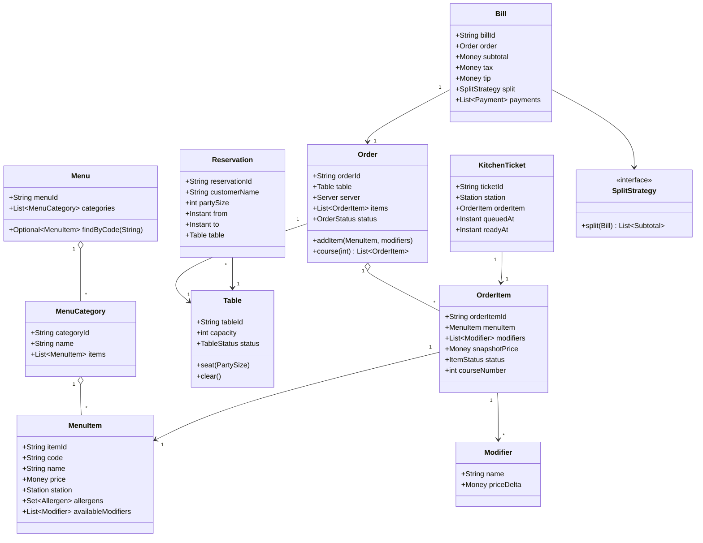
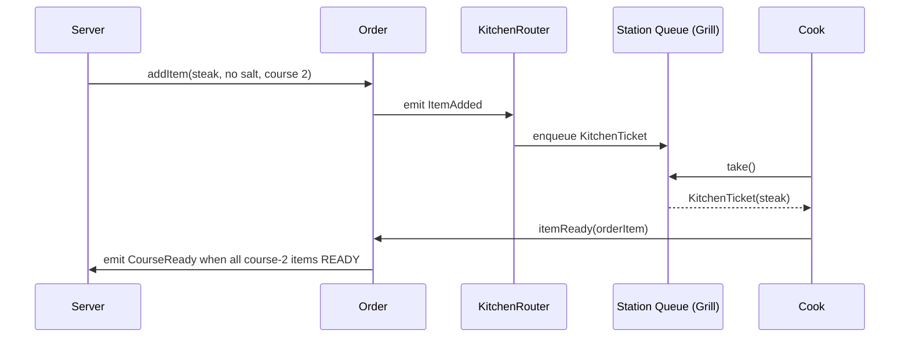

# Design Restaurant Management System

**Date:** 2026-05-02 | **Updated:** 2026-05-02
**Tags:** `low-level-design` `case-study` `management` `restaurant` `kitchen`

## Summary

A restaurant management system covers the full front- and back-of-house flow: menu, table layout, reservations, taking orders, routing items to kitchen stations, tracking ticket progression, and producing the final bill. The interesting LLD problems are: (1) a menu that supports modifiers and combos without exploding into a giant SKU list, (2) splitting one customer order across multiple kitchen stations and rejoining the timing, (3) reservation versus walk-in table allocation, and (4) splitting checks at the end without losing items in transit.

## Table of Contents

- [Requirements (Functional + Non-Functional)](#requirements-functional--non-functional)
- [Entities and Relationships](#entities-and-relationships)
- [Class Skeletons (Java)](#class-skeletons-java)
- [Key Algorithms / Workflows](#key-algorithms--workflows)
- [Patterns Used (with reason)](#patterns-used-with-reason)
- [Concurrency Considerations](#concurrency-considerations)
- [Trade-offs and Extensions](#trade-offs-and-extensions)
- [Related](#related)
- [References](#references)

## Requirements (Functional + Non-Functional)

### Functional

- Menu organised into categories (starters, mains, desserts, drinks). Each `MenuItem` has price, station (grill, fry, cold, bar), allergens, optional modifiers (e.g. "no onions").
- Table layout with capacity and status (`FREE`, `OCCUPIED`, `RESERVED`, `DIRTY`).
- Reservations with party size, time window, special requests.
- Walk-in seating: assign smallest-fitting free table.
- Take an order via a server; each `OrderItem` references a `MenuItem` and includes modifiers and notes.
- Send each `OrderItem` to its station's ticket queue; cooks mark items `IN_PROGRESS` then `READY`.
- When all items in a course are `READY`, server is paged.
- Bill generation with item totals, tax, tip presets, and check splitting (per-person, per-item, even split).
- Payment: card, cash, mobile.

### Non-Functional

- Order placement and item ready-state updates must propagate to the relevant terminals in < 1s.
- One table cannot be double-seated.
- A modifier price change after the order is placed must not affect the placed order.
- Audit every order, modification, and payment.

## Entities and Relationships



## Class Skeletons (Java)

```java
public enum Station { GRILL, FRY, COLD, PASTRY, BAR }
public enum TableStatus { FREE, OCCUPIED, RESERVED, DIRTY }
public enum ItemStatus { QUEUED, IN_PROGRESS, READY, SERVED, CANCELLED }
public enum OrderStatus { OPEN, AWAITING_PAYMENT, CLOSED, CANCELLED }

public final class MenuItem {
    private final String itemId;
    private final String code;
    private final String name;
    private final Money price;
    private final Station station;
    private final Set<String> allergens;
    private final List<Modifier> availableModifiers;
    public MenuItem(String id, String code, String name, Money price,
                    Station st, Set<String> allergens, List<Modifier> mods) {
        this.itemId = id; this.code = code; this.name = name;
        this.price = price; this.station = st;
        this.allergens = Set.copyOf(allergens);
        this.availableModifiers = List.copyOf(mods);
    }
    public Money price() { return price; }
    public Station station() { return station; }
}

public record Modifier(String name, Money priceDelta) { }

public final class Table {
    private final String tableId;
    private final int capacity;
    private volatile TableStatus status = TableStatus.FREE;
    public Table(String id, int cap) { this.tableId = id; this.capacity = cap; }

    public synchronized boolean trySeat(int partySize) {
        if (status != TableStatus.FREE) return false;
        if (partySize > capacity) return false;
        this.status = TableStatus.OCCUPIED;
        return true;
    }
    public synchronized void release(boolean dirty) {
        this.status = dirty ? TableStatus.DIRTY : TableStatus.FREE;
    }
    public TableStatus status() { return status; }
    public int capacity() { return capacity; }
}

public final class OrderItem {
    private final String orderItemId;
    private final MenuItem menuItem;
    private final List<Modifier> modifiers;
    private final Money snapshotPrice;       // captured at add time
    private final int courseNumber;
    private volatile ItemStatus status = ItemStatus.QUEUED;
    public OrderItem(String id, MenuItem mi, List<Modifier> mods, int course) {
        this.orderItemId = id; this.menuItem = mi;
        this.modifiers = List.copyOf(mods);
        this.snapshotPrice = mi.price().plus(
            mods.stream().map(Modifier::priceDelta).reduce(Money.ZERO, Money::plus));
        this.courseNumber = course;
    }
    public Money snapshotPrice() { return snapshotPrice; }
    public Station station() { return menuItem.station(); }
    public ItemStatus status() { return status; }
    public void setStatus(ItemStatus s) { this.status = s; }
    public int courseNumber() { return courseNumber; }
}

public final class Order {
    private final String orderId;
    private final Table table;
    private final Server server;
    private final List<OrderItem> items = new CopyOnWriteArrayList<>();
    private volatile OrderStatus status = OrderStatus.OPEN;
    private final List<OrderObserver> observers = new CopyOnWriteArrayList<>();

    public Order(String id, Table table, Server s) {
        this.orderId = id; this.table = table; this.server = s;
    }
    public OrderItem addItem(MenuItem mi, List<Modifier> mods, int course) {
        if (status != OrderStatus.OPEN) throw new IllegalStateException("order not open");
        OrderItem item = new OrderItem(UUID.randomUUID().toString(), mi, mods, course);
        items.add(item);
        emit(OrderEvent.itemAdded(this, item));
        return item;
    }
    public void itemReady(OrderItem i) {
        i.setStatus(ItemStatus.READY);
        emit(OrderEvent.itemReady(this, i));
        if (allInCourseReady(i.courseNumber())) emit(OrderEvent.courseReady(this, i.courseNumber()));
    }
    public List<OrderItem> course(int n) {
        return items.stream().filter(i -> i.courseNumber() == n).toList();
    }
    public void registerObserver(OrderObserver o) { observers.add(o); }
    private void emit(OrderEvent e) { observers.forEach(o -> o.onEvent(e)); }
    private boolean allInCourseReady(int course) {
        return items.stream().filter(i -> i.courseNumber() == course)
            .allMatch(i -> i.status() == ItemStatus.READY || i.status() == ItemStatus.SERVED);
    }
}

public final class KitchenRouter implements OrderObserver {
    private final Map<Station, BlockingQueue<KitchenTicket>> queues = new EnumMap<>(Station.class);
    public KitchenRouter() {
        for (Station s : Station.values()) queues.put(s, new LinkedBlockingQueue<>());
    }
    @Override public void onEvent(OrderEvent e) {
        if (e instanceof OrderEvent.ItemAdded ia) {
            KitchenTicket t = new KitchenTicket(UUID.randomUUID().toString(),
                                                ia.item().station(), ia.item(), Instant.now());
            queues.get(ia.item().station()).offer(t);
        }
    }
    public KitchenTicket nextFor(Station s) throws InterruptedException {
        return queues.get(s).take();
    }
}

public interface SplitStrategy { List<Subtotal> split(Bill b); }
public record Subtotal(String label, Money amount) { }

public final class EvenSplitStrategy implements SplitStrategy {
    private final int people;
    public EvenSplitStrategy(int n) { this.people = n; }
    @Override public List<Subtotal> split(Bill b) {
        Money each = b.totalDue().divide(people);
        return java.util.stream.IntStream.rangeClosed(1, people)
            .mapToObj(i -> new Subtotal("Guest " + i, each)).toList();
    }
}

public final class PerItemSplitStrategy implements SplitStrategy {
    private final Map<String, List<String>> orderItemIdsByGuest;
    public PerItemSplitStrategy(Map<String, List<String>> assignment) {
        this.orderItemIdsByGuest = Map.copyOf(assignment);
    }
    @Override public List<Subtotal> split(Bill b) {
        // sum snapshot prices per guest, distribute tax/tip proportionally
        return List.of();
    }
}

public final class Bill {
    private final String billId;
    private final Order order;
    private Money tip = Money.ZERO;
    private SplitStrategy split = new SinglePayerSplit();
    private final List<Payment> payments = new ArrayList<>();
    public Bill(String id, Order order) { this.billId = id; this.order = order; }
    public Money subtotal() {
        return order.items().stream().filter(i -> i.status() != ItemStatus.CANCELLED)
                .map(OrderItem::snapshotPrice).reduce(Money.ZERO, Money::plus);
    }
    public Money tax() { return subtotal().times(0.08); }     // configurable
    public Money totalDue() { return subtotal().plus(tax()).plus(tip).minus(paid()); }
    public Money paid() { return payments.stream().map(Payment::amount).reduce(Money.ZERO, Money::plus); }
    public List<Subtotal> currentSplit() { return split.split(this); }
}
```

## Key Algorithms / Workflows

### Walk-in seating

1. Sort tables by `(capacity asc, tableId asc)`.
2. Pick the first `FREE` table with `capacity >= partySize`.
3. `trySeat()` CAS — on failure, advance.

### Reservation honoring

A reservation is a future hold on a specific table. A separate sweeper marks tables `RESERVED` 15 minutes before the reservation start and reverts to `FREE` after a no-show window. Walk-in seating skips `RESERVED` tables.

### Order to kitchen ticket



### Course timing

- Each `OrderItem` carries a `courseNumber`.
- `Order.allInCourseReady(n)` — emits `CourseReady` only when **every** item in course `n` is `READY` (or already `SERVED` if a runner is ahead). The expediter sends the course out together.

### Check splitting

- Always compute `subtotal` and `tax` from `OrderItem.snapshotPrice` so price changes after order placement don't reach back.
- `SplitStrategy` is plugged in: `EvenSplit`, `PerItemSplit`, `PercentageSplit`. Tax and tip are distributed proportionally to each subtotal.
- Payments accumulate; `totalDue() = subtotal + tax + tip − paid`. Bill closes when `totalDue() <= 0`.

## Patterns Used (with reason)

| Pattern | Where | Why |
|---------|-------|-----|
| Observer | `Order` -> `KitchenRouter`, `Order` -> `ServerPager` | Loose coupling between front-of-house and back-of-house. |
| Strategy | `SplitStrategy`, `PaymentMethod`, `TaxPolicy` | Variation captured cleanly. |
| Decorator | `OrderItem` modifiers (price + name composed) | Modifiers stack without subclassing menu items. |
| Composite | `Menu -> Category -> Item`; `Combo` is a composite of items | Same traversal interface. |
| State | `OrderStatus`, `ItemStatus`, `TableStatus` | Make illegal transitions impossible. |
| Command | `OrderItemCommand` (add / void / 86) for audit + replay | Each action is a record. |
| Factory | `BillFactory.from(order, splitStrategy)` | Centralise construction with tax & tip rules. |

## Concurrency Considerations

- **Table CAS**: `Table.trySeat` is `synchronized`. Two hosts seating the same party at the same table — only one wins.
- **Order.items**: `CopyOnWriteArrayList` is fine because adds are bursty and reads (kitchen, expediter, billing) are frequent.
- **Kitchen queues**: `LinkedBlockingQueue` per station. Cooks block on `take()`; orderly handoff.
- **Item status transitions**: each item belongs to exactly one cook at a time; only that cook flips `IN_PROGRESS -> READY`.
- **Bill mutations**: split/tip changes are infrequent; a single `synchronized` block on `Bill` is fine. Payment additions are append; recompute totals on read.
- **Audit**: write each `OrderEvent` to an append-only log; the kitchen router and the audit logger are both observers.

## Trade-offs and Extensions

- **Combo / set menu**: a `ComboItem` aggregates multiple child items; price overrides children but they still route to their stations.
- **86'd items** (sold out): mark `MenuItem.available = false`; `Order.addItem` rejects, but already-placed orders are unaffected.
- **Loyalty / discounts**: add a `Discount` decorator that adjusts `Bill.subtotal` line items.
- **Multi-tenant chain**: prepend `restaurantId` to every aggregate id; menus and stations are per-restaurant.
- **Online / delivery orders** — same `Order` but no `Table`; a virtual courier "table" or null. Course timing is replaced by single-batch ready.
- **Real-time kitchen display system (KDS)** — additional observer streaming via WebSocket to per-station screens.
- **Cancellations after fire** — if the cook has already started, charging policy varies; model as `ItemStatus.CANCELLED` with optional fee.
- **Reservation overbooking** — controlled overbook within a tolerance; a release queue rebalances when no-shows free tables.

## Related

- [Design Parking Lot](design-parking-lot.md)
- [Design Task Management System](design-task-management-system.md)
- [Design Inventory Management System](design-inventory-management-system.md)
- [Design Library Management System](design-library-management-system.md)
- [Strategy pattern](../../design-patterns/behavioral/strategy.md)
- [Observer pattern](../../design-patterns/behavioral/observer.md)
- [State pattern](../../design-patterns/behavioral/state.md)
- [Command pattern](../../design-patterns/behavioral/command.md)
- [Composite pattern](../../design-patterns/structural/composite.md)
- [Decorator pattern](../../design-patterns/structural/decorator.md)

## References

- Erich Gamma et al., _Design Patterns: Elements of Reusable Object-Oriented Software_, Addison-Wesley, 1994.
- Martin Fowler, _Patterns of Enterprise Application Architecture_, Addison-Wesley, 2002.
- Eric Evans, _Domain-Driven Design_, Addison-Wesley, 2003.
- Brian Goetz et al., _Java Concurrency in Practice_, Addison-Wesley, 2006.
