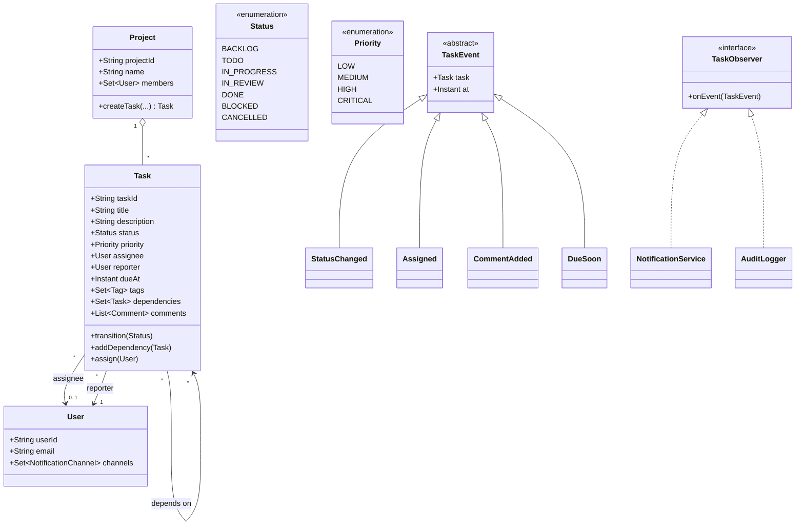
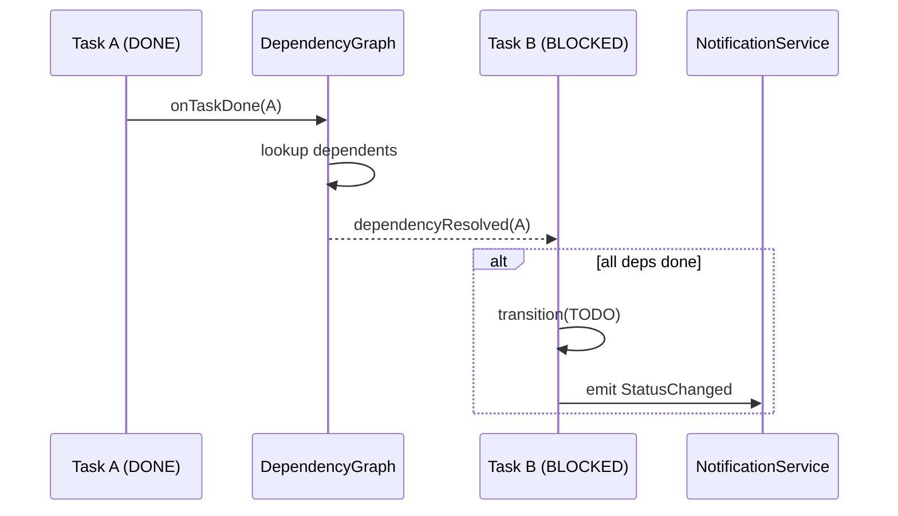

# Design Task Management System

**Date:** 2026-05-02 | **Updated:** 2026-05-02
**Tags:** `low-level-design` `case-study` `management` `tasks` `observer`

## Summary

A task management system stores work items, assigns them to people, tracks status as the work moves through a pipeline, encodes dependencies between tasks, and notifies the right people whenever something changes. The hard parts at LLD scope are: (1) a clean lifecycle / status machine, (2) dependency handling so a task only becomes runnable when its predecessors are done, (3) priority and scheduling rules, and (4) a notification subsystem that does not couple the core domain to email/Slack/etc.

## Table of Contents

- [Requirements (Functional + Non-Functional)](#requirements-functional--non-functional)
- [Entities and Relationships](#entities-and-relationships)
- [Class Skeletons (Java)](#class-skeletons-java)
- [Key Algorithms / Workflows](#key-algorithms--workflows)
- [Patterns Used (with reason)](#patterns-used-with-reason)
- [Concurrency Considerations](#concurrency-considerations)
- [Trade-offs and Extensions](#trade-offs-and-extensions)
- [Related](#related)
- [References](#references)

## Requirements (Functional + Non-Functional)

### Functional

- Create, edit, delete a task; tasks belong to a project.
- A task has: title, description, status, priority, assignee, reporter, due date, tags, dependencies, comments.
- Status pipeline: `BACKLOG -> TODO -> IN_PROGRESS -> IN_REVIEW -> DONE` (plus `BLOCKED` and `CANCELLED`).
- Priorities: `LOW`, `MEDIUM`, `HIGH`, `CRITICAL`.
- Assign / reassign tasks. A task without an assignee is allowed but flagged.
- Dependencies: a task can require other tasks to be `DONE` before it becomes `TODO`.
- Notifications on: assignment, status change, due-date approaching, blocking-task resolved.
- Search/filter by assignee, status, tag, priority, due window.

### Non-Functional

- Status transitions must be atomic; no two users can flip the same task into `DONE` twice.
- Notification delivery is best-effort but at-least-once.
- Lookup by id and by `assignee + status` must be O(1) / O(log n).
- Audit log of every change kept indefinitely (append-only).

## Entities and Relationships



## Class Skeletons (Java)

```java
public enum Status { BACKLOG, TODO, IN_PROGRESS, IN_REVIEW, DONE, BLOCKED, CANCELLED }
public enum Priority { LOW, MEDIUM, HIGH, CRITICAL }

public final class User {
    private final String userId;
    private final String email;
    private final Set<NotificationChannel> channels;
    public User(String id, String email, Set<NotificationChannel> ch) {
        this.userId = id; this.email = email; this.channels = Set.copyOf(ch);
    }
    public Set<NotificationChannel> channels() { return channels; }
    public String email() { return email; }
}

public sealed interface TaskEvent
        permits StatusChanged, Assigned, CommentAdded, DueSoon, DependencyResolved {
    Task task();
    Instant at();
}
public record StatusChanged(Task task, Status from, Status to, Instant at) implements TaskEvent {}
public record Assigned(Task task, User from, User to, Instant at) implements TaskEvent {}
public record CommentAdded(Task task, Comment comment, Instant at) implements TaskEvent {}
public record DueSoon(Task task, Instant at) implements TaskEvent {}
public record DependencyResolved(Task task, Task resolvedDep, Instant at) implements TaskEvent {}

public interface TaskObserver { void onEvent(TaskEvent e); }

public final class Task {
    private final String taskId;
    private String title;
    private String description;
    private volatile Status status = Status.BACKLOG;
    private volatile Priority priority = Priority.MEDIUM;
    private volatile User assignee;
    private final User reporter;
    private volatile Instant dueAt;
    private final Set<String> tags = ConcurrentHashMap.newKeySet();
    private final Set<Task> dependencies = ConcurrentHashMap.newKeySet();
    private final List<Comment> comments = new CopyOnWriteArrayList<>();
    private final List<TaskObserver> observers = new CopyOnWriteArrayList<>();

    public Task(String id, String title, User reporter) {
        this.taskId = id; this.title = title; this.reporter = reporter;
    }

    public synchronized void transition(Status next) {
        if (!StatusGuard.allowed(this.status, next)) {
            throw new IllegalStateException(this.status + " -> " + next + " not allowed");
        }
        if (next == Status.TODO && !allDependenciesDone()) {
            throw new IllegalStateException("dependencies not satisfied");
        }
        Status prev = this.status;
        this.status = next;
        emit(new StatusChanged(this, prev, next, Instant.now()));
        if (next == Status.DONE) notifyDependents();
    }

    public void assign(User user) {
        User prev = this.assignee;
        this.assignee = user;
        emit(new Assigned(this, prev, user, Instant.now()));
    }

    public void addDependency(Task dep) {
        if (createsCycle(dep)) throw new IllegalArgumentException("cyclic dependency");
        dependencies.add(dep);
        if (status == Status.TODO && dep.status != Status.DONE) {
            transition(Status.BLOCKED);
        }
    }

    public void addComment(Comment c) {
        comments.add(c);
        emit(new CommentAdded(this, c, Instant.now()));
    }

    public void registerObserver(TaskObserver o) { observers.add(o); }

    private void emit(TaskEvent e) {
        for (TaskObserver o : observers) {
            try { o.onEvent(e); } catch (RuntimeException ignored) { /* logged */ }
        }
    }

    private boolean allDependenciesDone() {
        return dependencies.stream().allMatch(d -> d.status == Status.DONE);
    }

    private void notifyDependents() {
        // implementation note: dependents tracked elsewhere, possibly via DependencyGraph
    }

    private boolean createsCycle(Task target) {
        Deque<Task> stack = new ArrayDeque<>();
        stack.push(target);
        Set<Task> seen = new HashSet<>();
        while (!stack.isEmpty()) {
            Task cur = stack.pop();
            if (cur == this) return true;
            if (!seen.add(cur)) continue;
            stack.addAll(cur.dependencies);
        }
        return false;
    }
    public Status status() { return status; }
}

public final class StatusGuard {
    private static final Map<Status, Set<Status>> ALLOWED = Map.of(
        Status.BACKLOG,     EnumSet.of(Status.TODO, Status.CANCELLED),
        Status.TODO,        EnumSet.of(Status.IN_PROGRESS, Status.BLOCKED, Status.CANCELLED),
        Status.IN_PROGRESS, EnumSet.of(Status.IN_REVIEW, Status.BLOCKED, Status.CANCELLED),
        Status.IN_REVIEW,   EnumSet.of(Status.DONE, Status.IN_PROGRESS),
        Status.BLOCKED,     EnumSet.of(Status.TODO, Status.IN_PROGRESS, Status.CANCELLED),
        Status.DONE,        EnumSet.of(),
        Status.CANCELLED,   EnumSet.of()
    );
    public static boolean allowed(Status from, Status to) {
        return ALLOWED.getOrDefault(from, Set.of()).contains(to);
    }
}

public final class NotificationService implements TaskObserver {
    private final Map<NotificationChannel, NotificationSender> senders;
    public NotificationService(Map<NotificationChannel, NotificationSender> s) { this.senders = s; }

    @Override public void onEvent(TaskEvent e) {
        Set<User> recipients = recipientsFor(e);
        Notification n = NotificationFormatter.format(e);
        for (User u : recipients) {
            for (NotificationChannel ch : u.channels()) {
                senders.get(ch).send(u, n);
            }
        }
    }

    private Set<User> recipientsFor(TaskEvent e) {
        Set<User> out = new HashSet<>();
        if (e.task().assignee() != null) out.add(e.task().assignee());
        out.add(e.task().reporter());
        return out;
    }
}
```

## Key Algorithms / Workflows

### Becoming runnable when blocked task is resolved



### Cycle detection

When `Task.addDependency(target)` is called we DFS from `target` over its transitive dependencies. If we ever encounter `this`, the new edge would close a cycle and is rejected. This keeps the dependency graph a DAG, which is required for the topological sort used by reporting and Gantt views.

### Priority + due-date scheduling

Open tasks are kept in a `PriorityBlockingQueue` ordered by:

1. `priority` desc (`CRITICAL` before `HIGH` etc.)
2. `dueAt` asc (earlier is more urgent)
3. `createdAt` asc

This is the order returned by "what should I work on next?" queries.

### Indexes

- `Map<UserId, Set<TaskId>>` per status — answers "open tasks for Bob" without a scan.
- `Map<Tag, Set<TaskId>>` — tag filter.
- `TreeMap<Instant, Set<TaskId>>` of `dueAt` — "due in next 24h" range query.

### Due-soon scanner

A scheduled job walks the `dueAt` index every N minutes and fires `DueSoon` events for any task with `dueAt - now < threshold` that has not already been notified.

## Patterns Used (with reason)

| Pattern | Where | Why |
|---------|-------|-----|
| Observer | `TaskObserver` and `emit()` | Notifications and audit log subscribe without the Task knowing about email/Slack. |
| State (lite) | `StatusGuard` | Centralises "which transition is legal" so it cannot drift. |
| Strategy | `NotificationSender` per channel | Email/Slack/in-app share a contract; pick at runtime. |
| Command | `TaskCommand` (create / transition / assign) for the audit log | Each command can be replayed and is the unit of authorisation. |
| Repository | `TaskRepository`, `ProjectRepository` | Keeps storage out of the domain model. |
| Composite | A project can contain sub-projects (epics) and tasks | Same query interface applied recursively. |

## Concurrency Considerations

- **Status transition** uses `synchronized` on the task. Two reviewers clicking "Done" race once; one wins, the other gets `IllegalStateException` and the UI shows the new state.
- **Observer notification** runs on the caller thread by default. For slow channels (email), wrap with an executor: `AsyncObserverAdapter` that pushes events to a bounded queue. If the queue fills, drop oldest with metric — the notification is best-effort, the audit log is not.
- **Audit log** is append-only; use a single-writer thread or a lock-free queue (e.g. `ConcurrentLinkedQueue`) drained to durable storage.
- **Dependency edges**: `addDependency` and `transition` can race. `addDependency` must read `status` after the check or use a per-task lock that also covers `transition`.
- **Indexes** are eventually consistent w.r.t. the in-memory task state. Updates flow `task -> event -> indexer -> index` so a search may briefly miss a just-created task — acceptable.

## Trade-offs and Extensions

- **Sub-tasks** vs **dependencies**: distinct relationships. Sub-tasks roll up progress to a parent; dependencies gate `TODO`. Modelled separately.
- **Custom workflows per project** — replace `StatusGuard.ALLOWED` with a `Workflow` object owned by the project; the Task asks its project for legal transitions.
- **Time tracking** — add `WorkLog` entries; aggregate per assignee for reports.
- **SLAs** — extend `DueSoon` into a tiered escalation policy (warn assignee, then manager, then auto-reprioritise).
- **Real-time UI** — broadcast events through WebSockets via a dedicated observer.
- **Bulk import** — a single `BulkCreateCommand` should validate the dependency graph for cycles _across the whole batch_ before applying any change.
- **Soft delete** — `CANCELLED` keeps history; never hard-delete tasks because they may be referenced by audit log and analytics.

## Related

- [Design Parking Lot](design-parking-lot.md)
- [Design Inventory Management System](design-inventory-management-system.md)
- [Design Library Management System](design-library-management-system.md)
- [Design Restaurant Management System](design-restaurant-management-system.md)
- [Observer pattern](../../design-patterns/behavioral/observer.md)
- [State pattern](../../design-patterns/behavioral/state.md)
- [Command pattern](../../design-patterns/behavioral/command.md)
- [Strategy pattern](../../design-patterns/behavioral/strategy.md)
- [Composite pattern](../../design-patterns/structural/composite.md)

## References

- Erich Gamma et al., _Design Patterns: Elements of Reusable Object-Oriented Software_, Addison-Wesley, 1994.
- Martin Fowler, _Patterns of Enterprise Application Architecture_, Addison-Wesley, 2002.
- Eric Evans, _Domain-Driven Design_, Addison-Wesley, 2003.
- Brian Goetz et al., _Java Concurrency in Practice_, Addison-Wesley, 2006.
