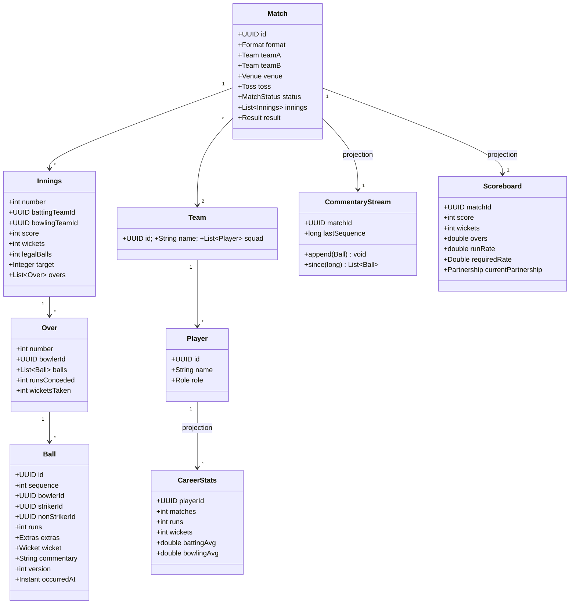
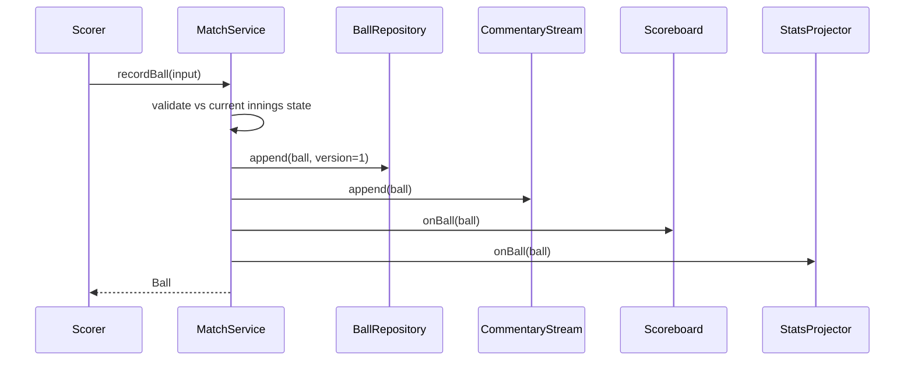

# Design Cricinfo

**Date:** 2026-05-02 | **Updated:** 2026-05-02
**Tags:** `low-level-design` `case-study` `social-content` `sports` `live-scoring`

## Summary

Cricinfo (and equivalents) presents **live cricket scores**, ball-by-ball commentary, and historical statistics. The domain is unusually rich — a match contains innings, each innings contains overs, each over contains balls, and each ball is a small event with many derived fields (runs, extras, wicket, fielding). This LLD models the entity hierarchy, the live scoreboard projection, the commentary stream, and the statistics rollup in OOD terms.

## Table of Contents

1. [Requirements (Functional + Non-Functional)](#requirements-functional--non-functional)
2. [Entities and Relationships (Mermaid classDiagram)](#entities-and-relationships-mermaid-classdiagram)
3. [Class Skeletons (Java)](#class-skeletons-java)
4. [Key Algorithms / Workflows](#key-algorithms--workflows)
5. [Patterns Used (with reason)](#patterns-used-with-reason)
6. [Concurrency Considerations](#concurrency-considerations)
7. [Trade-offs and Extensions](#trade-offs-and-extensions)
8. [Related](#related)
9. [References](#references)

## Requirements (Functional + Non-Functional)

**Functional**

- Model **Match** with format (`TEST`, `ODI`, `T20`, `T10`), two teams, venue, toss outcome, and innings list.
- Each **Innings** has batting team, bowling team, target (if 2nd innings), score, overs bowled, wickets fallen.
- An **Over** is six legitimate deliveries; extras (wide, no-ball) do not consume a delivery slot.
- A **Ball** records bowler, striker, non-striker, runs scored, extras, wicket info, fielding, and commentary text.
- Live scoreboard shows current score, current bowler, batters, run rate, required rate (if chasing), partnership.
- Commentary is a chronological stream replay-able from any cursor.
- Player career statistics aggregate from all completed matches.

**Non-Functional**

- A ball event is the **single immutable source of truth**. All other views are projections.
- Edits to a recorded ball (correction by scorer) are **versioned**, never destructive.
- Commentary stream is append-only with monotonic sequence.
- Statistics queries should be answerable from precomputed projections.

## Entities and Relationships (Mermaid classDiagram)



## Class Skeletons (Java)

```java
public enum Format { TEST, ODI, T20, T10 }
public enum MatchStatus { SCHEDULED, LIVE, COMPLETED, ABANDONED }
public enum DismissalKind { BOWLED, CAUGHT, LBW, RUN_OUT, STUMPED, HIT_WICKET, RETIRED_HURT }
public enum ExtraKind { WIDE, NO_BALL, BYE, LEG_BYE, PENALTY }
public enum Role { BATTER, BOWLER, ALL_ROUNDER, KEEPER }

public record Extras(EnumMap<ExtraKind,Integer> values) {
  public int total() { return values.values().stream().mapToInt(Integer::intValue).sum(); }
}

public record Wicket(DismissalKind kind, UUID dismissedPlayerId,
                     UUID bowlerId, UUID fielderId) {
  public boolean creditedToBowler() {
    return kind != DismissalKind.RUN_OUT && kind != DismissalKind.RETIRED_HURT;
  }
}

public final class Ball {
  private final UUID id;
  private final int sequence;        // monotonic per match
  private final UUID bowlerId;
  private final UUID strikerId;
  private final UUID nonStrikerId;
  private final int runs;
  private final Extras extras;
  private final Wicket wicket;       // nullable
  private final String commentary;
  private int version;               // bumped on correction
  private final Instant occurredAt;

  public boolean isLegalDelivery() {
    return extras == null
      || (!extras.values().containsKey(ExtraKind.WIDE)
          && !extras.values().containsKey(ExtraKind.NO_BALL));
  }
}
```

```java
public final class Innings {
  private final int number;
  private final UUID battingTeamId;
  private final UUID bowlingTeamId;
  private int score;
  private int wickets;
  private int legalBalls;
  private final Integer target;
  private final List<Over> overs = new ArrayList<>();

  public void apply(Ball b) {
    score += b.runs() + (b.extras() == null ? 0 : b.extras().total());
    if (b.isLegalDelivery()) legalBalls++;
    if (b.wicket() != null) wickets++;
    currentOver().addBall(b);
  }
  public double oversBowled() { return legalBalls / 6 + (legalBalls % 6) / 10.0; }
  public double runRate() { return legalBalls == 0 ? 0 : score * 6.0 / legalBalls; }
}
```

```java
public final class MatchService {
  private final MatchRepository matches;
  private final BallRepository balls;
  private final CommentaryStream commentary;
  private final ScoreboardProjector scoreboard;
  private final StatsProjector stats;

  @Transactional
  public Ball recordBall(UUID matchId, BallInput in) {
    Match m = matches.findLive(matchId).orElseThrow();
    Ball b = m.currentInnings().nextBallFrom(in);
    balls.append(matchId, b);
    m.currentInnings().apply(b);
    matches.save(m);
    commentary.append(b);
    scoreboard.onBall(matchId, b);
    stats.onBall(matchId, b);
    return b;
  }

  @Transactional
  public Ball correctBall(UUID matchId, UUID ballId, BallInput corrected) {
    Ball original = balls.findById(ballId).orElseThrow();
    Ball replacement = original.withCorrection(corrected);
    balls.saveCorrection(replacement);          // versioned, append-only
    rebuildProjectionsFrom(matchId, original.sequence());
    return replacement;
  }
}
```

```java
public final class Scoreboard {
  private int score;
  private int wickets;
  private double overs;
  private double runRate;
  private Double requiredRate;
  private Partnership currentPartnership;

  public void apply(Ball b, Innings inn) {
    score = inn.score();
    wickets = inn.wickets();
    overs = inn.oversBowled();
    runRate = inn.runRate();
    requiredRate = inn.target() == null ? null
      : 6.0 * (inn.target() - inn.score()) / Math.max(1, ballsRemaining(inn));
    currentPartnership = currentPartnership.advance(b);
  }
}
```

```java
public final class CommentaryStream {
  private final CommentaryRepository repo;

  public void append(Ball b) {
    repo.append(new CommentaryEntry(b.sequence(), b.id(), b.commentary(), b.occurredAt()));
  }
  public List<CommentaryEntry> since(UUID matchId, long cursor, int limit) {
    return repo.readSince(matchId, cursor, limit);
  }
}
```

```java
public final class StatsProjector {
  private final CareerStatsRepo career;

  public void onBall(UUID matchId, Ball b) {
    career.batterRuns(b.strikerId(), b.runs());
    career.bowlerBallsBowled(b.bowlerId(), b.isLegalDelivery() ? 1 : 0);
    if (b.wicket() != null && b.wicket().creditedToBowler())
      career.bowlerWicket(b.bowlerId());
  }
}
```

## Key Algorithms / Workflows

### Ball ingest sequence



### Correction & rebuild

When a scorer corrects a recorded ball, the original is preserved (as version `n`) and a new version `n+1` is appended. Projections are rebuilt by replaying balls from the affected sequence onward — possible because the ball log is immutable and ordered.

### Innings end / format rules

`Innings.isComplete()` is per-format:

- `T20`: `legalBalls == 120 || wickets == 10 || target reached`
- `ODI`: `legalBalls == 300 || wickets == 10 || target reached`
- `TEST`: declaration, all-out, draw, target reached, follow-on logic.

These are encapsulated as `InningsCompletionRule` strategies.

## Patterns Used (with reason)

- **Aggregate Root** — `Match` is the root; `Innings`, `Over`, `Ball` mutate only through the root to keep invariants consistent.
- **Event Sourcing (light)** — `Ball` log is the source of truth; scoreboard, commentary, and stats are projections.
- **Strategy** — `InningsCompletionRule` per format keeps format-specific logic isolated.
- **Observer / Projection** — `ScoreboardProjector` and `StatsProjector` subscribe to ball events.
- **Value Object** — `Extras`, `Wicket`, `Partnership` are immutable values.
- **Repository** — `BallRepository`, `MatchRepository`, `CareerStatsRepo` separate persistence.

## Concurrency Considerations

- **Single writer per match.** Live scoring is funneled through a single scorer session; the match aggregate uses a per-match lock or optimistic version on `Match` to enforce serial ball ingestion.
- **Append-only ball log** with monotonic `sequence` per match enforced by a unique index `(match_id, sequence)`.
- **Idempotent ingest** by ball client-generated id; replays of the same ball collapse to one row.
- **Projection lag** — scoreboard read may briefly lag the writer; viewers tolerate this. Stats projection is async via outbox.
- **Correction** locks projections only for the affected sequence range; rest of the match remains readable.

## Trade-offs and Extensions

- **Event-sourced vs. CRUD storage.** Event-sourced enables auditing, corrections, and projections — at the cost of replay complexity. CRUD on `Innings` directly is simpler but loses history.
- **Granularity of stats projection.** Per-ball is heavy but flexible. End-of-innings rollup is cheaper but locks you out of mid-innings deep stats.
- **Commentary text generation.** Templated from ball event vs. human-typed. Templates scale; humans add color.
- **Format strategies.** Closed `Format` enum simplifies dispatch; open extension would require a format registry.
- **Extensions.** Win-probability model, fall-of-wickets graph, manhattan / wagon-wheel charts, head-to-head stats, fantasy points, multi-language commentary streams.

## Related

- Siblings: [Design Stack Overflow](./design-stack-overflow.md), [Design a Social Network](./design-social-network.md), [Design Learning Platform](./design-learning-platform.md), [Design LinkedIn](./design-linkedin.md), [Design Spotify](./design-spotify.md)
- Patterns: [Strategy](../../design-patterns/behavioral/strategy.md), [Observer](../../design-patterns/behavioral/observer.md), [Repository](../../design-patterns/additional/repository-pattern.md)
- HLD twin: [System Design INDEX](../../../system-design/INDEX.md)

## References

- MCC. *Laws of Cricket.*
- ICC. *Playing Conditions* for Test, ODI, T20I.
- Fowler, M. *Event Sourcing.* martinfowler.com.
- Vernon, V. *Implementing Domain-Driven Design.* Aggregates, Projections.
