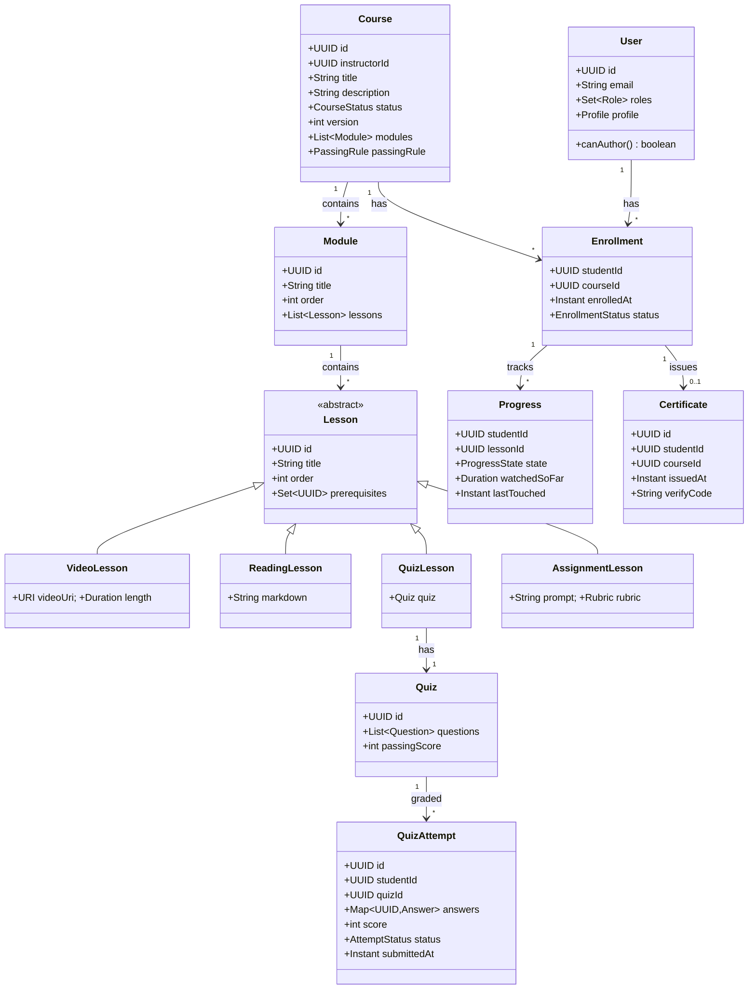

# Design Learning Platform

**Date:** 2026-05-02 | **Updated:** 2026-05-02
**Tags:** `low-level-design` `case-study` `social-content` `education` `progress-tracking`

## Summary

A learning platform (Coursera-, Udemy-, edX-shaped) hosts **courses** authored by instructors and consumed by students. A course is a structured tree of **modules** and **lessons**; learning is gated by **progress**, validated by **quizzes**, and rewarded with **certificates**. This LLD focuses on the entity model, role-based capability split between instructors and students, the progress state machine, the quiz / grading domain, and certificate issuance. Streaming, transcoding, and CDN concerns are out of scope.

## Table of Contents

1. [Requirements (Functional + Non-Functional)](#requirements-functional--non-functional)
2. [Entities and Relationships (Mermaid classDiagram)](#entities-and-relationships-mermaid-classdiagram)
3. [Class Skeletons (Java)](#class-skeletons-java)
4. [Key Algorithms / Workflows](#key-algorithms--workflows)
5. [Patterns Used (with reason)](#patterns-used-with-reason)
6. [Concurrency Considerations](#concurrency-considerations)
7. [Trade-offs and Extensions](#trade-offs-and-extensions)
8. [Related](#related)
9. [References](#references)

## Requirements (Functional + Non-Functional)

**Functional**

- Roles: `STUDENT`, `INSTRUCTOR`, `ADMIN`. A user may hold multiple roles.
- Instructors author courses with modules and ordered lessons. Lessons are `VIDEO`, `READING`, `QUIZ`, or `ASSIGNMENT`.
- Students enroll in a course; enrollment unlocks lesson access.
- Progress tracks per-lesson completion and overall course percent.
- Quizzes have multiple-choice, multi-select, and short-answer questions; scoring is automated for objective items.
- A course completion that meets a passing rule issues a verifiable **Certificate**.
- Gating: a lesson may require prior lessons to be `COMPLETE`.

**Non-Functional**

- A student's progress writes are idempotent (resume from last position).
- Certificate issuance must be exactly-once per `(student, course)` pair.
- Quiz submissions are versioned for instructor review.
- Authoring is concurrent-edit safe (drafts vs. published).

## Entities and Relationships (Mermaid classDiagram)



## Class Skeletons (Java)

```java
public enum Role { STUDENT, INSTRUCTOR, ADMIN }
public enum CourseStatus { DRAFT, PUBLISHED, ARCHIVED }
public enum EnrollmentStatus { ACTIVE, SUSPENDED, COMPLETED, REFUNDED }
public enum ProgressState { NOT_STARTED, IN_PROGRESS, COMPLETE }
public enum AttemptStatus { IN_PROGRESS, SUBMITTED, GRADED, ABANDONED }

public abstract sealed class Lesson permits VideoLesson, ReadingLesson, QuizLesson, AssignmentLesson {
  protected final UUID id;
  protected final String title;
  protected final int order;
  protected final Set<UUID> prerequisites;
  // ...
  public abstract LessonKind kind();
}

public final class Course {
  private final UUID id;
  private final UUID instructorId;
  private final String title;
  private CourseStatus status;
  private int version;
  private final List<Module> modules;
  private PassingRule passingRule;
  // domain methods:
  public void publish() { /* validate non-empty modules, lessons, quizzes */ }
  public void archive() { this.status = CourseStatus.ARCHIVED; }
}
```

```java
public final class EnrollmentService {
  private final EnrollmentRepository repo;
  private final CourseRepository courses;

  @Transactional
  public Enrollment enroll(UUID studentId, UUID courseId) {
    Course c = courses.findPublished(courseId).orElseThrow();
    return repo.findByStudentAndCourse(studentId, courseId)
      .orElseGet(() -> repo.save(Enrollment.fresh(studentId, c.id())));
  }
}
```

```java
public final class ProgressService {
  private final ProgressRepository progress;
  private final LessonRepository lessons;
  private final EnrollmentRepository enrollments;
  private final CertificateService certificates;

  @Transactional
  public void recordWatched(UUID studentId, UUID lessonId, Duration position) {
    Progress p = progress.findOrCreate(studentId, lessonId);
    if (position.compareTo(p.watchedSoFar()) > 0)
      p.advanceTo(position);
    if (p.watchedSoFar().compareTo(lessons.lengthOf(lessonId).multipliedBy(9).dividedBy(10)) >= 0)
      complete(studentId, lessonId);
    progress.save(p);
  }

  @Transactional
  public void complete(UUID studentId, UUID lessonId) {
    if (!gateOpen(studentId, lessonId))
      throw new GateClosedException();
    Progress p = progress.findOrCreate(studentId, lessonId);
    p.markComplete();
    progress.save(p);
    onLessonComplete(studentId, lessonId);
  }

  private boolean gateOpen(UUID studentId, UUID lessonId) {
    Set<UUID> prereqs = lessons.prerequisitesOf(lessonId);
    return progress.allComplete(studentId, prereqs);
  }

  private void onLessonComplete(UUID studentId, UUID lessonId) {
    UUID courseId = lessons.courseOf(lessonId);
    if (progress.percentComplete(studentId, courseId) >= 100)
      certificates.issueIfEligible(studentId, courseId);
  }
}
```

```java
public final class QuizService {
  private final QuizRepository quizzes;
  private final QuizAttemptRepository attempts;
  private final ProgressService progressService;

  @Transactional
  public QuizAttempt submit(UUID studentId, UUID quizId, Map<UUID,Answer> answers) {
    Quiz q = quizzes.findById(quizId).orElseThrow();
    int score = grade(q, answers);
    QuizAttempt attempt = QuizAttempt.submitted(studentId, quizId, answers, score);
    attempts.save(attempt);
    if (score >= q.passingScore())
      progressService.complete(studentId, q.lessonId());
    return attempt;
  }

  private int grade(Quiz q, Map<UUID,Answer> answers) {
    int total = 0, earned = 0;
    for (Question question : q.questions()) {
      total += question.points();
      Answer given = answers.get(question.id());
      if (given != null && question.isCorrect(given))
        earned += question.points();
    }
    return (int)Math.round(100.0 * earned / Math.max(1, total));
  }
}
```

```java
public final class CertificateService {
  private final CertificateRepository repo;
  private final CourseRepository courses;
  private final IdempotencyKeys keys;

  @Transactional
  public Optional<Certificate> issueIfEligible(UUID studentId, UUID courseId) {
    String key = "cert:" + studentId + ":" + courseId;
    if (!keys.acquire(key)) return repo.findByStudentAndCourse(studentId, courseId);
    Course c = courses.findById(courseId).orElseThrow();
    if (!c.passingRule().isMet(progressFor(studentId, courseId)))
      return Optional.empty();
    Certificate cert = Certificate.issue(studentId, courseId);
    return Optional.of(repo.save(cert));
  }
}
```

## Key Algorithms / Workflows

### Progress state machine

```
                start watching
NOT_STARTED ────────────────► IN_PROGRESS
                                  │
                ≥90% watched OR quiz passed OR
                    assignment graded ≥ pass
                                  ▼
                              COMPLETE
```

`Progress` is keyed by `(studentId, lessonId)`. Watched-position writes are monotonic — `advanceTo` rejects regressions to prevent rewind from clobbering further progress.

### Gate evaluation

```java
boolean gateOpen(student, lesson) =
  forall p in lesson.prerequisites: progress(student, p).state == COMPLETE;
```

Cheap because `prerequisites` is a small set per lesson.

### Certificate issuance idempotency

Issuance is gated by a unique `(studentId, courseId)` index on `certificates` and an idempotency key acquired before the issue. Concurrent triggers from a quiz pass and a video completion converge to one certificate row.

## Patterns Used (with reason)

- **Sealed Type Hierarchy** — `Lesson` permits a closed set of subtypes so the compiler enforces exhaustive `switch`.
- **State** — `Progress` and `QuizAttempt` model their own state transitions, blocking illegal moves.
- **Strategy** — `PassingRule` is pluggable (e.g. `AverageScoreAtLeast`, `EveryLessonComplete`, `WeightedFinalAtLeast`).
- **Repository** — Persistence ports keep the domain pure.
- **Specification** — `gateOpen` composes prerequisite predicates.
- **Idempotency Token** — Certificate issuance uses a key acquired in the same transaction as the row insert.
- **Domain Events** — `LessonCompleted` triggers downstream certificate evaluation.

## Concurrency Considerations

- **Optimistic locking** on `Course.version` so concurrent instructor edits don't silently overwrite.
- **Draft / published split** — instructors edit a draft snapshot; publishing copies it forward atomically.
- **Progress writes** — monotonic `advanceTo` is safe under concurrent player heartbeats from multiple devices.
- **Quiz attempt** — server holds the canonical `submittedAt`; multiple "submit" clicks reduce to one row via unique index on `(studentId, quizId, attemptNumber)`.
- **Certificate issuance** — unique index + idempotency key + check inside transaction.
- **Long-running grading** — assignment grading by an instructor uses optimistic locking on `QuizAttempt.version` to avoid double-grade overwrites.

## Trade-offs and Extensions

- **Tree vs. graph curriculum.** A pure tree is simple. Real platforms add prerequisite edges, making it a DAG; we keep `prerequisites: Set<UUID>` per lesson to support both.
- **Sync vs. async grading.** Auto-graded MCQs commit synchronously; assignments queue for instructor review with a `GRADED` transition.
- **Single-table vs. polymorphic lesson storage.** STI keeps queries simple; polymorphic with separate tables avoids sparse columns.
- **Certificate verification.** A signed code lets third parties verify without server access; trade-off is rotating signing keys and backward verification.
- **Extensions.** Cohorts (timed enrollments), peer review, discussion threads per lesson, proctored exams, badges, learning paths spanning multiple courses.

## Related

- Siblings: [Design Stack Overflow](./design-stack-overflow.md), [Design a Social Network](./design-social-network.md), [Design Cricinfo](./design-cricinfo.md), [Design LinkedIn](./design-linkedin.md), [Design Spotify](./design-spotify.md)
- Patterns: [State](../../design-patterns/behavioral/state.md), [Strategy](../../design-patterns/behavioral/strategy.md), [Repository](../../design-patterns/additional/repository-pattern.md), [Specification](../../design-patterns/additional/specification-pattern.md)
- HLD twin: [System Design INDEX](../../../system-design/INDEX.md)

## References

- IMS Global. *Caliper Analytics Specification.* (Learning event model.)
- W3C. *Verifiable Credentials Data Model.* (Certificate verification semantics.)
- Fowler, M. *State* and *Strategy* patterns, *Patterns of Enterprise Application Architecture*.
- Vernon, V. *Implementing Domain-Driven Design.* Aggregates, Domain Events.
