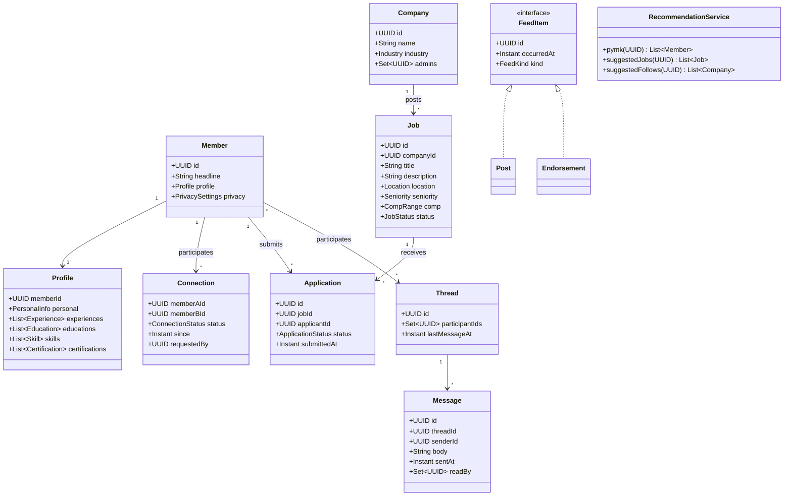
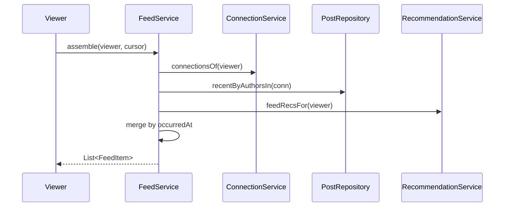

# Design LinkedIn

**Date:** 2026-05-02 | **Updated:** 2026-05-02
**Tags:** `low-level-design` `case-study` `social-content` `professional-network` `jobs`

## Summary

LinkedIn is a professional network blending **profiles**, a **mutual connection graph**, **jobs**, **messaging**, and a **content feed** with **recommendations**. This LLD models the OOD shape of the platform: profile composition, the connection invitation lifecycle, the job posting / application domain, message threads, and a feed-with-recommendations pipeline. We deliberately keep capacity, sharding, ranking models, and search infrastructure out of scope.

## Table of Contents

1. [Requirements (Functional + Non-Functional)](#requirements-functional--non-functional)
2. [Entities and Relationships (Mermaid classDiagram)](#entities-and-relationships-mermaid-classdiagram)
3. [Class Skeletons (Java)](#class-skeletons-java)
4. [Key Algorithms / Workflows](#key-algorithms--workflows)
5. [Patterns Used (with reason)](#patterns-used-with-reason)
6. [Concurrency Considerations](#concurrency-considerations)
7. [Trade-offs and Extensions](#trade-offs-and-extensions)
8. [Related](#related)
9. [References](#references)

## Requirements (Functional + Non-Functional)

**Functional**

- A **Profile** has identity (name, headline, photo) and ordered **experiences**, **education**, **skills**, **certifications**, and **endorsements**.
- A **Connection** is symmetric and requires both parties to accept.
- A **Job** is posted by a **Company** with role, location, comp, and seniority. Members **apply** to jobs.
- **Messaging** is per-thread, 1:1 or small group, with read receipts.
- The **Feed** shows posts from connections and followed companies/hashtags, plus recommended content.
- **Recommendations** include "People you may know", suggested jobs, and follow suggestions.

**Non-Functional**

- Connection invitations are **idempotent** — sending the same invite twice does nothing extra.
- Privacy: profile fields have per-field visibility (`PUBLIC`, `CONNECTIONS`, `PRIVATE`).
- Job applications are append-only with a state machine.
- Messaging preserves order per thread.

## Entities and Relationships (Mermaid classDiagram)



## Class Skeletons (Java)

```java
public enum ConnectionStatus { PENDING, ACCEPTED, REJECTED, WITHDRAWN, BLOCKED }
public enum JobStatus { OPEN, PAUSED, CLOSED, FILLED }
public enum ApplicationStatus { SUBMITTED, REVIEWED, INTERVIEW, OFFERED, REJECTED, WITHDRAWN }
public enum FieldVisibility { PUBLIC, CONNECTIONS, PRIVATE }

public final class Profile {
  private final UUID memberId;
  private PersonalInfo personal;
  private final List<Experience> experiences;
  private final List<Education> educations;
  private final List<Skill> skills;
  private final List<Certification> certifications;
  private final Map<String, FieldVisibility> visibility;

  public boolean canSeeField(String fieldKey, ViewerRelation rel) {
    FieldVisibility v = visibility.getOrDefault(fieldKey, FieldVisibility.PUBLIC);
    return switch (v) {
      case PUBLIC      -> true;
      case CONNECTIONS -> rel == ViewerRelation.SELF || rel == ViewerRelation.CONNECTED;
      case PRIVATE     -> rel == ViewerRelation.SELF;
    };
  }
}
```

```java
public final class ConnectionService {
  private final ConnectionRepository repo;

  @Transactional
  public Connection invite(UUID from, UUID to) {
    if (from.equals(to)) throw new SelfConnectException();
    UUID a = min(from, to), b = max(from, to);
    return repo.findByPair(a, b).orElseGet(() ->
      repo.save(new Connection(a, b, ConnectionStatus.PENDING, Instant.now(), from)));
  }

  @Transactional
  public void accept(UUID accepter, UUID counterparty) {
    Connection c = repo.findByPair(min(accepter, counterparty), max(accepter, counterparty))
      .orElseThrow();
    if (!c.requestedBy().equals(counterparty)) throw new IllegalStateException();
    c.accept();
    repo.save(c);
  }
}
```

```java
public final class JobService {
  private final JobRepository jobs;
  private final ApplicationRepository apps;

  public UUID postJob(UUID companyId, UUID poster, JobInput in) {
    requireCompanyAdmin(companyId, poster);
    Job j = Job.create(companyId, in);
    jobs.save(j);
    return j.id();
  }

  @Transactional
  public Application apply(UUID memberId, UUID jobId) {
    if (apps.exists(memberId, jobId))
      throw new DuplicateApplicationException();
    Job j = jobs.findOpen(jobId).orElseThrow();
    Application a = Application.submit(memberId, j.id());
    return apps.save(a);
  }

  @Transactional
  public void transition(UUID applicationId, ApplicationStatus next) {
    Application a = apps.findById(applicationId).orElseThrow();
    a.transitionTo(next);                 // enforces legal transitions
    apps.save(a);
  }
}
```

```java
public final class MessagingService {
  private final ThreadRepository threads;
  private final MessageRepository messages;

  public Message send(UUID senderId, UUID threadId, String body) {
    Thread t = threads.findById(threadId).orElseThrow();
    if (!t.participantIds().contains(senderId)) throw new AccessException();
    Message m = Message.create(threadId, senderId, body);
    messages.append(m);
    threads.touch(threadId, m.sentAt());
    return m;
  }

  public List<Message> read(UUID viewerId, UUID threadId, Cursor c, int limit) {
    return messages.read(threadId, c, limit);
  }
}
```

```java
public final class FeedService {
  private final ConnectionService connections;
  private final PostRepository posts;
  private final RecommendationService recs;

  public List<FeedItem> assemble(UUID viewer, Cursor c, int limit) {
    Set<UUID> connIds = connections.connectionsOf(viewer);
    List<Post> recent = posts.recentByAuthorsIn(connIds, c, limit);
    List<FeedItem> recommended = recs.feedRecsFor(viewer, limit / 4);
    return Merger.byOccurredAt(recent, recommended, limit);
  }
}

public final class RecommendationService {
  private final ConnectionRepository connections;
  private final ProfileRepository profiles;

  public List<Member> pymk(UUID memberId) {
    Set<UUID> direct = connections.connectionsOf(memberId);
    Map<UUID, Integer> mutualCount = new HashMap<>();
    for (UUID friend : direct)
      for (UUID friendOfFriend : connections.connectionsOf(friend))
        if (!direct.contains(friendOfFriend) && !friendOfFriend.equals(memberId))
          mutualCount.merge(friendOfFriend, 1, Integer::sum);
    return mutualCount.entrySet().stream()
      .sorted(Map.Entry.<UUID,Integer>comparingByValue().reversed())
      .limit(50)
      .map(e -> profiles.findMember(e.getKey()))
      .toList();
  }
}
```

## Key Algorithms / Workflows

### Connection invitation state machine

```
                   invite                 accept
   NONE ──────────────────► PENDING ─────────────► ACCEPTED
                              │
                  withdraw    │ reject
                              ▼
                          WITHDRAWN / REJECTED
```

The pair `(min(a,b), max(a,b))` is the canonical key, ensuring no duplicate invites in either direction.

### Application state machine

```
SUBMITTED → REVIEWED → INTERVIEW → OFFERED → ACCEPTED
            ↘            ↘          ↘
              REJECTED    REJECTED   REJECTED
SUBMITTED → WITHDRAWN
```

`Application.transitionTo(next)` is encapsulated: only legal moves succeed.

### People-You-May-Know (PYMK)

For each direct connection, walk to their connections and count occurrences of unseen members. Sort by mutual count and rank. This is `O(D · D̄)` where `D` is the viewer's degree and `D̄` is mean friend degree — adequate as a first-pass model.

### Feed assembly (sequence)



## Patterns Used (with reason)

- **Aggregate Root** — `Profile` aggregates the ordered child collections; mutations go through the root.
- **State** — `Connection` and `Application` enforce legal transitions internally.
- **Repository** — Persistence is abstracted from domain entities.
- **Specification** — `Profile.canSeeField` composes per-field visibility predicates.
- **Strategy** — `RecommendationService` exposes pluggable recommenders (PYMK, jobs, follows).
- **Facade** — `FeedService` combines connection lookup, post repo, and recommendations behind one call.
- **Observer / Domain Events** — Profile updates trigger feed and search reindex.

## Concurrency Considerations

- **Connection idempotency** — unique index on `(min(a,b), max(a,b))` and the canonical key in code.
- **Application uniqueness** — unique `(jobId, applicantId)` index ensures one application per pair.
- **Thread fan-in** — multiple senders write concurrently; messages get a server-assigned `sentAt` and per-thread monotonic `seq`.
- **Profile updates** — optimistic locking on `Profile.version` prevents lost updates between concurrent edits.
- **PYMK precompute** — recomputation runs offline; reads serve a snapshot.
- **Privacy at read** — visibility is checked when assembling responses, not stored on copies.

## Trade-offs and Extensions

- **Symmetric vs. asymmetric edges.** LinkedIn's "Connection" is symmetric (mutual accept), while "Follow" is asymmetric (one-way). The `Connection` here is symmetric; a separate `Follow` edge is the natural extension.
- **Profile as one aggregate.** Keeps invariants tight but makes partial-update queries chunky. Splitting into `ExperienceRepository`, `EducationRepository` improves write throughput at the cost of cross-aggregate consistency.
- **Recommendations inline vs. async.** Inline keeps the request loop simple; async batches give better quality but introduce staleness.
- **Feed: pure chronological vs. ranked.** Same trade-off as a generic social network; LinkedIn skews ranked.
- **Extensions.** InMail credits, Recruiter / Sales Navigator surfaces, learning courses, premium gating, anonymous browsing, skill assessments, company analytics.

## Related

- Siblings: [Design Stack Overflow](./design-stack-overflow.md), [Design a Social Network](./design-social-network.md), [Design Learning Platform](./design-learning-platform.md), [Design Cricinfo](./design-cricinfo.md), [Design Spotify](./design-spotify.md)
- Patterns: [State](../../design-patterns/behavioral/state.md), [Strategy](../../design-patterns/behavioral/strategy.md), [Repository](../../design-patterns/additional/repository-pattern.md), [Specification](../../design-patterns/additional/specification-pattern.md), [Facade](../../design-patterns/structural/facade.md)
- HLD twin: [System Design INDEX](../../../system-design/INDEX.md)

## References

- LinkedIn Engineering. *People You May Know* historical posts on the engineering blog.
- Fowler, M. *Patterns of Enterprise Application Architecture* — Domain Model, Repository, State.
- Vernon, V. *Implementing Domain-Driven Design.*
- Schema.org. *Person*, *Organization*, *JobPosting* vocabularies.
