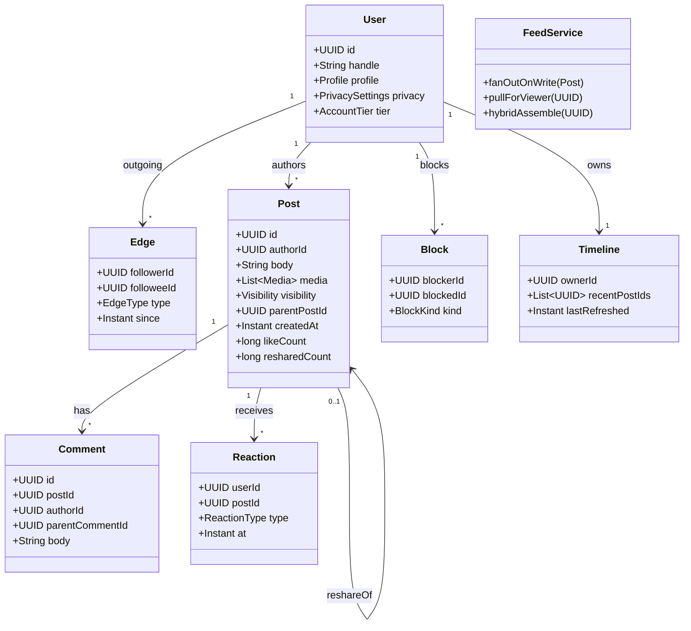
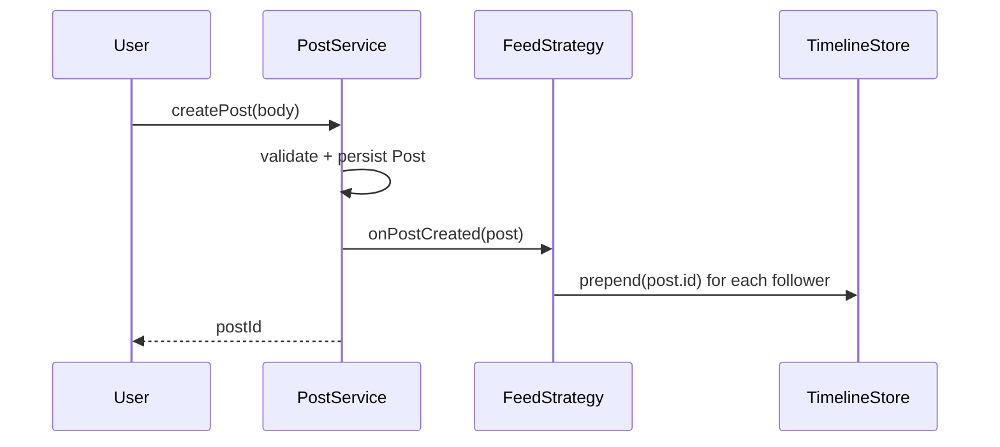

# Design a Social Network

**Date:** 2026-05-02 | **Updated:** 2026-05-02
**Tags:** `low-level-design` `case-study` `social-content` `social-graph` `feed`

## Summary

A general social network combines a **user graph**, **posts**, and a **timeline / feed**. This LLD focuses on the OOD shape: users and edges (follow vs. friendship), posts with media and visibility, comments and reactions, and the three classic feed-generation strategies — **fan-out on write (push)**, **fan-out on read (pull)**, and **hybrid** for celebrity-class accounts. We model the domain in Java as if implementing a single bounded context; capacity planning, sharding, and queue topology are intentionally out of scope.

## Table of Contents

1. [Requirements (Functional + Non-Functional)](#requirements-functional--non-functional)
2. [Entities and Relationships (Mermaid classDiagram)](#entities-and-relationships-mermaid-classdiagram)
3. [Class Skeletons (Java)](#class-skeletons-java)
4. [Key Algorithms / Workflows](#key-algorithms--workflows)
5. [Patterns Used (with reason)](#patterns-used-with-reason)
6. [Concurrency Considerations](#concurrency-considerations)
7. [Trade-offs and Extensions](#trade-offs-and-extensions)
8. [Related](#related)
9. [References](#references)

## Requirements (Functional + Non-Functional)

**Functional**

- Users have profiles (handle, display name, bio, avatar) and privacy settings.
- Edges support both **directed follow** (Twitter-style) and **mutual friendship** (Facebook-style). The system models both via the same primitive.
- Users post text + optional media; visibility is `PUBLIC`, `FOLLOWERS`, `FRIENDS`, or `LIST`.
- Posts can be liked, reshared, and commented on. Replies form a tree to depth N.
- A timeline shows the merged stream of posts authored by accounts the viewer follows, ordered by recency (or rank).
- Block / mute hide content from feed without informing the blocked party.

**Non-Functional**

- Feed read latency dominates write latency for typical users.
- Celebrities have followers >> N where N is fan-out break-even — must not stall their post path.
- Privacy must be enforced **at read time** (deny-by-default) regardless of cached materialization.

## Entities and Relationships (Mermaid classDiagram)



## Class Skeletons (Java)

```java
public enum EdgeType { FOLLOW, FRIEND_REQUEST, FRIENDSHIP }
public enum Visibility { PUBLIC, FOLLOWERS, FRIENDS, LIST }
public enum AccountTier { NORMAL, VERIFIED, CELEBRITY }
public enum ReactionType { LIKE, LOVE, LAUGH, SAD, ANGRY }

public final class User {
  private final UUID id;
  private final String handle;
  private final Profile profile;
  private final PrivacySettings privacy;
  private final AccountTier tier;
  // ...
}

public final class Edge {
  private final UUID followerId;
  private final UUID followeeId;
  private final EdgeType type;
  private final Instant since;
  // friendship is two reciprocal FOLLOW edges promoted to FRIENDSHIP on accept.
}

public final class Post {
  private final UUID id;
  private final UUID authorId;
  private final String body;
  private final List<Media> media;
  private final Visibility visibility;
  private final UUID parentPostId;   // null for original; set for reshare
  private final Instant createdAt;
  private long likeCount;
  private long resharedCount;
}
```

```java
public interface SocialGraph {
  void follow(UUID follower, UUID followee);
  void unfollow(UUID follower, UUID followee);
  void requestFriendship(UUID a, UUID b);
  void acceptFriendship(UUID a, UUID b);
  Set<UUID> followers(UUID userId);          // in-edges
  Set<UUID> followees(UUID userId);          // out-edges
  boolean isFollowing(UUID a, UUID b);
  boolean areFriends(UUID a, UUID b);
}

public final class GraphService implements SocialGraph {
  private final EdgeRepository edges;

  @Transactional
  public void follow(UUID follower, UUID followee) {
    if (follower.equals(followee)) throw new SelfEdgeException();
    edges.upsert(new Edge(follower, followee, EdgeType.FOLLOW, Instant.now()));
  }
  @Transactional
  public void acceptFriendship(UUID a, UUID b) {
    edges.upsert(new Edge(a, b, EdgeType.FRIENDSHIP, Instant.now()));
    edges.upsert(new Edge(b, a, EdgeType.FRIENDSHIP, Instant.now()));
  }
}
```

```java
public interface FeedStrategy {
  void onPostCreated(Post post);
  List<Post> assemble(UUID viewer, Cursor cursor, int limit);
}

public final class PushFeedStrategy implements FeedStrategy {
  private final SocialGraph graph;
  private final TimelineStore timelines;

  public void onPostCreated(Post p) {
    for (UUID follower : graph.followers(p.authorId()))
      timelines.prepend(follower, p.id());
  }
  public List<Post> assemble(UUID viewer, Cursor c, int limit) {
    return timelines.read(viewer, c, limit);
  }
}

public final class PullFeedStrategy implements FeedStrategy {
  private final SocialGraph graph;
  private final PostRepository posts;

  public void onPostCreated(Post p) { /* nothing */ }
  public List<Post> assemble(UUID viewer, Cursor c, int limit) {
    Set<UUID> followees = graph.followees(viewer);
    return posts.recentByAuthorsIn(followees, c, limit);
  }
}

public final class HybridFeedStrategy implements FeedStrategy {
  private final PushFeedStrategy push;
  private final PullFeedStrategy pull;
  private final UserRepository users;

  public void onPostCreated(Post p) {
    if (users.tier(p.authorId()) != AccountTier.CELEBRITY)
      push.onPostCreated(p);
  }
  public List<Post> assemble(UUID viewer, Cursor c, int limit) {
    List<Post> normal = push.assemble(viewer, c, limit);
    Set<UUID> celebFollowees = users.celebrityFollowees(viewer);
    List<Post> celeb = pull.assembleFor(celebFollowees, c, limit);
    return Merger.byCreatedAtDesc(normal, celeb, limit);
  }
}
```

```java
public final class FeedService {
  private final FeedStrategy strategy;
  private final PrivacyEvaluator privacy;
  private final BlockRepository blocks;

  public List<Post> read(UUID viewer, Cursor cursor, int limit) {
    List<Post> raw = strategy.assemble(viewer, cursor, limit * 2);
    Set<UUID> blocked = blocks.blockedBy(viewer);
    return raw.stream()
      .filter(p -> !blocked.contains(p.authorId()))
      .filter(p -> privacy.canSee(viewer, p))
      .limit(limit)
      .toList();
  }
}
```

```java
public final class PrivacyEvaluator {
  private final SocialGraph graph;

  public boolean canSee(UUID viewer, Post p) {
    if (p.authorId().equals(viewer)) return true;
    return switch (p.visibility()) {
      case PUBLIC    -> true;
      case FOLLOWERS -> graph.isFollowing(viewer, p.authorId());
      case FRIENDS   -> graph.areFriends(viewer, p.authorId());
      case LIST      -> graph.isInList(viewer, p.listId());
    };
  }
}
```

## Key Algorithms / Workflows

### Fan-out on write (push) — sequence



Cost: `O(F)` writes per post, where `F = followers(author)`. Read is `O(P)` with `P = page size`.

### Fan-out on read (pull)

`recentByAuthorsIn(followees, cursor, limit)` runs an indexed query over `posts(author_id, created_at)` filtered by the followee set and merged by `created_at`. Cost is `O(F · log N)` per read; cheap on write, expensive on read.

### Hybrid

Above an account tier threshold (e.g. `CELEBRITY` if `followers > 1M`), skip push for that author. At read time, merge per-viewer materialized timeline with a pulled list of recent celebrity posts, sorted by recency or rank.

## Patterns Used (with reason)

- **Strategy** — `FeedStrategy` allows runtime selection of push/pull/hybrid per author tier.
- **Repository** — `EdgeRepository`, `PostRepository`, `TimelineStore` separate persistence from domain.
- **Specification / Predicate** — `PrivacyEvaluator` composes block + visibility + relationship checks.
- **Observer / Domain Events** — `Post.created` event fans out via `FeedStrategy.onPostCreated`.
- **Facade** — `FeedService` is the single read entrypoint for clients.
- **Composite** — Comment trees use parent-pointer composite for thread rendering.

## Concurrency Considerations

- **Edge uniqueness** — `(followerId, followeeId)` unique index makes follow/unfollow idempotent.
- **Friendship promotion** — accepting a friend request promotes both directional edges in one transaction.
- **Timeline writes** — push fan-out uses an idempotent `prepend(ownerId, postId)`; replays are safe because timelines deduplicate by post id.
- **Privacy at read** — never trust the cached timeline; re-evaluate visibility after assembly so revoked access is enforced immediately.
- **Block races** — block applied at read filter; pre-existing materialized entries simply get filtered out next request.
- **Counter updates** — `likeCount` is a denormalized counter updated by atomic `+1 / -1`; truth lives in the `Reaction` table.

## Trade-offs and Extensions

- **Push vs. Pull.** Push wins on read latency, loses on celebrity write storms. Pull wins on write simplicity, loses on read fan-out cost. Hybrid pays complexity tax for both.
- **Recency vs. Ranked feed.** Pure chronological is predictable; ranked (engagement / affinity) drives engagement but adds a scoring service.
- **Friendship vs. Follow.** Modelling both via the same `Edge` keeps the graph uniform; a dedicated `Friendship` entity would simplify symmetric queries but duplicate state.
- **Privacy enforcement.** Doing it at read is safer; doing it at write (filtered fan-out) is faster but leaks past visibility decisions.
- **Extensions.** Stories with TTL, group posts, reactions on comments, shadow-banning, recommendations ("People you may know"), spam classifier in the post pipeline.

## Related

- Siblings: [Design Stack Overflow](./design-stack-overflow.md), [Design Learning Platform](./design-learning-platform.md), [Design Cricinfo](./design-cricinfo.md), [Design LinkedIn](./design-linkedin.md), [Design Spotify](./design-spotify.md)
- Patterns: [Strategy](../../design-patterns/behavioral/strategy.md), [Observer](../../design-patterns/behavioral/observer.md), [Facade](../../design-patterns/structural/facade.md), [Specification](../../design-patterns/additional/specification-pattern.md)
- HLD twin: [System Design INDEX](../../../system-design/INDEX.md)

## References

- Silberstein, A. et al. *Feeding Frenzy: Selectively Materializing Users' Event Feeds.* SIGMOD 2010.
- Twitter Engineering. *The Infrastructure Behind Twitter: Scale.* (Earlybird / Timeline / Manhattan posts.)
- Facebook Engineering. *TAO: Facebook's Distributed Data Store for the Social Graph.* USENIX ATC 2013.
- Vernon, V. *Implementing Domain-Driven Design.* Aggregates, Domain Events.
