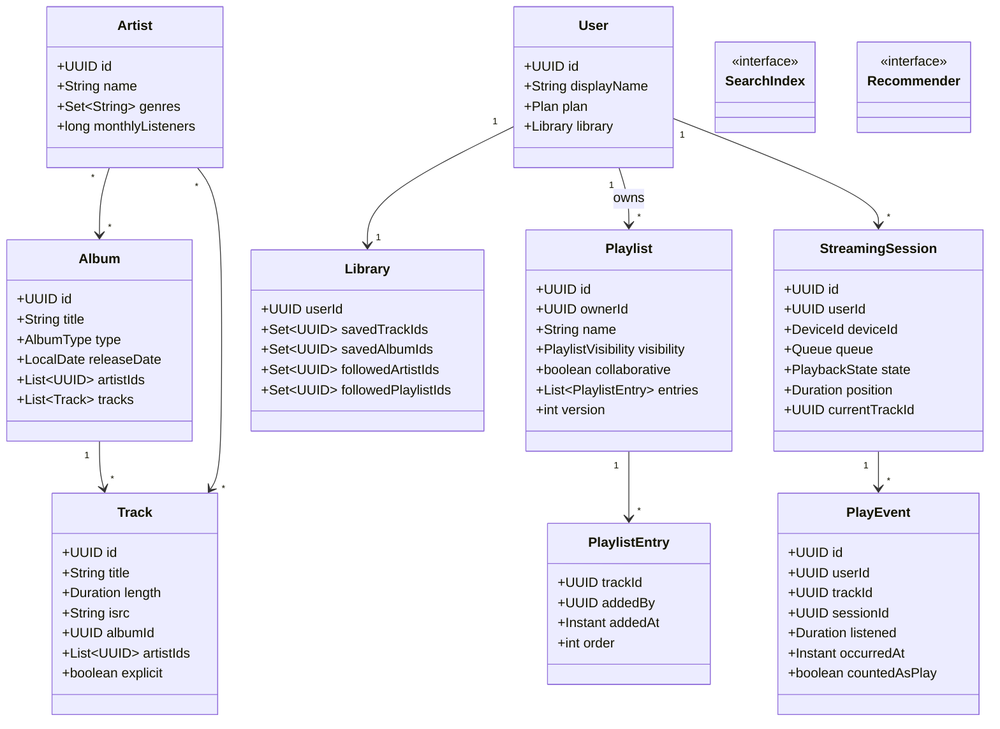

# Design Spotify

**Date:** 2026-05-02 | **Updated:** 2026-05-02
**Tags:** `low-level-design` `case-study` `social-content` `music-streaming` `recommendations`

## Summary

Spotify-style music streaming exposes a **catalog** (artists, albums, tracks), per-user **library** and **playlists**, **search**, **recommendations**, and a **streaming session** that delivers audio with playback state. This LLD focuses on the OOD shape: catalog hierarchy, playlist composition, library subscription model, the streaming session state machine, and a recommendation port. CDN, codec ladder, transcoding, ad serving, and royalty accounting are out of scope.

## Table of Contents

1. [Requirements (Functional + Non-Functional)](#requirements-functional--non-functional)
2. [Entities and Relationships (Mermaid classDiagram)](#entities-and-relationships-mermaid-classdiagram)
3. [Class Skeletons (Java)](#class-skeletons-java)
4. [Key Algorithms / Workflows](#key-algorithms--workflows)
5. [Patterns Used (with reason)](#patterns-used-with-reason)
6. [Concurrency Considerations](#concurrency-considerations)
7. [Trade-offs and Extensions](#trade-offs-and-extensions)
8. [Related](#related)
9. [References](#references)

## Requirements (Functional + Non-Functional)

**Functional**

- Catalog: `Artist`, `Album`, `Track` with track ↔ album / artist relationships and ISRC identifiers.
- Library: a user can save tracks, albums, and follow artists / playlists.
- Playlists: user-created, ordered list of tracks; can be collaborative or private.
- Search: free-text over artists, albums, tracks, and playlists with facets.
- Recommendations: personalized feeds (Daily Mixes, Discover Weekly), seeded radio.
- Streaming session: starts playback of a track, advances through a queue, supports pause / seek / next / previous, scrobbles play events.

**Non-Functional**

- A play counts only if the listener crossed a threshold (e.g. 30s).
- Session play history is the source of truth for personalization.
- Playlist edits are concurrency-safe across collaborators.
- Library writes are idempotent.

## Entities and Relationships (Mermaid classDiagram)



## Class Skeletons (Java)

```java
public enum AlbumType { ALBUM, EP, SINGLE, COMPILATION }
public enum Plan { FREE, PREMIUM, FAMILY, STUDENT }
public enum PlaylistVisibility { PUBLIC, UNLISTED, PRIVATE }
public enum PlaybackState { IDLE, PLAYING, PAUSED, BUFFERING, ENDED }

public final class Track {
  private final UUID id;
  private final String title;
  private final Duration length;
  private final String isrc;          // ISO 3901
  private final UUID albumId;
  private final List<UUID> artistIds;
  private final boolean explicit;
}

public final class Library {
  private final UUID userId;
  private final Set<UUID> savedTrackIds = new LinkedHashSet<>();
  private final Set<UUID> savedAlbumIds = new LinkedHashSet<>();
  private final Set<UUID> followedArtistIds = new HashSet<>();
  private final Set<UUID> followedPlaylistIds = new HashSet<>();

  public boolean saveTrack(UUID trackId)   { return savedTrackIds.add(trackId); }
  public boolean unsaveTrack(UUID trackId) { return savedTrackIds.remove(trackId); }
}
```

```java
public final class Playlist {
  private final UUID id;
  private final UUID ownerId;
  private String name;
  private PlaylistVisibility visibility;
  private boolean collaborative;
  private final List<PlaylistEntry> entries = new ArrayList<>();
  private int version;                 // optimistic lock

  public void addTrack(UUID trackId, UUID addedBy) {
    requireWriter(addedBy);
    entries.add(new PlaylistEntry(trackId, addedBy, Instant.now(), entries.size()));
    version++;
  }
  public void removeAt(int index, UUID actor) {
    requireWriter(actor);
    entries.remove(index);
    reindex();
    version++;
  }
  public void reorder(int from, int to, UUID actor) {
    requireWriter(actor);
    PlaylistEntry e = entries.remove(from);
    entries.add(to, e);
    reindex();
    version++;
  }
  private void requireWriter(UUID actor) {
    if (!ownerId.equals(actor) && !collaborative) throw new AccessException();
  }
}
```

```java
public final class StreamingSession {
  private final UUID id;
  private final UUID userId;
  private final DeviceId deviceId;
  private Queue queue;
  private PlaybackState state;
  private Duration position;
  private UUID currentTrackId;
  private final List<PlayEvent> events = new ArrayList<>();

  public void play(UUID trackId) {
    flushIfPlaying();
    this.currentTrackId = trackId;
    this.position = Duration.ZERO;
    this.state = PlaybackState.PLAYING;
  }
  public void pause()  { if (state == PlaybackState.PLAYING) state = PlaybackState.PAUSED; }
  public void resume() { if (state == PlaybackState.PAUSED)  state = PlaybackState.PLAYING; }
  public void seek(Duration to) { this.position = to; }
  public void next() { play(queue.dequeue()); }
  public void previous() { play(queue.previous()); }

  private void flushIfPlaying() {
    if (currentTrackId != null) {
      boolean counted = position.toSeconds() >= 30;
      events.add(new PlayEvent(UUID.randomUUID(), userId, currentTrackId, id,
        position, Instant.now(), counted));
    }
  }
  public List<PlayEvent> drainEvents() {
    List<PlayEvent> out = List.copyOf(events);
    events.clear();
    return out;
  }
}
```

```java
public interface SearchIndex {
  SearchPage search(String query, Set<EntityKind> kinds, Cursor cursor, int limit);
}

public interface Recommender {
  List<Track> dailyMix(UUID userId, int slot);
  List<Track> discoverWeekly(UUID userId);
  List<Track> radioFor(UUID seedTrackId);
}
```

```java
public final class StreamingService {
  private final SessionRepository sessions;
  private final TrackRepository tracks;
  private final PlayEventStore events;

  @Transactional
  public StreamingSession startOrResume(UUID userId, DeviceId device, UUID firstTrack) {
    StreamingSession s = sessions.activeFor(userId)
      .orElseGet(() -> sessions.save(StreamingSession.fresh(userId, device)));
    s.play(firstTrack);
    sessions.save(s);
    return s;
  }

  public void heartbeat(UUID sessionId, Duration position, PlaybackState state) {
    StreamingSession s = sessions.findById(sessionId).orElseThrow();
    s.applyHeartbeat(position, state);
    sessions.save(s);
  }

  public void endSession(UUID sessionId) {
    StreamingSession s = sessions.findById(sessionId).orElseThrow();
    s.end();
    events.appendAll(s.drainEvents());
    sessions.save(s);
  }
}
```

## Key Algorithms / Workflows

### Streaming session state machine

```
            play(t)            pause          resume         end
   IDLE ─────────────► PLAYING ──────► PAUSED ──────► PLAYING ────► ENDED
                          │                                │
                          │ buffer underrun                │ track ends
                          ▼                                ▼
                      BUFFERING                          (next() or ENDED)
```

A `PlayEvent` is emitted on each `play()` / `next()` / `previous()` / `endSession()` and on a periodic flush. `countedAsPlay = listened.toSeconds() >= 30`.

### Playlist concurrent edit

```mermaid
sequenceDiagram
    participant A as Editor A
    participant B as Editor B
    participant PL as PlaylistService
    A->>PL: addTrack(playlistId, t1, version=12)
    B->>PL: addTrack(playlistId, t2, version=12)
    PL->>PL: A wins; version → 13
    PL-->>B: 409 ConflictException
    B->>PL: reload version=13, retry addTrack
    PL-->>B: ok; version → 14
```

### Recommendations

`Recommender` is a port. A simple implementation backed by play history:

1. Aggregate the user's last 90 days of `PlayEvent`s.
2. Score artists / tracks by frequency, recency, and explicit feedback (saves, skips).
3. Cluster into "mixes" by genre / mood embedding.
4. Persist as `RecommendationSet(userId, slotKey, generatedAt, trackIds)`.

### Search facet merge

`SearchIndex.search(query, {ARTIST, ALBUM, TRACK, PLAYLIST}, cursor, limit)` returns a faceted page. Ranking uses popularity + textual match; the LLD treats the engine as a port.

## Patterns Used (with reason)

- **Aggregate Root** — `Playlist` and `StreamingSession` mutate only through their roots, keeping invariants (ordering, version, state machine) intact.
- **State** — `StreamingSession` enforces legal transitions between `IDLE → PLAYING → PAUSED → ENDED`.
- **Strategy** — `Recommender` and `SearchIndex` are ports with multiple strategies (collaborative filter, content-based, popularity).
- **Repository** — Persistence ports for catalog, library, playlist, session.
- **Value Object** — `PlaylistEntry`, `PlayEvent`, `Queue` items are immutable values.
- **Observer / Outbox** — Drained `PlayEvent`s feed the recommendation pipeline asynchronously.
- **Facade** — `StreamingService` is the single client entrypoint.

## Concurrency Considerations

- **Optimistic locking** on `Playlist.version` so collaborative edits don't lose updates; conflicts surface as `409` for client retry.
- **Library idempotency** — `Set` semantics make `saveTrack` and `unsaveTrack` idempotent; the persistence layer uses a unique `(userId, trackId)` index.
- **Single active session per device** enforced by a unique `(userId, deviceId)` index on active sessions; "play here instead" transfers update `deviceId` atomically.
- **Heartbeat ordering** — heartbeats carry monotonic `clientTick`; out-of-order ones are dropped.
- **Play event ingest** — append-only log; the 30-second threshold is enforced server-side at flush so client clocks can't game counts.
- **Recommendation freshness** — generated offline; `RecommendationSet` is read concurrently with no coordination.

## Trade-offs and Extensions

- **Track inside Album vs. standalone Track.** Modeling Track as an aggregate-of-its-own avoids loading huge album aggregates for a single track lookup; cross-album playlists demand it anyway.
- **Library as one aggregate vs. separate stores.** A single `Library` is convenient for small users but limits write throughput; in practice, splitting `SavedTrack`, `SavedAlbum`, `Follow` is standard.
- **Playlist storage shape.** Materialized ordered list vs. doubly-linked list (Spotify historically used a linked-list-like CRDT for playlist edits). Linked structures avoid full-list rewrites but complicate range reads.
- **Recommendations inline vs. async.** Async batches deliver better quality. Inline radio (seeded next-track) demands a fast path.
- **Extensions.** Podcasts, audiobooks, social blends ("Blend" playlists), Spotify Connect cross-device handoff, lyrics & timed transcripts, ad insertion for free tier.

## Related

- Siblings: [Design Stack Overflow](./design-stack-overflow.md), [Design a Social Network](./design-social-network.md), [Design Learning Platform](./design-learning-platform.md), [Design Cricinfo](./design-cricinfo.md), [Design LinkedIn](./design-linkedin.md)
- Patterns: [State](../../design-patterns/behavioral/state.md), [Strategy](../../design-patterns/behavioral/strategy.md), [Repository](../../design-patterns/additional/repository-pattern.md), [Facade](../../design-patterns/structural/facade.md), [Observer](../../design-patterns/behavioral/observer.md)
- HLD twin: [System Design INDEX](../../../system-design/INDEX.md)

## References

- IFPI / ISO 3901 — *International Standard Recording Code (ISRC).*
- Spotify Engineering. *Music recommendations at Spotify* historical posts (Discover Weekly, Daily Mix).
- Fowler, M. *Patterns of Enterprise Application Architecture* — Domain Model, Repository, Optimistic Offline Lock.
- Vernon, V. *Implementing Domain-Driven Design.*
