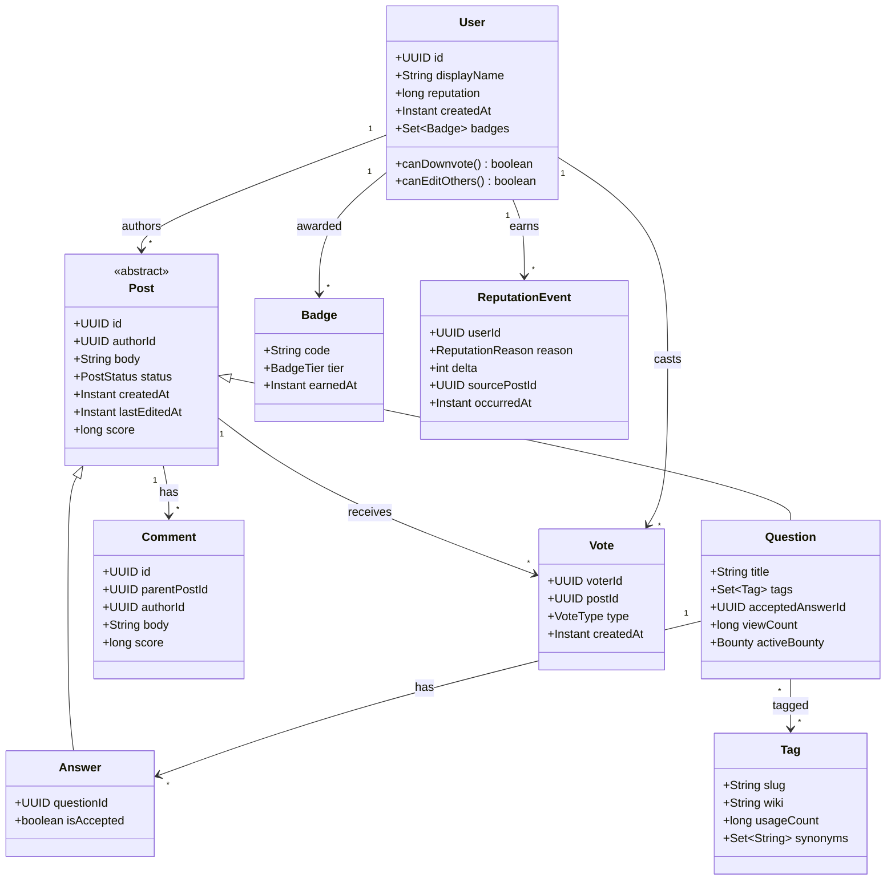

# Design Stack Overflow

**Date:** 2026-05-02 | **Updated:** 2026-05-02
**Tags:** `low-level-design` `case-study` `social-content` `q-and-a` `voting` `reputation`

## Summary

Stack Overflow is a Q&A platform where users post **questions**, receive **answers**, leave **comments**, **vote** on contributions, and earn **reputation** and **badges**. This LLD focuses on the object model: question/answer/comment hierarchy, the voting subsystem, the reputation engine, tag taxonomy, and a search facade. Capacity, sharding, and CDN concerns are out of scope — we model the domain in OOD terms suitable for a single Spring Boot service backed by a relational store and a search index abstraction.

## Table of Contents

1. [Requirements (Functional + Non-Functional)](#requirements-functional--non-functional)
2. [Entities and Relationships (Mermaid classDiagram)](#entities-and-relationships-mermaid-classdiagram)
3. [Class Skeletons (Java)](#class-skeletons-java)
4. [Key Algorithms / Workflows](#key-algorithms--workflows)
5. [Patterns Used (with reason)](#patterns-used-with-reason)
6. [Concurrency Considerations](#concurrency-considerations)
7. [Trade-offs and Extensions](#trade-offs-and-extensions)
8. [Related](#related)
9. [References](#references)

## Requirements (Functional + Non-Functional)

**Functional**

- A user can ask a question with title, markdown body, and 1–5 tags.
- A user can post answers and comments. Comments attach to either a question or an answer.
- Users can upvote / downvote questions and answers. Comments support upvotes only.
- The asker can accept exactly one answer; this is reversible.
- Tags form a flat taxonomy with synonyms and a curated wiki. Tags can be searched and followed.
- Reputation changes from votes, accepts, bounties, and edit approvals.
- Badges are awarded when reputation or activity rules trigger.
- Search supports keyword + tag filter + sort (newest / votes / activity / unanswered).
- A user cannot vote on their own posts; cannot downvote without minimum reputation.

**Non-Functional**

- Idempotent vote operations (one vote per user per post; toggle / switch).
- Consistent reputation across concurrent votes.
- Soft-delete posts (preserve audit trail).
- Edit history is preserved with diffs.

## Entities and Relationships (Mermaid classDiagram)



## Class Skeletons (Java)

```java
public enum PostStatus { ACTIVE, CLOSED, DELETED, LOCKED }
public enum VoteType { UP, DOWN }
public enum ReputationReason {
  ANSWER_UPVOTE, ANSWER_DOWNVOTE, QUESTION_UPVOTE, QUESTION_DOWNVOTE,
  ACCEPTED_AUTHOR, ACCEPTED_ASKER, BOUNTY_AWARDED, EDIT_APPROVED
}

public abstract class Post {
  protected final UUID id;
  protected final UUID authorId;
  protected String body;
  protected PostStatus status;
  protected final Instant createdAt;
  protected Instant lastEditedAt;
  protected long score;             // upvotes - downvotes
  protected int version;            // optimistic locking

  protected Post(UUID id, UUID authorId, String body) {
    this.id = id;
    this.authorId = authorId;
    this.body = body;
    this.status = PostStatus.ACTIVE;
    this.createdAt = Instant.now();
  }
  public abstract PostKind kind();
}

public final class Question extends Post {
  private String title;
  private final Set<Tag> tags = new HashSet<>();
  private UUID acceptedAnswerId;
  private long viewCount;
  // ...
  public PostKind kind() { return PostKind.QUESTION; }
}

public final class Answer extends Post {
  private final UUID questionId;
  private boolean accepted;
  public PostKind kind() { return PostKind.ANSWER; }
}
```

```java
public final class VotingService {
  private final VoteRepository voteRepo;
  private final PostRepository postRepo;
  private final ReputationService reputation;

  @Transactional
  public VoteResult cast(UUID voterId, UUID postId, VoteType type) {
    Post post = postRepo.findActive(postId).orElseThrow();
    if (post.authorId().equals(voterId))
      throw new SelfVoteException();

    Optional<Vote> existing = voteRepo.find(voterId, postId);
    if (existing.isPresent() && existing.get().type() == type) {
      voteRepo.delete(existing.get());                  // toggle off
      reputation.reverse(post, type);
      postRepo.applyDelta(postId, -delta(type));
      return VoteResult.RETRACTED;
    }
    if (existing.isPresent()) {
      voteRepo.update(existing.get().withType(type));   // switch
      reputation.reverse(post, existing.get().type());
      reputation.apply(post, type);
      postRepo.applyDelta(postId, delta(type) * 2);
      return VoteResult.SWITCHED;
    }
    voteRepo.insert(new Vote(voterId, postId, type, Instant.now()));
    reputation.apply(post, type);
    postRepo.applyDelta(postId, delta(type));
    return VoteResult.CAST;
  }

  private static int delta(VoteType t) { return t == VoteType.UP ? 1 : -1; }
}
```

```java
public final class ReputationService {
  private final ReputationEventRepo events;
  private final UserRepository users;
  private final BadgeEngine badges;

  @Transactional
  public void apply(Post post, VoteType type) {
    int delta = switch (post.kind()) {
      case QUESTION -> type == VoteType.UP ? 5  : -2;
      case ANSWER   -> type == VoteType.UP ? 10 : -2;
    };
    int voterDelta = type == VoteType.DOWN && post.kind() == PostKind.ANSWER ? -1 : 0;
    record(post.authorId(),
      type == VoteType.UP ? ReputationReason.ANSWER_UPVOTE
                          : ReputationReason.ANSWER_DOWNVOTE,
      delta, post.id());
    if (voterDelta != 0) record(currentVoterId(),
      ReputationReason.ANSWER_DOWNVOTE, voterDelta, post.id());
  }

  private void record(UUID userId, ReputationReason reason, int delta, UUID sourceId) {
    events.insert(new ReputationEvent(userId, reason, delta, sourceId, Instant.now()));
    users.incrementReputation(userId, delta);
    badges.evaluate(userId);
  }
}
```

```java
public final class QuestionService {
  private final QuestionRepository questions;
  private final TagService tagService;
  private final SearchIndex search;

  public UUID ask(UUID authorId, String title, String body, Set<String> tagSlugs) {
    if (tagSlugs.isEmpty() || tagSlugs.size() > 5)
      throw new ValidationException("1..5 tags required");
    Set<Tag> tags = tagService.resolveOrCreate(tagSlugs);
    Question q = Question.draft(authorId, title, body, tags);
    questions.save(q);
    search.index(q);
    return q.id();
  }

  public void accept(UUID asker, UUID questionId, UUID answerId) {
    Question q = questions.findById(questionId).orElseThrow();
    if (!q.authorId().equals(asker)) throw new AccessException();
    q.acceptAnswer(answerId);
    questions.save(q);
  }
}
```

```java
public interface SearchIndex {
  void index(Question q);
  SearchPage search(SearchQuery query);
}

public record SearchQuery(String text, Set<String> tags, SortKey sort, int page) {}
public enum SortKey { NEWEST, VOTES, ACTIVITY, UNANSWERED }
```

## Key Algorithms / Workflows

### Vote idempotency state machine

```
                cast UP                    cast UP (toggle)
   NO_VOTE  ─────────────►  UPVOTED  ─────────────────────►  NO_VOTE
      │                       │
      │ cast DOWN              │ cast DOWN (switch)
      ▼                       ▼
   DOWNVOTED  ◄──────  switch to DOWN, reverse +rep, apply -rep
```

The repository enforces a unique `(voterId, postId)` constraint so concurrent identical votes collapse safely.

### Accept-answer invariant

A question has at most one accepted answer. `Question.acceptAnswer(newId)` clears the prior accepted answer's `isAccepted` flag, sets the new one, and emits `ACCEPTED_AUTHOR` (+15) and `ACCEPTED_ASKER` (+2) reputation events. Reversing the accept emits offsetting events.

### Reputation rebuild

Reputation is derived from the `ReputationEvent` log. The `User.reputation` column is a cached projection. A nightly job validates `sum(events.delta) == users.reputation` and self-heals drift.

## Patterns Used (with reason)

- **Domain Model / Inheritance** — `Post` as abstract base for `Question` and `Answer` removes duplicated body, score, and edit logic.
- **Repository** — `QuestionRepository`, `VoteRepository`, etc., decouple persistence from domain.
- **Strategy** — `SortKey` selects sort strategy in `SearchIndex`. Vote-delta logic is a small strategy table per `PostKind`.
- **Event Sourcing (light)** — `ReputationEvent` log is the source of truth; `User.reputation` is a projection, enabling audits and self-healing.
- **Facade** — `SearchIndex` hides the chosen engine (Lucene/Elastic/PG full-text) behind a single port.
- **Specification** — Closing/locking rules and downvote eligibility expressed as composable predicates on `User`.

## Concurrency Considerations

- **Optimistic locking** on `Post.version` so concurrent edits don't silently overwrite.
- **Atomic counters** for `score` and `viewCount` via `UPDATE … SET score = score + :d` rather than read-modify-write.
- **Vote uniqueness** enforced by a DB unique index `(voter_id, post_id)`. Toggling deletes the row; switching updates the type.
- **Reputation updates** run inside the same transaction as the vote write, so a failed apply rolls back the vote.
- **Badge awarding** runs after commit (transactional outbox) — badges may briefly lag.
- **Edit serialization** — long-form edits use a draft + diff merge rather than a row lock.

## Trade-offs and Extensions

- **Single Post table vs. separate tables.** Single Table Inheritance keeps queries simple but bloats columns; Joined Table Inheritance trades a join for clean schemas.
- **Materialized score vs. on-demand.** Materialized score gives O(1) sort but needs careful concurrency. On-demand `COUNT(*)` is simpler but slow at scale.
- **Reputation projection lag.** Async projection scales better but creates a window where reputation is stale; synchronous keeps invariant tight.
- **Search engine.** Postgres full-text suffices early; swap behind `SearchIndex` when ranking and faceting demand more.
- **Extensions.** Bounties, review queues, close-vote workflows, edit suggestions from low-rep users, tag synonym redirects, hot-network feeds.

## Related

- Siblings: [Design a Social Network](./design-social-network.md), [Design Learning Platform](./design-learning-platform.md), [Design Cricinfo](./design-cricinfo.md), [Design LinkedIn](./design-linkedin.md), [Design Spotify](./design-spotify.md)
- Patterns: [Repository](../../design-patterns/additional/repository-pattern.md), [Strategy](../../design-patterns/behavioral/strategy.md), [Specification](../../design-patterns/additional/specification-pattern.md)
- HLD twin: [System Design INDEX](../../../system-design/INDEX.md)

## References

- Atwood, J. *The Stack Overflow Reputation System*. blog.codinghorror.com.
- Stack Exchange Help Center — *What is reputation? How do I earn (and lose) it?*
- Fowler, M. *Patterns of Enterprise Application Architecture* — Domain Model, Repository.
- Vernon, V. *Implementing Domain-Driven Design* — Aggregates and event-sourced projections.
