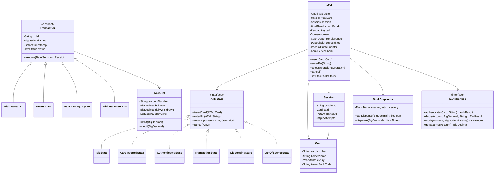
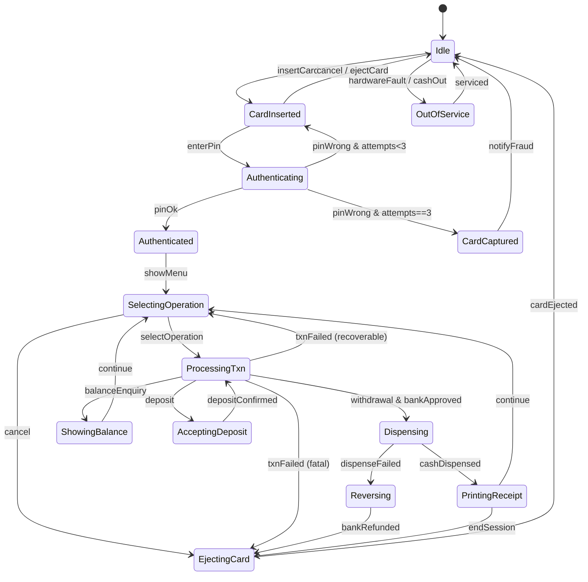

# Design ATM

**Date:** 2026-05-02 | **Updated:** 2026-05-02
**Tags:** `low-level-design` `case-study` `state-machines` `banking` `hardware-integration`

## Summary

An Automated Teller Machine (ATM) is a textbook example of a finite state machine
embedded in a hardware-driven system. The ATM accepts a debit/ATM card, validates a
PIN against a backend bank, lets the user choose an operation (balance enquiry,
withdrawal, deposit, mini statement), and orchestrates physical components — card
reader, keypad, screen, cash dispenser, deposit slot, receipt printer.

The dominant pattern is **State**: the machine moves through a small set of well-
defined states, and each state restricts which operations are legal. Transactions
themselves are also state machines (initiated → authorized → committed | rolled
back). This doc focuses on the LLD: states, classes, withdrawal flow, and how
hardware faults are handled without losing money or trust.

## Table of Contents

- [Requirements](#requirements)
- [Entities and Relationships](#entities-and-relationships-mermaid-classdiagram)
- [State Machine](#state-machine-mermaid-statediagram-v2)
- [Class Skeletons](#class-skeletons)
- [Key Algorithms](#key-algorithms)
- [Patterns Used](#patterns-used)
- [Concurrency Considerations](#concurrency-considerations)
- [Trade-offs and Extensions](#trade-offs-and-extensions)
- [Related](#related)
- [References](#references)

## Requirements

**Functional**

- Accept a card; read account number and bank routing info from the magstripe/chip.
- Authenticate user by PIN (3 attempts, then capture/eject card).
- Support: balance enquiry, withdrawal (cash dispense), deposit (cash/cheque),
  mini-statement, PIN change.
- Print a receipt on request.
- Eject the card at session end (or capture on fraud).
- Honour daily withdrawal limits and per-transaction limits.
- Handle hardware errors (no cash, jam, network down) without committing money.

**Non-functional**

- Atomicity: never debit the account if cash was not dispensed; never dispense
  cash if the debit failed.
- Auditability: every action logged with a transaction ID.
- Idempotency on retry: a duplicated bank request must not double-debit.
- Security: PIN never stored in plaintext, sent encrypted to the bank.
- Availability: degrade gracefully (e.g., cash-out → still allow balance enquiry).

**Out of scope**

- Real EMV chip protocol details.
- Cross-bank settlement and ISO 8583 wire format.
- Anti-skimming / camera surveillance hardware.

## Entities and Relationships (Mermaid classDiagram)



## State Machine (Mermaid stateDiagram-v2)



## Class Skeletons

```java
public interface ATMState {
    default void insertCard(ATM atm, Card card)    { illegal("insertCard"); }
    default void enterPin(ATM atm, String pin)      { illegal("enterPin"); }
    default void selectOperation(ATM atm, Operation op) { illegal("selectOperation"); }
    default void cancel(ATM atm)                    { illegal("cancel"); }

    private static void illegal(String op) {
        throw new IllegalStateException("Operation not allowed: " + op);
    }
}

public final class IdleState implements ATMState {
    @Override public void insertCard(ATM atm, Card card) {
        if (card.isExpired()) {
            atm.screen().show("Card expired");
            atm.cardReader().eject();
            return;
        }
        atm.openSession(card);
        atm.setState(new CardInsertedState());
    }
}

public final class CardInsertedState implements ATMState {
    @Override public void enterPin(ATM atm, String pin) {
        AuthResult r = atm.bank().authenticate(atm.session().card(), pin);
        if (r.success()) {
            atm.setState(new AuthenticatedState());
            return;
        }
        if (atm.session().incrementAttempts() >= 3) {
            atm.cardReader().capture();   // retain card
            atm.endSession();
            atm.setState(new IdleState());
        } else {
            atm.screen().show("Wrong PIN, try again");
        }
    }
    @Override public void cancel(ATM atm) {
        atm.cardReader().eject();
        atm.endSession();
        atm.setState(new IdleState());
    }
}

public final class AuthenticatedState implements ATMState {
    @Override public void selectOperation(ATM atm, Operation op) {
        Transaction txn = TransactionFactory.create(op, atm.session());
        atm.setState(new TransactionState(txn));
        txn.execute(atm);
    }
    @Override public void cancel(ATM atm) {
        atm.cardReader().eject();
        atm.endSession();
        atm.setState(new IdleState());
    }
}
```

```java
public abstract class Transaction {
    protected final String txnId = UUID.randomUUID().toString();
    protected final BigDecimal amount;
    protected TxnStatus status = TxnStatus.PENDING;

    public abstract void execute(ATM atm);
}

public final class WithdrawalTxn extends Transaction {
    @Override public void execute(ATM atm) {
        if (!atm.dispenser().canDispense(amount)) {
            atm.screen().show("Cannot dispense this amount");
            atm.setState(new AuthenticatedState());
            return;
        }
        TxnResult debit = atm.bank().debit(account, amount, txnId);
        if (!debit.ok()) { atm.screen().show("Declined"); return; }

        try {
            List<Note> notes = atm.dispenser().dispense(amount);
            atm.printer().print(Receipt.of(this, notes));
        } catch (DispenseException e) {
            atm.bank().reverse(txnId);          // compensating txn
            atm.screen().show("Dispense failed; refunded");
        }
        atm.setState(new AuthenticatedState());
    }
}
```

## Key Algorithms

### Withdrawal flow (happy path + reversal)

1. Validate amount: multiple of smallest dispensable denomination, ≤ daily limit.
2. Check dispenser inventory can cover amount with available denominations.
3. Send `debit(account, amount, txnId)` to bank — idempotent on `txnId`.
4. On bank approval, attempt physical dispense.
5. On dispense success → print receipt → return to operation menu.
6. On dispense failure → call `reverse(txnId)` to undo debit → show error.
7. If reversal call also fails → log to dead-letter queue; nightly recon repairs.

### Cash-dispense / change-making

Greedy across denominations, descending: ₹500 → ₹200 → ₹100. Falls back if a
denomination is empty. Reject if no exact combination is possible.

```java
public List<Note> plan(BigDecimal amount, Map<Denom, Integer> stock) {
    List<Note> plan = new ArrayList<>();
    BigDecimal remaining = amount;
    for (Denom d : Denom.descending()) {
        int need = remaining.divide(d.value(), RoundingMode.DOWN).intValue();
        int give = Math.min(need, stock.getOrDefault(d, 0));
        for (int i = 0; i < give; i++) plan.add(new Note(d));
        remaining = remaining.subtract(d.value().multiply(BigDecimal.valueOf(give)));
    }
    if (remaining.signum() != 0) throw new CannotMakeAmountException(amount);
    return plan;
}
```

### PIN handling

PIN is captured by the keypad's secure module, encrypted with the issuer's working
key (PIN block format ISO 9564), and forwarded to the bank. The ATM application
never sees a plaintext PIN.

## Patterns Used

- **State** — the ATM and each Transaction.
- **Command** — each Operation menu choice maps to a Transaction object that
  encapsulates `execute()` and (sometimes) `undo()` / `compensate()`.
- **Strategy** — change-making algorithm for the dispenser.
- **Factory** — `TransactionFactory` creates the right Transaction for an Operation.
- **Singleton** (per peripheral) — one CardReader, one Dispenser per ATM.
- **Observer** — bank back-office watches a stream of transaction events.

## Concurrency Considerations

A single ATM serves one user at a time, so internal concurrency is minor. The
hard problems are external:

- **Bank API timeouts.** Treat unknown outcomes as "in doubt"; reconcile from the
  bank's side via the idempotency key (`txnId`).
- **Power failure mid-dispense.** Hardware logs notes already paid before
  power-down; on reboot, ATM resumes the session in a recovery state and either
  finalises the receipt or files a claim ticket.
- **Network partition.** Optionally allow stand-in-processing (small offline
  withdrawal) gated by issuer rules; safer default is to refuse.
- **Race against daily limits.** Limits live on the bank side; the ATM reflects
  but does not enforce them as the source of truth.

## Trade-offs and Extensions

- **Thick vs thin client.** Real ATMs use XFS / CEN-XFS to standardise device
  drivers; our LLD abstracts those as `CardReader`, `Dispenser`, etc.
- **Offline mode.** Trade availability vs fraud risk; mostly disabled today.
- **Cardless withdrawal.** Mobile-app QR or OTP replaces the card-insert step
  but reuses the same auth-then-operate state machine.
- **Multi-currency.** Dispenser inventory becomes Map<Currency, Map<Denom,Int>>.
- **Cheque deposit.** Deposit slot returns a scanned image; the txn is
  pending-clearing rather than instant-credit.
- **Extending operations.** Adding "Funds Transfer" is a new Transaction class
  + a menu entry; no state changes needed.

## Related

- [Design Vending Machine](design-vending-machine.md) — same state pattern, simpler money domain.
- [Design Coffee Vending Machine](design-coffee-vending-machine.md) — recipe + payment + state.
- [Design Elevator System](design-elevator-system.md) — request scheduling FSM.
- [Design Traffic Control System](design-traffic-control-system.md) — phased state machine with sensor input.
- [State pattern](../../design-patterns/behavioral/state.md)
- [State-machine UML](../../uml/state-machine-diagram.md)

## References

- Bank for International Settlements — *Card Payments: Settlement Risk*.
- ISO 9564 — *PIN management and security*.
- ISO 8583 — *Financial transaction card originated messages*.
- CEN/XFS — *Extensions for Financial Services* device standard.
- Gamma, Helm, Johnson, Vlissides, *Design Patterns* — State and Command chapters.
