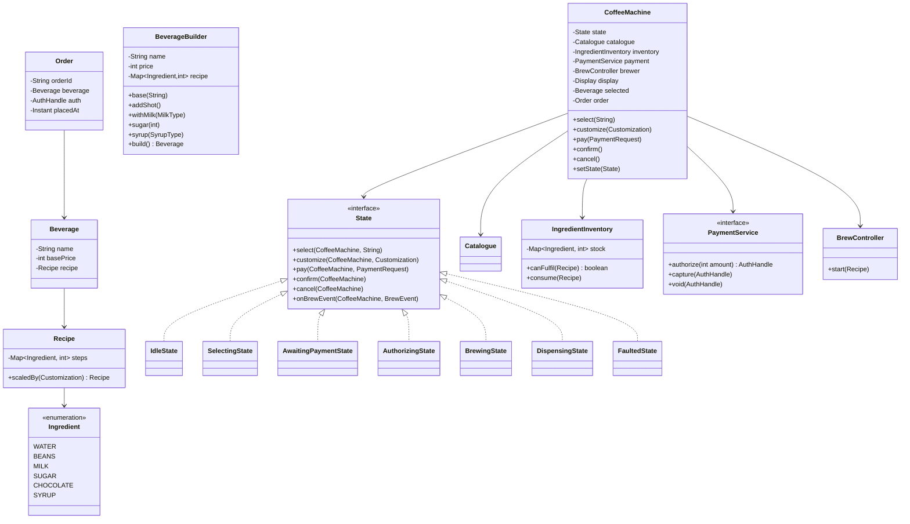
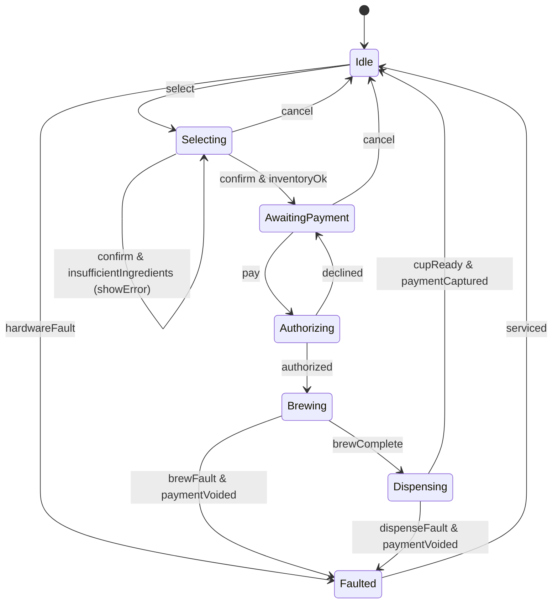

# Design Coffee Vending Machine

**Date:** 2026-05-02 | **Updated:** 2026-05-02
**Tags:** `low-level-design` `case-study` `state-machines` `builder` `inventory`

## Summary

A coffee vending machine is a vending-machine variant where the product is
*assembled on demand* from raw ingredients (water, milk, beans, sugar, syrup)
following a recipe (Espresso, Cappuccino, Latte, Mocha …). It still has a
state machine, a payment subsystem, and an inventory — but inventory is keyed
by ingredient, not finished product, and recipes are configurable.

The interesting LLD pieces are: the **Builder** for beverages, the
**recipe → ingredient inventory** check before payment, and the brewing
state machine (HeatingWater → Grinding → Brewing → AddingMilk → Finishing).
Cashless payments add an authorise/capture wrinkle to the FSM.

## Table of Contents

- [Requirements](#requirements)
- [Entities and Relationships](#entities-and-relationships-mermaid-classdiagram)
- [State Machine](#state-machine-mermaid-statediagram-v2)
- [Class Skeletons](#class-skeletons)
- [Key Algorithms](#key-algorithms)
- [Patterns Used](#patterns-used)
- [Concurrency Considerations](#concurrency-considerations)
- [Trade-offs and Extensions](#trade-offs-and-extensions)
- [Related](#related)
- [References](#references)

## Requirements

**Functional**

- Catalogue of beverages with recipes (ingredient → quantity).
- Show price per beverage; allow customisation (extra shot, sugar level,
  milk type) that adjusts price and recipe.
- Accept payment: coins/notes and/or cashless (card/UPI/QR).
- Verify all required ingredients are available before charging.
- Brew the beverage step-by-step, dispense into cup.
- Refund / void on failure during brewing.
- Operator mode: refill ingredients, descale, view sales.

**Non-functional**

- Atomicity around payment + brewing — no charge without coffee, no coffee
  without confirmed payment.
- Hygiene: scheduled rinse cycles between certain transitions (esp. milk).
- Auditable sales and ingredient consumption.
- Predictable user wait time; show progress.

**Out of scope**

- Real espresso machine fluid dynamics; we abstract pumps and heaters.
- Loyalty programmes / app integration (mention as extension).

## Entities and Relationships (Mermaid classDiagram)



## State Machine (Mermaid stateDiagram-v2)



## Class Skeletons

```java
public interface State {
    default void select(CoffeeMachine m, String name)            { illegal(); }
    default void customize(CoffeeMachine m, Customization c)     { illegal(); }
    default void pay(CoffeeMachine m, PaymentRequest p)          { illegal(); }
    default void confirm(CoffeeMachine m)                        { illegal(); }
    default void cancel(CoffeeMachine m)                         { illegal(); }
    default void onBrewEvent(CoffeeMachine m, BrewEvent e)       {}
    private static void illegal() {
        throw new IllegalStateException("Operation not allowed in this state");
    }
}

public final class SelectingState implements State {
    @Override public void customize(CoffeeMachine m, Customization c) {
        m.applyCustomization(c);
        m.display().show(m.selected().name() + " : " + m.selected().basePrice());
    }
    @Override public void confirm(CoffeeMachine m) {
        if (!m.inventory().canFulfil(m.selected().recipe())) {
            m.display().show("Out of ingredients — choose another");
            return;
        }
        m.setState(new AwaitingPaymentState());
    }
    @Override public void cancel(CoffeeMachine m) { m.reset(); m.setState(new IdleState()); }
}

public final class AwaitingPaymentState implements State {
    @Override public void pay(CoffeeMachine m, PaymentRequest p) {
        m.setState(new AuthorizingState());
        try {
            AuthHandle h = m.payment().authorize(m.selected().basePrice());
            m.setOrder(new Order(m.selected(), h));
            m.setState(new BrewingState());
            m.brewer().start(m.selected().recipe());
        } catch (DeclinedException e) {
            m.display().show("Payment declined — try another method");
            m.setState(new AwaitingPaymentState());
        }
    }
}

public final class BrewingState implements State {
    @Override public void onBrewEvent(CoffeeMachine m, BrewEvent e) {
        switch (e.kind()) {
            case PROGRESS -> m.display().show(e.step() + "...");
            case COMPLETE -> {
                m.inventory().consume(m.selected().recipe());
                m.setState(new DispensingState());
                m.dispenseCup();
                m.payment().capture(m.order().auth());
                m.reset();
                m.setState(new IdleState());
            }
            case FAULT -> {
                m.payment().voidAuth(m.order().auth());
                m.setState(new FaultedState());
            }
        }
    }
}
```

```java
public final class BeverageBuilder {
    private String name;
    private int price;
    private final Map<Ingredient, Integer> recipe = new EnumMap<>(Ingredient.class);

    public BeverageBuilder base(String name, int basePrice,
                                Map<Ingredient,Integer> baseRecipe) {
        this.name = name;
        this.price = basePrice;
        recipe.putAll(baseRecipe);
        return this;
    }
    public BeverageBuilder addShot() {
        recipe.merge(Ingredient.BEANS, 7, Integer::sum); // grams
        recipe.merge(Ingredient.WATER, 30, Integer::sum); // ml
        price += 50;
        return this;
    }
    public BeverageBuilder withMilk(MilkType type, int ml) {
        recipe.merge(Ingredient.MILK, ml, Integer::sum);
        if (type != MilkType.DAIRY) price += 30;          // alt-milk surcharge
        return this;
    }
    public BeverageBuilder sugar(int teaspoons) {
        recipe.merge(Ingredient.SUGAR, teaspoons * 4, Integer::sum); // grams
        return this;
    }
    public Beverage build() {
        return new Beverage(name, price, new Recipe(recipe));
    }
}
```

## Key Algorithms

### Inventory pre-check before charging

Always check ingredient availability *before* taking payment. The recipe is a
flat map of ingredient → quantity; iterate and verify stock ≥ required.
Failure path stays in `Selecting` and the customer never sees a charge.

### Authorise → capture (cashless)

Card networks expect a two-phase flow: `authorize(amount)` reserves funds,
`capture(handle)` settles them, `void(handle)` releases them. We map this onto
the brewing FSM: authorise on entering `Brewing`, capture on `Dispensing`
success, void on any fault. This is the same compensating-transaction pattern
the ATM uses for dispense reversal.

### Recipe scaling and customisation

```java
public Recipe scaledBy(Customization c) {
    Map<Ingredient,Integer> next = new EnumMap<>(steps);
    if (c.extraShot()) {
        next.merge(Ingredient.BEANS, 7, Integer::sum);
        next.merge(Ingredient.WATER, 30, Integer::sum);
    }
    if (c.milkType() == MilkType.OAT) {
        // swap dairy ml for oat ml; same grammage
    }
    if (c.sugarTeaspoons() > 0) {
        next.merge(Ingredient.SUGAR, c.sugarTeaspoons() * 4, Integer::sum);
    }
    return new Recipe(next);
}
```

### Hygiene rinses

After dispensing a milk-based drink, schedule a steam-wand rinse before the
next milk-based drink. Implement as a tiny state inserted automatically in the
`Idle → Selecting` transition when the previous drink used milk and the next
also will. Prevents bacterial growth without operator intervention.

## Patterns Used

- **State** — top-level user/brewing FSM.
- **Builder** — `BeverageBuilder` to assemble customised beverages cleanly.
- **Strategy** — payment methods (`CashStrategy`, `CardStrategy`, `UPIStrategy`)
  behind `PaymentService`.
- **Command** — each ingredient step in the brew cycle is a command.
- **Observer** — display panel and operator dashboard observe brew progress.
- **Template Method** — base `BrewingProcess` defines the order
  (heat → grind → extract → finish), specific recipes override only the steps
  they need.

## Concurrency Considerations

- One user at a time on the panel.
- Brewing runs on a dedicated controller thread; the FSM receives `BrewEvent`s
  via a thread-safe queue.
- Payment authorisation is network I/O — never run on the UI thread; use a
  small future / callback that posts back into the state machine.
- Operator-mode refills must pause brewing; entering operator mode requires
  reaching `Idle` first (or a forced abort that voids any in-flight auth).

## Trade-offs and Extensions

- **Mobile pre-order.** App pre-selects beverage and pre-authorises payment.
  Customer scans QR at the machine to redeem; FSM jumps from `Idle` straight
  to `Brewing`.
- **Loyalty.** Each capture emits a "purchase" event picked up by a loyalty
  service.
- **Bean / blend selection.** Multiple bean hoppers; the brewer chooses by
  beverage type or user preference.
- **Telemetry.** Stream `onBrewEvent` to operations; predictive maintenance
  on heater coils and grinders.
- **Recipe updates.** Treat recipes as data, fetched from a config service —
  enables remote menu changes.
- **Refund logic.** A failed brew after capture is rare (auth was voided
  earlier) but possible if the fault arrives between capture and dispense;
  expose a manual refund flow with operator code.

## Related

- [Design Vending Machine](design-vending-machine.md) — base FSM, simpler product model.
- [Design ATM](design-atm.md) — auth/capture pattern, hardware coordination.
- [Design Elevator System](design-elevator-system.md) — multi-actor scheduling.
- [Design Traffic Control System](design-traffic-control-system.md) — phased FSM with safety monitor.
- [State pattern](../../design-patterns/behavioral/state.md)
- [State-machine UML](../../uml/state-machine-diagram.md)

## References

- Gamma, Helm, Johnson, Vlissides, *Design Patterns* — State, Builder,
  Strategy, Template Method.
- Freeman & Robson, *Head First Design Patterns* — Builder and State chapters.
- EMVCo, *EMV Contactless Specifications* — authorise/capture model used by
  cashless terminals.
- ISO 22000 — food-hygiene principles applied to beverage equipment design.
