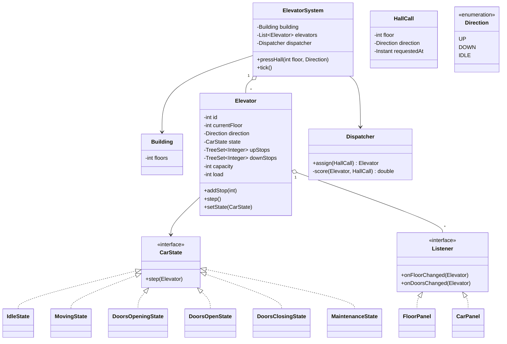
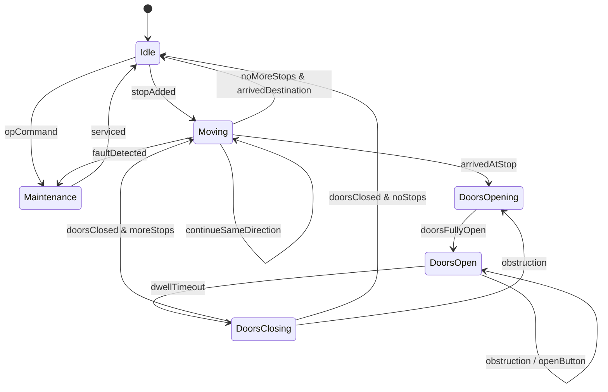

# Design Elevator System

**Date:** 2026-05-02 | **Updated:** 2026-05-02
**Tags:** `low-level-design` `case-study` `state-machines` `scheduling` `observer`

## Summary

An elevator system has multiple cars serving a building of N floors. Two kinds
of requests arrive: **hall calls** (a person on a floor presses Up or Down) and
**car calls** (a passenger inside the car selects a destination). A central
dispatcher decides which car serves each hall call, while each car runs its own
state machine (Idle → Moving → DoorsOpening → DoorsOpen → DoorsClosing → Moving …).

The interesting parts of the LLD are: the per-car state machine, the request
queues organised so that the SCAN/LOOK algorithm can serve them efficiently,
and the dispatcher's scoring function for assigning hall calls. UI panels on
each floor and inside each car observe the system via the Observer pattern.

## Table of Contents

- [Requirements](#requirements)
- [Entities and Relationships](#entities-and-relationships-mermaid-classdiagram)
- [State Machine](#state-machine-mermaid-statediagram-v2)
- [Class Skeletons](#class-skeletons)
- [Key Algorithms](#key-algorithms)
- [Patterns Used](#patterns-used)
- [Concurrency Considerations](#concurrency-considerations)
- [Trade-offs and Extensions](#trade-offs-and-extensions)
- [Related](#related)
- [References](#references)

## Requirements

**Functional**

- N floors, M elevators (M ≥ 1).
- Hall buttons (Up/Down) on each floor (top has only Down, bottom only Up).
- Car panel inside each elevator with one button per floor + Open/Close/Alarm.
- Dispatcher routes hall calls to elevators.
- Each car serves its own car calls plus assigned hall calls.
- Doors auto-close after a timeout; reopen on obstruction or button press.
- Display current floor and direction on each car and lobby.

**Non-functional**

- Minimise average passenger wait time and service time.
- Fairness: do not starve hall calls in the opposite direction of motion.
- Safety: never move while doors are open; never open between floors.
- Capacity: respect weight/passenger limit, refuse extra hall stops if full.

**Out of scope**

- Detailed motor control / acceleration profiles.
- Destination dispatch (group control by destination floor) — mentioned as
  extension only.

## Entities and Relationships (Mermaid classDiagram)



## State Machine (Mermaid stateDiagram-v2)



## Class Skeletons

```java
public enum Direction { UP, DOWN, IDLE }

public final class Elevator {
    private final int id;
    private final int capacity;
    private int currentFloor;
    private Direction direction = Direction.IDLE;
    private CarState state = new IdleState();
    private final NavigableSet<Integer> upStops   = new TreeSet<>();
    private final NavigableSet<Integer> downStops = new TreeSet<>(Comparator.reverseOrder());
    private final List<Listener> listeners = new CopyOnWriteArrayList<>();

    public void addStop(int floor) {
        if (floor > currentFloor)      upStops.add(floor);
        else if (floor < currentFloor) downStops.add(floor);
        else                            requestDoorsOpen();
        if (state instanceof IdleState) setState(new MovingState());
    }

    int nextStop() {
        return switch (direction) {
            case UP   -> upStops.isEmpty()
                            ? (downStops.isEmpty() ? currentFloor : downStops.first())
                            : upStops.first();
            case DOWN -> downStops.isEmpty()
                            ? (upStops.isEmpty() ? currentFloor : upStops.first())
                            : downStops.first();
            case IDLE -> currentFloor;
        };
    }
    public void step()                 { state.step(this); }
    public void setState(CarState s)   { this.state = s; }
}

public interface CarState { void step(Elevator e); }

public final class MovingState implements CarState {
    public void step(Elevator e) {
        int next = e.nextStop();
        if (next == e.currentFloor()) { e.setState(new DoorsOpeningState()); return; }
        e.setDirection(next > e.currentFloor() ? Direction.UP : Direction.DOWN);
        e.moveOneFloor();
        e.notifyFloorChanged();
        if (e.shouldStopHere()) e.setState(new DoorsOpeningState());
    }
}
```

```java
public final class Dispatcher {
    private final List<Elevator> cars;
    public Elevator assign(HallCall call) {
        return cars.stream()
            .min(Comparator.comparingDouble(c -> score(c, call)))
            .orElseThrow();
    }
    private double score(Elevator c, HallCall call) {
        // Lower is better.
        int distance = Math.abs(c.currentFloor() - call.floor());
        double directional = switch (c.direction()) {
            case IDLE -> 0;
            case UP   -> call.direction()==Direction.UP   && call.floor()>=c.currentFloor() ? 0 : 5;
            case DOWN -> call.direction()==Direction.DOWN && call.floor()<=c.currentFloor() ? 0 : 5;
        };
        double load = c.loadFactor() * 3;
        return distance + directional + load;
    }
}
```

## Key Algorithms

### LOOK / SCAN per car

Borrowed from disk scheduling: keep moving in the current direction servicing
all stops on the way, reverse only when no further stops exist in that
direction. Two ordered sets (`upStops` ascending, `downStops` descending) make
"next stop" an O(log n) lookup.

```text
loop:
    if direction == UP:
        if upStops not empty: target = min(upStops); move
        else if downStops not empty: direction = DOWN
        else: state = Idle; break
    elif direction == DOWN:
        if downStops not empty: target = max(downStops); move
        else if upStops not empty: direction = UP
        else: state = Idle; break
```

### Hall-call assignment scoring

Score each elevator for a hall call, pick the minimum. Components:

- **Distance** — how far is the car from the call floor.
- **Directional fit** — penalise cars moving away or about to reverse.
- **Load** — favour less-full cars (better passenger experience).
- **Pending stops** — more accurate models add the queue depth.

This is a heuristic; production systems learn weights from telemetry.

### Door dwell timer

Doors open on arrival, dwell for a configurable timeout (e.g. 3 s), close, and
the elevator advances. Obstruction (light curtain or door-open button) restarts
the dwell. The door FSM is its own sub-state-machine.

## Patterns Used

- **State** — per-car state machine.
- **Strategy** — pluggable scheduler (LOOK, SCAN, destination dispatch).
- **Observer** — floor panels and car panels subscribe to elevator events;
  decouples display from elevator core.
- **Command** — hall calls and car calls are commands queued at the elevator.
- **Singleton** — `ElevatorSystem` per building.
- **Factory** — building configuration produces N floors and M elevators.

## Concurrency Considerations

- Each elevator runs its own simulation loop (or controller thread). The
  dispatcher receives hall calls from the lobby thread and assigns under a
  lock or via a thread-safe queue per car.
- `upStops` / `downStops` should be thread-safe; either guarded by the car's
  monitor or held in a `ConcurrentSkipListSet`.
- Listeners (UI panels) get notified on a separate thread; never block the
  control loop with display updates.
- Safety interlocks live below the application FSM and can override it (door
  cannot open between floors regardless of software state).

## Trade-offs and Extensions

- **Group control / destination dispatch.** Passengers enter destination on the
  lobby panel; cars are pre-assigned and same-destination passengers are
  grouped. Reduces stops and journey time but needs richer panels.
- **Express zones.** Some cars only serve a floor band (e.g., 1, 30–50).
  Dispatcher restricts candidate set per call.
- **Energy mode.** Idle cars park at a "home floor" predicted by demand
  patterns; saves time on first call.
- **Failure handling.** A car in `Maintenance` is removed from the dispatch
  pool; passengers are evacuated at the nearest floor with doors opened.
- **Observability.** Stream `onFloorChanged`/`onDoorsChanged` events to a
  metrics pipeline; track average wait time, peak utilisation.

## Related

- [Design Vending Machine](design-vending-machine.md) — simpler single-actor FSM.
- [Design ATM](design-atm.md) — money + sessions + bank.
- [Design Traffic Control System](design-traffic-control-system.md) — phased multi-actor FSM.
- [Design Coffee Vending Machine](design-coffee-vending-machine.md) — recipe + payment FSM.
- [State pattern](../../design-patterns/behavioral/state.md)
- [State-machine UML](../../uml/state-machine-diagram.md)

## References

- Strakosch & Caporale, *The Vertical Transportation Handbook*.
- Barney, *Elevator Traffic Handbook: Theory and Practice*.
- Silberschatz, Galvin, Gagne, *Operating System Concepts* — disk scheduling
  (SCAN, LOOK), the same algorithms applied to elevator dispatch.
- Gamma et al., *Design Patterns* — State, Observer, Strategy.
