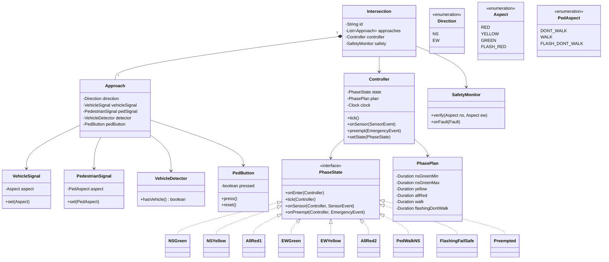
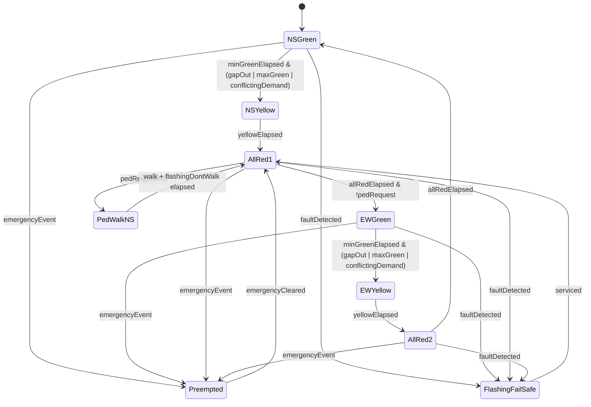

# Design Traffic Control System

**Date:** 2026-05-02 | **Updated:** 2026-05-02
**Tags:** `low-level-design` `case-study` `state-machines` `embedded` `sensors`

## Summary

A traffic control system at a road intersection cycles signals through phases
(north–south green, all-red, east–west green, …), reads sensors (inductive
loops, cameras, pedestrian buttons), and grants priority to emergency vehicles.
The dominant design construct is a **timed state machine** with strict safety
invariants (never two conflicting greens, mandatory all-red interval).

This LLD covers a typical four-way intersection with pedestrian crossings and
explains: phase modelling, sensor-driven extensions, emergency preemption, and
fail-safe (flashing-red) mode.

## Table of Contents

- [Requirements](#requirements)
- [Entities and Relationships](#entities-and-relationships-mermaid-classdiagram)
- [State Machine](#state-machine-mermaid-statediagram-v2)
- [Class Skeletons](#class-skeletons)
- [Key Algorithms](#key-algorithms)
- [Patterns Used](#patterns-used)
- [Concurrency Considerations](#concurrency-considerations)
- [Trade-offs and Extensions](#trade-offs-and-extensions)
- [Related](#related)
- [References](#references)

## Requirements

**Functional**

- 4-way intersection: NS approach + EW approach.
- Each approach has a vehicle signal (Red/Yellow/Green) and a pedestrian
  signal (Walk/FlashingDontWalk/DontWalk).
- Cycle phases with configurable durations.
- Vehicle sensors (loops or radar) detect waiting traffic.
- Pedestrian push-buttons request a Walk phase.
- Emergency vehicle preemption (siren / GPS beacon) clears a path quickly.
- Fault detection: stuck signal, conflicting greens, sensor outage.
- Fail-safe mode: flash all-red on critical fault.

**Non-functional**

- Hard safety: no two conflicting movements green simultaneously.
- Determinism: phase timings honoured to ±50 ms.
- Auditability: every phase change logged with timestamp.
- Maintainability: phase plans configurable without code change.

**Out of scope**

- Adaptive coordination across multiple intersections (green-wave) — extension
  only.
- Machine-vision turn-lane modelling.

## Entities and Relationships (Mermaid classDiagram)



## State Machine (Mermaid stateDiagram-v2)



## Class Skeletons

```java
public interface PhaseState {
    void onEnter(Controller c);
    void tick(Controller c);
    default void onSensor(Controller c, SensorEvent e) {}
    default void onPreempt(Controller c, EmergencyEvent e) {
        c.setState(new Preempted(e));
    }
}

public final class NSGreen implements PhaseState {
    private Instant enteredAt;

    public void onEnter(Controller c) {
        enteredAt = c.clock().now();
        c.setNS(Aspect.GREEN);  c.setEW(Aspect.RED);
        c.setPedNS(PedAspect.DONT_WALK); c.setPedEW(PedAspect.DONT_WALK);
        c.safety().verify(Aspect.GREEN, Aspect.RED);
    }
    public void tick(Controller c) {
        Duration elapsed = Duration.between(enteredAt, c.clock().now());
        boolean reachedMin = elapsed.compareTo(c.plan().nsGreenMin()) >= 0;
        boolean reachedMax = elapsed.compareTo(c.plan().nsGreenMax()) >= 0;
        boolean ewWaiting  = c.detectorEW().hasVehicle() || c.pedButtonEW().pressed();
        boolean gapOut     = reachedMin && !c.detectorNS().hasVehicle();

        if (reachedMax || (reachedMin && ewWaiting) || gapOut) {
            c.setState(new NSYellow());
        }
    }
}

public final class AllRed1 implements PhaseState {
    private Instant enteredAt;
    public void onEnter(Controller c) {
        enteredAt = c.clock().now();
        c.setNS(Aspect.RED); c.setEW(Aspect.RED);
    }
    public void tick(Controller c) {
        if (Duration.between(enteredAt, c.clock().now()).compareTo(c.plan().allRed()) >= 0) {
            if (c.pedButtonNS().pressed()) {
                c.pedButtonNS().reset();
                c.setState(new PedWalkNS());
            } else {
                c.setState(new EWGreen());
            }
        }
    }
}

public final class Preempted implements PhaseState {
    private final EmergencyEvent event;
    public Preempted(EmergencyEvent e) { this.event = e; }

    public void onEnter(Controller c) {
        Direction allow = event.path();
        c.setNS(allow == Direction.NS ? Aspect.GREEN : Aspect.RED);
        c.setEW(allow == Direction.EW ? Aspect.GREEN : Aspect.RED);
    }
    public void tick(Controller c) {
        if (event.cleared()) c.setState(new AllRed1());
    }
}
```

```java
public final class SafetyMonitor {
    private static final Set<Pair<Aspect,Aspect>> CONFLICTS = Set.of(
        Pair.of(Aspect.GREEN,  Aspect.GREEN),
        Pair.of(Aspect.GREEN,  Aspect.YELLOW),
        Pair.of(Aspect.YELLOW, Aspect.GREEN));

    public void verify(Aspect ns, Aspect ew) {
        if (CONFLICTS.contains(Pair.of(ns, ew))) {
            onFault(new Fault("Conflicting greens: NS=" + ns + " EW=" + ew));
        }
    }
    public void onFault(Fault f) {
        log.error("FAULT: {}", f);
        controller.setState(new FlashingFailSafe());
    }
}
```

## Key Algorithms

### Phase timing with min/max green and gap-out

A green is held for at least `nsGreenMin` so a driver does not see a flicker.
After `min`, the controller can terminate green if either:

- The cross direction has waiting demand AND a "gap" appears in the current
  direction (no vehicle detected for some seconds — *gap-out*), or
- `nsGreenMax` is reached (*max-out*) — guarantees the cross street eventually
  gets green even if the main street never empties.

### Emergency preemption

When an emergency event arrives, the controller forces the all-red interval
(if not already there), then opens a green for the emergency direction. After
the event clears, return through `AllRed1` and resume the normal cycle. Some
deployments hold a brief "recovery" all-red and re-synchronise to the corridor
plan.

### Fail-safe transitions

The `SafetyMonitor` cross-checks aspects on every tick. If a hardware feedback
loop (lamp current sensor) reports a green that should be red, the monitor
flips the controller into `FlashingFailSafe` and signals the maintenance
backend. This state has no automatic exit; a technician resets it.

## Patterns Used

- **State** — every phase is a class.
- **Strategy** — pluggable timing plans (rush-hour vs night).
- **Observer** — UI dashboards and adaptive controllers subscribe to phase
  changes and detector events.
- **Command** — emergency preemption arrives as an event/command on a queue.
- **Singleton** — `Controller` per intersection.
- **Memento** — save and restore "normal cycle" position when a preemption
  ends, so we resume cleanly.

## Concurrency Considerations

- The controller runs a periodic `tick()` (e.g. every 100 ms).
- Sensor events arrive on a separate thread; push them into a thread-safe
  queue and drain in the tick loop — keeps state mutation single-threaded.
- Hardware lamp drivers operate behind a hardware abstraction layer that may
  be asynchronous; the FSM only commands aspects, the HAL applies them.
- A watchdog timer must reboot the controller if `tick()` stalls (>500 ms)
  while the safety monitor forces flash-red.

## Trade-offs and Extensions

- **Adaptive timing.** Use detector counts and queue length estimates to
  retune `nsGreenMin/Max` per cycle (SCATS, SCOOT-style algorithms).
- **Coordination / green wave.** Connect controllers along a corridor; offset
  start of green to keep platoons moving at design speed.
- **Multi-modal.** Add bus / tram priority; light rail demands a dedicated
  preemption path.
- **Smart pedestrian.** Camera-based detection avoids missed Walk phases.
- **Cybersecurity.** Sensor and preemption inputs are attack surfaces;
  authenticate emergency beacons (e.g., GTT Opticom) and sign over-the-air
  plan updates.

## Related

- [Design ATM](design-atm.md) — single-user transactional FSM.
- [Design Vending Machine](design-vending-machine.md) — single-user product FSM.
- [Design Coffee Vending Machine](design-coffee-vending-machine.md) — recipe + payment FSM.
- [Design Elevator System](design-elevator-system.md) — multi-actor scheduling FSM.
- [State pattern](../../design-patterns/behavioral/state.md)
- [State-machine UML](../../uml/state-machine-diagram.md)

## References

- US Federal Highway Administration, *Traffic Signal Timing Manual*.
- ITE, *Manual of Traffic Signal Design*.
- NEMA TS 2 — *Traffic Controller Assemblies* standard.
- IEC 61508 — Functional safety; principles applied to fail-safe design.
- Gamma et al., *Design Patterns* — State, Observer.
