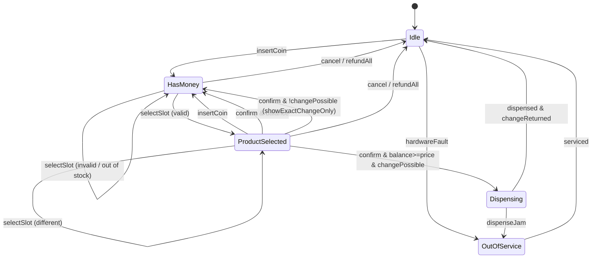

# Design Vending Machine

**Date:** 2026-05-02 | **Updated:** 2026-05-02
**Tags:** `low-level-design` `case-study` `state-machines` `state-pattern` `inventory`

## Summary

A vending machine accepts coins (or notes), lets the user select a product,
dispenses the product if it is in stock and paid for, and returns change. The
classic LLD interview question is "model the states cleanly and avoid a tangle
of `if` statements". The textbook answer is the **State pattern**: each state
(Idle, HasMoney, ProductSelected, Dispensing) is a class with the same
operations, but each behaves differently and decides which state to transition to.

This doc covers the state diagram, inventory and change-making, the class
skeleton, and edge cases such as exact-change-only mode.

## Table of Contents

- [Requirements](#requirements)
- [Entities and Relationships](#entities-and-relationships-mermaid-classdiagram)
- [State Machine](#state-machine-mermaid-statediagram-v2)
- [Class Skeletons](#class-skeletons)
- [Key Algorithms](#key-algorithms)
- [Patterns Used](#patterns-used)
- [Concurrency Considerations](#concurrency-considerations)
- [Trade-offs and Extensions](#trade-offs-and-extensions)
- [Related](#related)
- [References](#references)

## Requirements

**Functional**

- Accept coins of standard denominations (e.g. 1, 2, 5, 10).
- Display the running balance after each coin.
- Let the user select a product by slot code (A1, B3 …).
- Validate: product exists, is in stock, balance ≥ price.
- Dispense the product and return change.
- Allow cancel — refund coins inserted so far.
- Refuse selection in "exact-change-only" mode if change cannot be made.
- Operator mode: refill product, refill coin float, collect cash.

**Non-functional**

- Atomicity: never dispense without charging; never charge without dispensing.
- Robustness: hardware failures (slot jam, coin jam) move the machine to a
  diagnostic state, not a corrupt one.
- Auditability: every sale and refill recorded.
- O(1) selection lookup; O(D) change-making where D = number of denominations.

**Out of scope**

- Cashless / contactless payment (covered in coffee-vending design).
- Networked telemetry to a back office.

## Entities and Relationships (Mermaid classDiagram)

```mermaid
classDiagram
    class VendingMachine {
        -State state
        -Inventory inventory
        -CoinBox coinBox
        -int balance
        -Slot selectedSlot
        -Display display
        -Hopper hopper
        +insertCoin(Coin)
        +selectSlot(String)
        +confirm()
        +cancel()
        +setState(State)
    }

    class State {
        <<interface>>
        +insertCoin(VendingMachine, Coin)
        +selectSlot(VendingMachine, String)
        +confirm(VendingMachine)
        +cancel(VendingMachine)
    }

    class IdleState
    class HasMoneyState
    class ProductSelectedState
    class DispensingState
    class OutOfServiceState

    State <|.. IdleState
    State <|.. HasMoneyState
    State <|.. ProductSelectedState
    State <|.. DispensingState
    State <|.. OutOfServiceState

    class Slot {
        -String code
        -Product product
        -int quantity
        -int price
        +decrement()
    }

    class Product {
        -String sku
        -String name
        -int defaultPrice
    }

    class Inventory {
        -Map~String,Slot~ slots
        +get(String) Slot
        +refill(String, int)
    }

    class CoinBox {
        -Map~Coin,int~ float
        +accept(Coin)
        +canMakeChange(int) boolean
        +makeChange(int) List~Coin~
        +refund(List~Coin~)
    }

    enum Coin {
        ONE
        TWO
        FIVE
        TEN
    }

    VendingMachine --> State
    VendingMachine --> Inventory
    VendingMachine --> CoinBox
    Inventory "1" *-- "*" Slot
    Slot --> Product
    CoinBox --> Coin
```

## State Machine (Mermaid stateDiagram-v2)



## Class Skeletons

```java
public interface State {
    default void insertCoin(VendingMachine vm, Coin c)         { illegal(); }
    default void selectSlot(VendingMachine vm, String code)     { illegal(); }
    default void confirm(VendingMachine vm)                     { illegal(); }
    default void cancel(VendingMachine vm)                      { illegal(); }
    private static void illegal() {
        throw new IllegalStateException("Operation not allowed in this state");
    }
}

public final class IdleState implements State {
    @Override public void insertCoin(VendingMachine vm, Coin c) {
        vm.coinBox().accept(c);
        vm.addBalance(c.value());
        vm.display().show("Balance: " + vm.balance());
        vm.setState(new HasMoneyState());
    }
}

public final class HasMoneyState implements State {
    @Override public void insertCoin(VendingMachine vm, Coin c) {
        vm.coinBox().accept(c);
        vm.addBalance(c.value());
        vm.display().show("Balance: " + vm.balance());
    }
    @Override public void selectSlot(VendingMachine vm, String code) {
        Slot s = vm.inventory().get(code);
        if (s == null || s.outOfStock()) { vm.display().show("Unavailable"); return; }
        vm.select(s);
        vm.display().show(s.product().name() + " : " + s.price());
        vm.setState(new ProductSelectedState());
    }
    @Override public void cancel(VendingMachine vm) {
        vm.coinBox().refund(vm.coinsInserted());
        vm.reset();
        vm.setState(new IdleState());
    }
}

public final class ProductSelectedState implements State {
    @Override public void confirm(VendingMachine vm) {
        Slot slot = vm.selectedSlot();
        int change = vm.balance() - slot.price();
        if (change < 0) { vm.display().show("Insert " + (-change) + " more"); return; }
        if (!vm.coinBox().canMakeChange(change)) {
            vm.display().show("Cannot give change. Use exact amount.");
            return;
        }
        vm.setState(new DispensingState());
        vm.hopper().release(slot);
        slot.decrement();
        vm.coinBox().payOut(vm.coinBox().makeChange(change));
        vm.reset();
        vm.setState(new IdleState());
    }
    @Override public void cancel(VendingMachine vm) {
        vm.coinBox().refund(vm.coinsInserted());
        vm.reset();
        vm.setState(new IdleState());
    }
    @Override public void insertCoin(VendingMachine vm, Coin c) {
        vm.coinBox().accept(c); vm.addBalance(c.value());
        vm.setState(new HasMoneyState());   // user added more — re-evaluate
    }
}
```

```java
public final class CoinBox {
    private final NavigableMap<Coin, Integer> floatStock = new TreeMap<>(
        Comparator.comparingInt(Coin::value).reversed());

    public boolean canMakeChange(int amount) {
        return planChange(amount) != null;
    }
    public List<Coin> makeChange(int amount) {
        List<Coin> plan = planChange(amount);
        if (plan == null) throw new IllegalStateException("Cannot make change");
        for (Coin c : plan) floatStock.merge(c, -1, Integer::sum);
        return plan;
    }
    private List<Coin> planChange(int amount) {
        List<Coin> picked = new ArrayList<>();
        int remaining = amount;
        for (var e : floatStock.entrySet()) {
            int need = remaining / e.getKey().value();
            int give = Math.min(need, e.getValue());
            for (int i = 0; i < give; i++) picked.add(e.getKey());
            remaining -= give * e.getKey().value();
            if (remaining == 0) return picked;
        }
        return null; // cannot make this exact amount with current float
    }
}
```

## Key Algorithms

### Greedy change-making (with stock awareness)

For canonical denomination sets (1, 2, 5, 10, 20, 50, 100) the greedy algorithm
is optimal *if* every denomination is available in unlimited supply. Real
vending machines have limited float, so the planner must check stock and may
need to back off — the cleanest implementation is dynamic programming when stock
is tight:

```text
dp[a] = min coins needed for amount a (∞ if impossible)
dp[0] = 0
for each denomination d, capped by remaining float[d]:
    update dp[a] = min(dp[a], dp[a - d] + 1) for a in d..total
```

For interview answers, greedy + stock check (as in `CoinBox.planChange` above) is
usually accepted as long as you call out the limitation.

### Idempotent cancel

`cancel` must always be safe — it is bound to a hardware button. We snapshot
inserted coins at insertion time so refund returns the actual coins; alternative
designs refund equivalent value from the float, which is simpler but uses up
small denominations and worsens future change-making.

## Patterns Used

- **State** — central pattern.
- **Strategy** — change-making algorithm (greedy vs DP) selectable.
- **Command** — each user action is a small invocation on the current state.
- **Observer** — operator dashboard subscribes to "low stock" / "low coin float"
  events.
- **Singleton** — one `CoinBox`, one `Inventory` per machine.

## Concurrency Considerations

- Single user at a time; the panel buttons are physically serialised.
- The operator's refill mode is a separate state and cannot run concurrently
  with sales — entering it requires a key.
- Telemetry uploads run on a background thread and read snapshots, never
  mutating live state.

## Trade-offs and Extensions

- **Notes / banknotes.** Add a `BillValidator`; balance becomes int cents.
- **Cashless payments.** Replace `CoinBox` with a `PaymentService` that authorises
  before `confirm` and captures after `dispense`. See coffee-vending design.
- **Multiple products in one purchase.** Move from "one slot at a time" to a
  basket; price is sum of slot prices; harder to model as a tiny FSM.
- **Hardware fault recovery.** Persist state to NVRAM so after a power cycle the
  machine knows whether the last dispense completed.
- **Reservation locking.** When a slot is selected, decrement an in-memory
  reserved counter so a second selection cannot race for the last unit.

## Related

- [Design ATM](design-atm.md) — same state pattern, money + bank.
- [Design Coffee Vending Machine](design-coffee-vending-machine.md) — adds recipe and ingredient inventory.
- [Design Elevator System](design-elevator-system.md) — different FSM shape (queues).
- [Design Traffic Control System](design-traffic-control-system.md) — sensor-driven phased FSM.
- [State pattern](../../design-patterns/behavioral/state.md)
- [State-machine UML](../../uml/state-machine-diagram.md)

## References

- Gamma, Helm, Johnson, Vlissides, *Design Patterns* — State, Command.
- Freeman & Robson, *Head First Design Patterns* — Vending machine chapter.
- Cormen, Leiserson, Rivest, Stein, *Introduction to Algorithms* — Coin change DP.
