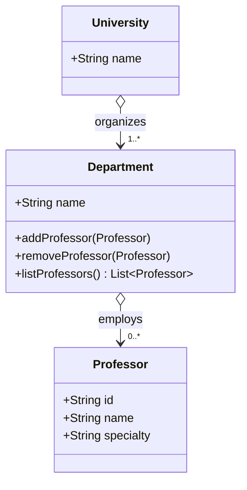

# Aggregation — A Has B (Loose)

**Date:** 2026-05-02 | **Updated:** 2026-05-02
**Tags:** `low-level-design` `class-relationships` `uml` `oop` `modeling`

## Summary

Aggregation is a **whole–part** association where the whole *has* the parts but does **not** own their lifetime. Parts can exist independently of the whole, can be shared with other wholes, and survive when the whole is destroyed. The classic test is: "if I delete the whole, do the parts make sense on their own?" If yes, it is aggregation.

## Table of Contents

- [Whole–Part Without Ownership](#whole-part-without-ownership)
- [How It Differs From Plain Association and Composition](#how-it-differs-from-plain-association-and-composition)
- [UML Notation](#uml-notation)
- [Mermaid Class Diagram](#mermaid-class-diagram)
- [Worked Example: Department Aggregates Professors](#worked-example-department-aggregates-professors)
- [Java Implementation](#java-implementation)
- [TypeScript Implementation](#typescript-implementation)
- [Other Realistic Aggregations](#other-realistic-aggregations)
- [Aggregation in Domain-Driven Design](#aggregation-in-domain-driven-design)
- [Common Pitfalls](#common-pitfalls)
- [Related](#related)

## Whole–Part Without Ownership

Aggregation answers two questions at once:

1. **Whole–part?** Yes — the whole is conceptually composed of its parts (a department *consists of* professors, a playlist *contains* tracks).
2. **Does the whole own the part's lifetime?** No — the part exists before, after, and outside of the whole.

Properties that follow:

- **Shared lifetime, not coincident.** Destroying the whole does not destroy the parts.
- **Sharing across wholes is allowed.** A `Professor` can belong to two departments. A `Track` can be in many playlists.
- **Parts are typically created elsewhere** (a repository, factory, or another aggregate) and then *assigned* to the whole.

## How It Differs From Plain Association and Composition

| Property | Association | Aggregation | Composition |
| --- | --- | --- | --- |
| Whole–part semantics | no | yes (loose) | yes (strict) |
| Lifetime coupling | none | independent | coincident (parts die with whole) |
| Sharing across wholes | unrestricted | allowed | forbidden (exclusive) |
| UML symbol | plain line | open (hollow) diamond on the whole | filled diamond on the whole |

Aggregation is therefore "an association that says yes, this is a has-a, but I am not the part's owner."

## UML Notation

Aggregation is drawn as a **solid line with an open (hollow) diamond on the side of the whole**. The diamond points at the whole; the part is at the other end.

```
+------------+ <>------------- +-----------+
| Department |                  | Professor |
+------------+                  +-----------+
       1                              0..*
```

Multiplicity is annotated at each end exactly as for plain association.

## Mermaid Class Diagram



The hollow diamond (`o--`) on the side of `Department` and `University` marks aggregation. A `Professor` can leave the department and join another; the professor object continues to exist.

## Worked Example: Department Aggregates Professors

The university domain is the textbook case.

- A `Department` lists the `Professor` objects currently employed in it.
- A `Professor` is hired by the university (or even exists as a person in the world) before joining a department.
- A `Professor` can move between departments — `Computer Science` may transfer to `Mathematics` without being deleted and recreated.
- Closing a `Department` does **not** delete its professors; they are reassigned, retired, or moved to another department.

If the relationship were composition instead, shutting down a department would destroy every professor in it — clearly wrong.

## Java Implementation

```java
public final class Professor {
    private final String id;
    private final String name;
    private final String specialty;

    public Professor(String id, String name, String specialty) {
        this.id = id;
        this.name = name;
        this.specialty = specialty;
    }

    public String getId() { return id; }
    public String getName() { return name; }
}

public final class Department {
    private final String name;
    private final Set<Professor> professors = new LinkedHashSet<>();

    public Department(String name) {
        this.name = name;
    }

    public void add(Professor professor) {
        professors.add(professor);
    }

    public void remove(Professor professor) {
        professors.remove(professor);
    }

    public Set<Professor> listProfessors() {
        return Set.copyOf(professors);
    }
}
```

Calling code makes the lifetime independence obvious:

```java
Professor ada = new Professor("p-1", "Ada", "Algorithms");
Department cs = new Department("Computer Science");
Department math = new Department("Mathematics");

cs.add(ada);
cs.remove(ada);
math.add(ada);

// `ada` is unchanged by being shuffled between departments.
```

## TypeScript Implementation

```typescript
class Professor {
  constructor(
    readonly id: string,
    readonly name: string,
    readonly specialty: string
  ) {}
}

class Department {
  private readonly professors = new Set<Professor>();

  constructor(readonly name: string) {}

  add(professor: Professor): void {
    this.professors.add(professor);
  }

  remove(professor: Professor): void {
    this.professors.delete(professor);
  }

  list(): readonly Professor[] {
    return [...this.professors];
  }
}

const ada = new Professor("p-1", "Ada", "Algorithms");
const cs = new Department("Computer Science");
const math = new Department("Mathematics");

cs.add(ada);
math.add(ada); // shared across departments — fine for aggregation
```

## Other Realistic Aggregations

- **Playlist `o—` Track.** A track exists in the music library independently of any playlist; many playlists may include the same track.
- **Team `o—` Player.** A player can be traded between teams without ceasing to exist.
- **Library `o—` Book** (where books are catalog entries). Removing the library does not destroy the books logically.
- **Bus `o—` Passenger.** Passengers board and disembark without depending on the bus's existence.

## Aggregation in Domain-Driven Design

Note that DDD uses the word "Aggregate" with a related but more specific meaning: a cluster of objects treated as a single unit for the purpose of data changes, with one object designated as the **aggregate root**. Outside callers reach inner entities only through the root.

The two ideas overlap in spirit (whole–part composition) but the UML aggregation diamond does not by itself imply a DDD aggregate. Many DDD aggregates are modeled with **composition** in UML because the parts are deleted with the root.

## Common Pitfalls

1. **Defaulting to aggregation when composition is appropriate.** If the parts cannot meaningfully exist without the whole (an `OrderLine` outside its `Order`), use composition.
2. **Defaulting to aggregation when plain association is appropriate.** If there is no whole–part feel ("the customer is not made of orders"), use plain association.
3. **Cascading deletes.** Aggregation should not cascade delete by default — that contradicts its lifetime semantics. Apply cascades thoughtfully at the persistence layer.
4. **Sharing mutable parts unsafely.** When a `Track` is referenced by many playlists, mutating it (rename, retag) affects every playlist. Decide whether parts should be immutable, copy-on-write, or coordinated through events.
5. **Confusing the diamond direction.** The diamond sits on the **whole**, not the part. The arrow head end (or the end without the diamond) is the part.

## Related

- [Association — A Knows About B](./association.md)
- [Composition — A Owns B (Strong)](./composition.md)
- [Dependency — A Uses B Briefly](./dependency.md)
- [Realization — A Implements Interface B](./realization.md)
- [UML Class Diagram Notation](../uml/class-diagram.md) _(planned)_
- [Dependency Inversion Principle](../solid/dependency-inversion-principle.md) _(planned)_
