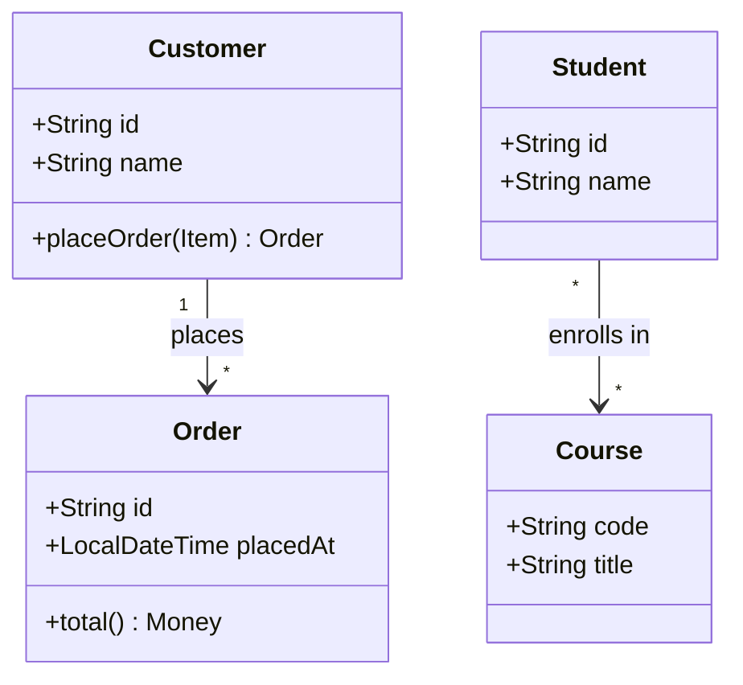

# Association — A Knows About B

**Date:** 2026-05-02 | **Updated:** 2026-05-02
**Tags:** `low-level-design` `class-relationships` `uml` `oop` `modeling`

## Summary

Association is the most general structural relationship in object-oriented design: one class **knows about** another and can interact with it. It is weaker than aggregation or composition (no ownership implied) and stronger than dependency (the link tends to persist as a field rather than appearing only inside a single method call).

## Table of Contents

- [What Association Means](#what-association-means)
- [Navigability: Unidirectional vs Bidirectional](#navigability-unidirectional-vs-bidirectional)
- [Multiplicity](#multiplicity)
- [UML Notation](#uml-notation)
- [Mermaid Class Diagram](#mermaid-class-diagram)
- [Java Examples](#java-examples)
- [TypeScript Examples](#typescript-examples)
- [Bidirectional Association: Maintaining Consistency](#bidirectional-association-maintaining-consistency)
- [Common Pitfalls](#common-pitfalls)
- [Related](#related)

## What Association Means

An association says: **objects of class A reference objects of class B** in some structural way — typically as a field — and can send messages to them. Unlike aggregation/composition, association does **not** imply that A owns B, controls B's lifetime, or is the "whole" containing B as a "part".

Classic examples:

- A `Customer` has a list of `Order` objects placed (and an `Order` references the `Customer` who placed it).
- A `Student` enrolls in `Course` objects (and a `Course` has enrolled `Student` objects).
- A `Driver` drives a `Car`.

The relationship is durable (it lives across method calls, stored in a field) but neither party owns the other's life.

## Navigability: Unidirectional vs Bidirectional

**Unidirectional**: only one side knows about the other. `Order` knows its `Customer`, but `Customer` does not hold a list of `Order` objects. To find a customer's orders, you query a repository.

**Bidirectional**: both sides hold references. `Customer` has `List<Order>`, and each `Order` has a `Customer`. Convenient navigation, but you must keep both sides consistent and you risk reference cycles (problematic for naive serialization, equality, and garbage collection in some runtimes).

**Default to unidirectional.** Add the reverse direction only when:

1. You traverse it often enough that querying a repository would be expensive or awkward.
2. You can guarantee the two sides stay in sync.

## Multiplicity

Multiplicity describes how many objects on each side participate.

| Form | Meaning | Example |
| --- | --- | --- |
| `1` | exactly one | An `Order` has exactly one `Customer`. |
| `0..1` | zero or one (optional) | A `User` may have an optional `ProfilePhoto`. |
| `*` or `0..*` | zero or more | A `Customer` has zero or more `Order` objects. |
| `1..*` | one or more | An `Invoice` has at least one `LineItem`. |
| `n..m` | bounded range | A `Team` has `5..11` `Player` objects. |

Combined into the four classic cardinalities:

- **1:1** — exactly one on each side. Often a sign you could fold the two classes together unless lifecycles or responsibilities differ.
- **1:N** — one to many. `Customer` 1—`*` `Order`. The single side typically owns the collection.
- **N:1** — many to one. The mirror of 1:N; just a viewpoint flip.
- **N:M** — many to many. `Student` `*`—`*` `Course`. Often introduces a join entity (`Enrollment`) when the relationship has its own attributes (grade, enrollment date).

## UML Notation

In a UML class diagram, association is drawn as a **plain solid line** between the two classes.

```
+----------+                 +----------+
| Customer |1 -----------*   |  Order   |
+----------+                 +----------+
```

Decorations you may see on that line:

- **Multiplicity** at each end (`1`, `*`, `0..1`, `1..*`).
- **Role names** describing the part each end plays (`placed`, `placedBy`).
- **Association name** in the middle (verb phrase, e.g. `places`).
- **Navigability arrows**: an open arrowhead `>` at one end means the line is navigable in that direction. A line with an arrowhead at only one end is unidirectional; a plain line is conventionally bidirectional or unspecified.
- **Cross `x`** on an end means explicitly **not** navigable in that direction.

## Mermaid Class Diagram



The arrow from `Customer` to `Order` shows a unidirectional 1-to-many: a customer holds references to its orders, but the order need not hold a back-reference. The line between `Student` and `Course` is bidirectional many-to-many.

## Java Examples

Unidirectional 1:N — `Customer` knows its `Order` objects, `Order` does not know its `Customer`:

```java
public final class Customer {
    private final String id;
    private final String name;
    private final List<Order> orders = new ArrayList<>();

    public Customer(String id, String name) {
        this.id = id;
        this.name = name;
    }

    public void place(Order order) {
        orders.add(order);
    }

    public List<Order> getOrders() {
        return List.copyOf(orders);
    }
}

public final class Order {
    private final String id;
    private final List<LineItem> items;

    public Order(String id, List<LineItem> items) {
        this.id = id;
        this.items = List.copyOf(items);
    }
}
```

Unidirectional N:1 — `Order` knows its `Customer`, but `Customer` does not list its orders (use a query):

```java
public final class Order {
    private final String id;
    private final Customer customer;

    public Order(String id, Customer customer) {
        this.id = id;
        this.customer = customer;
    }

    public Customer getCustomer() {
        return customer;
    }
}
```

## TypeScript Examples

```typescript
class Customer {
  constructor(
    readonly id: string,
    readonly name: string,
    private readonly orders: Order[] = []
  ) {}

  place(order: Order): void {
    this.orders.push(order);
  }

  listOrders(): readonly Order[] {
    return this.orders;
  }
}

class Order {
  constructor(
    readonly id: string,
    readonly customer: Customer,
    readonly placedAt: Date
  ) {}
}
```

Many-to-many with a join entity — preferable once the relationship carries its own data:

```typescript
class Student {
  constructor(readonly id: string, readonly name: string) {}
}

class Course {
  constructor(readonly code: string, readonly title: string) {}
}

class Enrollment {
  constructor(
    readonly student: Student,
    readonly course: Course,
    readonly enrolledAt: Date,
    public grade: string | null = null
  ) {}
}
```

`Enrollment` turns the conceptual `Student * — * Course` association into two 1:N associations (`Student 1 — * Enrollment * — 1 Course`), and it gives the relationship a place to store grade and date.

## Bidirectional Association: Maintaining Consistency

If you must keep references on both sides, encapsulate mutation behind a single method that updates both ends:

```java
public final class Order {
    private Customer customer;

    void assignTo(Customer newCustomer) {
        if (this.customer == newCustomer) return;
        if (this.customer != null) this.customer.removeOrder(this);
        this.customer = newCustomer;
        if (newCustomer != null) newCustomer.addOrder(this);
    }
}
```

Without this discipline, callers will set one side and forget the other, leading to ghost references and bugs that survive code review.

## Common Pitfalls

1. **Confusing association with aggregation/composition.** If neither side owns the other and lifetimes are independent, it is plain association. Reach for the diamond only when ownership is real.
2. **Bidirectional by default.** Adds complexity, encourages tight coupling, complicates JSON serialization, and risks infinite recursion in `toString` / `equals` / `hashCode`.
3. **Many-to-many without a join entity.** As soon as the relationship has attributes (when, by whom, with what role), introduce a class.
4. **Returning mutable collections.** Always return `List.copyOf` / `readonly` views so callers cannot mutate the association from outside.
5. **Storing IDs instead of references — or vice versa — without a reason.** Both are valid; the choice depends on aggregate boundaries (DDD), persistence model, and lazy-loading constraints.

## Related

- [Aggregation — A Has B (Loose)](./aggregation.md)
- [Composition — A Owns B (Strong)](./composition.md)
- [Dependency — A Uses B Briefly](./dependency.md)
- [Realization — A Implements Interface B](./realization.md)
- [UML Class Diagram Notation](../uml/class-diagram.md) _(planned)_
- [Dependency Inversion Principle](../solid/dependency-inversion-principle.md) _(planned)_
