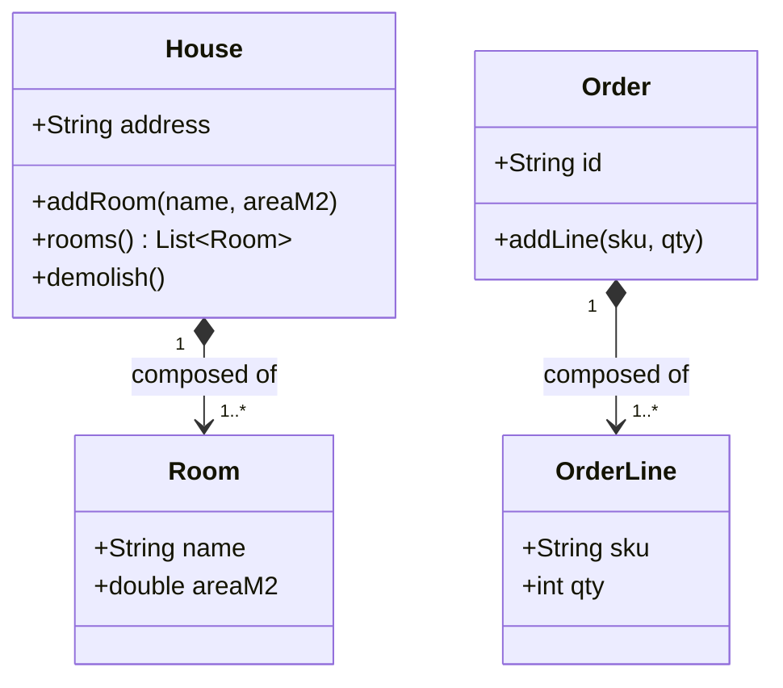

# Composition — A Owns B (Strong)

**Date:** 2026-05-02 | **Updated:** 2026-05-02
**Tags:** `low-level-design` `class-relationships` `uml` `oop` `modeling`

## Summary

Composition is the **strongest** structural relationship: the whole exclusively owns its parts and the parts share the whole's lifetime. When the whole is destroyed, its parts go with it. Parts cannot be shared between wholes, and parts are typically created and managed entirely inside the whole. The textbook example: a `House` is composed of `Room` objects — destroy the house, and the rooms cease to exist as meaningful entities.

## Table of Contents

- [Strong Ownership and Coincident Lifetime](#strong-ownership-and-coincident-lifetime)
- [Composition vs Aggregation at a Glance](#composition-vs-aggregation-at-a-glance)
- [UML Notation](#uml-notation)
- [Mermaid Class Diagram](#mermaid-class-diagram)
- [Java Implementation](#java-implementation)
- [TypeScript Implementation](#typescript-implementation)
- [Composition in Persistence (Cascade)](#composition-in-persistence-cascade)
- [Other Real Compositions](#other-real-compositions)
- ["Favor Composition Over Inheritance"](#favor-composition-over-inheritance)
- [Common Pitfalls](#common-pitfalls)
- [Related](#related)

## Strong Ownership and Coincident Lifetime

Composition makes three commitments simultaneously:

1. **Whole–part.** The whole is conceptually built from its parts.
2. **Exclusive ownership.** A part belongs to exactly one whole at a time. It is not shared.
3. **Coincident lifetime.** The part is created with (or by) the whole and destroyed with the whole. There is no "orphan part" state.

These are non-negotiable; relax any of them and you have moved from composition into aggregation or plain association.

## Composition vs Aggregation at a Glance

| Question | Aggregation | Composition |
| --- | --- | --- |
| Can the part exist before the whole? | yes | no |
| Can the part outlive the whole? | yes | no |
| Can the part be shared by another whole? | yes | no |
| Does deleting the whole delete the part? | no | yes |
| UML diamond | open (hollow) | filled (black) |

A useful intuition: aggregation is "has a roster of," composition is "is made of."

## UML Notation

Composition is drawn as a **solid line with a filled (black) diamond on the side of the whole**. The diamond, like with aggregation, sits on the **whole** end; the part is at the other end.

```
+--------+ <#>------------- +--------+
| House  |                   |  Room  |
+--------+                   +--------+
    1                         1..*
```

Multiplicity at the part end is typically `1..*` or a fixed range, and at the whole end it is essentially always `1` (because exclusive ownership means the part has exactly one owner).

## Mermaid Class Diagram



The filled-diamond notation in Mermaid is `*--` (the asterisk is the diamond). Both `Room` and `OrderLine` are owned by exactly one whole and die with it.

## Java Implementation

The whole creates and holds its parts; the parts are not exposed for outside construction or sharing.

```java
public final class House {
    private final String address;
    private final List<Room> rooms = new ArrayList<>();

    public House(String address) {
        this.address = address;
    }

    public void addRoom(String name, double areaM2) {
        rooms.add(new Room(name, areaM2));
    }

    public List<Room> rooms() {
        return List.copyOf(rooms);
    }

    public void demolish() {
        rooms.clear();
    }

    // Inner class makes "rooms cannot exist without their House" structural.
    public static final class Room {
        private final String name;
        private final double areaM2;

        private Room(String name, double areaM2) {
            this.name = name;
            this.areaM2 = areaM2;
        }

        public String name() { return name; }
        public double areaM2() { return areaM2; }
    }
}
```

Key design choices:

- The `Room` constructor is `private`, so only `House` can create rooms.
- `addRoom` takes the data needed to *build* a room, not a pre-built `Room` from outside. This forbids sharing.
- `rooms()` returns a defensive copy so callers cannot mutate the internal list.
- `demolish()` (or simply letting the `House` go out of scope) effectively destroys the rooms.

## TypeScript Implementation

```typescript
class Room {
  // Package-private by convention: created only by House.
  constructor(readonly name: string, readonly areaM2: number) {}
}

class House {
  private readonly _rooms: Room[] = [];

  constructor(readonly address: string) {}

  addRoom(name: string, areaM2: number): void {
    this._rooms.push(new Room(name, areaM2));
  }

  rooms(): readonly Room[] {
    return this._rooms;
  }

  demolish(): void {
    this._rooms.length = 0;
  }
}
```

In garbage-collected runtimes, "destroyed" means "unreachable." Once the `House` is unreachable, its `Room` instances become unreachable too (assuming no leaked references), and the GC reclaims them. The semantics match the diagram.

## Composition in Persistence (Cascade)

In ORMs (JPA/Hibernate, Doctrine, TypeORM, Prisma), composition typically maps to a parent–child relationship with **cascade-all** including delete and **orphan removal**. Removing a child from the parent's collection deletes the child row; deleting the parent deletes all children.

JPA sketch:

```java
@Entity
class Order {
    @Id String id;

    @OneToMany(
        mappedBy = "order",
        cascade = CascadeType.ALL,
        orphanRemoval = true
    )
    List<OrderLine> lines = new ArrayList<>();
}

@Entity
class OrderLine {
    @Id String id;

    @ManyToOne(optional = false)
    Order order;
}
```

This is exactly the persistence-layer expression of composition. Aggregation usually omits `orphanRemoval` and uses a narrower cascade (or none).

## Other Real Compositions

- **Order `*—` OrderLine.** An order line outside its order is meaningless.
- **Document `*—` Paragraph `*—` Run.** Word-processing models almost always use composition all the way down.
- **Window `*—` TitleBar / ContentArea / StatusBar.** UI containers and their structural sub-parts.
- **Tree `*—` Node.** A node in a tree is owned by the tree (and by its parent node, recursively).
- **Polygon `*—` Vertex / Edge.**

## "Favor Composition Over Inheritance"

The familiar slogan from *Design Patterns* (Gang of Four) uses *composition* in a slightly broader sense than the UML one — it covers both UML aggregation and UML composition. The point is: assemble behavior by **wiring objects together** (delegating to fields) rather than by **subclassing** to inherit it. Both UML composition and aggregation participate; UML composition just adds the additional commitment of exclusive ownership.

## Common Pitfalls

1. **Leaking part references.** Returning the live internal list lets callers mutate or even share the parts, breaking exclusive ownership. Always return defensive copies or read-only views.
2. **Accepting external part instances.** If your `addRoom(Room r)` accepts a pre-built `Room`, the same instance can be passed to two `House` objects — composition is now violated. Prefer factory-style methods that take the part's data, not the part.
3. **Mistaking it for inheritance.** Composition is a runtime structural relationship, not an `extends` relationship. A `House` is not a kind of `Room`.
4. **Ignoring cascade deletes in persistence.** If the model says composition but the database lets child rows survive, the model is lying. Add cascade and orphan removal, or downgrade the model to aggregation.
5. **Modeling everything as composition because it feels safe.** It is not safe — it bakes ownership into your model and makes refactoring (splitting wholes, sharing parts) harder. Use composition when the lifetime really is coincident, not as a default.

## Related

- [Association — A Knows About B](./association.md)
- [Aggregation — A Has B (Loose)](./aggregation.md)
- [Dependency — A Uses B Briefly](./dependency.md)
- [Realization — A Implements Interface B](./realization.md)
- [UML Class Diagram Notation](../uml/class-diagram.md) _(planned)_
- [Dependency Inversion Principle](../solid/dependency-inversion-principle.md) _(planned)_
