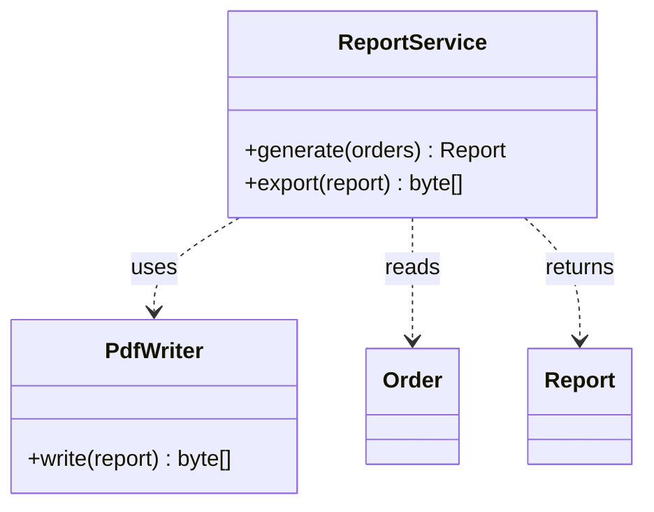

# Dependency — A Uses B Briefly

**Date:** 2026-05-02 | **Updated:** 2026-05-02
**Tags:** `low-level-design` `class-relationships` `uml` `oop` `dip`

## Summary

Dependency is the **weakest** structural relationship between classes: A *uses* B transiently — through a method parameter, a return value, a local variable, or a thrown exception type — without holding B as a field. Because the coupling is short-lived and non-structural, dependencies are the easiest relationships to refactor and the natural target for the Dependency Inversion Principle.

## Table of Contents

- [What "Brief Use" Means](#what-brief-use-means)
- [Dependency vs Association](#dependency-vs-association)
- [UML Notation](#uml-notation)
- [Mermaid Class Diagram](#mermaid-class-diagram)
- [Java Examples](#java-examples)
- [TypeScript Examples](#typescript-examples)
- [Why Dependencies Matter — Coupling and Recompilation](#why-dependencies-matter-coupling-and-recompilation)
- [Inverting Dependencies (DIP Preview)](#inverting-dependencies-dip-preview)
- [Common Pitfalls](#common-pitfalls)
- [Related](#related)

## What "Brief Use" Means

A class A *depends on* a class B if A needs to know B exists in order to compile, but the knowledge does not show up as a field of A. Concretely, A has a dependency on B when:

- A method of A takes B as a **parameter**.
- A method of A returns B (or a generic of B).
- A method of A creates a B as a **local variable**.
- A method of A catches or throws B (where B is an exception type).
- A static method of B is called from A.

The relationship lives only for the duration of a call. Outside that call, no instance of A references any instance of B.

## Dependency vs Association

| Property | Dependency | Association |
| --- | --- | --- |
| Where the reference lives | parameter, return, local, throws | field |
| Lifetime of the link | within a method call | as long as A is alive |
| Strength of coupling | weakest | medium |
| Easy to invert via interface? | very | yes, but field type is more rigid |
| UML | dashed line with open arrow | solid line |

A useful rule of thumb: if removing the field of type B from class A causes a compile error, you have an association (or stronger). If only a method signature breaks, you have a dependency.

## UML Notation

Dependency is drawn as a **dashed line with an open arrowhead** pointing from the *user* (the class that uses) to the *used* (the class being used).

```
+----------+ - - - - - - -> +-----------+
| Reporter |                | PdfWriter |
+----------+                +-----------+
```

Optional stereotypes (the `<<...>>` annotation on the line) clarify the kind of dependency:

- `<<use>>` — generic usage (default if unmarked).
- `<<create>>` — A instantiates B inside a method.
- `<<call>>` — A invokes a static method of B.
- `<<instantiate>>` — synonym for `<<create>>` in some dialects.

## Mermaid Class Diagram



The dashed arrows (`..>`) show that `ReportService` *uses* `PdfWriter`, *reads* `Order` parameters, and *returns* `Report` instances — without any of these being fields on `ReportService`.

## Java Examples

Dependency via parameter:

```java
public final class ReportService {
    public Report generate(List<Order> orders) {
        // `Order` is a dependency: parameter only, no field.
        return new Report(orders.stream().map(Order::total).toList());
    }
}
```

Dependency via local variable / `<<create>>`:

```java
public final class ReportService {
    public byte[] export(Report report) {
        PdfWriter writer = new PdfWriter();      // <<create>>
        return writer.write(report);
    }
}
```

Dependency via static call:

```java
public final class IdGenerator {
    public String next() {
        return UUID.randomUUID().toString();     // depends on UUID
    }
}
```

Dependency via thrown exception type:

```java
public final class PaymentClient {
    public void charge(Money amount) throws PaymentDeclinedException {
        // PaymentDeclinedException is a dependency.
    }
}
```

## TypeScript Examples

```typescript
class ReportService {
  generate(orders: Order[]): Report {
    return new Report(orders.map((o) => o.total()));
  }

  export(report: Report): Uint8Array {
    const writer = new PdfWriter();      // local variable dependency
    return writer.write(report);
  }
}
```

A function-based variant has the same dependencies — `Order`, `Report`, `PdfWriter` — but no class hierarchy:

```typescript
function exportReport(report: Report): Uint8Array {
  return new PdfWriter().write(report);
}
```

The dependency arrow in UML applies equally to module-level functions: `exportReport` depends on `PdfWriter` and `Report`.

## Why Dependencies Matter — Coupling and Recompilation

Even though dependency is the *weakest* relationship, dependencies dominate large-system design. They determine:

1. **Compile/build coupling.** If module A depends on module B, B must be compiled (or its types resolvable) before A. Dependency cycles between modules are usually fatal.
2. **Test isolation.** If `ReportService` directly depends on a concrete `PdfWriter` that opens files, you cannot unit-test `ReportService` without doing real I/O.
3. **Change propagation.** Every change to B's public API can ripple to every A that depends on it.
4. **Architectural layering.** "Domain depends on nothing; application depends on domain; infrastructure depends on both" is entirely a statement about dependency arrows.

Counting and shaping dependencies is one of the highest-leverage activities in architecture.

## Inverting Dependencies (DIP Preview)

The Dependency Inversion Principle (the **D** in SOLID) says: depend on **abstractions**, not on **concretions**. Apply it here by introducing an interface and letting both `ReportService` and `PdfWriter` depend on it instead of on each other:

Before (concrete dependency):

```java
public final class ReportService {
    public byte[] export(Report report) {
        PdfWriter writer = new PdfWriter();   // concrete dependency
        return writer.write(report);
    }
}
```

After (depend on an abstraction, inject the concrete):

```java
public interface ReportRenderer {
    byte[] render(Report report);
}

public final class PdfWriter implements ReportRenderer {
    @Override public byte[] render(Report report) { /* ... */ return new byte[0]; }
}

public final class ReportService {
    private final ReportRenderer renderer;       // now an association on the interface

    public ReportService(ReportRenderer renderer) {
        this.renderer = renderer;
    }

    public byte[] export(Report report) {
        return renderer.render(report);          // depends only on the abstraction
    }
}
```

Several things happened:

- `ReportService` no longer has a *concrete* dependency on `PdfWriter`; it has an *association* on the `ReportRenderer` interface and a *realization* arrow flows from `PdfWriter` to that interface.
- The arrow direction has **inverted** at the architectural level: high-level policy (`ReportService`) no longer points down at low-level detail (`PdfWriter`); both point at the abstraction.
- Test doubles (a `FakeReportRenderer`) plug in trivially.

A common pattern: dependencies on parameter types are easy to invert because you can simply change the parameter type to an interface. Dependencies on local-variable construction (`new PdfWriter()`) require lifting the construction out of the method (constructor injection, factory, container).

## Common Pitfalls

1. **`new` inside a method buries a hard dependency.** It looks like a "small local detail" but it irreversibly couples the method to the concrete class. Inject collaborators instead.
2. **Static method calls hide dependencies.** They do not appear in constructor signatures, so test setup is invisible. Wrap static APIs (`Clock`, `UUID`, file I/O) behind injectable interfaces when behavior depends on them.
3. **Hidden cyclic dependencies.** A and B depend on each other through method parameters; once both compile, the cycle survives quietly. Visualize dependencies regularly.
4. **Over-abstracting trivial dependencies.** Not every parameter needs an interface. Reach for DIP when there is a real reason to swap implementations (testing, plug-in points, alternate environments).
5. **Confusing dependency with composition.** A method that briefly creates a helper is dependency, not composition. Composition requires lifetime ownership at the field level.

## Related

- [Association — A Knows About B](./association.md)
- [Aggregation — A Has B (Loose)](./aggregation.md)
- [Composition — A Owns B (Strong)](./composition.md)
- [Realization — A Implements Interface B](./realization.md)
- [Dependency Inversion Principle](../solid/dependency-inversion-principle.md) _(planned)_
- [UML Class Diagram Notation](../uml/class-diagram.md) _(planned)_
