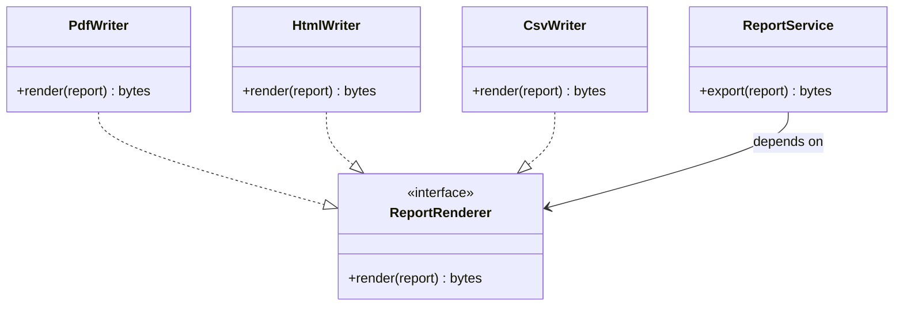

# Realization — A Implements Interface B

**Date:** 2026-05-02 | **Updated:** 2026-05-02
**Tags:** `low-level-design` `class-relationships` `uml` `oop` `interfaces`

## Summary

Realization is the relationship between a **specification** (typically an interface or abstract type) and a **provider** that fulfills it. The class promises to honor the contract declared by the interface — every operation, every signature, every documented behavior. In code, this is `implements` in Java and TypeScript; in UML, it is a dashed line ending in a hollow triangle pointing at the interface.

## Table of Contents

- [Specification vs Implementation](#specification-vs-implementation)
- [Realization vs Inheritance vs Dependency](#realization-vs-inheritance-vs-dependency)
- [UML Notation](#uml-notation)
- [Mermaid Class Diagram](#mermaid-class-diagram)
- [Java: `implements`](#java-implements)
- [TypeScript: `implements`](#typescript-implements)
- [Multiple Realization](#multiple-realization)
- [Structural vs Nominal Realization](#structural-vs-nominal-realization)
- [Realization and the LSP / DIP](#realization-and-the-lsp--dip)
- [Common Pitfalls](#common-pitfalls)
- [Related](#related)

## Specification vs Implementation

An interface is a **named contract**: a set of operation signatures (and, by convention, behavior expectations) without committing to how they are carried out. A class **realizes** an interface by providing concrete implementations for each operation in the contract.

The split lets you:

- Code clients against the interface, swap implementations later.
- Test against fakes that realize the same interface.
- Express *capabilities* (`Comparable`, `Iterable`, `Closeable`) independently of *class hierarchy*.

In UML, the interface is itself a classifier (often shown with the `<<interface>>` stereotype or with a circle/lollipop notation). Realization is the formal name for the "provides this interface" relationship.

## Realization vs Inheritance vs Dependency

| Relationship | Concept | UML symbol | Java/TS keyword |
| --- | --- | --- | --- |
| Realization (interface implementation) | "I promise to provide this contract" | dashed line, hollow triangle | `implements` |
| Generalization (class inheritance) | "I am a kind of, with shared state and code" | solid line, hollow triangle | `extends` |
| Dependency | "I briefly use this" | dashed line, open arrow | (no keyword) |

Two important distinctions:

- **Realization is dashed** (specification relationship); **generalization is solid** (substitutable subtype). Both end in a *hollow triangle*, which is what they have in common.
- **Realization commits to a contract**, not to inherited code. The implementer must provide every method (or be abstract).

## UML Notation

```
+-----------------+
| <<interface>>   |
| ReportRenderer  |
+-----------------+
        ^
        | (dashed line, hollow triangle)
        |
+-----------------+
|   PdfWriter     |
+-----------------+
```

The triangle's flat side rests against the interface; the dashed line runs from the implementing class. Some diagrams use the **lollipop** notation: a small circle attached to the providing class, labeled with the interface name. Both mean the same thing.

## Mermaid Class Diagram



`..|>` in Mermaid renders the dashed line with a hollow triangle: the realization arrow. Three classes realize the same `ReportRenderer` interface, and `ReportService` depends only on the interface.

## Java: `implements`

```java
public interface ReportRenderer {
    byte[] render(Report report);
}

public final class PdfWriter implements ReportRenderer {
    @Override
    public byte[] render(Report report) {
        // produce PDF bytes
        return new byte[0];
    }
}

public final class HtmlWriter implements ReportRenderer {
    @Override
    public byte[] render(Report report) {
        // produce HTML bytes
        return new byte[0];
    }
}
```

The `implements` keyword is the runtime expression of UML realization. The compiler enforces that every abstract method on the interface is implemented (or the implementing class is itself declared `abstract`). The `@Override` annotation is optional but strongly recommended — it makes signature drift a compile error.

Java interfaces also support:

- **`default` methods** — concrete code shipped with the interface (Java 8+). Implementers can use the default or override it.
- **`static` methods** — utility methods on the interface itself.
- **`private` helper methods** — for sharing logic among `default` methods (Java 9+).

These features blur the line slightly between interface and abstract class, but the realization relationship is unchanged.

## TypeScript: `implements`

```typescript
interface ReportRenderer {
  render(report: Report): Uint8Array;
}

class PdfWriter implements ReportRenderer {
  render(report: Report): Uint8Array {
    return new Uint8Array();
  }
}

class HtmlWriter implements ReportRenderer {
  render(report: Report): Uint8Array {
    return new Uint8Array();
  }
}
```

TypeScript also lets a class implement multiple interfaces and lets interfaces extend other interfaces:

```typescript
interface Renderer { render(r: Report): Uint8Array; }
interface Closeable { close(): void; }

class FileRenderer implements Renderer, Closeable {
  render(r: Report): Uint8Array { return new Uint8Array(); }
  close(): void { /* close file handle */ }
}
```

## Multiple Realization

Both Java and TypeScript allow a single class to realize **many** interfaces. This is one of the core reasons interfaces exist: they let a class advertise multiple orthogonal capabilities without forcing a single inheritance chain.

```java
public final class FileRenderer
    implements ReportRenderer, AutoCloseable, Flushable {

    @Override public byte[] render(Report r) { return new byte[0]; }
    @Override public void close() { /* ... */ }
    @Override public void flush() { /* ... */ }
}
```

Note the asymmetry between class inheritance and interface realization:

- A class can `extends` **at most one** other class (single inheritance of state and code).
- A class can `implements` **many** interfaces (multiple inheritance of contract — no diamond problem because interfaces don't carry state).

In UML, the same triangle-on-dashed-line is repeated once per interface.

## Structural vs Nominal Realization

There is a deep typing-system difference here:

- **Java is nominal.** A class only realizes `Foo` if it explicitly says `implements Foo`. Two classes with identical method signatures are not interchangeable unless they share a declared interface.
- **TypeScript is structural.** A value satisfies an interface if its shape matches — even without `implements`. The `implements` keyword is an explicit *check* that the class shape matches the interface, but consumers of the interface accept any matching shape.

```typescript
interface HasName { name: string; }

class Cat {
  constructor(public name: string) {}
}

const named: HasName = new Cat("Whiskers"); // OK — structural match
```

In UML, both are modeled as realization. The runtime mechanics differ, but the design intent is the same.

## Realization and the LSP / DIP

Realization is the structural foundation for two SOLID principles:

- **Liskov Substitution Principle (LSP).** Any realization of `ReportRenderer` must be **substitutable** for any other in any context that uses the interface. If `PdfWriter` throws on empty reports but `HtmlWriter` does not, the substitution is broken even though the types compile.
- **Dependency Inversion Principle (DIP).** High-level modules depend on the *interface* (the realized contract), not on the concrete implementing class. Realization is what makes that arrow inversion possible: client → interface ← implementation.

Without interfaces and realization, both principles collapse into platitudes.

## Common Pitfalls

1. **Confusing `extends` and `implements`.** They look similar in code, but generalization (extends) inherits state and behavior; realization (implements) only commits to a contract. Mixing them up muddles the design.
2. **Fat interfaces.** When an interface has many unrelated methods, every realization is forced to implement all of them — often with stubs. Split into focused interfaces (Interface Segregation Principle).
3. **Leaky abstractions.** The interface promises one thing, the implementation does another (timeouts, exceptions, concurrency). LSP violations are realization bugs even though the compiler is happy.
4. **Anemic interfaces.** A single concrete class with a "matching" interface added "just in case" — extra ceremony with no current substitution benefit. Add the interface when a real second implementation appears (or is unavoidable).
5. **Realization where composition would be simpler.** If you only want to *reuse* code, prefer composition or a base class with `default` methods, not a sprawling interface hierarchy.
6. **Over-trusting structural typing in TypeScript.** Two types with the same shape but different intent can silently substitute. Use branded/nominal types when the distinction matters (currency, ID kinds).

## Related

- [Association — A Knows About B](./association.md)
- [Aggregation — A Has B (Loose)](./aggregation.md)
- [Composition — A Owns B (Strong)](./composition.md)
- [Dependency — A Uses B Briefly](./dependency.md)
- [Dependency Inversion Principle](../solid/dependency-inversion-principle.md) _(planned)_
- [UML Class Diagram Notation](../uml/class-diagram.md) _(planned)_
