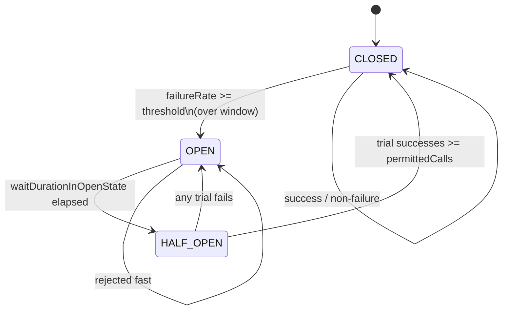

# Circuit Breaker Pattern (LLD)

**Date:** 2026-05-02 | **Updated:** 2026-05-02
**Tags:** `low-level-design` `design-patterns` `additional` `concurrency` `resilience`

## Summary

The Circuit Breaker is a small finite-state machine wrapped around a call to an unreliable collaborator. Instead of letting every caller pile up against a degraded dependency — burning threads, timing out, retrying, and turning a partial outage into a full one — the breaker **opens** after a threshold of failures and short-circuits subsequent calls with a fast failure. After a cool-down it allows a probe through (**half-open**) and either re-opens or returns to **closed**.

This document treats the breaker at the **class level** — what fields, what state transitions, what data structure for the failure window. It is the same pattern that appears in service meshes and gateways, but here we focus on what one Java class looks like, and we reference the well-known libraries by name (we do not invent their internals).

The pattern was popularized by **Michael Nygard** in *Release It! Design and Deploy Production-Ready Software* (Pragmatic Bookshelf). Production-grade implementations include **Netflix Hystrix** (now in maintenance mode) and **resilience4j** (the de facto standard for Java today).

## Table of Contents

- [Intent / Structure](#intent--structure)
- [State Machine](#state-machine)
- [Window Strategies](#window-strategies)
- [Code (Java)](#code-java)
- [When to Use / Not](#when-to-use--not)
- [Pitfalls](#pitfalls)
- [Related](#related)
- [References](#references)

## Intent / Structure

Wrap a `Supplier<T>` (or `Callable<T>`) that talks to an unreliable dependency. Track outcomes in a sliding window. Trip when failures exceed a threshold; reject subsequent calls cheaply with a `CircuitBreakerOpenException`; after a configured wait, allow a small number of trial calls and decide whether to close again.

Components:

- **State** — `CLOSED`, `OPEN`, `HALF_OPEN`.
- **Sliding window** — count-based or time-based record of recent outcomes.
- **Thresholds** — failure rate to open, success rate (or success count) to close from half-open, max half-open trials.
- **Wait duration in OPEN** — how long before transitioning to HALF_OPEN.
- **Result classifier** — what counts as a "failure" (which exceptions, which response codes, slow calls).

## State Machine



Notes:

- The `OPEN -> HALF_OPEN` transition is conventionally lazy: the next call after the wait elapses observes the timestamp and atomically flips state.
- In HALF_OPEN, the breaker permits exactly `permittedNumberOfCallsInHalfOpenState` concurrent trials. Excess calls are rejected.

## Window Strategies

| Strategy | What it counts | When to choose |
|---|---|---|
| **Count-based** | Last N calls (ring buffer) | Steady traffic; predictable rate |
| **Time-based** | Calls in the last T seconds (bucketed) | Bursty traffic; need a wall-clock guarantee |

`resilience4j` supports both via `slidingWindowType`. The choice matters: a count-based window on a low-traffic endpoint may take hours to refresh.

## Code (Java)

A minimal, illustrative count-based breaker. **Not production-ready** — use `resilience4j` for that. This shows the shape.

```java
public final class CircuitBreaker {

    public enum State { CLOSED, OPEN, HALF_OPEN }

    public static final class Config {
        public final int  windowSize;                 // last N calls
        public final int  minimumNumberOfCalls;       // before computing rate
        public final double failureRateThreshold;     // 0.0 - 1.0
        public final Duration waitInOpen;             // before HALF_OPEN
        public final int  permittedInHalfOpen;        // trial calls

        public Config(int windowSize, int minimumNumberOfCalls,
                      double failureRateThreshold, Duration waitInOpen,
                      int permittedInHalfOpen) {
            this.windowSize = windowSize;
            this.minimumNumberOfCalls = minimumNumberOfCalls;
            this.failureRateThreshold = failureRateThreshold;
            this.waitInOpen = waitInOpen;
            this.permittedInHalfOpen = permittedInHalfOpen;
        }
    }

    public static final class CircuitBreakerOpenException extends RuntimeException {
        public CircuitBreakerOpenException(String name) { super("breaker " + name + " is OPEN"); }
    }

    private final String name;
    private final Config config;
    private final Clock clock;

    // Outcome ring buffer: true = success, false = failure
    private final boolean[] outcomes;
    private int next;             // write index
    private int filled;           // number of valid entries
    private int failures;         // count of false in valid window

    private volatile State state = State.CLOSED;
    private volatile long  openedAtMillis;
    private final AtomicInteger halfOpenInFlight = new AtomicInteger();
    private final AtomicInteger halfOpenSuccesses = new AtomicInteger();
    private final Object lock = new Object();

    public CircuitBreaker(String name, Config config, Clock clock) {
        this.name = name;
        this.config = config;
        this.clock = clock;
        this.outcomes = new boolean[config.windowSize];
    }

    public <T> T execute(Supplier<T> call) {
        beforeCall();
        try {
            T result = call.get();
            onSuccess();
            return result;
        } catch (RuntimeException e) {
            onFailure();
            throw e;
        }
    }

    private void beforeCall() {
        State s = state;
        if (s == State.OPEN) {
            if (clock.millis() - openedAtMillis >= config.waitInOpen.toMillis()) {
                transitionToHalfOpen();
            } else {
                throw new CircuitBreakerOpenException(name);
            }
        }
        if (state == State.HALF_OPEN) {
            int inFlight = halfOpenInFlight.incrementAndGet();
            if (inFlight > config.permittedInHalfOpen) {
                halfOpenInFlight.decrementAndGet();
                throw new CircuitBreakerOpenException(name);
            }
        }
    }

    private void onSuccess() {
        if (state == State.HALF_OPEN) {
            halfOpenInFlight.decrementAndGet();
            int s = halfOpenSuccesses.incrementAndGet();
            if (s >= config.permittedInHalfOpen) transitionToClosed();
            return;
        }
        record(true);
    }

    private void onFailure() {
        if (state == State.HALF_OPEN) {
            halfOpenInFlight.decrementAndGet();
            transitionToOpen();
            return;
        }
        record(false);
        evaluate();
    }

    private void record(boolean success) {
        synchronized (lock) {
            if (filled == outcomes.length) {
                if (!outcomes[next]) failures--;
            } else {
                filled++;
            }
            outcomes[next] = success;
            if (!success) failures++;
            next = (next + 1) % outcomes.length;
        }
    }

    private void evaluate() {
        synchronized (lock) {
            if (filled < config.minimumNumberOfCalls) return;
            double rate = (double) failures / (double) filled;
            if (rate >= config.failureRateThreshold) transitionToOpen();
        }
    }

    private void transitionToOpen() {
        state = State.OPEN;
        openedAtMillis = clock.millis();
        halfOpenInFlight.set(0);
        halfOpenSuccesses.set(0);
    }

    private void transitionToHalfOpen() {
        state = State.HALF_OPEN;
        halfOpenInFlight.set(0);
        halfOpenSuccesses.set(0);
    }

    private void transitionToClosed() {
        synchronized (lock) {
            Arrays.fill(outcomes, false);
            next = 0; filled = 0; failures = 0;
        }
        state = State.CLOSED;
    }

    public State state() { return state; }
}
```

Caller:

```java
CircuitBreaker.Config cfg = new CircuitBreaker.Config(
        20, 10, 0.50, Duration.ofSeconds(30), 3);
CircuitBreaker cb = new CircuitBreaker("payments", cfg, Clock.systemUTC());

PaymentResult r = cb.execute(() -> paymentsClient.charge(req));
```

### Notes on real libraries (no invented internals)

- **resilience4j** offers `CircuitBreaker`, `Retry`, `RateLimiter`, `Bulkhead`, `TimeLimiter` as composable decorators. Configuration includes `slidingWindowType` (COUNT_BASED or TIME_BASED), `slidingWindowSize`, `minimumNumberOfCalls`, `failureRateThreshold`, `slowCallRateThreshold`, `waitDurationInOpenState`, and `permittedNumberOfCallsInHalfOpenState`. Consult the official resilience4j documentation for the authoritative behavior.
- **Hystrix** historically combined the breaker with a thread-pool / semaphore bulkhead and request collapsing; it has been in maintenance mode since 2018. Refer to the Netflix Hystrix wiki for details.

## When to Use / Not

**Use** when:

- The call crosses a network or process boundary to a dependency that can be slow or fail.
- A degraded dependency would cascade — threads pile up, queues fill, latencies climb.
- You have a sensible fallback (cached value, default, queue-for-later, surface the error early).

**Avoid** when:

- The call is in-process and fast — the breaker is overhead and adds complexity.
- The dependency is the only path and there is no fallback — failing fast just changes the failure mode without improving the outcome.
- Failures are expected to be deterministic (`4xx`) — those should not trip a breaker (see the result classifier).

## Pitfalls

- **Counting the wrong things.** Client-side validation errors (`4xx` from your own bug) should not count as failures. Configure a result classifier that counts only timeouts, connection errors, and `5xx`.
- **Slow calls.** Calls that hang but never throw still consume a thread. Combine the breaker with a `TimeLimiter` (or read/connect timeouts on the underlying client) and consider tripping on slow-call rate as well as failure rate.
- **Window too small.** A 10-call window on a low-RPS endpoint reacts to noise. Set `minimumNumberOfCalls` to a meaningful denominator.
- **Per-instance vs per-route.** One breaker per logical dependency, not per object. If you `new` one per request, every breaker sees one call and never trips.
- **HALF_OPEN stampede.** If you forget to cap concurrent trials, the moment the breaker half-opens you re-stampede the dependency. The `permittedInHalfOpen` counter must be enforced atomically.
- **Open + retry == amplifier.** A retry loop in front of an open breaker just spins. Decorate as `Retry(CircuitBreaker(call))` not the other way around, and let the breaker's open exception short-circuit the retry. See [retry-with-backoff.md](./retry-with-backoff.md).
- **State observability.** Emit metrics on every transition. A silent breaker that has been OPEN for an hour is a worse outage than the original one.

## Related

- [retry-with-backoff.md](./retry-with-backoff.md) — sibling resilience pattern; usually composed with the breaker.
- [concurrency-patterns.md](./concurrency-patterns.md) — the breaker is shared mutable state and uses Monitor Object semantics.
- [thread-pool-pattern.md](./thread-pool-pattern.md) — bulkheads are typically thread-pool-backed and sit alongside breakers.
- [producer-consumer-pattern.md](./producer-consumer-pattern.md) — async outbox / queue-for-later is a common breaker fallback.
- [../behavioral/state.md](../behavioral/state.md) — the breaker is a textbook State pattern.

## References

- Nygard, Michael. *Release It! Design and Deploy Production-Ready Software*. Pragmatic Bookshelf. (2nd edition.)
- resilience4j project documentation (CircuitBreaker module).
- Netflix Hystrix wiki (status: maintenance mode).
- Schmidt et al. *Pattern-Oriented Software Architecture, Volume 2* (Wiley) — for the underlying concurrency primitives the breaker uses.
