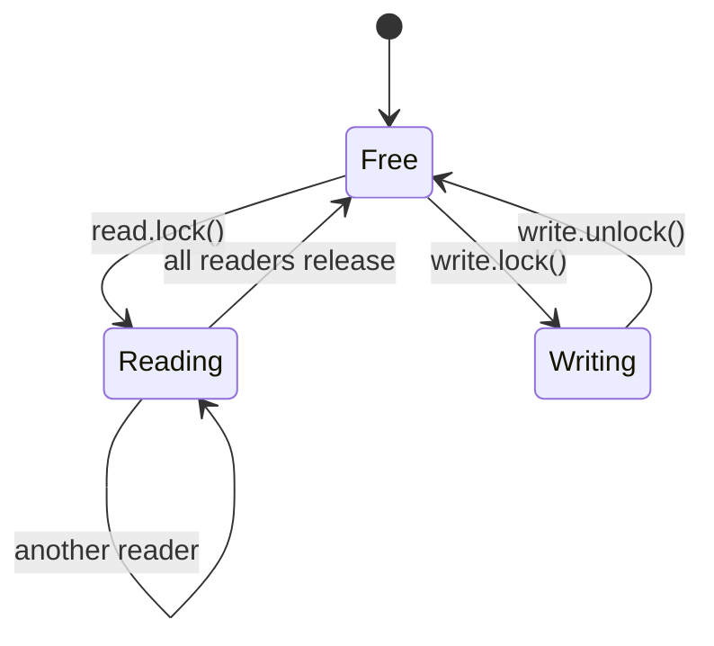
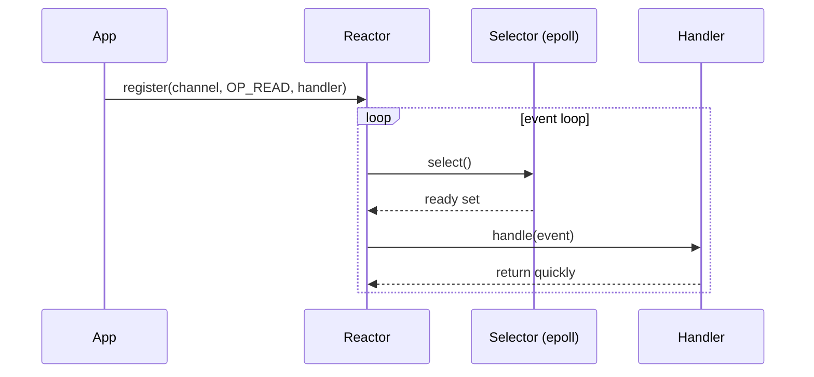

# Concurrency Patterns Survey — Read-Write Lock, Active Object, Monitor Object, Double-Checked Locking, Reactor

**Date:** 2026-05-02 | **Updated:** 2026-05-02
**Tags:** `low-level-design` `design-patterns` `additional` `concurrency` `java`

## Summary

A focused tour of the concurrency-and-networking patterns catalogued in **POSA Vol 2** (*Pattern-Oriented Software Architecture: Patterns for Concurrent and Networked Objects*, Schmidt, Stal, Rohnert, Buschmann). These are the building blocks behind every server, database engine, and reactive framework you've ever used. We cover six patterns at the class/object scale (i.e., not "circuit breaker at the service mesh"):

1. **Read-Write Lock** — many readers OR one writer.
2. **Active Object** — decouple invocation from execution via a queue.
3. **Monitor Object** — an object that owns its synchronization.
4. **Double-Checked Locking** — lazy init without paying lock cost on hot path (with the `volatile` fix the JMM requires).
5. **Reactor** — event demultiplexer that dispatches handlers when descriptors are ready.
6. **Half-Sync/Half-Async** — a hybrid layered around a queue, briefly.

All examples are Java.

## Table of Contents

- [Read-Write Lock](#read-write-lock)
- [Active Object](#active-object)
- [Monitor Object](#monitor-object)
- [Double-Checked Locking](#double-checked-locking)
- [Reactor](#reactor)
- [Half-Sync / Half-Async](#half-sync--half-async)
- [When to Use / Not](#when-to-use--not)
- [Pitfalls](#pitfalls)
- [Related](#related)
- [References](#references)

## Read-Write Lock

### Intent / Structure

Allow concurrent readers when no writer holds the lock; serialize writers. Optimizes read-heavy workloads where naive `synchronized` would serialize everything.



Java offers two main implementations:

- **`ReentrantReadWriteLock`** (Java 5+) — reentrant, supports fair/unfair modes, lock downgrade (write → read) but **not** upgrade.
- **`StampedLock`** (Java 8+) — non-reentrant, adds an **optimistic read** mode that returns a stamp; reader validates the stamp after reading and only falls back to a real read lock on conflict. Significantly faster for short reads but trickier API.

### Code (Java)

`ReentrantReadWriteLock`:

```java
public final class ConfigCache {
    private final Map<String, String> data = new HashMap<>();
    private final ReentrantReadWriteLock lock = new ReentrantReadWriteLock();

    public String get(String key) {
        lock.readLock().lock();
        try {
            return data.get(key);
        } finally {
            lock.readLock().unlock();
        }
    }

    public void put(String key, String value) {
        lock.writeLock().lock();
        try {
            data.put(key, value);
        } finally {
            lock.writeLock().unlock();
        }
    }
}
```

`StampedLock` optimistic read:

```java
public final class Point {
    private double x, y;
    private final StampedLock sl = new StampedLock();

    public double distanceFromOrigin() {
        long stamp = sl.tryOptimisticRead();
        double cx = x, cy = y;
        if (!sl.validate(stamp)) {
            stamp = sl.readLock();
            try { cx = x; cy = y; } finally { sl.unlockRead(stamp); }
        }
        return Math.hypot(cx, cy);
    }

    public void move(double dx, double dy) {
        long stamp = sl.writeLock();
        try { x += dx; y += dy; } finally { sl.unlockWrite(stamp); }
    }
}
```

### When

- Reader-to-writer ratio is high (caches, configuration, route tables).
- Read critical sections are short and side-effect-free.

## Active Object

### Intent / Structure

Decouple **method invocation** (in the client thread) from **method execution** (in a private scheduler thread). The client gets a `Future` immediately; the work runs serialized inside the active object. Originally formalized by Lavender & Schmidt and detailed in POSA Vol 2.

Components:

- **Proxy** — public interface; enqueues requests.
- **Method Request** — a command object representing one call.
- **Activation Queue** — bounded queue.
- **Scheduler** — single thread pulling and executing requests.
- **Servant** — actual logic, single-threaded by construction.
- **Future** — return handle.

### Code (Java)

```java
public final class ActiveLogger implements AutoCloseable {
    private final BlockingQueue<Runnable> queue = new LinkedBlockingQueue<>(1024);
    private final ExecutorService scheduler =
            Executors.newSingleThreadExecutor(r -> {
                Thread t = new Thread(r, "active-logger");
                t.setDaemon(true);
                return t;
            });
    private final Servant servant = new Servant();

    public CompletableFuture<Void> log(String line) {
        CompletableFuture<Void> f = new CompletableFuture<>();
        boolean accepted = queue.offer(() -> {
            try { servant.write(line); f.complete(null); }
            catch (Exception e) { f.completeExceptionally(e); }
        });
        if (!accepted) f.completeExceptionally(new RejectedExecutionException("queue full"));
        return f;
    }

    private void pumpForever() {
        scheduler.submit(() -> {
            while (!Thread.currentThread().isInterrupted()) {
                try { queue.take().run(); } catch (InterruptedException e) { return; }
            }
        });
    }

    private static final class Servant {
        void write(String line) { /* single-threaded I/O */ }
    }

    @Override public void close() { scheduler.shutdownNow(); }
}
```

### When

- The servant is not thread-safe and you don't want to retrofit locking.
- You need back-pressure via a bounded queue.
- You want async semantics without exposing threads to callers.

## Monitor Object

### Intent / Structure

An object that **owns** its lock and condition variables; clients call methods normally and synchronization is invisible to them. Java's `synchronized` + `Object.wait/notify` and `ReentrantLock` + `Condition` are direct realizations.

### Code (Java)

A bounded buffer monitor:

```java
public final class BoundedBuffer<T> {
    private final Object[] items;
    private int head, tail, count;
    private final ReentrantLock lock = new ReentrantLock();
    private final Condition notFull  = lock.newCondition();
    private final Condition notEmpty = lock.newCondition();

    public BoundedBuffer(int capacity) { this.items = new Object[capacity]; }

    public void put(T x) throws InterruptedException {
        lock.lock();
        try {
            while (count == items.length) notFull.await();
            items[tail] = x;
            tail = (tail + 1) % items.length;
            count++;
            notEmpty.signal();
        } finally { lock.unlock(); }
    }

    @SuppressWarnings("unchecked")
    public T take() throws InterruptedException {
        lock.lock();
        try {
            while (count == 0) notEmpty.await();
            T x = (T) items[head];
            items[head] = null;
            head = (head + 1) % items.length;
            count--;
            notFull.signal();
            return x;
        } finally { lock.unlock(); }
    }
}
```

### When

- Encapsulating a small piece of mutable shared state.
- Cooperative thread coordination (producer/consumer, bounded resources).

## Double-Checked Locking

### Intent / Structure

Lazy-initialize a field without paying lock cost after the first publish. Famously **broken** in pre-JMM Java; the fix in modern Java requires the field to be `volatile` so the partially-constructed object cannot be observed.

### Code (Java)

```java
public final class HeavyService {
    private static volatile HeavyService INSTANCE;   // volatile is mandatory

    private HeavyService() { /* expensive */ }

    public static HeavyService get() {
        HeavyService local = INSTANCE;               // single read
        if (local == null) {
            synchronized (HeavyService.class) {
                local = INSTANCE;
                if (local == null) {
                    local = new HeavyService();
                    INSTANCE = local;
                }
            }
        }
        return local;
    }
}
```

The local read is an idiom: it lets the JIT load `INSTANCE` exactly once on the fast path.

For singletons, **prefer the holder idiom** — it gets you laziness and thread-safety from the classloader, with no locks at all:

```java
public final class Settings {
    private Settings() {}
    private static final class Holder { static final Settings INSTANCE = new Settings(); }
    public static Settings get() { return Holder.INSTANCE; }
}
```

### When

- You genuinely need lazy init (cost of construction is high or has side effects).
- You cannot use the holder idiom (e.g., the lazy field is not a singleton, but per-key in a map).

## Reactor

### Intent / Structure

A single thread (or small pool) waits on an **event demultiplexer** (e.g., `epoll`, `kqueue`, `select`) for I/O readiness on many descriptors and dispatches each ready event to a registered **event handler**. Inverts control: handlers do not block on I/O; they are called when I/O is possible.



In Java, `java.nio.channels.Selector` is the demultiplexer; **Netty** is the standard reactor framework built on top of it (with one or two `EventLoopGroup`s — boss + worker — implementing the **Half-Sync/Half-Async** layering).

### Code (Java)

A minimal echo reactor over NIO:

```java
public final class EchoReactor {
    public static void main(String[] args) throws IOException {
        Selector selector = Selector.open();
        ServerSocketChannel server = ServerSocketChannel.open();
        server.bind(new InetSocketAddress(8080));
        server.configureBlocking(false);
        server.register(selector, SelectionKey.OP_ACCEPT);

        ByteBuffer buf = ByteBuffer.allocate(1024);
        while (true) {
            selector.select();
            for (Iterator<SelectionKey> it = selector.selectedKeys().iterator(); it.hasNext();) {
                SelectionKey k = it.next(); it.remove();
                if (k.isAcceptable()) {
                    SocketChannel c = ((ServerSocketChannel) k.channel()).accept();
                    c.configureBlocking(false);
                    c.register(selector, SelectionKey.OP_READ);
                } else if (k.isReadable()) {
                    SocketChannel c = (SocketChannel) k.channel();
                    buf.clear();
                    int n = c.read(buf);
                    if (n == -1) { c.close(); continue; }
                    buf.flip();
                    c.write(buf);
                }
            }
        }
    }
}
```

Real Netty handlers do exactly this conceptually but with pipelines, codecs, and proper backpressure.

### When

- You need to serve many connections with few threads (C10K and beyond).
- I/O is the bottleneck, not CPU.

## Half-Sync / Half-Async

A layered pattern: an **async layer** (Reactor + non-blocking I/O) hands off completed inputs through a **queue** to a **sync layer** of worker threads that can use familiar blocking code. Netty's `EventLoopGroup` (async) handing work off to a `DefaultEventExecutorGroup` (sync workers) is the canonical example. Use when handlers need to call blocking APIs (JDBC, legacy services) without stalling the event loop.

## When to Use / Not

| Pattern | Use | Avoid |
|---|---|---|
| Read-Write Lock | Many short reads, few writes | Writes dominate; very short critical sections (atomic suffices) |
| Active Object | Async API over thread-unsafe servant; need backpressure | Trivial logic where direct calls suffice; latency-critical paths |
| Monitor Object | Small encapsulated shared state | High-throughput data structures (use j.u.c. instead) |
| DCL | Lazy non-singleton fields | Singletons (use holder idiom) |
| Reactor | Many connections, I/O-bound | CPU-bound work (use a worker pool, or Half-Sync/Half-Async) |
| Half-Sync/Half-Async | Mixed blocking + async | Pure async stacks (don't introduce queues you don't need) |

## Pitfalls

- **Read-Write Lock**: writer starvation under fair=false; downgrade is allowed but upgrade is not — attempting it deadlocks. `StampedLock` is **not** reentrant.
- **Active Object**: unbounded queue == hidden memory leak; bounded queue without a rejection policy == surprise exceptions. Always bound and decide the policy.
- **Monitor Object**: `notify` vs `notifyAll` — use `notifyAll`/`signalAll` unless you can prove only one waiter can make progress.
- **Double-Checked Locking**: forgetting `volatile` is the classic bug; another thread can see a non-null reference to a partially constructed object and read its default-zeroed fields.
- **Reactor**: blocking inside a handler stalls every other connection on that selector. Offload to a worker pool (Half-Sync/Half-Async) or use async APIs all the way down.
- **All of the above**: prefer `java.util.concurrent` primitives over hand-rolled. They've been audited; yours has not.

## Related

- [thread-pool-pattern.md](./thread-pool-pattern.md) — pool semantics that often back Active Object and Half-Sync/Half-Async workers.
- [producer-consumer-pattern.md](./producer-consumer-pattern.md) — the bounded-buffer monitor above is the canonical implementation.
- [circuit-breaker-pattern.md](./circuit-breaker-pattern.md) — wraps remote calls; often combined with retry.
- [retry-with-backoff.md](./retry-with-backoff.md) — sibling resilience pattern.
- [../behavioral/state.md](../behavioral/state.md) — state-machine modeling used by the breaker.

## References

- Schmidt, Stal, Rohnert, Buschmann. *Pattern-Oriented Software Architecture, Volume 2: Patterns for Concurrent and Networked Objects*. Wiley.
- Goetz et al. *Java Concurrency in Practice*. Addison-Wesley.
- Lea. *Concurrent Programming in Java: Design Principles and Patterns* (2nd ed.).
- JDK Javadoc: `java.util.concurrent.locks.ReentrantReadWriteLock`, `StampedLock`, `Condition`, `java.nio.channels.Selector`.
- Netty project documentation (event loop and channel pipeline).
