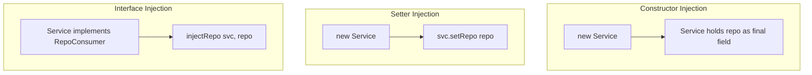

# Dependency Injection Pattern

**Date:** 2026-05-02 | **Updated:** 2026-05-02
**Tags:** `low-level-design` `design-patterns` `additional` `architecture` `testing`

## Summary

Dependency Injection (DI) is the discipline of *passing collaborators to an object from the outside* rather than letting it construct or look them up itself. It is the most common implementation of the Dependency Inversion Principle. DI can be done by hand (poor man's DI) or via a container (Spring, Guice, NestJS, .NET host). The pattern is older than the containers — Fowler's article *Inversion of Control Containers and the Dependency Injection Pattern* (2004) is the canonical write-up.

## Intent

- Decouple a class from how its collaborators are created or located.
- Make code testable by letting tests inject fakes/mocks.
- Centralize wiring so lifecycle and configuration live in one place.
- Enable substitution at deployment time without code changes.

## Three Forms of Injection



### Constructor injection (preferred)

```java
public final class OrderService {
    private final OrderRepository repo;
    private final PaymentGateway  payments;

    public OrderService(OrderRepository repo, PaymentGateway payments) {
        this.repo     = Objects.requireNonNull(repo);
        this.payments = Objects.requireNonNull(payments);
    }
    // ...
}
```

- Dependencies are explicit, immutable, and required.
- The class cannot exist in a half-built state.
- Easy to unit-test: `new OrderService(fakeRepo, fakePay)`.

### Setter injection

```java
public class OrderService {
    private OrderRepository repo;
    public void setRepo(OrderRepository repo) { this.repo = repo; }
}
```

- Use only for genuinely optional dependencies.
- Object can be in an invalid state until setters fire.
- Useful for circular dependencies or framework-required mutability.

### Interface injection

```java
public interface RepoAware { void inject(OrderRepository repo); }
```

Rarely used in modern Java/TS; once dominant in legacy J2EE and AWT.

## TypeScript Example — Hand-Wired

```ts
// Ports
interface OrderRepository { save(o: Order): Promise<void>; }
interface PaymentGateway  { charge(amount: number): Promise<string>; }

// Constructor injection
class OrderService {
  constructor(
    private readonly repo: OrderRepository,
    private readonly payments: PaymentGateway,
  ) {}

  async place(order: Order): Promise<void> {
    await this.payments.charge(order.total);
    await this.repo.save(order);
  }
}

// Composition root — wire once, at the top
const service = new OrderService(
  new PgOrderRepository(pool),
  new StripeGateway(stripeClient),
);
```

The composition root is the only place that knows concrete types.

## Java Example — Spring Container

```java
@Service
public class OrderService {
    private final OrderRepository repo;
    private final PaymentGateway  payments;

    // Spring picks this constructor and injects beans
    public OrderService(OrderRepository repo, PaymentGateway payments) {
        this.repo     = repo;
        this.payments = payments;
    }
}

@Configuration
public class WiringConfig {
    @Bean OrderRepository orderRepository(DataSource ds)        { return new JpaOrderRepository(ds); }
    @Bean PaymentGateway  paymentGateway(StripeClient stripe)   { return new StripeGateway(stripe); }
}
```

## NestJS Example — TypeScript Container

```ts
@Injectable()
export class OrderService {
  constructor(
    @Inject("OrderRepository") private readonly repo: OrderRepository,
    @Inject("PaymentGateway")  private readonly pay: PaymentGateway,
  ) {}
}

@Module({
  providers: [
    OrderService,
    { provide: "OrderRepository", useClass: PgOrderRepository },
    { provide: "PaymentGateway",  useClass: StripeGateway },
  ],
})
export class OrderModule {}
```

## Service Locator vs DI

A common confusion. Both decouple from `new`, but they differ:

| | Dependency Injection | Service Locator |
|---|---|---|
| Direction | Container *gives* deps to object | Object *asks* the locator for deps |
| Visibility of deps | Constructor signature | Hidden inside method bodies |
| Testability | Easy — pass test doubles | Harder — must stub the global locator |
| Coupling | To the dependency interface | To the locator and to dep keys |

DI is generally preferred. Service Locator is a legitimate pattern but easier to abuse.

## When DI Is Worth It

- Class has more than one collaborator with a real interface.
- You want to write unit tests with fakes/mocks.
- Same code runs in different environments (prod DB vs in-memory test DB).
- Object lifecycles differ (singleton, request-scoped, prototype).
- Cross-cutting concerns (logging, metrics, security) are wired uniformly.

## When DI Is Overkill

- Pure functions and value objects.
- Classes with zero or one stable collaborator.
- Tiny scripts and CLIs where wiring everything by hand is shorter than a container config.
- Performance-critical hot paths where reflection/proxy overhead matters and the dependency is not going to change.
- Library code: forcing consumers to adopt your DI container is hostile. Provide constructors that take the deps directly.

## Pitfalls

- **Circular dependencies**: A needs B, B needs A. Often a sign of a missing third class. Spring will fail fast unless one is `@Lazy`.
- **Container-coupled domain**: scattering `@Autowired` in domain classes leaks the framework. Keep the domain framework-free; wire it from the application layer.
- **Field injection**: `@Autowired private Foo foo;` looks tidy but hides dependencies and breaks `final` immutability. Prefer constructor injection.
- **Too many constructor params**: 5+ deps usually signals an SRP violation, not a DI problem.
- **Magic at runtime**: heavy reflection/proxying makes stack traces and startup harder to debug. Compile-time DI (Dagger, Macaron) is an alternative for Android.
- **Container as global state**: passing the `ApplicationContext` around is a Service Locator in disguise.
- **Premature interfaces**: do not extract `IFoo` for every class on the off chance you need a mock — extract when you need a substitute.

## Real-World Examples

- **Spring** (Java) — the canonical Java DI container; Spring Boot's autoconfiguration is DI driven.
- **Guice** (Google) — annotation-driven, lighter than Spring.
- **Dagger / Hilt** (Android) — compile-time DI, no runtime reflection.
- **NestJS** (TypeScript) — module-and-provider model, Angular-inspired.
- **Angular** — hierarchical injectors, one of the first JS DI containers.
- **.NET `IServiceCollection`** — first-party DI in ASP.NET Core.
- **Inversify**, **tsyringe** (TypeScript) — standalone containers.
- Plain functional code in Go, Rust, and TypeScript often does DI by hand — pass the dependency as a parameter.

## Related

- [../../solid/dependency-inversion-principle.md](../../solid/dependency-inversion-principle.md) — DI is the most common DIP implementation.
- [../creational/factory-method.md](../creational/factory-method.md) — DI containers are essentially smart factories.
- [../creational/builder.md](../creational/builder.md) — for objects with many optional deps, builder + DI compose well.
- [./repository-pattern.md](./repository-pattern.md) — services receive repositories via DI.
- [./mvc-pattern.md](./mvc-pattern.md) — controllers receive services via DI.

## References

- Fowler, *Inversion of Control Containers and the Dependency Injection Pattern* (martinfowler.com, 2004).
- *Dependency Injection Principles, Practices, and Patterns* — Mark Seemann.
- *Effective Java* (Bloch) — Item 5: prefer dependency injection to hardwiring resources.
