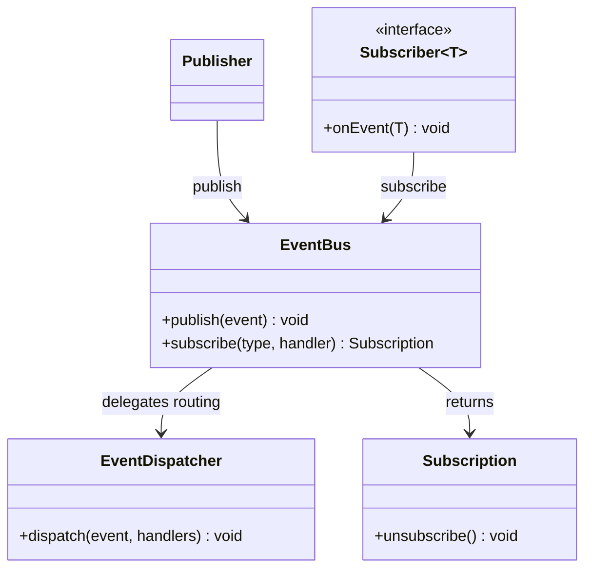

# In-Process Event Bus / Pub-Sub Pattern

**Date:** 2026-05-02 | **Updated:** 2026-05-02
**Tags:** `low-level-design` `design-patterns` `additional` `messaging` `decoupling`

## Summary

An Event Bus is an in-process publish/subscribe component: publishers post typed events to the bus, and subscribers register to receive events of types they care about. The bus mediates: it knows nothing about the business of either side, only how to route events from N producers to M consumers.

The pattern is closely related to the classic GoF Observer, but it is not the same. Observer is 1:N and *type-coupled* — the subject knows the observer interface and notifies it directly. An event bus is N:M and *type-routed* — publishers do not know what subscribers exist, subscribers do not know what publishers exist, and both ends communicate purely by event type. That extra layer of decoupling is the point.

This document covers in-process buses: Spring's `ApplicationEventPublisher`, Guava's `EventBus`, hand-rolled buses inside applications. Out-of-process pub/sub (Kafka, NATS, RabbitMQ) shares the conceptual shape but lives in a different operational world and is out of scope here.

## Table of Contents

- Intent / Problem
- Observer vs Event Bus
- Structure (Mermaid classDiagram)
- Class Skeletons (Java)
- Synchronous vs Asynchronous Dispatch
- Subscriber Lifecycle and Backpressure
- Spring `ApplicationEventPublisher` and Guava `EventBus`
- When to Use / When NOT
- Pitfalls
- Related
- References

## Intent / Problem

In a moderately sized application, modules want to react to things that happen in other modules without depending on them: when an order is placed, the inventory module should reserve stock, the email module should queue a confirmation, the metrics module should increment a counter, and the audit module should record the event. None of those reactions are part of the order module's responsibility, and in many cases they were added later by different teams.

The direct approach — `OrderService` calling `InventoryService`, `EmailService`, `MetricsService`, `AuditService` — couples the order module to all four. Each new reactor means a new dependency, a new constructor parameter, a new line in `OrderService`. Over time the order module becomes a coordinator of side effects rather than a service that places orders.

The Event Bus approach: `OrderService` publishes an `OrderPlaced` event. Each reactor subscribes to `OrderPlaced` and does its work in isolation. The order module knows about the event type, but not about who reacts to it. New reactors can be added without touching `OrderService` at all.

The cost: control flow becomes harder to follow. "What happens after `place()` returns?" is now answered by "search the codebase for subscribers of `OrderPlaced`", not by reading `OrderService` top to bottom. That trade-off is the central design question of the pattern.

## Observer vs Event Bus

The two are often confused. They are not the same.

| Aspect                  | Observer (GoF)                                    | Event Bus / Pub-Sub                              |
|-------------------------|---------------------------------------------------|--------------------------------------------------|
| Cardinality             | 1 subject : N observers                           | N publishers : M subscribers                     |
| Coupling between ends   | Subject knows observer interface                  | Both sides know only the event type              |
| Routing                 | Subject calls each observer directly              | Bus matches event type to registered handlers    |
| Registration            | `subject.addObserver(observer)`                   | `bus.subscribe(EventType.class, handler)`        |
| Typical use             | One model, multiple views                         | Cross-module coordination, side-effect fan-out   |
| Mediator                | None                                              | The bus itself                                   |

Observer is sufficient when there is a single source. The bus pays its complexity cost when there are *many* sources of conceptually similar events, or when the source and the listeners come from independent modules.

## Structure (Mermaid classDiagram)



The bus has two API halves: a publisher half (`publish`) and a subscriber half (`subscribe`). Internally it owns a routing table from event type to handler list, and a dispatcher that turns one publish into N handler invocations.

## Class Skeletons (Java)

### Subscriber and Subscription

```java
@FunctionalInterface
public interface Subscriber<T> {
    void onEvent(T event);
}

public interface Subscription {
    void unsubscribe();
}
```

### Bus

```java
public final class EventBus {
    private final Map<Class<?>, List<Subscriber<?>>> handlers =
        new ConcurrentHashMap<>();
    private final EventDispatcher dispatcher;

    public EventBus(EventDispatcher dispatcher) {
        this.dispatcher = dispatcher;
    }

    public <T> Subscription subscribe(Class<T> type, Subscriber<T> handler) {
        handlers.computeIfAbsent(type, k -> new CopyOnWriteArrayList<>())
                .add(handler);
        return () -> {
            List<Subscriber<?>> list = handlers.get(type);
            if (list != null) list.remove(handler);
        };
    }

    @SuppressWarnings("unchecked")
    public <T> void publish(T event) {
        Class<?> type = event.getClass();
        List<Subscriber<?>> direct = handlers.getOrDefault(type, List.of());
        dispatcher.dispatch(event, (List<Subscriber<Object>>) (List<?>) direct);
    }
}
```

### Dispatcher (synchronous)

```java
public final class SynchronousDispatcher implements EventDispatcher {
    @Override
    public <T> void dispatch(T event, List<Subscriber<Object>> handlers) {
        for (Subscriber<Object> handler : handlers) {
            try {
                handler.onEvent(event);
            } catch (RuntimeException ex) {
                // log; do not let one handler's failure block the rest
            }
        }
    }
}
```

### Dispatcher (asynchronous)

```java
public final class AsyncDispatcher implements EventDispatcher {
    private final Executor executor;

    public AsyncDispatcher(Executor executor) {
        this.executor = executor;
    }

    @Override
    public <T> void dispatch(T event, List<Subscriber<Object>> handlers) {
        for (Subscriber<Object> handler : handlers) {
            executor.execute(() -> {
                try {
                    handler.onEvent(event);
                } catch (RuntimeException ex) {
                    // log
                }
            });
        }
    }
}
```

### Usage

```java
public final class OrderService {
    private final EventBus bus;

    public OrderService(EventBus bus) {
        this.bus = bus;
    }

    public void place(Order order) {
        // ... persist order ...
        bus.publish(new OrderPlaced(order.id(), order.totalCents()));
    }
}

public final class InventoryReactor {
    public InventoryReactor(EventBus bus, InventoryService inventory) {
        bus.subscribe(OrderPlaced.class,
            e -> inventory.reserveFor(e.orderId()));
    }
}
```

`OrderService` knows about `EventBus` and `OrderPlaced`. It does not know `InventoryReactor` exists, and it never will.

## Synchronous vs Asynchronous Dispatch

The dispatcher is the seam where the bus's behaviour profile is decided.

**Synchronous dispatch.** `publish` runs every handler on the calling thread before returning. Handler exceptions can be propagated, swallowed, or aggregated. Behaviour is predictable and easy to test. The cost: a slow handler slows the publisher; an exception in a handler can break the publisher unless caught. Spring's default `ApplicationEventPublisher` is synchronous unless you opt into `@Async`.

**Asynchronous dispatch.** `publish` enqueues handler invocations onto an executor and returns immediately. Publishers are not slowed by handlers, and handler failures cannot harm publishers. The cost: ordering is no longer strict (handlers may run in any order, even out of publish order across types), tests need to wait for the executor to drain, and exceptions are silent unless explicitly captured.

A common middle ground is *publisher-synchronous, handler-bounded*: dispatch runs on the publisher thread, but each handler has a per-handler timeout or short-circuit so a misbehaving subscriber cannot stall the bus. Hand-rolled buses can implement this; off-the-shelf libraries usually pick one of the two extremes.

The decision is downstream of what events represent. `OrderPlaced` as a notification — async is fine. `OrderValidationRequested` as a request-for-decision — sync is required, because the publisher needs the result.

## Subscriber Lifecycle and Backpressure

Subscribers come and go. Forgetting to unsubscribe is the single most common bug in long-lived event-bus code:

- Subscriber instances are kept alive by the bus's strong reference, so the GC cannot reclaim them.
- New events keep arriving at handlers whose owning component is logically dead.
- Each leak grows the dispatch fan-out, slowing publishes for everyone.

Defenses:

- Return a `Subscription` from `subscribe` and require the caller to call `unsubscribe()` on shutdown. Make this part of the component lifecycle (e.g., Spring `@PreDestroy`).
- Use weak references for subscribers when the use case allows; accept that subscribers will be collected unpredictably.
- Tie the subscription to a scope object (request, session, page) and cancel it when the scope ends.

Backpressure is the harder problem. With async dispatch, slow handlers cause events to pile up in the executor's queue. There are three honest options:

- **Bounded queue + reject**: when the queue is full, the publisher gets an exception. Forces the publisher to deal with overload.
- **Bounded queue + drop**: events are dropped silently when full. Acceptable for non-critical events (metrics) and dangerous for critical ones (audit).
- **Unbounded queue**: the JVM eats memory until OOM. Almost never the right answer.

In-process buses have no flow-control story comparable to broker-backed pub/sub. If backpressure matters, that is a strong signal to step out of process.

## Spring `ApplicationEventPublisher` and Guava `EventBus`

Two well-known implementations, mentioned by name without claiming internal details:

**Spring `ApplicationEventPublisher`.** Built into Spring's application context. Publishers receive an injected `ApplicationEventPublisher` and call `publishEvent(event)`. Subscribers are beans with `@EventListener`-annotated methods, optionally `@Async` for asynchronous dispatch. Type matching uses the event class hierarchy. Tightly integrated with the Spring lifecycle: events fire during context refresh, beans are subscribed/unsubscribed automatically with the context.

**Guava `EventBus`.** A standalone in-process bus. Publishers call `bus.post(event)`; subscribers register objects whose methods are annotated `@Subscribe`. Type matching is by parameter type of the subscribed method. An async variant (`AsyncEventBus`) takes an `Executor`. Lighter weight than Spring's; appropriate when you want pub/sub but do not want the rest of a framework.

For a new project, the choice is usually "use whatever the framework already provides" — Spring's bus inside a Spring app, the Guava bus in a non-Spring service that already depends on Guava, a small hand-rolled bus when neither is in play. Avoid building a bus for the sake of building one; the operational and debugging costs are real.

## When to Use / When NOT

**Use an in-process Event Bus when:**

- Multiple modules need to react to the same domain event without coupling to each other.
- The set of reactors is open-ended — new ones should be addable without changing the publisher.
- Reactions are best-effort / fire-and-forget rather than blocking part of the publisher's contract.
- The events are within one process; cross-process delivery is not required.

**Do NOT use an in-process Event Bus when:**

- The reactor is single, stable, and named: a direct method call is simpler and easier to follow.
- You need cross-process delivery, durability, replay, or ordering across machines — that is a real broker (Kafka, NATS, RabbitMQ), not an in-process bus.
- Latency budgets are tight: a method call is faster than any dispatcher, and the dispatcher's variance can be hard to bound.
- You are debugging an unfamiliar codebase: an event bus turns explicit calls into "search the codebase" mysteries. New code in such a codebase should pay extra attention to traceability.
- The "events" are really requests with a return value. A bus is not a request/response channel; trying to stretch it that way produces awkward code and worse testability.

## Pitfalls

**Lost flow.** Reading `OrderService.place()` no longer tells you what happens after a successful place; the answer is in the subscribers, somewhere. Mitigate by naming events after domain facts (`OrderPlaced`, not `Notify`), keeping subscriber lists discoverable (one place per module), and adding tracing that follows event IDs across handlers.

**Cyclic event chains.** Handler A publishes B, B's handler publishes C, C's handler publishes A. Synchronous buses with this shape stack-overflow; async buses just keep running until something OOMs. Detect cycles in tests; refuse to publish from inside a handler unless you have explicitly thought about it.

**Order surprises.** Subscribers are typically invoked in registration order on synchronous buses, in arbitrary order on async ones. Code that assumes ordering breaks silently when registration moves or the dispatcher changes. Treat ordering as not guaranteed; if you need ordering, encode it in the event types (`OrderValidated` follows `OrderReceived`).

**Subscriber leaks.** Covered above; the most common production bug. Treat unsubscription as mandatory cleanup.

**Hidden coupling via event shape.** Adding a field to `OrderPlaced` is a breaking change for every subscriber that pattern-matches on the type. Versioning is harder than it looks; treat events as part of the public contract of the publishing module.

**Exceptions in handlers.** A synchronous bus that lets handler exceptions propagate to the publisher is a footgun: a bug in `MetricsReactor` should not break order placement. Catch in the dispatcher; log; possibly publish an `EventDispatchFailed` event for monitoring.

**Testing.** Async buses make tests flaky if you assert on side effects without waiting. Build a test bus that runs synchronously, or expose a `drain()` / `awaitIdle()` hook on the production bus.

**Mistaking the bus for a broker.** In-process buses do not survive crashes, do not deliver across processes, do not replay history. If your design depends on those properties, the bus is wrong; reach for a real message broker.

## Related

Siblings under `additional/`:

- [dependency-injection-pattern.md](./dependency-injection-pattern.md) — Subscribers are usually wired via DI; the bus is itself an injected dependency.
- [service-locator.md](./service-locator.md) — Some hand-rolled buses use a locator-shaped registry under the hood; the same critiques apply if subscribers pull the bus instead of receiving it.
- [retry-with-backoff.md](./retry-with-backoff.md) — Async event handlers commonly need retry semantics for transient failures.
- [circuit-breaker-pattern.md](./circuit-breaker-pattern.md) — Pair with async dispatch when handlers call out to flaky downstreams.
- [producer-consumer-pattern.md](./producer-consumer-pattern.md) — The classic queue-based shape; an event bus is a typed, multi-handler form of producer/consumer.
- [thread-pool-pattern.md](./thread-pool-pattern.md) — The async dispatcher's executor is almost always a thread pool.
- [concurrency-patterns.md](./concurrency-patterns.md) — Background on the synchronization primitives a bus uses internally.
- [plugin-architecture.md](./plugin-architecture.md) — Plugin systems often expose extension points as event subscriptions.

Cross-category:

- [../behavioral/observer.md](../behavioral/observer.md) — The 1:N ancestor; the contrast in the table above is the most important cross-link.
- [../behavioral/mediator.md](../behavioral/mediator.md) — A bus is a typed Mediator with open membership.
- [../behavioral/chain-of-responsibility.md](../behavioral/chain-of-responsibility.md) — Sequential, ordered alternative when only one handler should win.
- [../structural/proxy.md](../structural/proxy.md) — Async dispatchers are conceptually proxies that defer the call.
- [../creational/singleton.md](../creational/singleton.md) — A bus is usually a process-wide singleton; the usual singleton trade-offs apply.

Principles:

- [../../solid/open-closed-principle.md](../../solid/open-closed-principle.md) — The bus is OCP-shaped: open for new subscribers, closed against changes to the publisher.
- [../../solid/single-responsibility-principle.md](../../solid/single-responsibility-principle.md) — Event-driven reactors keep each module focused on its own job.
- [../../design-principles/coupling-and-cohesion.md](../../design-principles/coupling-and-cohesion.md) — The defining principle the pattern serves.
- [../../design-principles/separation-of-concerns.md](../../design-principles/separation-of-concerns.md) — The principle the pattern most threatens; mitigations above.

## References

- *Design Patterns* (Gamma, Helm, Johnson, Vlissides) — Observer entry; the conceptual ancestor.
- Spring Framework documentation — `ApplicationEventPublisher`, `@EventListener`, `@Async`.
- Guava — `EventBus` and `AsyncEventBus` (named only; consult Guava's own docs for current API shape).
- *Enterprise Integration Patterns* (Gregor Hohpe, Bobby Woolf) — Publish-Subscribe Channel and Message Bus, the messaging-broker counterparts.
- Reactive Streams specification — for thinking about backpressure when an in-process bus is no longer enough.
