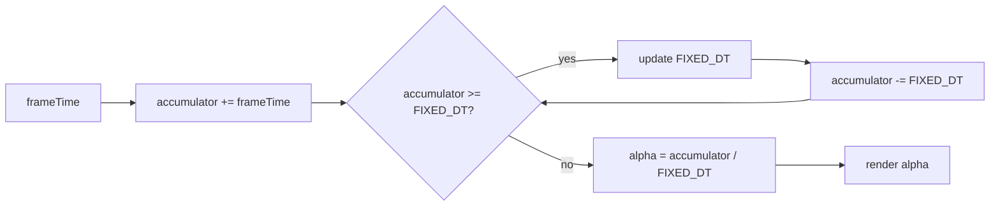

# Game Loop Pattern

**Date:** 2026-05-02 | **Updated:** 2026-05-02
**Tags:** `low-level-design` `design-patterns` `additional` `real-time` `simulation`

## Summary

A Game Loop runs continuously, processing input, advancing simulation, and rendering frames. The hard problem is **decoupling simulation rate from render rate**: the world should update at a stable rate independent of how fast (or slow) frames are drawn. The fixed-timestep-with-accumulator approach codified by Glenn Fiedler in *Fix Your Timestep!* is the standard answer for deterministic simulation. The pattern is documented at length in Robert Nystrom's *Game Programming Patterns*.

## Intent

- Drive a real-time application as a continuous cycle of input → update → render.
- Make simulation independent of frame rate so physics behave the same on a 30 FPS phone and a 240 FPS gaming PC.
- Provide a predictable, testable, deterministic update cadence.

## Three Loop Shapes

### 1. Run as fast as you can (naive)

```java
while (running) {
    processInput();
    update();
    render();
}
```

Problem: world speed depends on hardware. A faster CPU literally moves objects faster. Unusable past a one-screen demo.

### 2. Variable timestep

```java
long previous = System.nanoTime();
while (running) {
    long now = System.nanoTime();
    double dt = (now - previous) / 1_000_000_000.0;
    previous = now;

    processInput();
    update(dt);     // multiply velocities by dt
    render();
}
```

Pros: simple, smooth on modern hardware.
Cons: non-deterministic (large `dt` spikes after a stall produce different outcomes); physics integration explodes for large `dt`; networked games desync.

### 3. Fixed timestep with accumulator (Glenn Fiedler)

The right answer for most games and simulations:

```java
final double FIXED_DT = 1.0 / 60.0;     // 60 Hz simulation
double accumulator = 0.0;
long previous = System.nanoTime();

while (running) {
    long now = System.nanoTime();
    double frameTime = Math.min((now - previous) / 1_000_000_000.0, 0.25); // clamp spiral of death
    previous = now;
    accumulator += frameTime;

    processInput();

    while (accumulator >= FIXED_DT) {
        update(FIXED_DT);
        accumulator -= FIXED_DT;
    }

    double alpha = accumulator / FIXED_DT;   // 0..1 — interpolation factor
    render(alpha);                            // interpolate between previous and current state
}
```

Properties:
- Simulation is deterministic — every `update` step receives the same `dt`.
- Render rate is independent and can be uncapped, vsync-locked, or throttled.
- The `alpha` factor lets the renderer interpolate between the last two simulation states for smooth visuals even when render rate ≠ sim rate.



## Java Sketch

```java
public final class GameLoop {
    private static final double FIXED_DT  = 1.0 / 60.0;
    private static final double MAX_FRAME = 0.25;

    private final World  world;
    private final Render render;
    private boolean running = true;

    public GameLoop(World world, Render render) {
        this.world  = world;
        this.render = render;
    }

    public void run() {
        long previous = System.nanoTime();
        double accumulator = 0.0;

        while (running) {
            long now = System.nanoTime();
            double frame = Math.min((now - previous) / 1e9, MAX_FRAME);
            previous = now;
            accumulator += frame;

            world.processInput();

            while (accumulator >= FIXED_DT) {
                world.snapshotPrevious();
                world.update(FIXED_DT);
                accumulator -= FIXED_DT;
            }

            double alpha = accumulator / FIXED_DT;
            render.draw(world, alpha);
        }
    }

    public void stop() { running = false; }
}
```

The `snapshotPrevious` / `update` pair lets the renderer linearly interpolate positions between the previous and current simulation step using `alpha`, eliminating visual jitter when the render rate is higher than the simulation rate.

## TypeScript Sketch — Browser `requestAnimationFrame`

```ts
const FIXED_DT  = 1 / 60;
const MAX_FRAME = 0.25;

let accumulator = 0;
let previous    = performance.now() / 1000;
let running     = true;

function tick(): void {
  if (!running) return;

  const now   = performance.now() / 1000;
  const frame = Math.min(now - previous, MAX_FRAME);
  previous    = now;
  accumulator += frame;

  world.processInput();

  while (accumulator >= FIXED_DT) {
    world.snapshotPrevious();
    world.update(FIXED_DT);
    accumulator -= FIXED_DT;
  }

  const alpha = accumulator / FIXED_DT;
  render(world, alpha);

  requestAnimationFrame(tick);
}

requestAnimationFrame(tick);
```

Browsers throttle background tabs and align with the display refresh rate via `requestAnimationFrame`; the accumulator pattern absorbs that.

## The "Spiral of Death"

If `update` is slower than `FIXED_DT`, each frame the accumulator grows, more update steps are needed, the loop falls further behind. Defenses:

- Clamp `frameTime` to a max (`0.25 s`) — already shown above.
- Cap the number of update steps per frame; drop simulation steps if behind, accept temporal dilation over freeze.
- Profile and reduce update cost.

## Decoupling Sim Rate From Render Rate

| Sim Hz | Render Hz | Behavior |
|---|---|---|
| 60 | 60 | Each frame: ~1 update, alpha ≈ 0..1 |
| 60 | 144 | Most frames: 0 updates, render interpolates |
| 60 | 30 | Each frame: 2 updates |
| 120 | 60 | Each frame: 2 updates (more responsive physics, costlier) |

You can pick the simulation rate based on physics needs (e.g., 120 Hz for fighting games) and the render rate based on display capability.

## When to Use

- Real-time games, physics simulations, particle systems.
- VR/AR where frame timing is hard-required.
- Networked multiplayer (deterministic lockstep needs fixed sim rate).
- Live audio/music systems with visual sync.
- Animation-heavy interactive demos and creative coding.

## When NOT to Use

- Event-driven UIs — render only when state changes.
- Server-authoritative games already use a tick loop on the server; the client may use a simpler render loop and reconcile.
- Headless batch simulations — you do not need a render step at all; just iterate updates.
- Anything not real-time.

## Pitfalls

- **Variable timestep for physics**: large `dt` spikes cause integration to explode (objects tunneling through walls).
- **Forgetting to clamp `frameTime`**: a 5-second debugger pause queues 300 update steps and freezes the game.
- **Coupling input polling to update rate**: poll input *once per frame*, feed the latest into every fixed step, or buffer inputs with timestamps.
- **Render reading mid-update state**: snapshot before update; let render lerp `(previous, current)`.
- **Hidden allocations** in the update loop trigger GC pauses; preallocate, reuse buffers.
- **Time source drift**: prefer monotonic clocks (`System.nanoTime`, `performance.now`) over wall clocks.
- **Floating-point divergence in lockstep multiplayer**: use fixed-point or carefully constrained float math.

## Real-World Examples

- Most modern game engines (Unity's `FixedUpdate`, Unreal's tick groups, Godot's `_physics_process`) implement variants of this.
- Box2D, Bullet, PhysX physics engines — fixed-timestep stepping required.
- *Quake III* networking model — fixed sim ticks, interpolated rendering.
- Web-based simulations (matter.js, planck.js) follow Fiedler's recipe.
- Robotics control loops — fixed-rate update for stability.

## Related

- [./thread-pool-pattern.md](./thread-pool-pattern.md) — heavy update work can be sharded across worker threads.
- [./producer-consumer-pattern.md](./producer-consumer-pattern.md) — input events arrive on a queue.
- [../behavioral/observer.md](../behavioral/observer.md) — game events fan out to subsystems.
- [../behavioral/state.md](../behavioral/state.md) — entity AI often uses state machines.
- [../structural/flyweight.md](../structural/flyweight.md) — shared sprite/material data.

## References

- Glenn Fiedler, *Fix Your Timestep!* (gafferongames.com).
- Robert Nystrom, *Game Programming Patterns* — chapter "Game Loop."
- *Real-Time Rendering* (Akenine-Möller et al.) — frame timing and pipelining.
