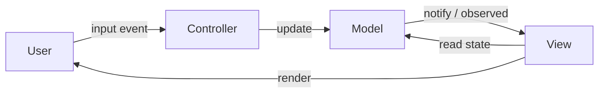
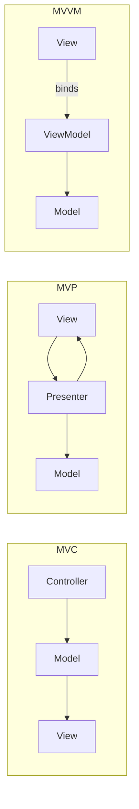

# MVC Pattern — Model, View, Controller

**Date:** 2026-05-02 | **Updated:** 2026-05-02
**Tags:** `low-level-design` `design-patterns` `additional` `architecture` `ui`

## Summary

MVC separates an interactive application into three roles: a **Model** that owns state and business rules, a **View** that renders the model, and a **Controller** that translates user input into model updates. The pattern was introduced by Trygve Reenskaug at Xerox PARC for Smalltalk-80 and has since fragmented into MVP, MVVM, MVI, and many web-framework variants. The unchanging point: keep rendering, state, and input-handling in distinct seams.

## Intent

- Separate concerns so that UI changes do not cascade into business logic.
- Allow multiple views of the same model.
- Make presentation logic testable independently of the rendering technology.
- Provide a clean place for input validation, authorization, and request shaping.

## Classical Structure



In *classical* Smalltalk MVC, View observes the Model directly (Observer pattern). In *web* MVC (Rails, Spring MVC, Django), the Controller pulls from the Model and pushes a snapshot to the View — there is no live observation across an HTTP boundary.

## Java Example — Spring MVC Style

```java
// Model — domain + repository
public record Order(String id, String customerId, BigDecimal total, Status status) {}

@Service
public class OrderService {
    private final OrderRepository repo;
    public OrderService(OrderRepository repo) { this.repo = repo; }
    public Order place(NewOrder cmd) { /* business rules */ return repo.save(/*...*/); }
    public Order find(String id)     { return repo.findById(id).orElseThrow(); }
}

// Controller — translates HTTP into service calls
@RestController
@RequestMapping("/orders")
public class OrderController {
    private final OrderService service;
    public OrderController(OrderService service) { this.service = service; }

    @PostMapping
    public ResponseEntity<OrderView> create(@Valid @RequestBody NewOrderRequest req) {
        Order order = service.place(req.toCommand());
        return ResponseEntity
            .created(URI.create("/orders/" + order.id()))
            .body(OrderView.from(order));
    }

    @GetMapping("/{id}")
    public OrderView get(@PathVariable String id) {
        return OrderView.from(service.find(id));
    }
}

// View — DTO / template binding (here: JSON projection)
public record OrderView(String id, BigDecimal total, String status) {
    public static OrderView from(Order o) { return new OrderView(o.id(), o.total(), o.status().name()); }
}
```

The controller is *thin*: parse, delegate, return. Business rules live in `OrderService`. The view is a serialization concern.

## TypeScript Example — Express

```ts
// Model — service layer
export class OrderService {
  constructor(private readonly repo: OrderRepository) {}
  async place(cmd: NewOrder): Promise<Order> { /* rules */ return this.repo.save(/*...*/); }
  async find(id: string): Promise<Order>     { return this.repo.byId(id); }
}

// Controller
export function orderRouter(service: OrderService): Router {
  const r = Router();

  r.post("/orders", async (req, res, next) => {
    try {
      const cmd = NewOrderSchema.parse(req.body);   // validation
      const order = await service.place(cmd);
      res.status(201).json(toView(order));          // view projection
    } catch (e) { next(e); }
  });

  r.get("/orders/:id", async (req, res, next) => {
    try { res.json(toView(await service.find(req.params.id))); }
    catch (e) { next(e); }
  });

  return r;
}

// View
const toView = (o: Order) => ({ id: o.id, total: o.total, status: o.status });
```

## MVC vs MVP vs MVVM



| Variant | Who owns presentation logic | Coupling | Typical use |
|---|---|---|---|
| **MVC** | Controller (input→model); View reads model | View knows model shape | Web frameworks (Rails, Spring MVC, Django, ASP.NET MVC) |
| **MVP** | Presenter; View is passive (interface) | Presenter ↔ View via interface | Desktop/mobile (WinForms, GWT, Android pre-Compose) |
| **MVVM** | ViewModel; View binds declaratively | Two-way data binding | WPF, SwiftUI, Vue, Knockout, Angular |

Modern frontends often blend these: React with Redux is closer to MVVM-with-unidirectional-flow than classical MVC.

## Where Business Logic Actually Lives

A frequent question. In a healthy MVC app:

- **Domain model** owns invariants and rules that are true regardless of UI: `order.canBeCancelled()`, `account.withdraw(amount)`.
- **Application/service layer** orchestrates use cases: transactions, authorization, multi-aggregate workflows.
- **Controller** orchestrates the *HTTP request*: parse, validate, call service, format response.
- **View** owns presentation only: formatting, layout, i18n.

Anti-patterns to avoid:

- "Fat controller" — business logic stuffed into request handlers.
- "Anemic model" — domain objects are bags of getters/setters with no behavior; logic ends up in services that read/write them.
- "Smart view" — templates that query the database or run rules.

## When to Use

- Server-rendered web apps with clear request/response cycles.
- Apps where multiple representations of the same data exist (HTML, JSON, CSV, RSS).
- Teams large enough that splitting input handling, rules, and rendering pays off.
- Frameworks already enforce it (Spring MVC, Rails, Django, Laravel) — use the grain.

## When NOT to Use

- Small CLI scripts — overhead outweighs benefit.
- Highly interactive client apps with reactive state — MVVM/MVI/Flux models fit better.
- Pipelines, batch jobs, or background workers — there is no "view."
- Realtime systems where state observation crosses many boundaries (consider event-driven or actor patterns).

## Pitfalls

- **Fat controllers**: classic. Push logic down into services and the domain.
- **View talking to the database**: separation broken; tests become coupled to schema.
- **Anemic domain model**: services do everything; the "M" in MVC becomes data classes.
- **Tight coupling of view to model class**: leaks `Entity` to JSON; introduces accidental API breakage on internal renames. Use DTO/view models.
- **Confusing "controller" with the framework's request handler**: MVC's Controller and Rails' `ApplicationController` are similar but not identical to MVP's Presenter.
- **Over-decomposition**: every project does not need separate folders for `controllers/`, `services/`, `views/`, `dtos/` if it has 4 routes.

## Real-World Examples

- Spring MVC, Spring WebFlux (`@Controller`, `@RestController`).
- Ruby on Rails — opinionated MVC with conventions over configuration.
- Django (technically MTV — Model/Template/View, but same idea).
- ASP.NET MVC / ASP.NET Core MVC.
- Laravel.
- iOS UIKit before SwiftUI — UIViewController is the Controller.

## Related

- [../behavioral/observer.md](../behavioral/observer.md) — classical MVC's View observes the Model.
- [../behavioral/command.md](../behavioral/command.md) — controllers often dispatch commands.
- [./repository-pattern.md](./repository-pattern.md) — sits behind the model layer.
- [./dependency-injection-pattern.md](./dependency-injection-pattern.md) — controllers receive services via DI.
- [../../solid/single-responsibility-principle.md](../../solid/single-responsibility-principle.md) — MVC is SRP applied at the layer level.

## References

- Reenskaug, *Models–Views–Controllers* (Xerox PARC technical note, 1979).
- Fowler, *Patterns of Enterprise Application Architecture* — MVC, Model-View-Presenter, Application Controller.
- Microsoft Patterns & Practices — *Application Architecture Guide* on MVVM.
