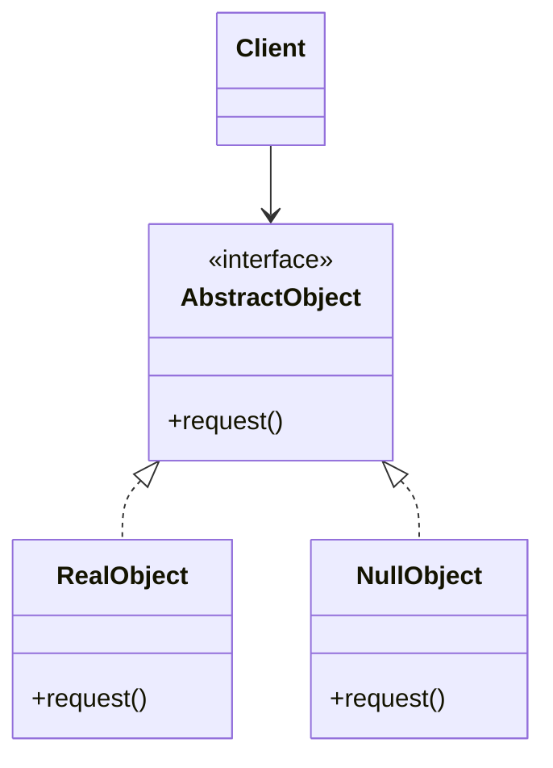

# Null Object Pattern

**Date:** 2026-05-02 | **Updated:** 2026-05-02
**Tags:** `low-level-design` `design-patterns` `additional` `behavioral` `defensive-programming`

## Summary

The Null Object Pattern replaces explicit `null` references with a benign no-op object that conforms to the same interface. Callers stop branching on `if (x != null)` because the null object responds to every message with safe, do-nothing behavior. It trades a runtime sentinel for a compile-time-typed neutral element.

## Intent

- Eliminate scattered null checks at call sites.
- Provide a default "do nothing" implementation that satisfies the interface.
- Make absence a first-class polymorphic case rather than a special-case throw.

> Originally codified by Bobby Woolf in *Pattern Languages of Program Design 3* and popularized by Fowler in *Refactoring* (Introduce Null Object).

## Structure



The client only ever holds an `AbstractObject`. The factory or repository returns either a `RealObject` or a `NullObject` — never `null`.

## Java Example — No-Op Logger

```java
public interface Logger {
    void info(String message);
    void warn(String message);
    void error(String message, Throwable t);
}

public final class ConsoleLogger implements Logger {
    @Override public void info(String m)  { System.out.println("INFO:  " + m); }
    @Override public void warn(String m)  { System.out.println("WARN:  " + m); }
    @Override public void error(String m, Throwable t) {
        System.err.println("ERROR: " + m);
        t.printStackTrace(System.err);
    }
}

public final class NullLogger implements Logger {
    public static final NullLogger INSTANCE = new NullLogger();
    private NullLogger() {}
    @Override public void info(String m) {}
    @Override public void warn(String m) {}
    @Override public void error(String m, Throwable t) {}
}

// Factory hides the choice
public final class LoggerFactory {
    public static Logger forEnvironment(String env) {
        return "test".equals(env) ? NullLogger.INSTANCE : new ConsoleLogger();
    }
}

// Usage — no null checks
class OrderService {
    private final Logger log;
    OrderService(Logger log) { this.log = log; }
    void place(Order o) {
        log.info("placing " + o.id());          // safe even when log is NullLogger
        // ...
    }
}
```

## Java Example — No-Op Authenticator

```java
public interface Authenticator {
    boolean isAuthenticated();
    String currentUser();
}

public final class GuestAuthenticator implements Authenticator {
    @Override public boolean isAuthenticated() { return false; }
    @Override public String  currentUser()     { return "guest"; }
}
```

`GuestAuthenticator` is a Null Object that returns *meaningful* defaults rather than `null`. Callers can write `auth.currentUser().toUpperCase()` without a NPE.

## TypeScript Example

```ts
interface Notifier {
  send(userId: string, body: string): void;
}

class EmailNotifier implements Notifier {
  send(userId: string, body: string): void {
    // SMTP call ...
  }
}

class NullNotifier implements Notifier {
  send(_userId: string, _body: string): void { /* no-op */ }
}

function notifierFor(featureFlag: boolean): Notifier {
  return featureFlag ? new EmailNotifier() : new NullNotifier();
}

// Caller is unconditional
const notifier = notifierFor(false);
notifier.send("u-1", "hello");   // safe
```

A common TypeScript variant uses `Optional<T>` / `T | undefined` plus the `??` operator. Null Object is preferred when the *behavior* is invoked many times — the discipline lives in the type, not at every call site.

## When to Use

- A collaborator may legitimately be absent and the absence has a clear neutral behavior.
- Null checks are scattered across many call sites.
- You want polymorphic dispatch over presence/absence (e.g., guest vs logged-in user).
- Default behavior is genuinely "do nothing" or "return identity element."

## When NOT to Use

- Absence is a real error case the caller must handle (use exceptions or `Result`/`Either`).
- The neutral behavior is not actually safe — silently swallowing errors hides bugs.
- The interface has many methods returning non-trivial values; defining "neutral" for each is forced.
- You are tempted to add logic to the null object — at that point it is no longer null.

## Pitfalls

- **Hidden bugs**: a missing dependency silently does nothing; logs may never appear in production.
- **Tests that pass for the wrong reason**: `verify(logger).info(...)` against a Null Object always succeeds against `any()`.
- **Identity confusion**: `nullObject.equals(null)` is `false` — code relying on `== null` checks won't see the null object as absent.
- **Method explosion**: every new method on the interface needs a no-op definition. Default methods (Java 8+) help.
- **Mutable null objects**: never hold state on a null object — share a single immutable instance.

## Real-World Examples

- `Collections.emptyList()`, `emptyMap()`, `emptySet()` — null objects for collections.
- `Optional.empty()` — type-safe absence; callers use `orElse`, `ifPresent` instead of null checks.
- `java.util.logging.Logger.getGlobal()` configured to a no-op handler.
- Spring Security's `AnonymousAuthenticationToken` — guest user as a real principal.
- React's `Fragment` and "noop" event handlers (`onClick: () => {}`).
- `/dev/null` at the OS level — the canonical null object.

## Related

- [../behavioral/strategy.md](../behavioral/strategy.md) — Null Object is often a degenerate Strategy.
- [../behavioral/state.md](../behavioral/state.md) — initial/idle states are sometimes Null Objects.
- [../structural/proxy.md](../structural/proxy.md) — both wrap an object; Proxy delegates, Null Object swallows.
- [./specification-pattern.md](./specification-pattern.md) — `AlwaysTrue`/`AlwaysFalse` specs are null objects of the predicate algebra.
- [../../solid/dependency-inversion-principle.md](../../solid/dependency-inversion-principle.md) — the pattern only works when callers depend on the abstraction, not the concrete class.

## References

- Fowler, *Refactoring* — "Introduce Null Object" refactoring.
- Woolf, *Pattern Languages of Program Design 3* — original write-up.
- *Effective Java* (Bloch) — Item 54: return empty collections, not nulls.
