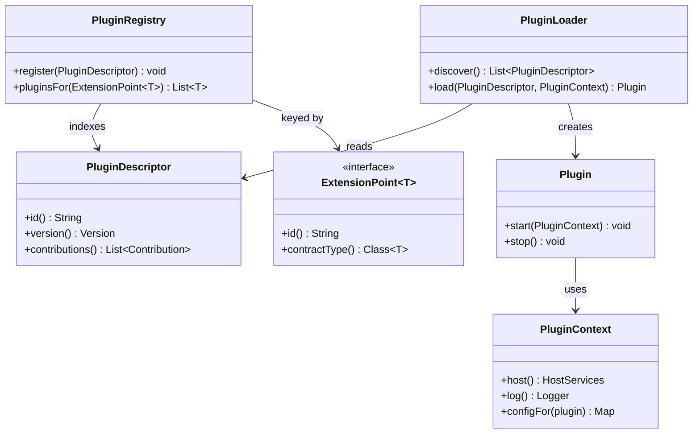

# Plugin Architecture / Extension Points

**Date:** 2026-05-02 | **Updated:** 2026-05-02
**Tags:** `low-level-design` `design-patterns` `additional` `extensibility` `modularity`

## Summary

A Plugin Architecture lets a host application be extended at runtime by code it did not know about at build time. The host defines stable *extension points* — small, well-named interfaces — and a *plugin loader* that discovers, instantiates, initialises, and (sometimes) tears down plugins that implement those interfaces. The host depends only on its own interfaces; plugins depend only on the published extension API.

This shape powers IDEs (Eclipse, IntelliJ), browsers, build tools (Gradle, Maven), monitoring agents, OS shells, and many enterprise products. It also powers smaller in-process extension systems built on `java.util.ServiceLoader`. The pattern's strengths — extensibility, ecosystem, clean separation of host and plugin teams — are paid for in lifecycle complexity, versioning hazards, and security surface.

## Table of Contents

- Intent / Problem
- Structure (Mermaid classDiagram)
- Class Skeletons (Java)
- Plugin Lifecycle: load -> init -> register -> unload
- Discovery Mechanisms (ServiceLoader, OSGi, Eclipse Extension Points)
- Versioning and Compatibility
- Sandboxing: Classloader Isolation, Security, Resource Limits
- When to Use / When NOT
- Pitfalls
- Related
- References

## Intent / Problem

A product needs to support extensions written by people who are not on the core team — third parties, customers, separate internal teams. The constraints:

- The host cannot import or reference plugins directly: they do not exist at host build time.
- Plugins should be installable without recompiling the host.
- Multiple plugins should coexist without interfering with each other or the host.
- Adding, replacing, or removing a plugin should not require restarting unrelated subsystems (or, in some products, the whole process).
- Plugins should not be able to break the host through bugs or malice.

The pattern's answer is a strict separation:

- The host publishes one or more *extension point* interfaces (`ExportFormatter`, `BuildStep`, `LinterRule`).
- Plugins ship as JARs/modules/packages that implement those interfaces and declare metadata describing what they provide.
- A *plugin loader* in the host scans known locations, reads metadata, instantiates implementations, and exposes them through a *plugin registry*.
- The host's feature code consumes the registry without ever naming a plugin.

Two healthy invariants follow: the host depends only on its own API, and plugins depend only on the published extension API. The product's evolution is constrained at exactly the right boundary.

## Structure (Mermaid classDiagram)



The split between `PluginDescriptor` (metadata) and `Plugin` (live object) is critical: descriptors can be enumerated cheaply without instantiating anything, which is what enables admin UIs, conflict checks, and version-compatibility reporting before a plugin actually runs.

## Class Skeletons (Java)

### Extension point

```java
public interface ExtensionPoint<T> {
    String id();
    Class<T> contractType();
}

public interface ExportFormatter {
    String formatId();
    byte[] format(Report report);
}

public final class ExportFormatterPoint implements ExtensionPoint<ExportFormatter> {
    public static final ExportFormatterPoint INSTANCE = new ExportFormatterPoint();

    @Override public String id() { return "host.export.formatter"; }
    @Override public Class<ExportFormatter> contractType() { return ExportFormatter.class; }
}
```

### Descriptor and context

```java
public final class PluginDescriptor {
    private final String id;
    private final Version version;
    private final List<String> extensionPointIds;
    private final Path source;

    // constructor + getters omitted for brevity
}

public interface PluginContext {
    HostServices host();
    Logger logger();
    Path dataDir();
    Map<String, String> config();
}
```

### Plugin contract

```java
public interface Plugin {
    void start(PluginContext ctx) throws PluginException;
    void stop();
}
```

### Registry

```java
public final class PluginRegistry {
    private final Map<String, List<Object>> contributionsByPoint =
        new ConcurrentHashMap<>();

    public <T> void contribute(ExtensionPoint<T> point, T contribution) {
        contributionsByPoint
            .computeIfAbsent(point.id(), k -> new CopyOnWriteArrayList<>())
            .add(contribution);
    }

    @SuppressWarnings("unchecked")
    public <T> List<T> pluginsFor(ExtensionPoint<T> point) {
        List<Object> raw = contributionsByPoint.getOrDefault(point.id(), List.of());
        return (List<T>) List.copyOf(raw);
    }
}
```

### Loader

```java
public final class PluginLoader {
    private final Path pluginsDir;
    private final HostServices host;
    private final PluginRegistry registry;

    public PluginLoader(Path pluginsDir, HostServices host, PluginRegistry registry) {
        this.pluginsDir = pluginsDir;
        this.host = host;
        this.registry = registry;
    }

    public List<PluginDescriptor> discover() throws IOException {
        try (Stream<Path> jars = Files.list(pluginsDir)) {
            return jars.filter(p -> p.toString().endsWith(".jar"))
                       .map(this::readDescriptor)
                       .filter(Objects::nonNull)
                       .toList();
        }
    }

    public Plugin load(PluginDescriptor d) throws PluginException {
        ClassLoader loader = newPluginClassLoader(d.source());
        ServiceLoader<Plugin> services = ServiceLoader.load(Plugin.class, loader);
        Plugin plugin = services.findFirst()
            .orElseThrow(() -> new PluginException("No Plugin in " + d.id()));
        plugin.start(new DefaultPluginContext(host, d, registry));
        return plugin;
    }

    private ClassLoader newPluginClassLoader(Path jar) { /* see sandboxing */ }
    private PluginDescriptor readDescriptor(Path jar) { /* parse manifest */ return null; }
}
```

### A plugin contributing to the extension point

```java
public final class CsvExportPlugin implements Plugin {
    @Override
    public void start(PluginContext ctx) {
        ctx.host().registry().contribute(
            ExportFormatterPoint.INSTANCE,
            new CsvExportFormatter());
    }

    @Override public void stop() { /* release resources */ }
}

public final class CsvExportFormatter implements ExportFormatter {
    @Override public String formatId() { return "csv"; }
    @Override public byte[] format(Report report) { /* ... */ return new byte[0]; }
}
```

## Plugin Lifecycle: load -> init -> register -> unload

The lifecycle has four stages, each with its own failure mode.

**Load.** Read the plugin's metadata, resolve its classloader, verify the version of the host API it was built against, and decide whether to proceed. Failures here are common — wrong host version, missing transitive dependency, malformed manifest — and must not break other plugins. Discovery should be cheap; full load can be deferred until first use.

**Init / start.** Call the plugin's entry point with a `PluginContext`. The plugin may open files, fetch config, allocate resources. Failures here are *the* dangerous moment: half-initialised state can leak. Treat `start` as a transaction — on exception, the loader runs a best-effort `stop` and refuses to mark the plugin as active.

**Register.** The plugin contributes implementations of extension points to the registry. The host's feature code only sees plugins after this point. Some systems make registration declarative (annotations, manifest entries); others require imperative `registry.contribute(...)` calls. Imperative gives more control at the cost of more error surface.

**Unload / stop.** Reverse of load. Stop callbacks run, contributions are removed from the registry, classloader is released. The hard part is making sure no live reference to plugin code escapes the registry — an extension that another component cached as a field will keep the plugin's classloader alive forever, which is exactly the classloader leak that has burned every long-lived JVM plugin host. Unloading is *not* a free feature; many products simply require a process restart to remove a plugin, and that is an honest engineering choice.

## Discovery Mechanisms

Three named mechanisms, no fabricated internals:

**`java.util.ServiceLoader` (JDK built-in).** Standard JDK API. A JAR ships a file under `META-INF/services/` listing implementations of an SPI interface; `ServiceLoader.load(Iface.class)` enumerates them. Simple, no extra runtime, used by JDBC drivers, JAX-RS providers, and innumerable application SPIs. Limitations: flat list, no metadata beyond class name, no real lifecycle, no isolation between providers when they share a classloader.

**OSGi.** A long-standing Java module/plugin platform with rigorous bundle metadata, per-bundle classloaders, declarative service registration, and dynamic install/start/stop/uninstall semantics. Powerful and operationally heavy. Often overkill for a single-product plugin system; sometimes exactly right (Eclipse runtime, telecoms, large embedded systems).

**Eclipse extension points.** Eclipse's plugin model layered on top of OSGi. Plugins declare contributions to named extension points in their `plugin.xml`; the platform reads these declaratively and instantiates contributions lazily. The combination of declarative metadata, lazy activation, and namespaced extension points is the design influence behind many later plugin systems.

For a typical line-of-business product or IDE feature, `ServiceLoader` is the floor and Eclipse-style declarative extension points are a strong ceiling. OSGi is its own commitment.

Other ecosystems have their own mechanisms — Python entry points, Node `require` resolution, .NET MEF — that share the conceptual shape but differ in details out of scope here.

## Versioning and Compatibility

Plugin systems live or die on versioning. Three things have versions and they must be tracked separately:

- The **host** version (the application).
- The **extension API** version (the published interfaces plugins build against).
- The **plugin** version.

A plugin built against extension API 2.3 is compatible with hosts that ship extension API 2.x where x >= 3 — a semver-style minor compatibility promise. Breaking changes to an extension interface are major-version events: rename, restructure, repackage. Adding a method to an interface in a non-default way is a breaking change; adding it as a default method is not.

Compatibility checks belong in the loader, not at runtime when a method is called:

- Read the plugin's declared "built against extension API X.Y" from its manifest.
- Compare to the host's running extension API version.
- Refuse to load incompatible plugins, with a message that names exactly which plugin and which version.

Soft failures (load anyway, hope for the best, crash later) are how plugin hosts develop reputations as fragile. Hard, early refusal is how plugin hosts develop reputations as trustworthy.

A separate concern is *contract* compatibility: the same interface can mean different things at different times. Documenting the *behavioural* contract of each extension point (preconditions, threading rules, lifecycle obligations) is as important as the type signature.

## Sandboxing: Classloader Isolation, Security, Resource Limits

The host runs in the same process as the plugins. Anything the host can do, a plugin's bytecode can do — open sockets, allocate memory, read files, spawn threads. Sandboxing is what limits this.

**Classloader isolation.** Each plugin gets its own classloader, parented to the host's API classloader. Plugins cannot see each other's internals; they share only what the API classloader exposes. This prevents accidental coupling, lets two plugins ship incompatible versions of a transitive library, and bounds the damage a buggy plugin can do to its own classes. The cost: more memory, slower startup, and classloader leaks if any plugin class escapes the registry on unload.

**Security policy.** Historically Java had `SecurityManager` with per-codebase permissions. The model is deprecated in modern JDKs and was rarely used well in practice. Today, host processes typically rely on OS-level isolation (process boundaries, containers, seccomp, capabilities) for hostile-plugin scenarios — i.e., they do not host hostile plugins in-process. If hostile plugins are a real threat, run them in a separate process and communicate over IPC. In-process plugin systems are appropriate for *trusted* extensions: first-party, enterprise-customer, or signed-third-party.

**Resource limits.** A plugin can leak threads, memory, file handles, and clock time. Defenses are indirect: per-plugin executors with bounded thread counts, watchdogs that log slow extension calls, memory metrics broken down by classloader (where possible). True resource isolation in a single JVM is hard; `ProcessHandle` / cgroup-style limits arrive only when you cross the process boundary.

**Signing and trust.** For ecosystems with third-party plugins, JAR signing plus a host-managed trust list moves the question from "can this plugin do harm" to "do we trust the publisher". This is the model most enterprise plugin ecosystems converge on.

## When to Use / When NOT

**Use a Plugin Architecture when:**

- The product genuinely needs runtime extensibility by parties other than the core team.
- The set of extensions is open-ended and will outlive any single release.
- The host has a small, stable feature surface and a long, varied tail of integrations.
- Plugin authors need to ship on their own schedule, not the host's.

**Do NOT use a Plugin Architecture when:**

- You have two implementations of one feature and could solve it with a `Strategy` interface and constructor DI.
- All extension authors are on your team. Direct dependencies and feature flags are simpler and safer.
- The product is small and unlikely to grow an ecosystem. Building a plugin system you do not need is months of infrastructure for zero user-visible value.
- Untrusted code is a real risk and you cannot afford a separate process. In-process plugins assume some trust.
- You cannot commit to maintaining a stable extension API. A plugin system that breaks on every release is worse than no plugin system at all, because it has trained an ecosystem to distrust you.

## Pitfalls

**Premature plugin systems.** Building one before there is a real need (or even one external author) consumes engineering time, complicates deployment, and locks in interfaces that later turn out to be wrong. Wait for the second concrete use case before generalising.

**Leaking the host's internals.** The temptation to "let plugins do anything" by exposing the host's full object graph through `PluginContext` is irresistible and disastrous. Every method on `HostServices` is a forever commitment; once a plugin uses it, you cannot remove it without breaking that plugin. Curate the surface; say no often.

**Classloader leaks on unload.** A single static reference from host code to a plugin object pins the plugin's entire classloader. Memory grows with each install/uninstall cycle until the JVM dies. Audit every cache, every registry, every framework integration; unloading is not free, and many systems pragmatically choose "restart to uninstall".

**Lazy versioning.** Refusing to version the extension API explicitly because "we will keep it stable" is the precondition for a future ecosystem-wide break. Version from day one; bump on every breaking change; document compatibility ranges.

**Plugins as pipelines.** Order matters — `BuildStep` plugins running in unspecified order produce non-deterministic builds. If order matters, make it explicit in the API (priority numbers, named phases) rather than relying on registration order.

**Cross-plugin coupling.** Plugin A depends on plugin B. The plugin system has now grown a dependency graph it must enforce. Either forbid this (plugins talk only to the host), or build a real dependency manifest with load order. Half-measures fail under load.

**Diagnostics.** A user reports "the export plugin does not work". Which plugin, which version, against which host build? If the answer requires reading server logs, the plugin system is under-instrumented. Surface plugin id, version, classloader, and last error in any UI that lists plugins.

**Hot reload as a feature, not a goal.** "We support hot reload" sounds great in marketing and is a tarpit in engineering. Most production plugin systems explicitly require restart for install/uninstall and are happier for it. Choose deliberately; do not drift into supporting hot reload by accident.

## Related

Siblings under `additional/`:

- [event-bus.md](./event-bus.md) — Many plugin systems expose extension points as event subscriptions; the bus and the registry are often the same data structure under different names.
- [service-locator.md](./service-locator.md) — Plugin registries are locator-shaped *by necessity*; this is the legitimate use of the locator pattern called out in that document.
- [dependency-injection-pattern.md](./dependency-injection-pattern.md) — Plugins typically receive their host services via DI through `PluginContext`.
- [repository-pattern.md](./repository-pattern.md) — A plugin registry is a domain-specific repository over `PluginDescriptor` and contributions.
- [specification-pattern.md](./specification-pattern.md) — Useful for "find all plugins matching criteria X" queries inside the registry.
- [null-object-pattern.md](./null-object-pattern.md) — A no-op plugin / no-op contribution simplifies tests when no real extension is loaded.
- [concurrency-patterns.md](./concurrency-patterns.md) — Background for the executor and lifecycle synchronization a loader needs.

Cross-category:

- [../structural/facade.md](../structural/facade.md) — `HostServices` is a Facade over the host's internals, exposed to plugins.
- [../structural/adapter.md](../structural/adapter.md) — Plugins frequently adapt third-party APIs into the host's extension interfaces.
- [../structural/decorator.md](../structural/decorator.md) — Plugin contributions stacked over a base implementation form a decorator chain.
- [../behavioral/strategy.md](../behavioral/strategy.md) — A single extension point with one chosen plugin is the runtime form of Strategy.
- [../behavioral/chain-of-responsibility.md](../behavioral/chain-of-responsibility.md) — Multiple plugins handling the same event in order is a CoR.
- [../creational/factory-method.md](../creational/factory-method.md) — The loader is, structurally, a factory specialised for plugin objects.

Principles:

- [../../solid/open-closed-principle.md](../../solid/open-closed-principle.md) — The defining principle: open for extension via plugins, closed for modification of the host.
- [../../solid/liskov-substitution-principle.md](../../solid/liskov-substitution-principle.md) — Every plugin implementing an extension point must be substitutable for any other; the host depends on the contract.
- [../../solid/interface-segregation-principle.md](../../solid/interface-segregation-principle.md) — Small, focused extension points are far easier to evolve than large ones.
- [../../oop-fundamentals/encapsulation.md](../../oop-fundamentals/encapsulation.md) — Sandboxing and curated `PluginContext` are encapsulation at module scale.
- [../../design-principles/coupling-and-cohesion.md](../../design-principles/coupling-and-cohesion.md) — The extension API must be among the most stable parts of the system.

## References

- *Design Patterns* (Gamma, Helm, Johnson, Vlissides) — Strategy, Factory Method, and Mediator entries; the conceptual building blocks.
- *Patterns of Enterprise Application Architecture* (Martin Fowler) — Plugin pattern entry; concise treatment of the host/plugin split.
- *Contributing to Eclipse* (Erich Gamma, Kent Beck) — Eclipse extension points by name; the canonical worked example, though specific APIs have evolved since.
- Java SE documentation — `java.util.ServiceLoader` (the JDK-built-in mechanism).
- OSGi Alliance specifications — for the rigorous module/lifecycle model named here.
- *Java Concurrency in Practice* (Brian Goetz et al.) — for the threading and lifecycle invariants a robust loader must enforce.
