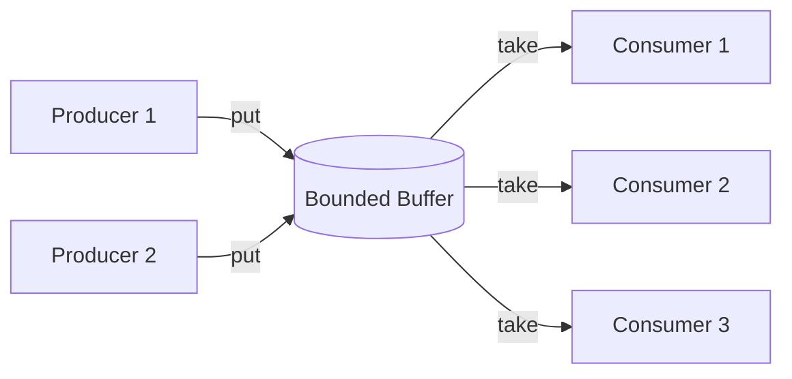

# Producer-Consumer Pattern

**Date:** 2026-05-02 | **Updated:** 2026-05-02
**Tags:** `low-level-design` `design-patterns` `additional` `concurrency` `messaging`

## Summary

Producer-Consumer decouples the part of the system that *creates* work (producers) from the part that *processes* it (consumers) via a shared bounded buffer. The buffer absorbs short-term rate mismatches; its capacity provides natural backpressure. The pattern is one of the oldest concurrency primitives — Dijkstra's *bounded buffer problem* (1965) is its formal ancestor — and remains the foundation of message queues, log pipelines, and reactive streams.

## Intent

- Decouple producers from consumers in time and rate.
- Smooth bursty input by buffering.
- Apply backpressure when consumers cannot keep up.
- Enable parallel consumption (one queue, many workers).

## Structure



Key properties:

- **Bounded** capacity — unbounded queues hide bugs and blow up memory.
- **Thread-safe** put/take — usually a `BlockingQueue`.
- **Blocking on full** — producer waits or rejects.
- **Blocking on empty** — consumer parks waiting for work.

## Java — `BlockingQueue`

```java
import java.util.concurrent.*;

public final class LogPipeline {
    private final BlockingQueue<LogEvent> queue = new ArrayBlockingQueue<>(10_000);
    private final ExecutorService consumers     = Executors.newFixedThreadPool(4);
    private volatile boolean running = true;

    public LogPipeline() {
        for (int i = 0; i < 4; i++) {
            consumers.submit(this::consumeLoop);
        }
    }

    // Producer side — called by application threads
    public boolean offer(LogEvent e) {
        return queue.offer(e);                       // non-blocking; returns false if full
    }

    public void put(LogEvent e) throws InterruptedException {
        queue.put(e);                                // blocks until space
    }

    // Consumer loop
    private void consumeLoop() {
        while (running || !queue.isEmpty()) {
            try {
                LogEvent e = queue.poll(1, TimeUnit.SECONDS);
                if (e != null) sendToBackend(e);
            } catch (InterruptedException ie) {
                Thread.currentThread().interrupt();
                return;
            } catch (Exception ex) {
                handleFailure(ex);                  // never let the loop die
            }
        }
    }

    public void shutdown() throws InterruptedException {
        running = false;
        consumers.shutdown();
        if (!consumers.awaitTermination(30, TimeUnit.SECONDS)) {
            consumers.shutdownNow();
        }
    }

    private void sendToBackend(LogEvent e) { /* HTTP / disk write */ }
    private void handleFailure(Exception e) { /* metric + log */ }
}
```

### Choosing the queue

| Implementation | Trait | Use when |
|---|---|---|
| `ArrayBlockingQueue` | Bounded, array-backed, FIFO | Fixed capacity, predictable memory |
| `LinkedBlockingQueue` | Optionally bounded, linked nodes | Higher throughput, separate locks for head/tail |
| `SynchronousQueue` | Capacity 0; hand-off only | Direct rendezvous (used by `newCachedThreadPool`) |
| `LinkedTransferQueue` | Hand-off-or-buffer hybrid | High-performance hand-offs |
| `PriorityBlockingQueue` | Unbounded, priority-ordered | Priority scheduling (careful — unbounded) |
| `DelayQueue` | Items become available at a time | Scheduled tasks |
| Disruptor (LMAX) | Lock-free ring buffer | Ultra-low-latency pipelines |

## Java — `Lock` + `Condition` (the textbook version)

For the classic Dijkstra solution without `BlockingQueue`:

```java
public final class BoundedBuffer<T> {
    private final Object[] items;
    private int head, tail, count;

    private final ReentrantLock lock     = new ReentrantLock();
    private final Condition     notFull  = lock.newCondition();
    private final Condition     notEmpty = lock.newCondition();

    public BoundedBuffer(int capacity) { this.items = new Object[capacity]; }

    public void put(T x) throws InterruptedException {
        lock.lock();
        try {
            while (count == items.length) notFull.await();
            items[tail] = x;
            tail = (tail + 1) % items.length;
            count++;
            notEmpty.signal();
        } finally { lock.unlock(); }
    }

    @SuppressWarnings("unchecked")
    public T take() throws InterruptedException {
        lock.lock();
        try {
            while (count == 0) notEmpty.await();
            T x = (T) items[head];
            items[head] = null;
            head = (head + 1) % items.length;
            count--;
            notFull.signal();
            return x;
        } finally { lock.unlock(); }
    }
}
```

In production, prefer `ArrayBlockingQueue` — same semantics, more battle-tested.

## Backpressure Strategies

When the buffer is full, the producer's options are:

1. **Block** (`put`) — natural backpressure; slows producer to consumer rate.
2. **Drop newest** (`offer` returns false) — lose new data, keep old.
3. **Drop oldest** (`evict head` on insert) — keep recent data, lose old.
4. **Reject** (throw / return error) — push the decision upstream.
5. **Spill to disk** — bounded memory + bounded disk.
6. **Apply pressure upstream** — flow-control signals (TCP window, HTTP 429, reactive streams `request(n)`).

The right choice depends on the data:

- Logs → drop oldest or sample.
- Payments → block or reject; never drop.
- Telemetry → drop is fine; alert on drop rate.
- User-facing requests → reject with 503/429.

## When to Use

- Bursty work that can be queued and processed asynchronously.
- Multiple producers to a single processing stage.
- Multiple consumers parallelizing the same processing.
- Decoupling so a slow downstream does not block fast upstream paths.
- Batching: consumers coalesce items into batches for efficient downstream calls.

## When NOT to Use

- Strictly synchronous request/response — buffering adds latency for no benefit.
- When ordering across producers must be preserved globally and partitioning is impossible.
- When you actually need a distributed message queue — use Kafka/RabbitMQ/SQS, not an in-process queue you have to operate yourself.
- Single-producer single-consumer pipelines that fit in a stream/iterator.

## Pitfalls

- **Unbounded queues**: turn memory pressure into OOM. Always cap.
- **`Thread.sleep()` polling**: defeats the point — use blocking primitives.
- **Lost wakeups**: hand-rolled wait/notify code that uses `if` instead of `while` around `await`. Always loop.
- **Poison pill confusion**: how do consumers know to stop? Use a sentinel value or interrupt + drain.
- **Exception swallowing**: a consumer that dies silently leaves the queue filling. Catch, log, and keep looping.
- **Priority inversion**: priority queues + heavy producers can starve low-priority items forever.
- **Hot single consumer**: 10 producers, 1 consumer, no parallelism gain. Size consumer count to throughput needs.
- **Reordering surprises**: with multiple consumers, "FIFO" only holds within a single consumer.
- **Backpressure ignored**: producers using `offer` and ignoring `false` silently drop everything.

## Producer-Consumer vs Pub-Sub vs Reactive Streams

- **Producer-Consumer**: each item is consumed by exactly one consumer (work distribution).
- **Pub-Sub**: each item is delivered to every subscriber (fan-out).
- **Reactive Streams** (Reactor, RxJava, `java.util.concurrent.Flow`): producer-consumer with explicit `request(n)` backpressure built in.

If you find yourself implementing demand signaling on top of a `BlockingQueue`, you probably want a Reactive Streams library.

## Real-World Examples

- `java.util.logging` and Logback async appenders — application threads are producers, an async appender thread is the consumer.
- Tomcat/Jetty request handling — accept thread → request queue → worker pool.
- Kafka consumer groups — each partition is a queue, consumers in a group share work.
- LMAX Disruptor — extreme-low-latency single-writer producer-consumer ring buffer.
- Go's channels — language-level producer-consumer primitive.
- Node.js streams + `pipeline` — async iterators with backpressure.
- Operating system: keyboard interrupt → input buffer → application reading.

## Related

- [./thread-pool-pattern.md](./thread-pool-pattern.md) — the consumer side is almost always a thread pool.
- [./game-loop-pattern.md](./game-loop-pattern.md) — input events are produced by OS, consumed once per frame.
- [../behavioral/observer.md](../behavioral/observer.md) — pub-sub variant for one-to-many fan-out.
- [../behavioral/command.md](../behavioral/command.md) — items in the queue are often commands.
- [../../solid/single-responsibility-principle.md](../../solid/single-responsibility-principle.md) — producer and consumer have distinct responsibilities.

## References

- Goetz et al., *Java Concurrency in Practice* — chapter on producer-consumer and `BlockingQueue`.
- Dijkstra, *Cooperating Sequential Processes* (1965) — bounded buffer problem.
- LMAX Disruptor technical paper — when a `BlockingQueue` is too slow.
- Reactive Streams specification (reactive-streams.org).
